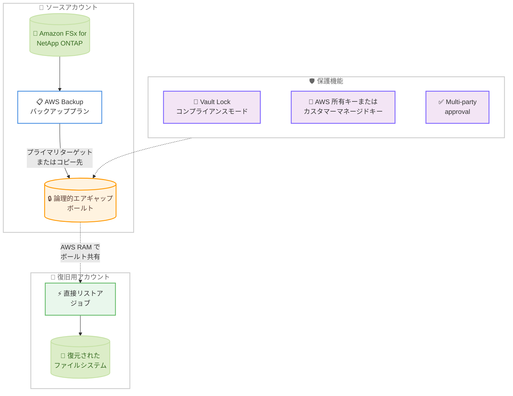

# AWS Backup - Amazon FSx for NetApp ONTAP の論理的エアギャップボールトサポート

**リリース日**: 2026 年 9 月 28 日
**サービス**: AWS Backup / Amazon FSx for NetApp ONTAP
**機能**: 論理的エアギャップボールト (Logically Air-Gapped Vault) による FSx for NetApp ONTAP バックアップの保護

📊 [このアップデートのインフォグラフィックを見る](https://takech9203.github.io/aws-news-summary/20260928-aws-backup-air-gapped-vault-fsx-ontap.html)

## 概要

AWS Backup の論理的エアギャップボールト (Logically Air-Gapped Vault) が、Amazon FSx for NetApp ONTAP をサポートしました。論理的エアギャップボールトは、標準のバックアップボールトよりも高いセキュリティを提供する特殊なボールトで、デフォルトでロックされた変更不可能 (イミュータブル) なバックアップを保存します。AWS 所有キーまたはカスタマーマネージドキーによる暗号化で分離され、AWS アカウントや AWS Organizations をまたいだ安全なバックアップ共有と直接復元により、データ損失発生時の復旧時間を短縮できます。

今回のアップデートにより、バックアッププランのプライマリターゲットまたはコピー先として、FSx for NetApp ONTAP のバックアップを論理的エアギャップボールトに保存できるようになりました。バックアップは同一アカウント内だけでなく、別のアカウントやリージョンのボールトにも保存できます。さらに、AWS Resource Access Manager (AWS RAM) を使用してボールトを他のアカウントと共有し、共有先アカウントから事前のコピーなしで直接リストアジョブを開始できます。

ランサムウェア対策や事業継続計画 (BCP) の要件として、バックアップの不変性とアカウント侵害時の復旧手段を確保したい組織にとって、FSx for NetApp ONTAP を利用するワークロードのデータ保護戦略を強化できる重要なアップデートです。

**アップデート前の課題**

このアップデート以前は、FSx for NetApp ONTAP のバックアップ保護に以下の制限がありました。

- FSx for NetApp ONTAP のバックアップを論理的エアギャップボールトに保存できず、標準のバックアップボールトでの保護に限られていた
- Vault Lock コンプライアンスモードによるデフォルトの不変性保護を FSx for NetApp ONTAP のバックアップに適用するには追加の設定が必要だった
- アカウント侵害などのインシデント発生時に、別アカウントから FSx for NetApp ONTAP のバックアップを直接復元する手段が限られており、復旧前にバックアップのコピーが必要だった

**アップデート後の改善**

今回のアップデートにより、以下が可能になりました。

- バックアッププランのプライマリターゲットまたはコピー先として、FSx for NetApp ONTAP のバックアップを論理的エアギャップボールトに保存できるようになった
- デフォルトで Vault Lock コンプライアンスモードが有効なボールトにより、FSx for NetApp ONTAP のバックアップをイミュータブルに保護できるようになった
- AWS RAM によるボールト共有と直接復元により、事前のバックアップコピーなしで共有先アカウントからリストアでき、復旧時間 (RTO) を短縮できるようになった
- Multi-party approval (多者承認) との統合により、ボールト所有アカウントにアクセスできない場合でもバックアップの復旧が可能になった

## アーキテクチャ図



FSx for NetApp ONTAP のバックアップを論理的エアギャップボールトに保存し、AWS RAM で共有した復旧用アカウントから直接リストアするフローを示しています。ボールトは Vault Lock コンプライアンスモードと暗号化で保護されます。

## サービスアップデートの詳細

### 主要機能

1. **論理的エアギャップボールトへの FSx for NetApp ONTAP バックアップ保存**
   - バックアッププランのプライマリターゲットとして直接バックアップを保存可能
   - 既存ボールトからのコピー先としても指定可能
   - 同一アカウント内、または別アカウント・別リージョンのボールトへの保存に対応

2. **デフォルトの不変性保護**
   - すべての論理的エアギャップボールトは Vault Lock コンプライアンスモードでロックされる
   - 保存されたバックアップはイミュータブルとなり、保持期間中の削除や変更から保護される
   - AWS 所有キー (デフォルト) またはカスタマーマネージド KMS キーで暗号化され、暗号化キータイプの情報は API とコンソールで確認可能

3. **AWS RAM によるボールト共有と直接復元**
   - AWS RAM を使用して、組織内外の個別の AWS アカウントとボールトを共有可能
   - 共有先アカウントは、事前にバックアップをコピーすることなく直接リストアジョブを開始可能
   - データ損失からの復旧や復元テスト (Restore Testing) に活用可能

4. **Multi-party approval によるアクセス保護**
   - 多者承認 (MPA) との統合により、アカウントが侵害された場合でもボールトへのアクセスを保護
   - ボールト所有アカウントにアクセスできない状況でも、承認チームの承認を経てバックアップを復旧可能

## 技術仕様

### 標準バックアップボールトとの比較

| 項目 | 標準バックアップボールト | 論理的エアギャップボールト |
|------|------------------------|--------------------------|
| 暗号化 | カスタマーマネージドキーまたは AWS マネージドキー (任意) | AWS 所有キー (デフォルト) またはカスタマーマネージドキー |
| Vault Lock | コンプライアンスモードまたはガバナンスモードを任意で設定 | コンプライアンスモードで常にロック |
| AWS RAM による共有 | 非対応 | 対応 (個別アカウント ID 単位) |
| バックアップの保存先 | 自アカウント | AWS Backup サービス所有アカウント |
| 保持期間 | 任意 | 最小保持期間は 7 日以上、最大保持期間の指定が必須 |

### ボールト作成時の要件

| 項目 | 詳細 |
|------|------|
| 最小保持期間 | 7 日以上の整数値が必須。これより短い保持期間のバックアップはボールトにコピー不可 |
| 最大保持期間 | 必須。これより長い保持期間のバックアップはボールトにコピー不可 |
| 共有単位 | 個別の AWS アカウント ID のみ。組織全体や OU 単位での共有は不可 |
| 共有招待の承諾期限 | 12 時間以内 |

## 設定方法

### 前提条件

1. AWS Backup で FSx for NetApp ONTAP のバックアップが有効化されていること
2. ボールトを共有する場合、共有元アカウントに `ram:CreateResourceShare` 権限があること (`AWSResourceAccessManagerFullAccess` ポリシーに含まれる)
3. 論理的エアギャップボールトと FSx for NetApp ONTAP の両方が利用可能なリージョンであること

### 手順

#### ステップ 1: 論理的エアギャップボールトの作成

```bash
aws backup create-logically-air-gapped-backup-vault \
  --backup-vault-name my-lag-vault \
  --min-retention-days 7 \
  --max-retention-days 35
```

論理的エアギャップボールトを作成します。最小保持期間 (7 日以上) と最大保持期間の指定が必須です。カスタマーマネージド KMS キーを使用する場合は `--encryption-key-arn` パラメータを追加します。指定しない場合は AWS 所有キーが使用されます。

#### ステップ 2: バックアッププランでボールトをターゲットに指定

```bash
aws backup create-backup-plan \
  --backup-plan '{
    "BackupPlanName": "fsx-ontap-lag-plan",
    "Rules": [{
      "RuleName": "daily-to-lag-vault",
      "TargetBackupVaultName": "my-lag-vault",
      "ScheduleExpression": "cron(0 5 * * ? *)",
      "Lifecycle": {"DeleteAfterDays": 30}
    }]
  }'
```

バックアッププランを作成し、論理的エアギャップボールトをプライマリターゲットとして指定します。FSx for NetApp ONTAP のファイルシステムをリソース割り当てで対象に追加すると、スケジュールに従いバックアップがボールトに直接保存されます。既存プランのコピー先として指定することも可能です。

#### ステップ 3: AWS RAM でボールトを共有

```bash
aws ram create-resource-share \
  --name lag-vault-share \
  --resource-arns arn:aws:backup:us-east-1:123456789012:backup-vault:my-lag-vault \
  --principals 210987654321
```

AWS RAM のリソース共有を作成し、復旧用アカウントとボールトを共有します。共有先アカウントは 12 時間以内に招待を承諾する必要があります。承諾後、共有先アカウントからボールト内のバックアップを直接リストアできます。

## メリット

### ビジネス面

- **ランサムウェア対策の強化**: イミュータブルなバックアップにより、悪意ある削除や暗号化からデータを保護し、事業継続性を確保できる
- **復旧時間の短縮**: 共有先アカウントからの直接復元により、事前のバックアップコピーが不要となり、インシデント発生時の RTO を短縮できる
- **コンプライアンス対応**: Vault Lock コンプライアンスモードによるデフォルトの不変性保護により、規制要件やディザスタリカバリ要件への対応が容易になる

### 技術面

- **多層防御の実現**: 暗号化による分離、Vault Lock、Multi-party approval を組み合わせた多層的なバックアップ保護を構成できる
- **クロスアカウント復旧の簡素化**: AWS RAM によるボールト共有で、組織内外のアカウントとの復旧体制を柔軟に構築できる
- **既存バックアップ戦略との統合**: バックアッププランのプライマリターゲットまたはコピー先として指定するだけで、既存の運用に組み込める

## デメリット・制約事項

### 制限事項

- 最小保持期間は 7 日以上が必須のため、短期間のみ保持するバックアップには利用できない
- ボールトの共有は個別のアカウント ID 単位のみで、AWS Organizations の組織全体や OU 単位での共有はできない
- Vault Lock はコンプライアンスモード固定であり、ロック設定の解除や緩和はできない
- 論理的エアギャップボールトは一部のリージョン (アジアパシフィック (マレーシア)、カナダ西部 (カルガリー) など) では利用できない

### 考慮すべき点

- バックアップは AWS Backup サービス所有アカウントに保存されるため、AWS CloudTrail ログ上では組織外への共有として記録される点に注意が必要
- 論理的エアギャップボールトのストレージ料金は標準ボールトと異なるため、料金ページで事前に確認が必要
- 保持期間の範囲外のバックアップはボールトにコピーできないため、既存バックアッププランのライフサイクル設定との整合性を確認する必要がある

## ユースケース

### ユースケース 1: ランサムウェア対策としてのイミュータブルバックアップ

**シナリオ**: FSx for NetApp ONTAP 上で基幹業務のファイル共有を運用しており、ランサムウェア攻撃によるバックアップ削除リスクに備えたい。

**実装例**:
```
1. 最小保持期間 7 日、最大保持期間 90 日の論理的エアギャップボールトを作成
2. 既存バックアッププランにコピールールを追加し、コピー先に論理的エアギャップボールトを指定
3. Multi-party approval の承認チームを設定し、アカウント侵害時の復旧経路を確保
```

**効果**: アカウントの認証情報が侵害された場合でも、Vault Lock コンプライアンスモードによりバックアップの削除を防止し、確実な復旧ポイントを維持できる。

### ユースケース 2: クロスアカウントでの迅速な災害復旧

**シナリオ**: 本番アカウントで障害やインシデントが発生した際に、専用の復旧アカウントから FSx for NetApp ONTAP のデータを迅速に復元したい。

**実装例**:
```
1. 本番アカウントで論理的エアギャップボールトを作成し、FSx for NetApp ONTAP のバックアップを保存
2. AWS RAM で復旧アカウントとボールトを共有
3. インシデント発生時、復旧アカウントから直接リストアジョブを実行
```

**効果**: バックアップを事前にコピーする時間が不要となり、復旧時間 (RTO) を大幅に短縮できる。

### ユースケース 3: 定期的な復元テストによる復旧体制の検証

**シナリオ**: コンプライアンス要件として、バックアップからの復旧可能性を定期的に検証する必要がある。

**実装例**:
```
1. 論理的エアギャップボールトをテスト用アカウントと AWS RAM で共有
2. AWS Backup の復元テスト機能を使用し、共有ボールト内の FSx for NetApp ONTAP バックアップから定期的に復元を実行
3. 復元結果を監査レポートとして記録
```

**効果**: 本番環境に影響を与えることなく、実際の復旧手順とバックアップの整合性を継続的に検証できる。

## 料金

論理的エアギャップボールトに保存されたバックアップのストレージ料金は、標準のバックアップストレージとは別の料金体系が適用されます。FSx for NetApp ONTAP のバックアップを論理的エアギャップボールトに保存する場合の料金は、AWS Backup の料金ページで確認できます。

詳細は [AWS Backup 料金ページ](https://aws.amazon.com/backup/pricing/) を参照してください。

## 利用可能リージョン

論理的エアギャップボールトと Amazon FSx for NetApp ONTAP の両方が利用可能なすべての AWS リージョンで利用できます。

なお、論理的エアギャップボールトは以下のリージョンでは現在利用できません: アジアパシフィック (マレーシア)、カナダ西部 (カルガリー)、メキシコ (中部)、アジアパシフィック (タイ)、アジアパシフィック (台北)、アジアパシフィック (ニュージーランド)、中国 (北京)、中国 (寧夏)、AWS GovCloud (US-East)、AWS GovCloud (US-West)。

最新のリージョン別・リソース別の対応状況は [機能の利用可能状況ドキュメント](https://docs.aws.amazon.com/aws-backup/latest/devguide/backup-feature-availability.html#features-by-region) を参照してください。

## 関連サービス・機能

- **Amazon FSx for NetApp ONTAP**: 今回のアップデートで論理的エアギャップボールトの保護対象となったフルマネージドの NetApp ONTAP ファイルストレージサービス
- **AWS Resource Access Manager (AWS RAM)**: 論理的エアギャップボールトを他のアカウントと共有するために使用するリソース共有サービス
- **AWS Backup Vault Lock**: 論理的エアギャップボールトにデフォルトで適用されるコンプライアンスモードの不変性保護機能
- **Multi-party approval**: アカウント侵害時にもボールトへのアクセスを保護する多者承認機能
- **AWS Key Management Service (AWS KMS)**: ボールトの暗号化に使用するカスタマーマネージドキーを管理するサービス

## 参考リンク

- 📊 [インフォグラフィック](https://takech9203.github.io/aws-news-summary/20260928-aws-backup-air-gapped-vault-fsx-ontap.html)
- [公式発表 (What's New)](https://aws.amazon.com/about-aws/whats-new/2026/09/aws-backup-air-gapped-vault-fsx-ontap/)
- [ドキュメント: 論理的エアギャップボールト](https://docs.aws.amazon.com/aws-backup/latest/devguide/logicallyairgappedvault.html)
- [ドキュメント: Multi-party approval](https://docs.aws.amazon.com/aws-backup/latest/devguide/multipartyapproval.html)
- [ドキュメント: 機能の利用可能状況](https://docs.aws.amazon.com/aws-backup/latest/devguide/backup-feature-availability.html#features-by-region)
- [料金ページ](https://aws.amazon.com/backup/pricing/)

## まとめ

AWS Backup の論理的エアギャップボールトが Amazon FSx for NetApp ONTAP に対応したことで、ONTAP ワークロードのバックアップをイミュータブルに保護し、クロスアカウントでの迅速な復旧体制を構築できるようになりました。FSx for NetApp ONTAP を利用している組織は、ランサムウェア対策や BCP の観点から、既存のバックアッププランに論理的エアギャップボールトの追加を検討することを推奨します。まずは開発環境でボールトの作成と AWS RAM による共有、直接復元のフローを検証するとよいでしょう。
