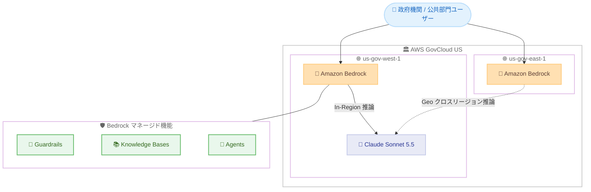

# Amazon Bedrock - Claude Sonnet 5.5 が AWS GovCloud (US) で利用可能に

**リリース日**: 2026 年 9 月 28 日
**サービス**: Amazon Bedrock / AWS GovCloud (US)
**機能**: Claude Sonnet 5.5 の AWS GovCloud (US) リージョン対応

📊 [このアップデートのインフォグラフィックを見る](https://takech9203.github.io/aws-news-summary/20260928-claude-sonnet-5-5-aws-govcloud-us.html)

## 概要

AWS GovCloud (US) の Amazon Bedrock で、Anthropic の最新モデル Claude Sonnet 5.5 が利用可能になりました。Claude Sonnet 5.5 は「よりスマートで効率的な Sonnet」と位置付けられ、Sonnet 5 からの明確な進化として、コーディングとナレッジワークにおいてタスクあたりのコストを抑えながら、より高速な処理を実現します。商用リージョンでの提供開始と同日に GovCloud (US) でも利用可能になった点が特徴です。

AWS GovCloud (US) は、米国政府機関や規制対象ワークロードを扱う組織向けに設計された隔離されたリージョンです。Amazon Bedrock 経由でモデルにアクセスすることで、データを AWS インフラストラクチャ内に保持したままリージョナルなデータレジデンシーを確保でき、Guardrails や Knowledge Bases といった AWS マネージドの機能も併せて利用できます。

厳格なコンプライアンス要件を持つ公共部門 (政府機関、防衛関連、規制産業) のチームが、商用リージョンと同じ最新世代のモデルを、データレジデンシーを維持しながら利用できるようになる重要なアップデートです。

**アップデート前の課題**

- 以前は GovCloud (US) で利用できる Claude モデルは旧世代に限られ、最新モデルの利用には商用リージョンを使う必要があった
- 商用リージョンの Claude Sonnet 5.5 は Global クロスリージョン推論のみの提供であり、リクエストが世界中のリージョンで処理される可能性があるため、データレジデンシー要件の厳しいワークロードには適用が難しかった
- 政府系ワークロードでは、コンプライアンス境界内で最新の AI モデルを利用する選択肢が限られていた

**アップデート後の改善**

- GovCloud (US) 内で最新の Claude Sonnet 5.5 を利用可能になり、コンプライアンス境界内で最新モデルによるコーディング支援やナレッジワークを実行できるようになった
- us-gov-west-1 では In-Region 推論が可能で、リクエストを単一リージョン内に閉じた厳格なデータレジデンシーを確保できるようになった
- Guardrails、Knowledge Bases、Agents などの Bedrock マネージド機能と組み合わせて、ガバナンスの効いた生成 AI アプリケーションを構築できるようになった

## アーキテクチャ図



GovCloud (US) の 2 リージョンから Claude Sonnet 5.5 を利用する構成です。us-gov-west-1 は In-Region 推論に対応し、us-gov-east-1 からは Geo クロスリージョン推論プロファイル経由でアクセスします。

## サービスアップデートの詳細

### 主要機能

1. **Sonnet 5 からの性能向上**
   - コーディングとナレッジワークで Sonnet 5 を上回る性能を、より低いタスクあたりコストと高速な応答で実現
   - すでに Sonnet 5 上でアプリケーションを構築しているチームにとって自然なアップグレードパスとなる
   - コーディングでは、大きな開発戦略の中の明確にスコープされたタスクに対応し、同一セッション内での機能の構築・修正と要件に対する出力の検証が可能

2. **ナレッジワーク向けの成果物生成**
   - ワンページャー、図表、サマリースライド、ドキュメント編集、スプレッドシートのクリーンアップなど、そのまま共有可能な成果物を生成
   - 公共部門における報告書作成や文書業務の効率化に活用可能

3. **GovCloud (US) におけるデータレジデンシーとマネージド機能**
   - Amazon Bedrock 経由の利用により、データは AWS インフラストラクチャ内に保持され、リージョナルなデータレジデンシーが確保される
   - Guardrails によるコンテンツフィルタリング、Knowledge Bases による RAG 構成など、AWS マネージドの機能を GovCloud 内で利用可能
   - us-gov-west-1 は Claude Sonnet 5.5 で唯一 In-Region 推論に対応するリージョン (商用リージョンは Global クロスリージョン推論のみ)

4. **アダプティブ思考 (Reasoning) のサポート**
   - 推論 (思考) 機能をサポートし、アダプティブ思考がデフォルトで有効
   - 思考の努力レベルは low / medium / high / xhigh / max から設定可能 (デフォルト: high)

## 技術仕様

### モデル仕様

| 項目 | 詳細 |
|------|------|
| モデル ID | `anthropic.claude-sonnet-5-5` |
| コンテキストウィンドウ | 100 万トークン |
| 最大出力トークン | 128K トークン |
| 入力モダリティ | テキスト、画像 |
| 出力モダリティ | テキスト |
| Reasoning | サポート (アダプティブ思考がデフォルトで有効、努力レベル設定可能) |
| ナレッジカットオフ | 2026 年 6 月 |
| モデルライフサイクル | Active (EOL は 2027 年 9 月 28 日以降、レガシー期間 6 か月) |

### GovCloud (US) での推論オプション

| リージョン | In-Region | Geo クロスリージョン | Global クロスリージョン |
|------------|-----------|---------------------|------------------------|
| us-gov-west-1 | 対応 | 対応 | 非対応 |
| us-gov-east-1 | 非対応 | 対応 (Geo 推論プロファイル必須) | 非対応 |

商用リージョンでは Global クロスリージョン推論プロファイル (`global.anthropic.claude-sonnet-5-5`) のみの提供であるのに対し、GovCloud (US) では In-Region / Geo 推論により米国政府向け境界内でのデータレジデンシーが維持されます。

### サポートされる Bedrock 機能

| サポート対象 | 非サポート |
|--------------|-----------|
| レスポンスストリーミング、プロンプトキャッシング (暗黙的 / 明示的)、Guardrails、Knowledge Bases、Agents、Flows、モデル評価、プロンプト管理・最適化、Computer Use | Intelligent Prompt Routing、Count Tokens、Structured Outputs、Batch 推論 |

サービスティアは Standard (従量課金) のみのサポートです。Priority / Flex / Reserved / Batch は現時点で非対応です。

## 設定方法

### 前提条件

1. AWS GovCloud (US) アカウントと、それに紐づく標準 (商用) AWS アカウント
2. Amazon Bedrock へのアクセス権限を持つ IAM ユーザーまたはロール
3. モデルアクセスの有効化 (EULA への同意)

### 手順

#### ステップ 1: 紐づく標準アカウントでモデルアグリーメントに同意

```bash
# 利用可能なモデルを確認
aws bedrock list-foundation-models --region us-east-1

# モデルのアグリーメントオファーを確認
aws bedrock list-foundation-model-agreement-offers \
  --model-id anthropic.claude-sonnet-5-5 \
  --region us-east-1

# アグリーメントを作成 (EULA に同意)
aws bedrock create-foundation-model-agreement \
  --model-id anthropic.claude-sonnet-5-5 \
  --offer-token <offerToken> \
  --region us-east-1
```

GovCloud (US) でサードパーティモデルを利用するには、まず GovCloud アカウントに紐づく標準アカウント (us-east-1 または us-west-2) で EULA に同意する必要があります。上記コマンドは、モデルの一覧確認、オファートークンの取得、アグリーメントの作成を順に実行しています。

#### ステップ 2: GovCloud (US) でモデルアクセスを有効化

GovCloud (US) の Amazon Bedrock コンソールの [モデルアクセス] ページから Claude Sonnet 5.5 へのアクセスを有効化します。エンタイトルメントの反映には数分かかる場合があります。

#### ステップ 3: モデルを呼び出す

```python
import boto3

client = boto3.client('bedrock-runtime', region_name='us-gov-west-1')
response = client.converse(
    modelId='anthropic.claude-sonnet-5-5',
    messages=[
        {
            'role': 'user',
            'content': [{'text': '調達要件書のドラフトを作成してください。'}]
        }
    ]
)
print(response)
```

us-gov-west-1 で Converse API を使用して Claude Sonnet 5.5 を In-Region で呼び出す例です。us-gov-east-1 から利用する場合は、Geo クロスリージョン推論プロファイルを指定します。

## メリット

### ビジネス面

- **コンプライアンス境界内で最新モデルを利用可能**: 政府機関や規制対象ワークロードが、GovCloud (US) の境界から出ることなく最新世代の Claude モデルを利用できる
- **タスクあたりコストの削減**: Sonnet 5 と比較して、より低いタスクあたりコストと高速な応答により、大規模な文書処理やコーディング業務の運用コストを抑制できる
- **商用リージョンとの同時提供**: 最新モデルの GovCloud 対応を待つ期間がなくなり、公共部門でも商用と同じタイミングで技術を採用できる

### 技術面

- **In-Region 推論によるデータレジデンシー**: us-gov-west-1 では推論リクエストが単一リージョン内で完結し、厳格なデータ所在要件を満たせる (商用リージョンは Global クロスリージョン推論のみ)
- **Bedrock マネージド機能との統合**: Guardrails、Knowledge Bases、Agents などと組み合わせ、ガバナンスの効いた生成 AI アプリケーションを構築できる
- **大規模コンテキスト**: 100 万トークンのコンテキストウィンドウと 128K トークンの最大出力により、大規模なコードベースや長大な文書を扱える

## デメリット・制約事項

### 制限事項

- us-gov-east-1 では In-Region 推論は利用できず、Geo クロスリージョン推論プロファイルの使用が必須
- サービスティアは Standard のみで、Priority / Flex / Reserved / Batch 推論は非対応
- Intelligent Prompt Routing、Count Tokens、Structured Outputs は現時点で非対応
- モデルアクセスの有効化には、GovCloud アカウントに紐づく標準アカウントでの EULA 同意が必要

### 考慮すべき点

- 本モデルは AWS Marketplace 経由で提供されるサードパーティモデルであり、請求は Amazon Bedrock ではなくモデルプロバイダー名義で AWS 請求書と AWS Cost Explorer に表示される
- Sonnet 5 など既存モデルからの移行時は、アダプティブ思考 (デフォルト有効、努力レベル high) による応答特性やトークン消費の変化を検証することが推奨される

## ユースケース

### ユースケース 1: 政府機関内のコーディング支援

**シナリオ**: 連邦政府機関の開発チームが、GovCloud (US) 内でレガシーシステムのモダナイゼーションを進めており、コンプライアンス境界内で AI コーディング支援を活用したい。

**実装例**:
```python
client = boto3.client('bedrock-runtime', region_name='us-gov-west-1')
response = client.converse(
    modelId='anthropic.claude-sonnet-5-5',
    messages=[{
        'role': 'user',
        'content': [{'text': 'この COBOL コードを Java に移行し、'
                             '要件との整合性を検証してください。\n' + code}]
    }]
)
```

**効果**: 同一セッション内での機能の構築・修正と要件検証により、境界内で安全に開発生産性を向上できる。

### ユースケース 2: 機密文書を扱うナレッジワークの効率化

**シナリオ**: 公共部門の組織が、内部規程や調達文書などの機密性の高い文書のサマリー作成、ワンページャー生成、ドキュメント編集を効率化したい。

**実装例**:
```
Knowledge Bases に内部文書を格納し、Claude Sonnet 5.5 を
推論モデルとして RAG 構成を構築。Guardrails で出力の
コンテンツポリシーを適用。
```

**効果**: データを GovCloud (US) 内に保持したまま、報告書やスライドなど共有可能な成果物の作成を自動化できる。

### ユースケース 3: マルチリージョン構成での可用性確保

**シナリオ**: us-gov-east-1 を主リージョンとするシステムで Claude Sonnet 5.5 を利用したい。

**実装例**:
```
us-gov-east-1 の Bedrock エンドポイントから、GovCloud 向けの
Geo クロスリージョン推論プロファイルを指定して呼び出す。
リクエストは GovCloud 境界内でルーティングされる。
```

**効果**: 東側リージョンのワークロードからも、GovCloud 境界を越えることなく最新モデルを利用できる。

## 料金

Claude Sonnet 5.5 は AWS Marketplace 経由で提供・課金されるサードパーティモデルです。料金は AWS 請求書と AWS Cost Explorer にモデルプロバイダー (Anthropic) 名義で表示されます。従量課金 (Standard ティア) での利用となり、Sonnet 5 と比較して低いタスクあたりコストが特徴とされています。

具体的な単価は [Amazon Bedrock 料金ページ](https://aws.amazon.com/bedrock/pricing/) を参照してください。プロンプトキャッシング (暗黙的 / 明示的) を活用することで、繰り返し利用するコンテキストの入力コストを削減できます。

## 利用可能リージョン

- **AWS GovCloud (US-West) / us-gov-west-1**: In-Region 推論および Geo クロスリージョン推論に対応
- **AWS GovCloud (US-East) / us-gov-east-1**: Geo クロスリージョン推論プロファイル経由で対応

商用リージョン (東京、大阪を含む 35 以上のリージョン) では、Global クロスリージョン推論プロファイル (`global.anthropic.claude-sonnet-5-5`) 経由で同日から利用可能です。詳細は [リージョン別モデル対応表](https://docs.aws.amazon.com/bedrock/latest/userguide/models-region-compatibility.html#model-regions-anthropic) を参照してください。

## 関連サービス・機能

- **Amazon Bedrock Guardrails**: 有害コンテンツのフィルタリングや PII 検出など、政府系ワークロードで求められる出力制御を実現
- **Amazon Bedrock Knowledge Bases**: 内部文書を活用した RAG 構成を GovCloud 内で構築可能
- **Amazon Bedrock Agents / Flows**: Claude Sonnet 5.5 を推論エンジンとしたエージェントワークフローの構築に対応
- **クロスリージョン推論 (Geo / Global)**: GovCloud では Geo プロファイルにより境界内ルーティング、商用リージョンでは Global プロファイルによる世界規模のルーティングを提供

## 参考リンク

- 📊 [インフォグラフィック](https://takech9203.github.io/aws-news-summary/20260928-claude-sonnet-5-5-aws-govcloud-us.html)
- [公式発表 (What's New)](https://aws.amazon.com/about-aws/whats-new/2026/09/claude-sonnet-5-5-aws-govcloud-us/)
- [関連発表: Claude Sonnet 5.5 now available on AWS](https://aws.amazon.com/about-aws/whats-new/2026/09/claude-sonnet-5-5-aws/)
- [ドキュメント: Claude Sonnet 5.5 モデルカード](https://docs.aws.amazon.com/bedrock/latest/userguide/model-card-anthropic-claude-sonnet-5-5.html)
- [ドキュメント: リージョン別モデル対応表](https://docs.aws.amazon.com/bedrock/latest/userguide/models-region-compatibility.html#model-regions-anthropic)
- [料金ページ: Amazon Bedrock Pricing](https://aws.amazon.com/bedrock/pricing/)

## まとめ

Claude Sonnet 5.5 が商用リージョンと同日に AWS GovCloud (US) で利用可能になったことで、厳格なコンプライアンス要件を持つ公共部門でも最新世代のモデルを遅延なく採用できるようになりました。特に us-gov-west-1 の In-Region 推論は、Global クロスリージョン推論のみの商用リージョンにはないデータレジデンシー上の利点です。GovCloud で Sonnet 5 を利用中のチームは、紐づく標準アカウントでの EULA 同意とモデルアクセス有効化を行い、アップグレードの検証を開始することを推奨します。
