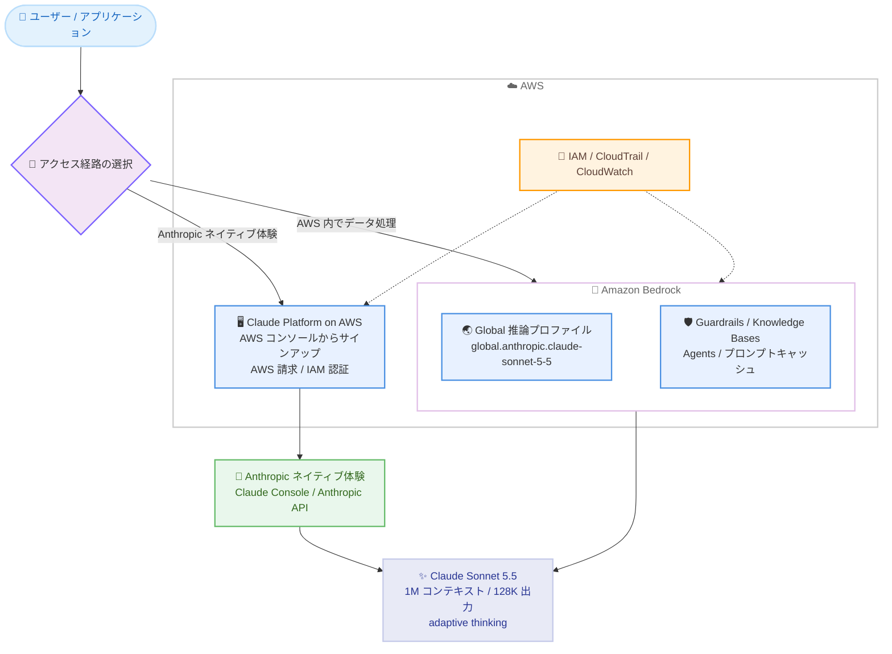

# AWS - Anthropic Claude Sonnet 5.5 の提供開始

**リリース日**: 2026 年 9 月 28 日
**サービス**: Amazon Bedrock / Claude Platform on AWS
**機能**: Anthropic Claude Sonnet 5.5 モデルの提供開始

📊 [このアップデートのインフォグラフィックを見る](https://takech9203.github.io/aws-news-summary/20260928-claude-sonnet-5-5-aws.html)

## 概要

Anthropic の最新モデル Claude Sonnet 5.5 が AWS で利用可能になりました。Claude Sonnet 5.5 は「よりスマートで効率的な Sonnet」と位置づけられ、コーディングとナレッジワークにおいて Sonnet 5 から大きく前進しつつ、タスクあたりのコストを抑え、より高速に動作します。1M トークンのコンテキストウィンドウと最大 128K トークンの出力に対応し、adaptive thinking (推論) がデフォルトで有効です。

コーディングでは、機能の実装やバグ修正といったスコープが明確なタスクに強く、作業を完了した後に要件と照らして結果を検証します。ナレッジワークでは、1 ページ資料、アーキテクチャ図、サマリースライド、ドキュメント編集、スプレッドシートのクリーンアップなど、そのまま共有できる品質の成果物を生成します。判断を要する複雑な作業は Claude Opus 5.5、アプローチが明確な作業は低コストで高速な Sonnet 5.5、という使い分けが想定されています。

アクセス経路は 2 つ用意されています。(1) Amazon Bedrock 経由では、データを AWS インフラストラクチャ内に保持し、Guardrails や Knowledge Bases などの AWS マネージド機能と統合して利用できます。(2) Claude Platform on AWS 経由では、AWS コンソールから Anthropic のネイティブなプラットフォーム体験 (Claude Console、Anthropic の API) に、AWS の請求と認証を統合した形でアクセスできます。

**アップデート前の課題**

- Sonnet 5 では、成果物の仕上がり品質 (1 ページ資料、図、スライドなど) に編集の手間が残ることがあった
- スコープが明確なコーディングタスクでも、出力を要件と照らして検証する動作が限定的だった
- アラート一次対応や SQL 生成などの常時実行・大量実行ワークロードでは、タスクあたりのコストと速度が課題になりやすかった
- Anthropic のネイティブプラットフォームを利用する場合、AWS の請求・認証とは別に Anthropic と直接契約する必要があった

**アップデート後の改善**

- コーディングとナレッジワークの品質が Sonnet 5 から向上し、タスクあたりのコストが低減、速度も向上した
- 機能の実装・修正と、要件に対する出力の検証を同一セッション内で行えるようになった
- 1M トークンコンテキストと最大 128K トークン出力により、大規模なコードベースやドキュメント群を扱えるようになった
- Claude Platform on AWS により、AWS の請求・認証のまま Anthropic ネイティブの API・コンソール体験を利用できるようになった

## アーキテクチャ図



Claude Sonnet 5.5 へのアクセス経路は 2 つあります。データを AWS 内で処理し AWS マネージド機能と統合する Amazon Bedrock と、AWS の請求・認証のまま Anthropic ネイティブのプラットフォーム体験を利用する Claude Platform on AWS です。

## サービスアップデートの詳細

### 主要機能

1. **コーディング能力の強化**
   - スコープが明確なタスク (機能の実装、バグ修正) に強く、大きな開発戦略の中の個別タスクを確実に遂行
   - 同一セッション内で機能の構築・修正と、要件に対する出力の検証を実施
   - IDE のコーディングエージェント、UI / UX テスト、SQL 生成など、定常的・大量実行のワークロードに適合

2. **そのまま共有できるナレッジワーク成果物**
   - 1 ページ資料、アーキテクチャ図、サマリースライドなど、Sonnet 5 より仕上がりの良い成果物を生成
   - ドキュメント編集やスプレッドシートのクリーンアップといった定型業務にも対応

3. **1M トークンコンテキストと adaptive thinking**
   - コンテキストウィンドウは 1M トークン、最大出力は 128K トークン
   - adaptive thinking (推論) がデフォルトで有効。effort レベルは low / medium / high / xhigh / max の 5 段階で調整可能 (デフォルト: high)
   - 入力はテキストと画像、出力はテキストに対応。知識カットオフは 2026 年 6 月

4. **Amazon Bedrock の各種機能と統合**
   - Guardrails、Knowledge Bases、Agents、Flows、プロンプト管理・最適化、モデル評価、computer use に対応
   - 暗黙的・明示的プロンプトキャッシュに対応 (チェックポイントあたり最小 512 トークン、リクエストあたり最大 4 チェックポイント、TTL は 5 分または 1 時間)
   - IAM によるアクセス制御、CloudTrail による監査、CloudWatch によるモニタリングと統合

5. **Claude Platform on AWS でのネイティブ体験**
   - AWS コンソールの Claude Platform on AWS サービスページからサインアップし、AWS Marketplace サブスクリプションを自動処理
   - Anthropic と直接取引する場合と同じ API・機能・コンソール体験を、AWS の請求と IAM 認証で利用可能
   - Claude Console へのサインインは IAM ロール (`aws-external-anthropic:AssumeConsole` 権限) を通じてフェデレーション

## 技術仕様

### モデル仕様

| 項目 | 詳細 |
|------|------|
| プロバイダー | Anthropic |
| モデル ID | `anthropic.claude-sonnet-5-5` |
| 推論プロファイル | `global.anthropic.claude-sonnet-5-5` (Global) |
| コンテキストウィンドウ | 1M トークン |
| 最大出力トークン | 128K トークン |
| 入力モダリティ | テキスト、画像 |
| 出力モダリティ | テキスト |
| 推論 | adaptive thinking がデフォルトで有効。effort は low / medium / high / xhigh / max (デフォルト: high) |
| 知識カットオフ | 2026 年 6 月 |
| 対応 API | Messages / Converse / InvokeModel (bedrock-runtime)、Messages (bedrock-mantle) |
| サービスティア | Standard のみ (Priority / Flex / Reserved / Batch は非対応) |
| モデルリリース日 | 2026 年 9 月 28 日 |
| EOL | 2027 年 9 月 28 日以降 (レガシー期間は 6 か月) |

### 対応機能 (bedrock-runtime エンドポイント)

| 対応 | 非対応 |
|------|--------|
| レスポンスストリーミング | インテリジェントプロンプトルーティング |
| 暗黙的・明示的プロンプトキャッシュ | トークンカウント (Count tokens) |
| Guardrails | 構造化出力 (Structured outputs) |
| Knowledge Bases / Agents / Flows | Responses API / Chat Completions API |
| プロンプト管理・最適化 / モデル評価 | インリージョン推論 (商用リージョン) |
| computer use (computer_20251124) | - |

## 設定方法

### 前提条件

1. AWS アカウントと Amazon Bedrock へのアクセス権限
2. IAM 権限 `bedrock:InvokeModel` および `bedrock:InvokeModelWithResponseStream`
3. Bedrock API キーまたは IAM 認証情報 (AWS CLI / SDK 利用時)

### 手順

#### ステップ 1: コンソールでの動作確認

Amazon Bedrock コンソールの [Test] > [Playground] で Claude Sonnet 5.5 を選択し、プロンプトを送信して動作を確認します。

#### ステップ 2: Converse API での呼び出し

```python
import boto3

client = boto3.client("bedrock-runtime", region_name="us-east-1")

response = client.converse(
    modelId="global.anthropic.claude-sonnet-5-5",
    messages=[
        {"role": "user", "content": [{"text": "Amazon Bedrock の特徴を説明してください。"}]}
    ],
)
print(response)
```

AWS SDK (boto3) の Converse API で Claude Sonnet 5.5 を呼び出します。modelId にはモデル ID ではなく Global 推論プロファイル ID (`global.anthropic.claude-sonnet-5-5`) を指定します。

#### ステップ 3: Anthropic Messages API での呼び出し

```python
from anthropic import Anthropic
from aws_bedrock_token_generator import provide_token

token = provide_token(region="us-east-1")

client = Anthropic(
    base_url="https://bedrock-runtime.us-east-1.amazonaws.com/anthropic",
    api_key=token,
)

response = client.messages.create(
    model="global.anthropic.claude-sonnet-5-5",
    max_tokens=1024,
    messages=[{"role": "user", "content": "Amazon Bedrock の特徴を説明してください。"}],
)
print(response)
```

Anthropic SDK から Bedrock の Messages API 互換エンドポイントを呼び出します。`aws-bedrock-token-generator` で IAM 認証情報から短期トークンを生成して認証します。adaptive thinking により、レスポンスの先頭に thinking ブロックが返る場合があるため、固定インデックスではなくブロックタイプでテキストブロックを取得する実装が推奨されます。

#### ステップ 4: Claude Platform on AWS のセットアップ (ネイティブ体験を利用する場合)

1. AWS コンソールの Claude Platform on AWS サービスページで [Sign up] を選択 (AWS Marketplace サブスクリプションは自動処理)
2. `platform.claude.com/partner-signup` にリダイレクトされ、組織オーナーのメールアドレスで Anthropic 組織をセットアップ
3. 自動プロビジョニングされるデフォルトワークスペースの ID (`wrkspc_` で始まる) を確認
4. `aws-external-anthropic:AssumeConsole` 権限を持つ IAM ロールで Claude Console にサインイン

AWS コンソール経由のサインアップでは、AWS アカウントに紐づく新しい Anthropic 組織が作成されます。既存の Anthropic 組織の API キーやワークスペースは引き継がれません。

## メリット

### ビジネス面

- **タスクあたりのコスト低減**: Sonnet 5 からの性能向上に加えてタスクあたりのコストが低く高速なため、アラート一次対応、常時稼働エージェント、SQL 生成などの大量実行ワークロードを経済的に運用できる
- **Opus 5.5 との使い分けによる最適化**: 判断を要する複雑な作業は Opus 5.5、アプローチが明確な作業は Sonnet 5.5 と使い分けることで、品質とコストのバランスを最適化できる
- **調達・請求の一元化**: Claude Platform on AWS により、Anthropic ネイティブのプラットフォームを AWS の請求・認証・プライベートオファーの枠組みで利用できる

### 技術面

- **大規模コンテキスト**: 1M トークンのコンテキストウィンドウと 128K トークンの最大出力により、大規模なコードベースや複数ドキュメントの一括処理が可能
- **検証を含むコーディング動作**: 出力を要件と照らして検証する動作により、スコープが明確なタスクの完遂率と信頼性が向上
- **AWS ガバナンス基盤との統合**: Bedrock 経由では IAM、CloudTrail、CloudWatch、Guardrails と統合され、統制された形でモデルを運用可能
- **プロンプトキャッシュによる最適化**: 暗黙的・明示的プロンプトキャッシュ (TTL 5 分 / 1 時間) により、繰り返し利用するプレフィックスのコストとレイテンシーを削減できる

## デメリット・制約事項

### 制限事項

- 商用リージョンでは Global クロスリージョン推論プロファイルのみの提供で、インリージョン推論および Geo (地理内) 推論は非対応。Global 推論は世界中のリージョンにルーティングされるため、厳格なデータレジデンシー要件があるワークロードには適さない
- サービスティアは Standard のみで、Priority / Flex / Reserved / Batch は非対応
- 構造化出力 (Structured outputs)、トークンカウント、インテリジェントプロンプトルーティング、Responses / Chat Completions API は非対応
- Claude Platform on AWS の利用では、プロンプトや補完などのコンテンツは AWS の外部で Anthropic により処理される

### 考慮すべき点

- 料金は AWS Marketplace 経由の請求となり、AWS Cost Explorer 上では Amazon Bedrock ではなくモデルプロバイダー (Anthropic) の項目として表示される
- adaptive thinking がデフォルトで有効なため、レスポンス解析では thinking ブロックの存在を前提とした実装が必要
- Claude Platform on AWS のサインアップは既存の Anthropic 組織 (Claude Enterprise を含む) とは別組織となり、既存の API キーや設定は引き継がれない。Bedrock のプライベートオファーがある場合はサインアップ前にアカウント担当への相談が推奨される

## ユースケース

### ユースケース 1: IDE コーディングエージェントの標準モデル

**シナリオ**: 開発チームが IDE 上のコーディングエージェントで、機能実装やバグ修正といったスコープの明確なタスクを、支出上限を設けつつ大量に処理したい。

**実装例**:
```text
1. Bedrock で Claude Sonnet 5.5 へのアクセスを設定
2. コーディングエージェントの推論モデルに
   global.anthropic.claude-sonnet-5-5 を指定
3. プロンプトキャッシュを有効化してシステムプロンプトと
   リポジトリコンテキストのコストを削減
```

**効果**: タスクあたりのコストが低く高速なため、日常的な開発タスクを経済的に自動化できる。出力を要件と照らして検証する動作により、修正の完遂率も向上する。

### ユースケース 2: 常時稼働ワークロードの一次対応

**シナリオ**: 運用チームがアラートの一次対応、エージェントの常時モニタリング、SQL 生成などの継続的なワークロードを AI で自動化したい。

**実装例**:
```text
1. アラートを受信する Lambda などから Converse API 経由で呼び出し
2. Guardrails をアタッチして入出力の安全性を担保
3. CloudWatch と CloudTrail で呼び出しを監視・監査
```

**効果**: 低コスト・高速なモデル特性により、大量・継続実行が前提のワークロードでも運用コストを抑えながら品質の高い一次対応を実現できる。

### ユースケース 3: そのまま共有できる資料作成の自動化

**シナリオ**: ビジネスチームが会議用の 1 ページ資料、アーキテクチャ図、サマリースライドの作成や、既存ドキュメントの編集・スプレッドシートの整理を効率化したい。

**実装例**:
```text
1. 元資料やデータを 1M トークンのコンテキストに投入
2. 出力形式 (1 ページ資料、図、スライド構成) を指示して生成
3. 判断を要する長文分析やレビューは Opus 5.5 に振り分け
```

**効果**: Sonnet 5 より仕上がりの良い、そのまま共有できる成果物が得られ、資料作成と編集の工数を削減できる。

## 料金

トークン単位の従量課金です。Claude Sonnet 5.5 は AWS Marketplace 経由で提供・請求されるサードパーティーモデルであり、料金は AWS の請求書に計上され、AWS Cost Explorer ではモデルプロバイダー (Anthropic) の項目として表示されます。What's New およびモデルカードでは具体的な単価は公表されていないため、最新の料金は [Amazon Bedrock 料金ページ](https://aws.amazon.com/bedrock/pricing/)を参照してください。Sonnet 5 と比較してタスクあたりのコストが低減するとされています。

## 利用可能リージョン

Amazon Bedrock では Global クロスリージョン推論 (`global.anthropic.claude-sonnet-5-5`) として、東京 (ap-northeast-1)、大阪 (ap-northeast-3) を含む世界中の幅広い商用リージョンから利用できます。AWS GovCloud (US) では bedrock-runtime エンドポイントの Geo 推論 (us-gov-west-1、us-gov-east-1) および bedrock-mantle エンドポイントのインリージョン推論 (us-gov-west-1) で利用できます。Claude Platform on AWS は北米で利用可能です。最新の対応状況は[モデルのリージョン対応状況のドキュメント](https://docs.aws.amazon.com/bedrock/latest/userguide/models-region-compatibility.html#model-regions-anthropic)で確認してください。

## 関連サービス・機能

- **Amazon Bedrock Guardrails**: コンテンツフィルター、拒否トピック、PII マスキングを Claude Sonnet 5.5 の呼び出しにアタッチ可能
- **Amazon Bedrock Knowledge Bases / Agents / Flows**: RAG やエージェントワークフローの基盤モデルとして利用可能
- **Amazon Bedrock プロンプトキャッシュ**: 暗黙的・明示的キャッシュにより、繰り返し利用するプロンプトのコストとレイテンシーを削減
- **Claude Platform on AWS**: AWS の請求・IAM 認証で Anthropic ネイティブの API・Claude Console を利用できるサービス
- **AWS IAM / CloudTrail / CloudWatch**: アクセス制御、監査、モニタリングの各基盤と統合

## 参考リンク

- 📊 [インフォグラフィック](https://takech9203.github.io/aws-news-summary/20260928-claude-sonnet-5-5-aws.html)
- [公式発表 (What's New)](https://aws.amazon.com/about-aws/whats-new/2026/09/claude-sonnet-5-5-aws/)
- [AWS Blog: Introducing Claude Sonnet 5.5 on AWS](https://aws.amazon.com/blogs/machine-learning/introducing-claude-sonnet-5-5-on-aws/)
- [ドキュメント: Claude Sonnet 5.5 モデルカード](https://docs.aws.amazon.com/bedrock/latest/userguide/model-card-anthropic-claude-sonnet-5-5.html)
- [ドキュメント: モデルのリージョン対応状況](https://docs.aws.amazon.com/bedrock/latest/userguide/models-region-compatibility.html#model-regions-anthropic)
- [ドキュメント: Claude Platform on AWS セットアップ](https://docs.aws.amazon.com/claude-platform/latest/userguide/setup.html)
- [料金ページ](https://aws.amazon.com/bedrock/pricing/)

## まとめ

Claude Sonnet 5.5 の提供開始により、スコープの明確なコーディングタスクとそのまま共有できるナレッジワークを、Sonnet 5 より低コスト・高速に処理できるようになりました。まずは Bedrock の Playground や Converse API で既存の Sonnet 5 ワークロードからの移行効果を評価し、判断を要する複雑な作業は Opus 5.5 と使い分ける構成を検討することを推奨します。データレジデンシー要件がある場合は、Global 推論のルーティング特性と Claude Platform on AWS のデータ処理場所を事前に確認してください。
