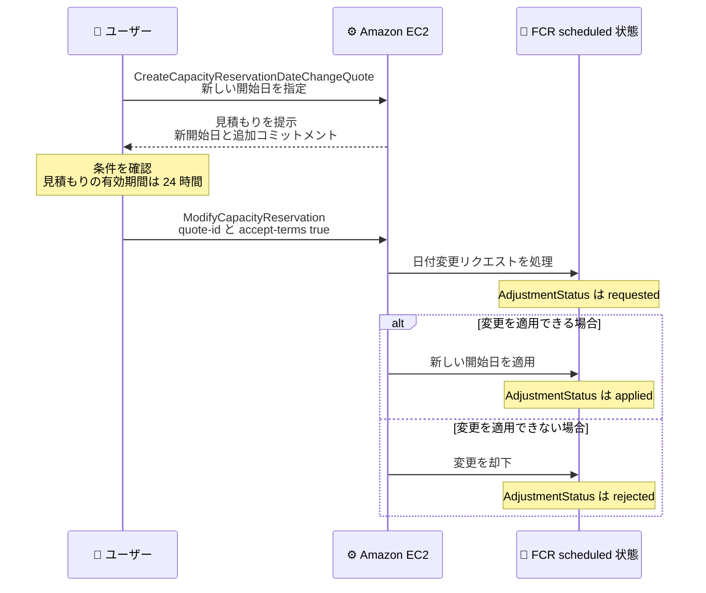

# Amazon EC2 - Future-dated Capacity Reservations の開始日延期サポート

**リリース日**: 2026 年 9 月 28 日
**サービス**: Amazon EC2 (Elastic Compute Cloud)
**機能**: Future-dated Capacity Reservations における開始日の延期 (Postponing Start Dates)

📊 [このアップデートのインフォグラフィックを見る](https://takech9203.github.io/aws-news-summary/20260928-ec2-fcr-postpone-start-date.html)

## 概要

Amazon EC2 Future-dated Capacity Reservations (FCR) で、予約の開始日を延期できるようになりました。FCR は、必要なキャパシティ、開始日、コミットメント期間を指定することで、最大 120 日前からキャパシティを確保できる機能です。今回のアップデートにより、キャパシティが提供される前に計画が変更になった場合でも、新しいスケジュールに合わせて開始日を後ろ倒しにできます。

開始日を延期する際は、EC2 が新しい開始日と必要なコミットメント期間を示す見積もり (quote) を提示します。延期のタイミングによってはコミットメント期間が増加する場合がありますが、見積もりの条件を確認して承諾すると、EC2 が予約に新しい開始日を適用します。事前に正確な条件を確認した上で判断できるため、意図しないコストの増加を避けられます。

本機能は、すべての Future-dated Capacity Reservations のお客様が利用できます。大規模なイベント、製品ローンチ、移行プロジェクトなどでキャパシティを事前確保しているものの、スケジュールが流動的なユーザーにとって有用なアップデートです。

**アップデート前の課題**

- 以前は FCR の開始日を作成後に変更できず、計画変更時の柔軟性が限られていた
- スケジュールが後ろ倒しになった場合、既存の予約をキャンセルして新規に作成し直すなどの対応が必要だった
- 予約の作り直しでは、同じキャパシティを再度確保できる保証がなく、リスクを伴った

**アップデート後の改善**

- `scheduled` 状態の FCR に対して、開始日の延期をリクエストできるようになった
- 延期前に見積もりで新しい開始日と必要なコミットメント期間を確認し、承諾するかどうかを判断できるようになった
- 予約を作り直すことなく、確保済みのキャパシティを維持したままスケジュール変更に対応できるようになった

## アーキテクチャ図



開始日の延期は、見積もりの取得、条件の承諾、EC2 による適用という 3 段階のフローで処理されます。処理状況は `AdjustmentStatus` フィールドで追跡できます。

## サービスアップデートの詳細

### 主要機能

1. **開始日の延期 (Postpone Start Date)**
   - `scheduled` 状態の Future-dated Capacity Reservation に対して開始日を後ろ倒しにできる
   - 累計で `OriginalStartDate` から最大 30 日まで延期可能 (例: 10 日延期した後は、さらに最大 20 日まで延期可能)
   - 開始日まで 1 時間を切っている場合は延期できない

2. **日付変更見積もり (Date-change Quote)**
   - 延期には日付変更見積もりの取得が必要で、見積もりには新しい開始日、追加コミットメント、変更後のコミットメント期間とコミットメント終了日が明示される
   - 見積もりの有効期間は 24 時間で、期限が切れた場合は新しい見積もりを取得する必要がある
   - 見積もり ID を指定して条件を承諾すると、EC2 が変更を適用する

3. **追加コミットメントのルール**
   - 現在の開始日の 2 週間より前にリクエストした場合、追加コミットメントは原則不要
   - 現在の開始日まで 2 週間以内にリクエストした場合、延期 1 日につき 1 日のコミットメントが追加されるのが一般的
   - 正確な条件は見積もりに表示されるため、承諾前に確認できる

4. **リクエスト状況の追跡**
   - `AdjustmentStatus` フィールドで処理状況を確認できる: `requested` (評価中)、`applied` (適用済み)、`rejected` (却下)
   - 1 つの FCR で同時に進行できる変更リクエストは 1 件のみ

## 技術仕様

### 状態ごとの変更可否

| Capacity Reservation の状態 | 可能な変更 |
|------|------|
| `assessing` | タグの変更のみ |
| `scheduled` | タグの変更、開始日の延期、終了日の変更 |
| `pending` | 変更不可 |
| `active` (コミットメント期間内) | コミット済みインスタンス数未満への削減、コミットメント期間より前の終了日設定は不可。それ以外は可能 |
| `delayed` / `expired` / `cancelled` / `unsupported` / `failed` | 変更不可 |

### 追加コミットメントの目安

| リクエストのタイミング | 一般的なコミットメント変化 |
|------|------|
| 現在の開始日の 2 週間より前 | 追加コミットメントなし |
| 現在の開始日まで 2 週間以内 | 延期 1 日につき 1 日のコミットメントを追加 |

例: 開始日が 2026-05-15、コミットメント期間 14 日の FCR について、2026-05-08 に開始日を 7 日延期した場合、開始日まで 2 週間以内のリクエストであるため、延期 1 日につき 1 日が追加され、合計コミットメント期間は 21 日になります。

### 関連 API

| API | 役割 |
|------|------|
| `CreateCapacityReservationDateChangeQuote` | 新しい開始日を指定して日付変更見積もりを生成 |
| `ModifyCapacityReservation` | 見積もり ID と条件承諾フラグを指定して変更を適用 |
| `DescribeCapacityReservations` | `AdjustmentStatus` フィールドでリクエスト状況を確認 |

## 設定方法

### 前提条件

1. `scheduled` 状態の Future-dated Capacity Reservation が存在すること
2. 延期後の開始日が `OriginalStartDate` から累計 30 日以内であること
3. 現在の開始日まで 1 時間以上の余裕があること

### 手順

#### ステップ 1: 日付変更見積もりを生成する

```bash
aws ec2 create-capacity-reservation-date-change-quote \
    --capacity-reservation-id cr-1234567890abcdef0 \
    --new-start-date 2026-05-22T00:00:00.000Z
```

対象の Capacity Reservation ID と新しい開始日を指定して、日付変更見積もりを生成します。レスポンスの `CapacityReservationModificationQuote` に、追加コミットメントや変更後の `CommitmentEndDate` が含まれます。

#### ステップ 2: 見積もりを承諾して変更を適用する

```bash
aws ec2 modify-capacity-reservation \
    --capacity-reservation-id cr-1234567890abcdef0 \
    --quote-id crmq-1a2b3c4d5e6f7g8h9i0j \
    --accept-terms true
```

見積もり ID を指定して条件を承諾し、変更リクエストを送信します。見積もりにリクエスト時の開始日が含まれているため、開始日を再度指定する必要はありません。

#### ステップ 3: リクエストの状況を確認する

```bash
aws ec2 describe-capacity-reservations \
    --capacity-reservation-ids cr-1234567890abcdef0 \
    --query "CapacityReservations[0].AdjustmentStatus"
```

`AdjustmentStatus` フィールドを確認し、リクエストの処理状況を追跡します。`requested` は評価中、`applied` は新しい開始日が適用済み、`rejected` は EC2 が変更をサポートできなかったことを示します。

マネジメントコンソールから操作する場合は、EC2 コンソールの [Capacity Reservations] で対象の予約を選択して [Edit] を選び、開始日を変更した後、見積もりの条件を確認して `confirm` と入力して承諾します。

## メリット

### ビジネス面

- **計画変更への柔軟な対応**: 製品ローンチやイベントの延期など、ビジネススケジュールの変更に合わせてキャパシティ確保の開始日を調整できる
- **コストの透明性**: 承諾前に見積もりで追加コミットメントを確認できるため、予期しないコスト増加を回避できる
- **キャパシティ確保の維持**: 予約を作り直す必要がないため、確保済みのキャパシティを失うリスクがない

### 技術面

- **API による自動化**: `CreateCapacityReservationDateChangeQuote` と `ModifyCapacityReservation` を組み合わせて、延期処理をワークフローに組み込める
- **状態追跡**: `AdjustmentStatus` フィールドにより、変更リクエストの進行状況をプログラムから監視できる
- **段階的な延期**: 累計 30 日の範囲内で複数回に分けて延期でき、状況の変化に段階的に対応できる

## デメリット・制約事項

### 制限事項

- 延期できるのは `scheduled` 状態の FCR のみ (`assessing` 状態で開始日を変更したい場合は、無料でキャンセルして新しい開始日でリクエストを再作成する)
- 延期は `OriginalStartDate` から累計 30 日までに制限される
- 開始日まで 1 時間を切っている場合は延期できない
- 見積もりの有効期間は 24 時間で、期限切れ後は再取得が必要
- 同時に進行できる変更リクエストは 1 件のみで、処理中のリクエストの差し替えやキャンセルはできない

### 考慮すべき点

- 開始日まで 2 週間以内の延期では、延期日数分のコミットメントが追加されるため、コスト影響を見積もりで必ず確認する
- 延期リクエストが `rejected` になる場合もあるため、`AdjustmentStatus` の確認をワークフローに組み込む
- 30 日を超える大幅なスケジュール変更が必要な場合は、キャンセルと再作成を含めた対応を検討する必要がある

## ユースケース

### ユースケース 1: 製品ローンチの延期に伴うキャパシティ調整

**シナリオ**: 大規模な製品ローンチに備えて FCR でキャパシティを確保していたが、ローンチが 1 週間延期になった。

**実装例**:
```bash
# 新しいローンチ日に合わせて見積もりを取得
aws ec2 create-capacity-reservation-date-change-quote \
    --capacity-reservation-id cr-1234567890abcdef0 \
    --new-start-date 2026-10-22T00:00:00.000Z

# 見積もりを確認後、承諾して適用
aws ec2 modify-capacity-reservation \
    --capacity-reservation-id cr-1234567890abcdef0 \
    --quote-id crmq-1a2b3c4d5e6f7g8h9i0j \
    --accept-terms true
```

**効果**: 確保済みのキャパシティを失うことなく、新しいローンチ日に合わせて予約を調整できる。

### ユースケース 2: 移行プロジェクトのスケジュール変更

**シナリオ**: オンプレミスから AWS への移行プロジェクトで GPU インスタンスの FCR を確保していたが、事前検証の遅延により移行開始が 2 週間後ろ倒しになった。

**実装例**:
```bash
# 開始日の 2 週間より前に延期リクエストを実施し、追加コミットメントを回避
aws ec2 create-capacity-reservation-date-change-quote \
    --capacity-reservation-id cr-0987654321fedcba0 \
    --new-start-date 2026-11-15T00:00:00.000Z
```

**効果**: 早めに延期をリクエストすることで、追加コミットメントなしで移行スケジュールに合わせたキャパシティ確保を維持できる。

### ユースケース 3: 延期リクエストの自動追跡

**シナリオ**: 複数の FCR を管理しており、延期リクエストの適用状況を自動で監視したい。

**実装例**:
```bash
# AdjustmentStatus を定期的に確認
aws ec2 describe-capacity-reservations \
    --capacity-reservation-ids cr-1234567890abcdef0 \
    --query "CapacityReservations[0].{Id:CapacityReservationId,Status:State,Adjustment:AdjustmentStatus}"
```

**効果**: `applied` または `rejected` への遷移を検知し、却下時には代替のキャパシティ確保策を迅速に検討できる。

## 料金

開始日の延期自体に追加料金はありませんが、延期のタイミングによってはコミットメント期間が増加します。一般的な目安は以下のとおりです。

| リクエストのタイミング | コスト影響 |
|--------|------------------|
| 開始日の 2 週間より前 | 追加コミットメントなし |
| 開始日まで 2 週間以内 | 延期 1 日につき 1 日のコミットメントを追加 (その分の予約料金が増加) |

正確な条件は延期時に提示される見積もりに表示されるため、承諾前に必ず確認してください。Capacity Reservation の料金は、予約したインスタンスタイプの On-Demand 料金に基づいて課金されます。

## 利用可能リージョン

すべての Future-dated Capacity Reservations のお客様が利用できます。リージョンごとの提供状況は [AWS Capabilities by Region](https://builder.aws.com/build/capabilities/explore) を参照してください。

## 関連サービス・機能

- **On-Demand Capacity Reservations (ODCR)**: 特定のアベイラビリティーゾーンでキャパシティを即時に確保する機能。FCR はその将来日付版
- **EC2 Capacity Blocks for ML**: ML ワークロード向けに GPU キャパシティを将来の日付で確保する機能
- **EC2 Capacity Manager**: キャパシティの使用状況を一元的に可視化し、予約の管理を支援する機能

## 参考リンク

- 📊 [インフォグラフィック](https://takech9203.github.io/aws-news-summary/20260928-ec2-fcr-postpone-start-date.html)
- [公式発表 (What's New)](https://aws.amazon.com/about-aws/whats-new/2026/09/ec2-fcr-postpone-start-date/)
- [ドキュメント: Modify a Capacity Reservation](https://docs.aws.amazon.com/AWSEC2/latest/UserGuide/capacity-reservations-modify.html)
- [ドキュメント: Capacity Reservations](https://docs.aws.amazon.com/AWSEC2/latest/UserGuide/ec2-capacity-reservations.html)
- [料金ページ: Amazon EC2 On-Demand 料金](https://aws.amazon.com/ec2/pricing/on-demand/)

## まとめ

Future-dated Capacity Reservations の開始日延期サポートにより、キャパシティ確保後のスケジュール変更に柔軟に対応できるようになりました。延期条件は見積もりで事前に確認でき、特に開始日の 2 週間より前であれば追加コミットメントなしで延期できる可能性が高いため、計画変更が判明した時点で早めにリクエストすることを推奨します。FCR を利用中のチームは、`AdjustmentStatus` の監視を含めた運用フローへの組み込みを検討してください。
