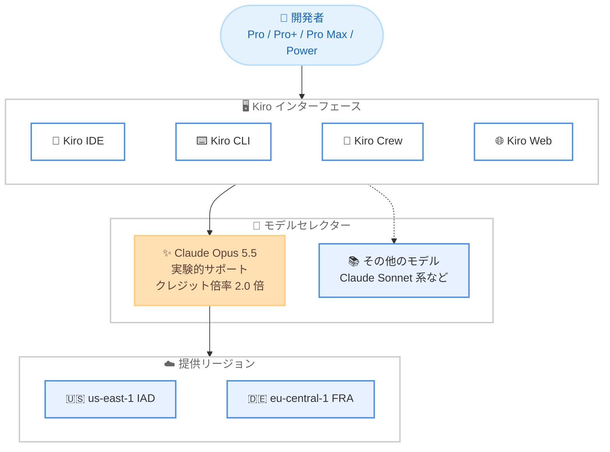

# Kiro - Claude Opus 5.5 の提供開始

**リリース日**: 2026 年 9 月 28 日
**サービス**: Kiro
**機能**: Claude Opus 5.5 の実験的サポート

📊 [このアップデートのインフォグラフィックを見る](https://takech9203.github.io/aws-news-summary/20260928-kiro-opus-5-5.html)

## 概要

AWS が提供する AI 搭載 IDE である Kiro において、Anthropic の最新モデル Claude Opus 5.5 が利用可能になりました。Claude Opus 5.5 は Kiro IDE、CLI、Crew、Web のすべてのインターフェースで実験的サポートとして段階的に展開されます。

Claude Opus 5.5 は Anthropic の Opus シリーズで最も高性能なモデルであり、ブログ記事によると、多くのタスクにおいて Claude Fable 5.1 相当の性能を Opus 5 より 40% 低いコストで提供するとされています。エージェント型コーディングでは、変更を加える前に根本原因を特定し、作業しながら自身の成果を検証するため、変更内容のレビューと信頼がしやすくなります。また、従来のモデルよりも自然なコミュニケーションを行い、最も重要な情報を先頭に提示するため、出力が明確で理解しやすくなっています。

クレジット倍率は 2.0 倍で、Opus 5 の 2.2 倍から引き下げられており、より高性能なモデルをより低いクレジット消費で利用できます。対象は Kiro Pro、Pro+、Pro Max、Power の各プランのユーザーです。

**アップデート前の課題**

- 以前は Kiro で利用できる最上位の Opus モデルは Opus 5 であり、クレジット倍率は 2.2 倍だった
- 以前はエージェントのツール呼び出し回数やトークン消費が多く、セッションの時間とコストが開発者の負担になっていた
- 以前は複雑なタスクで最高水準の性能を得るには、相応に高いクレジット消費が必要だった

**アップデート後の改善**

- 今回のアップデートにより、Claude Opus 5.5 を Kiro IDE、CLI、Crew、Web のすべてで利用可能になった
- 今回のアップデートにより、クレジット倍率が 2.0 倍に低下し、Opus 5 の 2.2 倍よりも低コストで上位モデルを利用できるようになった
- 今回のアップデートにより、社内ベンチマークで Opus 5 比約 40% 少ないツール呼び出しと半分のトークン消費で、より高い性能を達成した
- 今回のアップデートにより、100 万トークンのフルコンテキストウィンドウを利用できるようになった

## アーキテクチャ図



Kiro の各インターフェースから Claude Opus 5.5 をモデルセレクターで選択でき、us-east-1 と eu-central-1 でホストされたモデルが利用されます。

## サービスアップデートの詳細

### 主要機能

1. **エージェント型コーディング性能の向上**
   - 変更を加える前に根本原因を特定し、作業を進めながら自身の成果を検証する
   - 変更内容のレビューがしやすく、信頼性の高いコード変更を実現
   - 社内ベンチマークでは Opus 5 を上回る性能を、約 40% 少ないツール呼び出しと半分のトークン消費で達成

2. **より明確なコミュニケーション**
   - 従来のモデルよりも自然な文章で応答する
   - 最も重要な情報を先頭に提示するため、出力が明確で追いやすい

3. **コスト効率の向上**
   - 多くのタスクで Claude Fable 5.1 相当の性能を Opus 5 より 40% 低いコストで提供
   - クレジット倍率は 2.0 倍で、Opus 5 の 2.2 倍から引き下げ
   - AWS の Agentic AI 担当 VP である Deepak Singh 氏によると、実際のコマンドラインタスクの公開ベンチマークで、Opus 5 より多くの課題を約 40% 少ない呼び出し回数と半分のトークンで解決した

4. **大規模コンテキストウィンドウ**
   - 100 万トークンのフルコンテキストウィンドウを搭載
   - 大規模なコードベースや長時間のエージェントセッションに対応

## 技術仕様

### モデル仕様

| 項目 | 詳細 |
|------|------|
| モデル名 | Claude Opus 5.5 |
| 提供形態 | 実験的サポート (段階的ロールアウト) |
| 対応インターフェース | Kiro IDE、CLI、Crew、Web |
| 対象プラン | Pro、Pro+、Pro Max、Power |
| コンテキストウィンドウ | 100 万トークン |
| クレジット倍率 | 2.0 倍 (Opus 5 は 2.2 倍) |
| ホストリージョン | us-east-1 (IAD)、eu-central-1 (FRA) |

### セーフガードに関する注記

Opus 5.5 は生物学とサイバーセキュリティの分野で Claude Mythos 5.1 と同等の能力を持ち、Claude Fable 5.1 と同様のセーフガードが適用されています。日常的なコーディング、健康、教育に関する質問は通常どおり動作しますが、一部の高リスクなリクエストはブロックされます。無害なタスクで誤検知が発生した場合は、Kiro で別のモデルに切り替えることが推奨されています。

## 設定方法

### 前提条件

1. Kiro Pro、Pro+、Pro Max、Power のいずれかのプランに加入していること
2. Kiro IDE、CLI、Crew、Web のいずれかを利用していること
3. 段階的ロールアウトの対象になっていること

### 手順

#### ステップ 1: Kiro を最新の状態にする

```bash
# Kiro CLI の場合は再起動して最新モデルを確認
kiro
```

Kiro IDE、CLI、Crew を利用している場合は、[ダウンロードページ](https://kiro.dev/downloads/) から最新版を取得するか、アプリケーションを再起動して利用可能なモデルの一覧を更新します。

#### ステップ 2: Web の場合はブラウザを更新する

Kiro Web を利用している場合は、ブラウザを再読み込みするとモデルセレクターに Claude Opus 5.5 が表示されます。

#### ステップ 3: モデルセレクターで Claude Opus 5.5 を選択する

モデルセレクターから Claude Opus 5.5 を選択してセッションを開始します。段階的ロールアウト中のため、表示されない場合は時間をおいて再度確認します。

## メリット

### ビジネス面

- **コスト効率の向上**: クレジット倍率が 2.2 倍から 2.0 倍に低下し、同じクレジットでより多くの高性能モデルの利用が可能
- **開発速度の向上**: ツール呼び出し回数の削減とトークン消費の半減により、エージェントセッションがより高速かつ低コストに
- **成果物の品質向上**: レビューしやすく信頼性の高いコード変更により、レビュー工数を削減

### 技術面

- **根本原因の特定**: 変更前に根本原因を特定するアプローチにより、場当たり的な修正を回避
- **自己検証**: 作業を進めながら自身の成果を検証するため、手戻りが減少
- **大規模コンテキスト**: 100 万トークンのコンテキストウィンドウにより、大規模コードベースの理解と長時間セッションに対応

## デメリット・制約事項

### 制限事項

- 実験的サポートとしての提供であり、段階的ロールアウトのためすべてのユーザーがすぐに利用できるとは限らない
- 対象プランは Pro、Pro+、Pro Max、Power であり、Free プランでは利用できない
- モデルのホストリージョンは us-east-1 (IAD) と eu-central-1 (FRA) に限定される

### 考慮すべき点

- クレジット倍率が 2.0 倍のため、標準モデルよりもクレジット消費が大きい点を考慮する
- セーフガードにより一部の高リスクなリクエストはブロックされる。無害なタスクで誤検知が発生した場合は別のモデルへの切り替えが必要

## ユースケース

### ユースケース 1: 大規模コードベースのバグ修正

**シナリオ**: 大規模なモノレポで発生した複雑なバグを、根本原因から特定して修正したい。

**実装例**:
```
Kiro IDE で Claude Opus 5.5 を選択し、バグの再現手順とエラーログを提示して調査を依頼する。
モデルは変更を加える前に根本原因を特定し、修正後に自身の変更を検証する。
```

**効果**: 場当たり的な修正ではなく根本原因に基づいた修正が行われ、レビューしやすい変更が得られる。

### ユースケース 2: 長時間のエージェントセッションによるリファクタリング

**シナリオ**: 複数のモジュールにまたがるリファクタリングを、コンテキストを維持したまま一貫して実行したい。

**実装例**:
```
Kiro CLI または Crew で Claude Opus 5.5 を選択し、リファクタリング方針をスペックとして定義して実行する。
100 万トークンのコンテキストウィンドウにより、大量のファイルを参照しながら一貫した変更を適用できる。
```

**効果**: 大規模な変更でも文脈を失わずに一貫性のあるリファクタリングを実現できる。

### ユースケース 3: ルーチンタスクのコスト最適化

**シナリオ**: 日常的なコマンドラインタスクをエージェントに任せつつ、クレジット消費を抑えたい。

**実装例**:
```
従来 Opus 5 (クレジット倍率 2.2 倍) で実行していたタスクを Claude Opus 5.5 (2.0 倍) に切り替える。
ツール呼び出し回数が約 40% 減り、トークン消費も半減するため、セッション全体のコストが低下する。
```

**効果**: 同等以上の成果をより少ないクレジット消費と短い実行時間で達成できる。

## 料金

Claude Opus 5.5 のクレジット倍率は 2.0 倍で、Opus 5 の 2.2 倍から引き下げられました。Kiro の各有料プランに含まれるクレジットを消費して利用します。

### Kiro プラン (参考)

| プラン | 月額料金 | クレジット | Claude Opus 5.5 |
|--------|----------|-----------|-----------------|
| Free | $0 | 50 クレジット | 利用不可 |
| Pro | $20 | 1,000 クレジット | 利用可能 |
| Pro+ | $40 | 2,000 クレジット | 利用可能 |
| Pro Max | $100 | 5,000 クレジット | 利用可能 |
| Power | $200 | 10,000 クレジット | 利用可能 |

有料プランでは追加クレジットを $0.04/クレジットで購入できます。最新の料金は [料金ページ](https://kiro.dev/pricing/) を参照してください。

## 利用可能リージョン

Kiro はグローバルに利用可能なサービスです。なお、Claude Opus 5.5 のモデルは us-east-1 (IAD) と eu-central-1 (FRA) でホストされ、対象プランのユーザーに段階的に展開されます。

## 関連サービス・機能

- **Kiro IDE / CLI / Crew / Web**: Claude Opus 5.5 はすべての Kiro インターフェースで利用可能
- **Amazon Bedrock**: AWS 上で Claude ファミリーのモデルを API として利用できるサービス
- **Kiro スペック駆動開発**: プロトタイプから本番までを支援する Kiro の中核機能であり、高性能モデルとの組み合わせで効果を発揮

## 参考リンク

- 📊 [インフォグラフィック](https://takech9203.github.io/aws-news-summary/20260928-kiro-opus-5-5.html)
- [公式ブログ記事 (Claude Opus 5.5 is now available in Kiro)](https://kiro.dev/blog/opus-5-5/)
- [Kiro Changelog](https://kiro.dev/changelog/)
- [Kiro ドキュメント](https://kiro.dev/docs/)
- [料金ページ](https://kiro.dev/pricing/)

## まとめ

Claude Opus 5.5 の Kiro への追加により、Anthropic の最上位 Opus モデルを従来より低いクレジット倍率 (2.0 倍) で利用できるようになりました。ツール呼び出し回数の削減とトークン消費の半減により、エージェントセッションの速度とコスト効率が大きく向上します。Pro 以上のプランを利用中のユーザーは、Kiro を最新版に更新してモデルセレクターから Claude Opus 5.5 を試すことを推奨します。
