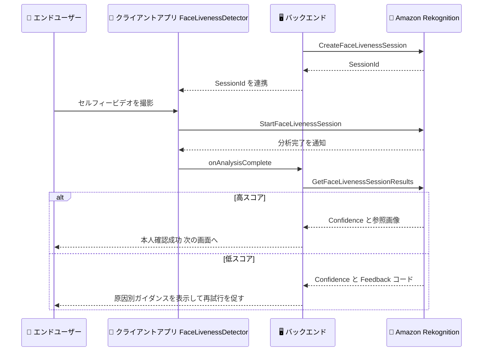

# Amazon Rekognition - Face Liveness Feedback Codes

**リリース日**: 2026 年 9 月 28 日
**サービス**: Amazon Rekognition
**機能**: Face Liveness Feedback Codes (GetFaceLivenessSessionResults API レスポンスへのフィードバックコード追加)

📊 [このアップデートのインフォグラフィックを見る](https://takech9203.github.io/aws-news-summary/20260928-rekognition-liveness-feedback-codes.html)

## 概要

Amazon Rekognition Face Liveness が、`GetFaceLivenessSessionResults` API のレスポンスでフィードバックコード (Feedback Codes) を返すようになりました。Face Liveness は、短いセルフィービデオによるガイド付きチェックを通じて、写真、リプレイ動画、マスク、ディープフェイクなどのなりすましではなく、実在の人物がその場にいることを確認する機能です。今回のアップデートにより、ライブネスチェックの信頼度スコアが低くなった理由 (照明不足、顔の遮蔽、目を閉じている、動画品質の低下など) がコードとして提示されます。

1 つのセッションで複数のフィードバックコードが返されるため、エンドユーザーは検出されたすべての問題を一度に修正して再試行できます。アプリケーション開発者はこのコードをエンドユーザー向けのガイダンスとして表示することで、再試行の成功率を高め、本人確認フローの完了率を向上させることができます。

本人確認を伴うオンボーディング、再認証、アクセシビリティ対応など、Face Liveness を利用するあらゆるユースケースで、ユーザー体験の改善に活用できます。

**アップデート前の課題**

以前は、ライブネスチェックが低スコアで終わった場合に原因を特定する手段が限られていました。

- 信頼度スコアが低い場合でも、API レスポンスからは「なぜ低かったのか」が分からなかった
- エンドユーザーには「もう一度お試しください」といった一般的なメッセージしか表示できず、同じ失敗を繰り返しやすかった
- 失敗原因の分析には監査画像の目視確認など、追加の手間が必要だった

**アップデート後の改善**

今回のアップデートにより、低スコアの原因を機械可読なコードとして取得できるようになりました。

- `GetFaceLivenessSessionResults` のレスポンスに `Feedback` フィールドが追加され、低スコアの原因コードとメッセージが返される
- 1 セッションで複数のコードが返されるため、ユーザーはすべての問題を一度に修正して再試行できる
- 「明るい場所に移動してください」など、原因に応じた具体的なガイダンスをエンドユーザーに提示できる

## アーキテクチャ図



Face Liveness の API フローを示しています。低スコアの場合、`GetFaceLivenessSessionResults` のレスポンスに含まれる `Feedback` コードをもとに、エンドユーザーへ具体的な修正ガイダンスを提示して再試行を促すことができます。

## サービスアップデートの詳細

### 主要機能

1. **Feedback フィールドの追加**
   - `GetFaceLivenessSessionResults` API のレスポンスに `Feedback` リストが追加された
   - 各要素は `Code` (原因を示す列挙値) と `Message` (説明文) で構成される
   - 低スコアの原因となった条件を機械可読な形式で取得できる

2. **複数コードの同時返却**
   - 1 つのセッションで複数のフィードバックコードが返される
   - 「照明が暗い」「顔が正面を向いていない」など、複数の問題を一度に把握できる
   - エンドユーザーは 1 回の再試行ですべての問題を修正できるため、再試行回数を削減できる

3. **Metadata フィールドの追加**
   - 同じ API 変更で `Metadata` フィールドも追加された
   - セッションのストリーミングに使用されたクライアント SDK の種類 (`SDKType`) を確認できる
   - クライアント環境ごとの傾向分析やトラブルシューティングに活用できる

## 技術仕様

### フィードバックコード一覧

| コード | 意味 |
|------|------|
| `FACE_NOT_VISIBLE` | 顔が映っていない |
| `FACE_OBSTRUCTION_DETECTED` | 顔の遮蔽 (マスク、手など) を検出 |
| `LOW_VIDEO_QUALITY_DETECTED` | 動画品質の低下を検出 |
| `FACE_NOT_ALIGNED` | 顔がカメラに正対していない |
| `EYES_CLOSED_DETECTED` | 目を閉じている状態を検出 |
| `LOW_LIGHTING_DETECTED` | 照明不足を検出 |
| `HIGH_LIGHTING_DETECTED` | 照明過多 (逆光や白飛びなど) を検出 |

### API 変更履歴

| 日付 | サービス | 変更内容 |
|------|----------|----------|
| 2026/09/25 | [rekognition](https://awsapichanges.com/archive/changes/a0db94-rekognition.html) | 1 updated api method - `GetFaceLivenessSessionResults` レスポンスに `Feedback` と `Metadata` を追加 |

### レスポンス例 (低スコアセッション)

```json
{
    "SessionId": "3b2d1f0a-9c4e-4a7b-8f2d-1e6c5a4b3d2e",
    "Confidence": 45.2,
    "Status": "SUCCEEDED",
    "Feedback": [
        {
            "Code": "LOW_LIGHTING_DETECTED",
            "Message": "Please move to a brighter location or add more lighting."
        },
        {
            "Code": "FACE_NOT_ALIGNED",
            "Message": "Please look directly at the camera without tilting your head."
        }
    ],
    "Metadata": {
        "SDKType": "js"
    }
}
```

## 設定方法

### 前提条件

1. AWS アカウントと AWS CLI / AWS SDK のセットアップが完了していること
2. バックエンドの IAM ポリシーに `rekognition:CreateFaceLivenessSession` と `rekognition:GetFaceLivenessSessionResults` の権限があること
3. クライアントアプリで AWS Amplify の FaceLivenessDetector コンポーネントをセットアップしていること

### 手順

#### ステップ1: Face Liveness セッションの作成

```bash
aws rekognition create-face-liveness-session \
    --region us-east-1
```

バックエンドから Face Liveness セッションを作成し、一意の `SessionId` を取得します。取得した `SessionId` をクライアントアプリに連携します。

#### ステップ2: クライアントでのライブネスチェック実行

クライアントアプリの FaceLivenessDetector コンポーネントが `StartFaceLivenessSession` を呼び出し、エンドユーザーがセルフィービデオを撮影します。この処理は Amplify コンポーネントが自動的に実行するため、追加のセットアップは不要です。

#### ステップ3: 結果とフィードバックコードの取得

```bash
aws rekognition get-face-liveness-session-results \
    --session-id "3b2d1f0a-9c4e-4a7b-8f2d-1e6c5a4b3d2e" \
    --region us-east-1
```

セッションの結果を取得します。信頼度スコアが低い場合、レスポンスの `Feedback` リストに原因コードが含まれます。アプリケーションはこのコードに応じて「明るい場所に移動してください」などのガイダンスをエンドユーザーに表示し、再試行を促します。

## メリット

### ビジネス面

- **本人確認の完了率向上**: 失敗原因を具体的に提示することで再試行の成功率が上がり、オンボーディングの離脱を減らせる
- **サポートコストの削減**: 「なぜ失敗したのか分からない」という問い合わせを減らし、エンドユーザーが自己解決できるようになる
- **アクセシビリティの向上**: 原因に応じた明確なガイダンスにより、多様なユーザーがスムーズに本人確認を完了できる

### 技術面

- **機械可読な失敗原因**: 列挙型のコードとして原因を取得できるため、多言語対応の UI メッセージやリトライロジックを実装しやすい
- **複数原因の一括把握**: 1 セッションで複数コードが返るため、1 回の再試行で全問題を解消でき、セッション数の増加を抑制できる
- **追加実装の負担が小さい**: 既存の `GetFaceLivenessSessionResults` レスポンスへのフィールド追加のため、API フローの変更は不要

## デメリット・制約事項

### 制限事項

- フィードバックコードは低スコアのセッションで返されるものであり、高スコアのセッションでは返されない
- 利用可能リージョンは米国東部 (バージニア北部)、米国西部 (オレゴン)、欧州 (アイルランド)、アジアパシフィック (東京、ムンバイ、マレーシア、タイ)、南米 (サンパウロ) に限られる
- コードは事前定義された 7 種類の列挙値であり、それ以外の失敗原因は特定できない場合がある

### 考慮すべき点

- `Message` フィールドは英語で返されるため、日本語アプリケーションでは `Code` をもとに独自のメッセージへマッピングする実装が推奨される
- 再試行時は新しいセッションを作成する必要があり、セッションごとに課金が発生するため、再試行回数の上限設計が必要
- 信頼度スコアのしきい値判定は従来どおりアプリケーション側の責務であり、フィードバックコードはしきい値判定を代替するものではない

## ユースケース

### ユースケース1: 金融サービスのオンライン口座開設 (eKYC)

**シナリオ**: オンライン口座開設の本人確認でライブネスチェックが低スコアとなり、ユーザーが原因不明のまま離脱してしまう。

**実装例**:
```javascript
const result = await client.send(new GetFaceLivenessSessionResultsCommand({
    SessionId: sessionId
}));

if (result.Confidence < THRESHOLD && result.Feedback) {
    const guidance = result.Feedback.map((f) => messageMapJa[f.Code]);
    showRetryScreen(guidance); // 例: 「明るい場所に移動してください」
}
```

**効果**: 原因別の日本語ガイダンスを提示することで再試行の成功率が向上し、口座開設フローの完了率と顧客体験が改善する。

### ユースケース2: 高額取引時の再認証

**シナリオ**: 送金や設定変更などの重要操作で再認証としてライブネスチェックを実施しているが、失敗時のユーザー負担が大きい。

**実装例**:
```javascript
// 複数のフィードバックコードをまとめてチェックリスト表示
const checklist = result.Feedback?.map((f) => ({
    code: f.Code,
    fixed: false,
    hint: messageMapJa[f.Code]
}));
renderChecklist(checklist);
```

**効果**: 複数の問題を一度に提示することで 1 回の再試行で認証を完了でき、重要操作の中断時間を最小化できる。

### ユースケース3: 失敗傾向の分析と UX 改善

**シナリオ**: ライブネスチェックの失敗率が高い環境や端末を特定し、アプリの UX を継続的に改善したい。

**実装例**:
```javascript
// フィードバックコードと SDK 種別を分析基盤へ送信
analytics.track("liveness_low_confidence", {
    codes: result.Feedback?.map((f) => f.Code),
    sdkType: result.Metadata?.SDKType
});
```

**効果**: `LOW_LIGHTING_DETECTED` が多い場合は撮影前の明るさチェックを追加するなど、データに基づいた UX 改善が可能になる。

## 料金

フィードバックコードの取得自体に追加料金はありません。Face Liveness は従来どおりチェック 1 回 (セッション) ごとの従量課金です。ボリュームに応じた段階的な割引が適用されます。詳細は [Amazon Rekognition 料金ページ](https://aws.amazon.com/rekognition/pricing/) を参照してください。

## 利用可能リージョン

- 米国東部 (バージニア北部)
- 米国西部 (オレゴン)
- 欧州 (アイルランド)
- アジアパシフィック (東京)
- アジアパシフィック (ムンバイ)
- アジアパシフィック (マレーシア)
- アジアパシフィック (タイ)
- 南米 (サンパウロ)

## 関連サービス・機能

- **AWS Amplify**: FaceLivenessDetector コンポーネントがクライアント側のビデオ撮影と `StartFaceLivenessSession` の呼び出しを担う
- **Amazon Rekognition CompareFaces**: Face Liveness が返す参照画像を ID 書類の顔写真と照合し、本人確認を完結できる
- **Amazon S3**: セッションの参照画像と監査画像の保存先として指定でき、失敗原因の目視確認や監査に活用できる

## 参考リンク

- 📊 [インフォグラフィック](https://takech9203.github.io/aws-news-summary/20260928-rekognition-liveness-feedback-codes.html)
- [公式発表 (What's New)](https://aws.amazon.com/about-aws/whats-new/2026/09/rekognition-liveness-feedback-codes/)
- [ドキュメント: Face Liveness API プログラミングガイド](https://docs.aws.amazon.com/rekognition/latest/dg/face-liveness-programming-api.html)
- [ドキュメント: Face Liveness FAQ](https://docs.aws.amazon.com/rekognition/latest/dg/face-liveness-faq.html)
- [API リファレンス: GetFaceLivenessSessionResults](https://docs.aws.amazon.com/rekognition/latest/APIReference/API_GetFaceLivenessSessionResults.html)
- [料金ページ](https://aws.amazon.com/rekognition/pricing/)

## まとめ

Face Liveness のフィードバックコードにより、ライブネスチェック失敗時の原因をエンドユーザーへ具体的に提示できるようになり、本人確認フローの完了率とユーザー体験を大きく改善できます。Face Liveness を利用中のアプリケーションでは、`GetFaceLivenessSessionResults` レスポンスの `Feedback` フィールドを解析し、コード別の日本語ガイダンス表示を実装することを推奨します。
