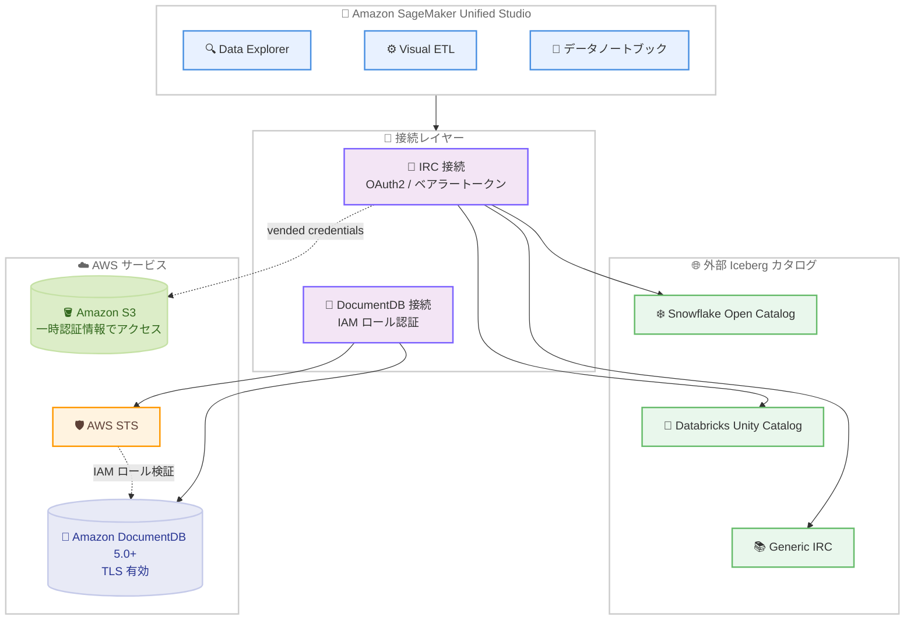

# Amazon SageMaker Unified Studio - Iceberg REST Catalog 接続と Amazon DocumentDB の IAM 認証をサポート

**リリース日**: 2026 年 9 月 28 日
**サービス**: Amazon SageMaker Unified Studio
**機能**: Iceberg REST Catalog (IRC) 接続および Amazon DocumentDB 接続の IAM 認証

📊 [このアップデートのインフォグラフィックを見る](https://takech9203.github.io/aws-news-summary/20260928-sagemaker-iceberg-rest-iam-documentdb.html)

## 概要

Amazon SageMaker Unified Studio が、2 つの新しい接続機能をサポートしました。1 つ目は Iceberg REST Catalog (IRC) 接続で、Iceberg REST 仕様に準拠した外部 Apache Iceberg カタログへの接続が可能になります。2 つ目は Amazon DocumentDB 接続の IAM 認証で、データベースのユーザー名やパスワードを保存せずに DocumentDB へ接続できるようになります。

IRC 接続では、Snowflake Open Catalog (Polaris)、Databricks Unity Catalog、およびその他の仕様準拠カタログ向けの Generic IRC タイプがサポートされます。接続後は Data Explorer でのカタログ閲覧 (カタログ / スキーマ / テーブルの一覧表示、カラム表示、データサンプリング)、Visual ETL でのソースまたは追記 / 上書きシンクとしての読み書き、データノートブックからのクエリが可能です。認証には OAuth2 またはベアラートークンを使用し、データアクセスには有効期限の短い一時的な Amazon S3 認証情報 (vended credentials) が使用されます。

DocumentDB の IAM 認証では、接続に紐づく IAM ロールを使用して認証を行い、DocumentDB が AWS Security Token Service (AWS STS) 経由で検証します。データチームは、より幅広いガバナンス対象データソースへの接続と、プロジェクト全体でのクレデンシャルレスな認証を実現できます。

**アップデート前の課題**

- SageMaker Unified Studio から Snowflake Open Catalog や Databricks Unity Catalog などの外部 Iceberg カタログに直接接続できず、データを複製するか別のツールを使用する必要があった
- DocumentDB への接続では、データベースのユーザー名とパスワードを接続設定やノートブックに保存する必要があり、認証情報の管理・ローテーションの負担があった
- 外部カタログ上のデータを分析するには、データの移動やコピーによるガバナンスの分断が発生していた

**アップデート後の改善**

- Iceberg REST 仕様に準拠した外部カタログ (Snowflake Open Catalog、Databricks Unity Catalog、Generic IRC) へ直接接続し、Data Explorer、Visual ETL、データノートブックから利用できるようになった
- DocumentDB 接続で IAM ロールベースの認証が可能になり、ユーザー名 / パスワードの保存が不要になった
- 接続のライフサイクル (作成、編集、削除、テスト) が完全にサポートされ、接続管理が一元化された

## アーキテクチャ図



SageMaker Unified Studio の各ツール (Data Explorer、Visual ETL、データノートブック) から、IRC 接続経由で外部 Iceberg カタログへ、IAM 認証の DocumentDB 接続経由で DocumentDB クラスターへアクセスする構成を示しています。IRC のデータアクセスには一時的な S3 認証情報が、DocumentDB 認証には AWS STS が使用されます。

## サービスアップデートの詳細

### 主要機能

1. **Iceberg REST Catalog (IRC) 接続**
   - Iceberg REST 仕様に準拠した外部 Apache Iceberg カタログへの接続をサポート
   - サポートされるカタログタイプ: Snowflake Open Catalog (Polaris)、Databricks Unity Catalog、Generic IRC (その他の仕様準拠カタログ向け)
   - 認証は OAuth2 またはベアラートークンを使用
   - データアクセスには有効期限の短い一時的な Amazon S3 認証情報 (vended credentials) を使用

2. **IRC 接続で利用可能な操作**
   - Data Explorer: カタログ / スキーマ / テーブルの一覧表示、カラムの表示、データのサンプリング
   - Visual ETL: ソースとしての読み取り、追記 (append) / 上書き (overwrite) シンクとしての書き込み
   - データノートブック: 接続先カタログへのクエリ実行
   - 接続ライフサイクルの完全サポート: 作成、編集、削除、接続テスト

3. **Amazon DocumentDB 接続の IAM 認証**
   - データベースのユーザー名 / パスワードを接続やノートブックに保存せずに DocumentDB へ接続可能
   - 接続に紐づく IAM ロールで認証し、DocumentDB が AWS STS 経由で検証
   - データノートブック、Data Explorer、接続テスト、Visual ETL のデータプレビューから利用可能

## 技術仕様

### 接続機能の比較

| 項目 | IRC 接続 | DocumentDB IAM 認証 |
|------|----------|---------------------|
| 対象 | 外部 Apache Iceberg カタログ | Amazon DocumentDB クラスター |
| カタログ / DB タイプ | Snowflake Open Catalog (Polaris)、Databricks Unity Catalog、Generic IRC | DocumentDB 5.0 以降のインスタンスベースクラスター |
| 認証方式 | OAuth2 またはベアラートークン | IAM ロール (AWS STS 経由で検証) |
| データアクセス | 一時的な S3 認証情報 (vended credentials) | TLS 接続必須 |
| 利用可能なツール | Data Explorer、Visual ETL (ソース / シンク)、データノートブック | データノートブック、Data Explorer、接続テスト、Visual ETL データプレビュー |
| 書き込み | 追記 / 上書きシンクとして対応 | データプレビュー中心 |

### API変更履歴

| 日付 | サービス | 変更内容 |
|------|----------|----------|
| 2026/09/24 | [Amazon DataZone](https://awsapichanges.com/archive/changes/60d28e-datazone.html) | CreateConnection が iamProperties で roleArn を受け付けるように更新 (IAM ロールベースの接続認証に関連)。あわせて TOOLING ブループリントカテゴリのサポートを追加 |

SageMaker Unified Studio の接続機能は Amazon DataZone API を基盤としており、上記の `CreateConnection` の `iamProperties.roleArn` 対応が、今回の IAM 認証機能に関連する API 変更です。

### DocumentDB IAM 認証の要件

| 要件 | 詳細 |
|------|------|
| DocumentDB バージョン | 5.0 以降 |
| クラスタータイプ | インスタンスベースクラスター |
| 暗号化 | TLS の有効化が必須 |
| 認証フロー | 接続の IAM ロール → AWS STS → DocumentDB が検証 |

## 設定方法

### 前提条件

1. Amazon SageMaker Unified Studio のドメインとプロジェクトが作成済みであること
2. IRC 接続の場合: 接続先の外部 Iceberg カタログ (Snowflake Open Catalog、Databricks Unity Catalog など) の OAuth2 認証情報またはベアラートークンを取得済みであること
3. DocumentDB IAM 認証の場合: DocumentDB 5.0 以降のインスタンスベースクラスターで TLS が有効化されており、IAM 認証用のデータベースユーザーが設定済みであること

### 手順

#### ステップ1: 接続の作成

SageMaker Unified Studio のプロジェクトで、[Compute] または [Data] セクションから新しい接続を追加します。接続タイプとして「Iceberg REST Catalog」または「Amazon DocumentDB」を選択します。

#### ステップ2: 認証情報の設定

IRC 接続の場合は、カタログタイプ (Snowflake Open Catalog / Databricks Unity Catalog / Generic IRC) を選択し、エンドポイント URL と OAuth2 またはベアラートークンの認証情報を入力します。DocumentDB 接続の場合は、認証方式として IAM を選択します。接続の IAM ロールが認証に使用されるため、ユーザー名 / パスワードの入力は不要です。

#### ステップ3: 接続テストと利用開始

接続作成後、「Test Connection」機能で疎通を確認します。テストに成功したら、Data Explorer でのカタログ / データ閲覧、Visual ETL でのソース / シンク設定、データノートブックからのクエリ実行が可能になります。

## メリット

### ビジネス面

- **データ活用範囲の拡大**: Snowflake や Databricks で管理されている Iceberg テーブルを、データを複製せずに SageMaker Unified Studio から直接分析でき、マルチベンダー環境でのデータ活用が加速する
- **セキュリティリスクの低減**: DocumentDB の認証情報をノートブックや接続設定に保存しないため、認証情報の漏えいリスクと管理コストが削減される
- **追加コストなし**: 両機能とも追加料金なしで利用可能

### 技術面

- **オープン標準への準拠**: Iceberg REST 仕様に準拠しているため、Generic IRC タイプにより特定ベンダーに依存しない接続が可能
- **短期認証情報によるデータアクセス**: IRC のデータアクセスに有効期限の短い S3 認証情報を使用し、長期認証情報の管理が不要
- **一貫した接続ライフサイクル管理**: 作成、編集、削除、テストまで接続管理が SageMaker Unified Studio 上で完結する

## デメリット・制約事項

### 制限事項

- DocumentDB の IAM 認証は、DocumentDB 5.0 以降のインスタンスベースクラスターかつ TLS 有効の環境のみサポート (エラスティッククラスターや旧バージョンは対象外)
- IRC 接続の書き込みは追記 (append) / 上書き (overwrite) シンクに限定される
- IRC 接続の認証は OAuth2 またはベアラートークンに限定される

### 考慮すべき点

- 外部カタログ側 (Snowflake Open Catalog、Databricks Unity Catalog) で、SageMaker Unified Studio からのアクセスに必要な権限やトークンの発行設定が別途必要
- DocumentDB の IAM 認証を使用する場合、DocumentDB 側で IAM 認証に対応したユーザー設定が必要
- ベアラートークンを使用する場合、トークンの有効期限とローテーション運用を検討する必要がある

## ユースケース

### ユースケース1: Snowflake 管理の Iceberg テーブルを SageMaker で機械学習に活用

**シナリオ**: データウェアハウスとして Snowflake を利用しており、Snowflake Open Catalog (Polaris) で Iceberg テーブルを管理している。これらのデータを SageMaker Unified Studio で機械学習の特徴量として利用したい。

**実装例**:
```
1. SageMaker Unified Studio で IRC 接続を作成 (タイプ: Snowflake Open Catalog)
2. OAuth2 認証情報を設定し、接続テストを実行
3. データノートブックから Iceberg テーブルをクエリし、特徴量エンジニアリングを実施
```

**効果**: データを複製せずに Snowflake 管理下のデータを直接活用でき、データの鮮度とガバナンスを維持したまま機械学習ワークフローを構築できる。

### ユースケース2: Databricks Unity Catalog と AWS 分析環境の連携

**シナリオ**: Databricks で管理している Unity Catalog 上の Iceberg テーブルを、AWS 側の Visual ETL パイプラインで変換し、結果を書き戻したい。

**実装例**:
```
1. IRC 接続を作成 (タイプ: Databricks Unity Catalog)
2. Visual ETL で IRC 接続をソースとして設定し、変換処理を定義
3. 変換結果を IRC 接続の追記 / 上書きシンクとして書き込み
```

**効果**: マルチクラウド環境における ETL 処理を SageMaker Unified Studio の GUI ベースで構築でき、開発効率が向上する。

### ユースケース3: DocumentDB のデータをクレデンシャルレスで分析

**シナリオ**: アプリケーションデータを DocumentDB に保存しており、データサイエンティストがノートブックから分析したい。ただし、セキュリティポリシー上、データベースパスワードをノートブックや設定に保存できない。

**実装例**:
```
1. DocumentDB 5.0 クラスターで TLS と IAM 認証対応ユーザーを設定
2. SageMaker Unified Studio で DocumentDB 接続を作成し、認証方式に IAM を選択
3. データノートブックや Data Explorer からパスワードなしでデータを参照
```

**効果**: 認証情報の保存・共有が不要になり、セキュリティポリシーに準拠しながらデータ分析の民主化を実現できる。

## 料金

両機能とも追加料金なしで利用できます。SageMaker Unified Studio が内部で利用する各サービス (Amazon Athena、AWS Glue、Amazon S3 など) および接続先の DocumentDB クラスターの利用料金は、通常どおり発生します。

## 利用可能リージョン

Amazon SageMaker Unified Studio が利用可能なすべての AWS リージョンで利用できます。

## 関連サービス・機能

- **Amazon SageMaker Lakehouse**: SageMaker のレイクハウス機能。Iceberg 互換の統合データアクセスを提供し、今回の IRC 接続により外部カタログにも範囲が拡大
- **Amazon DataZone**: SageMaker Unified Studio の基盤となるデータガバナンスサービス。接続 API (CreateConnection) は DataZone API として提供される
- **Amazon DocumentDB**: MongoDB 互換のドキュメントデータベース。今回のアップデートで SageMaker Unified Studio からの IAM 認証接続に対応
- **AWS Security Token Service (AWS STS)**: DocumentDB の IAM 認証で、接続の IAM ロールの検証に使用される
- **AWS Glue Data Catalog**: AWS ネイティブの Iceberg カタログ。外部 IRC カタログと組み合わせたハイブリッドなカタログ戦略が可能

## 参考リンク

- 📊 [インフォグラフィック](https://takech9203.github.io/aws-news-summary/20260928-sagemaker-iceberg-rest-iam-documentdb.html)
- [公式発表 (What's New)](https://aws.amazon.com/about-aws/whats-new/2026/09/sagemaker-iceberg-rest-iam-documentdb/)
- [Amazon SageMaker Unified Studio ユーザーガイド](https://docs.aws.amazon.com/sagemaker-unified-studio/latest/userguide/what-is-sagemaker-unified-studio.html)
- [接続に関するドキュメント](https://docs.aws.amazon.com/sagemaker-unified-studio/latest/userguide/connections.html)
- [API 変更履歴 (Amazon DataZone)](https://awsapichanges.com/archive/changes/60d28e-datazone.html)

## まとめ

今回のアップデートにより、SageMaker Unified Studio は Snowflake Open Catalog や Databricks Unity Catalog といった外部 Iceberg カタログへの直接接続と、DocumentDB へのクレデンシャルレスな IAM 認証接続をサポートし、マルチベンダー環境でのデータ活用とセキュリティ強化を同時に実現しました。外部データプラットフォームと AWS の分析 / 機械学習環境を併用している組織は、データ複製や認証情報管理の負担を減らす手段として、これらの接続機能の検証をおすすめします。
