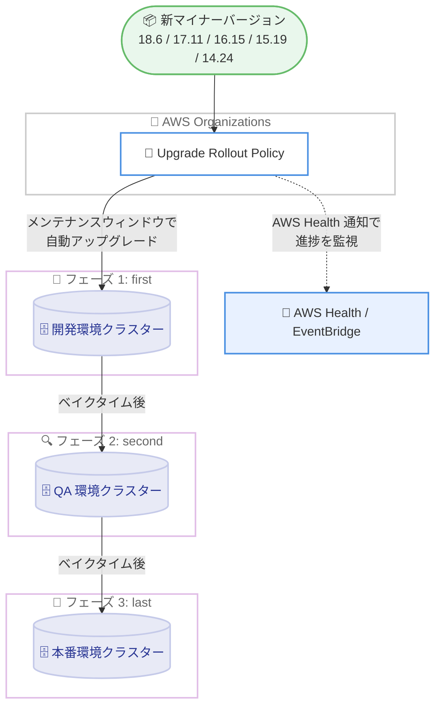

# Amazon Aurora - PostgreSQL 18.6, 17.11, 16.15, 15.19, 14.24 のサポート

**リリース日**: 2026 年 9 月 29 日
**サービス**: Amazon Aurora PostgreSQL 互換エディション
**機能**: PostgreSQL マイナーバージョン 18.6, 17.11, 16.15, 15.19, 14.24 のサポート

📊 [このアップデートのインフォグラフィックを見る](https://takech9203.github.io/aws-news-summary/20260929-amazon-aurora-postgresql-18-6-17-11-16-15-15-19-14-24.html)

## 概要

Amazon Aurora PostgreSQL 互換エディションが、PostgreSQL コミュニティの最新マイナーバージョンである 18.6, 17.11, 16.15, 15.19, 14.24 をサポートしました。これらのリリースには、PostgreSQL コミュニティによるバグ修正に加え、Aurora 固有の機能強化が含まれています。

今回のマイナーバージョンには既知の CVE (共通脆弱性識別子) への対処が含まれており、AWS はセキュリティ観点から最新マイナーバージョンへのアップグレードを推奨しています。リリースノートによると、CVE-2026-6464、CVE-2026-14662 ～ 14681 系、CVE-2026-15741/15742、CVE-2026-16238/16239/16241、CVE-2026-18024、CVE-2026-18408、CVE-2026-19385 など多数の修正がバックポートされています。また 18.6 では、SSL 向けハイブリッド鍵交換 (X25519MLKEM768 など) のサポートや、相関集約サブクエリをウィンドウ関数に書き換えるクエリ最適化機能などの新機能も追加されています。

大規模環境でのアップグレード運用を簡素化するため、自動マイナーバージョンアップグレード (AMVU) の有効化と、AWS Organizations の Upgrade Rollout Policy の利用が推奨されています。これにより、優先度の低い環境で先に検証を行い、その後重要な本番環境を段階的にアップグレードする運用が可能です。

**アップデート前の課題**

- 以前は PostgreSQL コミュニティの最新マイナーバージョンに含まれるバグ修正やセキュリティ修正を Aurora で利用できなかった
- 既知の CVE への対処を適用するには、新しいマイナーバージョンの提供を待つ必要があった
- マイナーバージョンアップグレードやパッチ適用時のダウンタイムが、一時スキーマを持つセッションのシリアライズ処理などにより長くなる場合があった
- 多数のインデックスを持つテーブルへの COPY FROM による一括ロードで、インデックスメンテナンスがボトルネックになっていた

**アップデート後の改善**

- PostgreSQL 18.6, 17.11, 16.15, 15.19, 14.24 の各コミュニティ修正を Aurora で利用可能になった
- 多数の CVE 修正が適用され、セキュリティ体制を強化できるようになった
- マイナーバージョン / パッチアップグレード時のダウンタイムが短縮され、COPY FROM 実行時のインデックスメンテナンスが並列化された
- 18.6 では SSL のハイブリッド鍵交換 (ポスト量子暗号対応) や相関集約サブクエリの最適化など、新機能が利用可能になった
- AMVU と Upgrade Rollout Policy の組み合わせで、組織全体の段階的アップグレードを自動化できる

## アーキテクチャ図



AWS Organizations の Upgrade Rollout Policy を利用した段階的アップグレードの流れです。新しいマイナーバージョンが自動アップグレード対象になると、first (開発) → second (QA) → last (本番) の順に、各フェーズ間のベイクタイム (検証期間) を挟みながら各クラスターのメンテナンスウィンドウ中にアップグレードが実行されます。

## サービスアップデートの詳細

### 主要機能

1. **PostgreSQL コミュニティ最新マイナーバージョンのサポート**
   - PostgreSQL 18.6, 17.11, 16.15, 15.19, 14.24 に対応
   - コミュニティによるバグ修正を含む
   - リリースノートによると、Aurora PostgreSQL 18.6 および 17.11 は 2026 年 9 月 29 日にリリース

2. **セキュリティ修正 (CVE 対応)**
   - 既知の CVE への対処を含むため、AWS は最新マイナーバージョンへのアップグレードを推奨
   - リリースノートでは CVE-2026-6464、CVE-2026-6469 ～ 6471、CVE-2026-14662 ～ 14664、CVE-2026-14666、CVE-2026-14668 ～ 14673、CVE-2026-14676 ～ 14681、CVE-2026-15741/15742、CVE-2026-16238/16239/16241、CVE-2026-18024、CVE-2026-18408、CVE-2026-19385 の修正バックポートが確認できる

3. **アップグレードダウンタイムの短縮とパフォーマンス改善**
   - 一時スキーマを持つバックエンドのセッションシリアライズ時間を短縮し、マイナーバージョン / パッチアップグレードのダウンタイムを削減
   - COPY FROM による一括ロード時のインデックスメンテナンスを並列化し、多数のインデックスを持つテーブルのロード時間を短縮
   - メジャーバージョンアップグレード時のユーザーファイル向け I/O 操作を削減し、ダウンタイムを短縮
   - Zero-Downtime Patching (ZDP) 利用時のクライアント接続の信頼性を改善

4. **Aurora PostgreSQL 18.6 の新機能**
   - SSL 向けハイブリッド鍵交換 (KEX) アルゴリズム (X25519MLKEM768、SecP256r1MLKEM768 など) をサポートし、ポスト量子暗号への移行に対応
   - 相関集約サブクエリをウィンドウ関数相当に書き換える最適化を追加 (`apg_enable_subquery_to_window_transform` パラメータで制御、デフォルトは OFF)
   - 中断された DROP DATABASE 操作で残された無効なデータベースを自動検出・削除し、誤検知アラートやアップグレード失敗を防止

5. **可観測性と運用性の強化**
   - `aurora_volume_size_info()` 関数を追加し、現在のボリューム使用量、残容量、ソフトリミットをバイト単位で確認可能
   - `aurora_stat_resource_usage()` 関数に `worker_threads_cpu_usage_percent` 列を追加し、バックエンドプロセスのワーカースレッド CPU 使用率を確認可能
   - Aurora Serverless v2 のスケールダウン時に、頻繁にアクセスされるデータをバッファキャッシュに保持するよう改善
   - pglogical 拡張機能を 2.4.8 に更新

6. **段階的アップグレードの運用支援**
   - 自動マイナーバージョンアップグレード (AMVU) によりメンテナンスウィンドウ中に自動適用
   - AWS Organizations の Upgrade Rollout Policy により、アカウントレベルまたはリソースタグベースでアップグレード順序 (first / second / last) を制御
   - AWS Health 通知と Amazon RDS イベント通知 (EventBridge 連携) で進捗を監視

## 技術仕様

### サポートされる PostgreSQL バージョン

| PostgreSQL メジャーバージョン | 新しいマイナーバージョン |
|------|------|
| PostgreSQL 18 | 18.6 |
| PostgreSQL 17 | 17.11 |
| PostgreSQL 16 | 16.15 |
| PostgreSQL 15 | 15.19 |
| PostgreSQL 14 | 14.24 |

### 主な修正・改善内容 (18.6 / 17.11 リリースノートより)

| 分類 | 内容 |
|------|------|
| 新機能 | アップグレードダウンタイム短縮、COPY FROM のインデックスメンテナンス並列化、無効データベースの自動削除 (18.6)、SSL ハイブリッド KEX (18.6)、相関集約サブクエリ最適化 (18.6) |
| 重要な安定性向上 | 最大ボリュームサイズ到達時にデータベースが起動できない問題の修正、HypoPG の仮想インデックス参照範囲の修正 |
| 優先度の高い修正 | グローバルクラスターのスイッチオーバー時間長期化の修正 (`aurora.enhanced_logical_replication` 有効時)、pg_columnmask 拡張機能の可用性問題の修正、多数の CVE 修正のバックポート |
| 一般的な改善 | メモリリーク修正、Aurora Serverless v2 スケールダウン時のバッファキャッシュ保持改善、ZDP の信頼性向上、`aurora_volume_size_info()` 追加、pglogical 2.4.8 への更新 |

### Upgrade Rollout Policy のアップグレード順序

| 順序 | 想定環境 | 動作 |
|------|------|------|
| first | 開発・テスト環境 | 新バージョンが対象になると最初にメンテナンスウィンドウでアップグレード |
| second | QA 環境 (未設定リソースのデフォルト) | first のベイクタイム経過後にアップグレード対象 |
| last | 本番環境 | second のベイクタイム経過後にアップグレード対象 |

- ポリシーはアカウントレベル、またはクラスターレベルのリソースタグで定義 (Aurora ではクラスターレベルのタグのみが使用される)
- ポリシー未設定または除外されたリソースは自動的に second の順序が適用される
- すべてのアップグレードは各クラスターのメンテナンスウィンドウ中に実行される

## 設定方法

### 前提条件

1. Aurora PostgreSQL 互換エディションのクラスターを利用していること
2. Upgrade Rollout Policy を利用する場合、AWS アカウントが AWS Organizations の組織に所属し、ポリシーが有効化されていること
3. 対象クラスターで自動マイナーバージョンアップグレード (AMVU) が有効になっていること

### 手順

#### ステップ 1: 利用可能なバージョンの確認

```bash
aws rds describe-db-engine-versions \
  --engine aurora-postgresql \
  --query '*[].[EngineVersion]' \
  --output text \
  --region ap-northeast-1
```

指定リージョンで利用可能な Aurora PostgreSQL のエンジンバージョン一覧を表示します。新しいマイナーバージョン (例: 17.11) が利用可能かを確認します。

#### ステップ 2: 手動でのマイナーバージョンアップグレード

```bash
aws rds modify-db-cluster \
  --db-cluster-identifier my-aurora-cluster \
  --engine-version 17.11 \
  --apply-immediately
```

クラスターのエンジンバージョンを指定バージョンへアップグレードします。`--apply-immediately` を指定すると即時適用され、省略するとメンテナンスウィンドウで適用されます。

#### ステップ 3: 自動マイナーバージョンアップグレードの有効化

```bash
aws rds modify-db-instance \
  --db-instance-identifier my-aurora-instance \
  --auto-minor-version-upgrade \
  --apply-immediately
```

インスタンスの自動マイナーバージョンアップグレードを有効化します。有効化すると、対象バージョンが自動アップグレード対象になった際にメンテナンスウィンドウ中に自動適用されます。

#### ステップ 4: Upgrade Rollout Policy 用のタグ付け

```bash
aws rds add-tags-to-resource \
  --resource-name arn:aws:rds:ap-northeast-1:123456789012:cluster:my-aurora-cluster \
  --tags Key=Environment,Value=Development
```

クラスターに環境を示すタグを付与します。AWS Organizations 側の Upgrade Rollout Policy でこのタグを参照し、アップグレード順序 (first / second / last) を割り当てることで、開発環境から本番環境への段階的アップグレードを実現します。

## メリット

### ビジネス面

- **セキュリティリスクの低減**: 多数の既知 CVE への対処が含まれるため、コンプライアンス要件やセキュリティ基準への対応を維持できる
- **運用コストの削減**: AMVU と Upgrade Rollout Policy により、大規模なフリートのアップグレード作業を自動化し、手作業を削減できる
- **障害リスクの抑制**: 開発環境で先に検証してから本番環境をアップグレードする段階的ロールアウトにより、問題の早期発見が可能

### 技術面

- **アップグレード影響の最小化**: セッションシリアライズ時間の短縮や ZDP の信頼性向上により、アップグレード時のダウンタイムと接続断が減少する
- **パフォーマンス改善**: COPY FROM のインデックスメンテナンス並列化や相関集約サブクエリの最適化 (18.6) により、ロードやクエリの性能を向上できる
- **将来の暗号要件への対応**: 18.6 の SSL ハイブリッド鍵交換 (X25519MLKEM768 など) により、ポスト量子暗号への移行準備を進められる
- **可観測性の向上**: `aurora_volume_size_info()` や `worker_threads_cpu_usage_percent` 列により、ボリューム使用量やリソース使用状況をより詳細に把握できる

## デメリット・制約事項

### 制限事項

- 自動マイナーバージョンアップグレードは各クラスターのメンテナンスウィンドウ中に実行されるため、短時間のダウンタイム (再起動) が発生する
- 相関集約サブクエリ最適化 (`apg_enable_subquery_to_window_transform`) は PostgreSQL 18.6 の機能で、デフォルトは OFF のため明示的な有効化が必要
- Upgrade Rollout Policy は AWS Organizations の組織に所属し、ポリシーが有効化されているアカウントでのみ利用可能
- Aurora リソースでは、Upgrade Rollout Policy はクラスターレベルのタグのみを参照する (インスタンスレベルのタグは無視される)

### 考慮すべき点

- 進行中のアップグレードキャンペーンに途中から参加した場合、リソースは現在実行中のアップグレード順序に従い、設定済みポリシーを待たない
- ポリシーやタグの変更が新しいアップグレード順序に反映されるまでには伝播時間が必要
- 問題を検出した場合は、後続環境の AMVU を無効化するか、フェーズ間の検証期間内に問題を解決する運用設計が必要
- アップグレード前に、アプリケーションで使用している拡張機能や機能の互換性をリリースノートで確認することを推奨

## ユースケース

### ユースケース 1: CVE 対応のための計画的なセキュリティパッチ適用

**シナリオ**: 金融系ワークロードで Aurora PostgreSQL 16 系を利用しており、セキュリティポリシー上、既知の CVE に対する修正を一定期間内に適用する必要がある。

**実装例**:
```bash
# 検証環境で新バージョンへアップグレードして互換性を確認
aws rds modify-db-cluster \
  --db-cluster-identifier staging-cluster \
  --engine-version 16.15 \
  --apply-immediately

# 検証後、本番はメンテナンスウィンドウで適用
aws rds modify-db-cluster \
  --db-cluster-identifier prod-cluster \
  --engine-version 16.15
```

**効果**: CVE 修正を含む最新マイナーバージョンを計画的に適用し、セキュリティ基準を満たしながらダウンタイムをメンテナンスウィンドウ内に限定できる。

### ユースケース 2: マルチアカウント環境での段階的自動アップグレード

**シナリオ**: AWS Organizations 配下の複数アカウントに開発・QA・本番の Aurora クラスターが多数存在し、マイナーバージョンアップグレードの運用負荷が高い。

**実装例**:
```bash
# 各クラスターに環境タグを付与し AMVU を有効化
aws rds add-tags-to-resource \
  --resource-name arn:aws:rds:ap-northeast-1:111111111111:cluster:dev-cluster \
  --tags Key=Environment,Value=Development

aws rds modify-db-instance \
  --db-instance-identifier dev-instance \
  --auto-minor-version-upgrade
```

Organizations 側で Upgrade Rollout Policy を設定し、Development タグを first、QA を second、Production を last に割り当てます。

**効果**: 開発環境で先行検証した後、ベイクタイムを挟んで QA・本番へ自動的にアップグレードが波及し、手動オペレーションなしで組織全体のバージョンを最新に保てる。

### ユースケース 3: 大量データロードを行う分析基盤の性能改善

**シナリオ**: 多数のインデックスを持つテーブルに COPY FROM で日次バッチロードを行っており、ロード時間の短縮が課題になっている。

**実装例**:
```sql
-- アップグレード後、通常どおり COPY FROM を実行
COPY sales_fact FROM '/data/sales_20260929.csv' WITH (FORMAT csv);

-- 18.6 では相関集約サブクエリ最適化も検証可能
-- (クラスターパラメータグループで apg_enable_subquery_to_window_transform を ON に設定)
```

**効果**: 新バージョンではインデックスメンテナンスが並列化されるため、多数のインデックスを持つテーブルへの一括ロード時間を短縮できる。18.6 では相関集約サブクエリの最適化により分析クエリの性能向上も見込める。

## 料金

新しいマイナーバージョンの利用自体に追加料金はありません。Aurora PostgreSQL の通常の料金 (インスタンス時間またはサーバーレスの ACU 時間、ストレージ、I/O) が適用されます。自動マイナーバージョンアップグレードおよび AWS Organizations の Upgrade Rollout Policy にも追加料金はありません。

詳細は [Amazon Aurora 料金ページ](https://aws.amazon.com/rds/aurora/pricing/) を参照してください。

## 利用可能リージョン

公式発表にはリージョン情報の記載がありません。リージョンごとの利用可能バージョンは以下のコマンドで確認できます。

```bash
aws rds describe-db-engine-versions \
  --engine aurora-postgresql \
  --query '*[].[EngineVersion]' \
  --output text \
  --region <リージョン名>
```

## 関連サービス・機能

- **Amazon RDS for PostgreSQL**: Aurora と同様に PostgreSQL コミュニティのマイナーバージョンを順次サポートするマネージドデータベースサービス
- **AWS Organizations**: Upgrade Rollout Policy を定義し、マルチアカウント環境の段階的アップグレードを制御
- **AWS Health / Amazon EventBridge**: アップグレードキャンペーンの通知と進捗監視、イベント駆動の自動化に活用
- **Aurora Global Database / Aurora Serverless**: 発表内で言及されている Aurora の主要機能。マルチリージョン耐障害性やゼロまでスケールするサーバーレスコンピュートを提供

## 参考リンク

- 📊 [インフォグラフィック](https://takech9203.github.io/aws-news-summary/20260929-amazon-aurora-postgresql-18-6-17-11-16-15-15-19-14-24.html)
- [公式発表 (What's New)](https://aws.amazon.com/about-aws/whats-new/2026/09/amazon-aurora-postgresql-18-6-17-11-16-15-15-19-14-24/)
- [Aurora PostgreSQL リリースノート](https://docs.aws.amazon.com/AmazonRDS/latest/AuroraPostgreSQLReleaseNotes/AuroraPostgreSQL.Updates.html)
- [Upgrade Rollout Policy のドキュメント](https://docs.aws.amazon.com/AmazonRDS/latest/AuroraUserGuide/Aurora.Maintenance.AMVU.UpgradeRollout.html)
- [Aurora PostgreSQL のアップグレードガイド](https://docs.aws.amazon.com/AmazonRDS/latest/AuroraUserGuide/USER_UpgradeDBInstance.PostgreSQL.html)
- [Amazon Aurora 入門ガイド](https://docs.aws.amazon.com/AmazonRDS/latest/AuroraUserGuide/CHAP_GettingStartedAurora.html)
- [料金ページ](https://aws.amazon.com/rds/aurora/pricing/)

## まとめ

Aurora PostgreSQL 互換エディションが PostgreSQL 18.6, 17.11, 16.15, 15.19, 14.24 をサポートし、コミュニティのバグ修正、多数の CVE 対応、アップグレードダウンタイムの短縮や COPY FROM の並列インデックスメンテナンスなどの Aurora 固有の改善が利用可能になりました。18.6 では SSL のハイブリッド鍵交換によるポスト量子暗号対応や相関集約サブクエリの最適化といった新機能も追加されています。既知の脆弱性への対処が含まれるため、リリースノートで互換性を確認のうえ、早期に最新マイナーバージョンへアップグレードすることを推奨します。多数のクラスターを運用している場合は、AMVU の有効化と AWS Organizations の Upgrade Rollout Policy による段階的な自動アップグレードの導入を検討してください。
