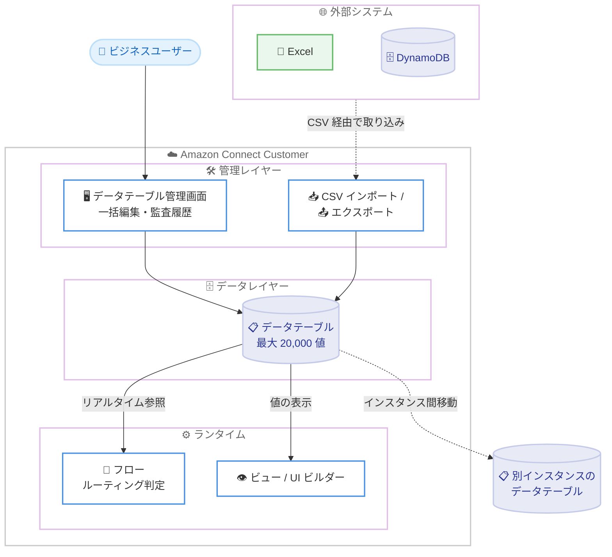

# Amazon Connect Customer - データテーブルによる参照データ管理の強化

**リリース日**: 2026 年 9 月 29 日
**サービス**: Amazon Connect (Connect Customer)
**機能**: データテーブルの容量拡大とインポート / エクスポート機能の強化

📊 [このアップデートのインフォグラフィックを見る](https://takech9203.github.io/aws-news-summary/20260929-amazon-connect-manage-data-tables.html)

## 概要

Amazon Connect Customer で、ビジネスユーザーがコンタクトセンター設定を支える参照データをより大規模に管理できるようになりました。データテーブルは 1 テーブルあたり最大 20,000 値まで格納できるようになり、営業時間、エスカレーションルール、AI エージェントのプロンプト、キュー割り当てなど、フローを駆動する設定データを一元管理できます。

さらに、テーブルのエクスポート、数百件規模のレコードの一括編集、Connect Customer インスタンス間でのテーブル移動、Excel や DynamoDB などの外部システムからの参照データのインポートが可能になりました。これにより、ビジネスチームが技術リソースに依存することなく、状況の変化に応じて設定をリアルタイムに更新できます。

対象ユーザーは、コンタクトセンターの運用を担当するビジネスユーザーや管理者、および設定変更の依頼対応から解放されたい IT / 開発チームです。

**アップデート前の課題**

- データテーブルのデフォルトクォータは 1 テーブルあたり 1,000 値であり、大規模な参照データ (多数の店舗、言語、部門の組み合わせなど) を 1 つのテーブルで管理することが困難だった
- 外部システム (Excel や DynamoDB など) で管理していた参照データを Connect Customer に取り込む手段が限られており、移行や同期に手作業が必要だった
- テスト環境で作成・検証したデータテーブルを本番インスタンスへ移動する仕組みがなく、環境間での再作成が必要だった
- 多数のレコードを変更する場合、1 件ずつ編集する必要があり、大量の更新作業に時間がかかった

**アップデート後の改善**

- 1 テーブルあたり最大 20,000 値まで格納可能になり、大規模な参照データを単一のテーブルで管理できるようになった
- CSV によるインポート / エクスポートを通じて、Excel や DynamoDB などの外部システムのデータを取り込み、一括編集やバックアップにも活用できるようになった
- Connect Customer インスタンス間でテーブルを移動できるようになり、開発環境から本番環境への展開が容易になった
- 数百件規模のレコードをまとめて編集できるようになり、ビジネスユーザー自身が技術リソースに依存せずリアルタイムに設定を調整できるようになった

## アーキテクチャ図



ビジネスユーザーが管理画面や CSV インポートを通じてデータテーブルを直接更新し、フローやビューが実行時にその値を参照する構成です。変更はほぼ即時に反映されるため、フロー自体を編集することなくコンタクトセンターの動作を調整できます。

## サービスアップデートの詳細

### 主要機能

1. **テーブル容量の拡大 (最大 20,000 値)**
   - 1 テーブルあたり最大 20,000 値まで格納可能
   - 営業時間、エスカレーションルール、AI エージェントプロンプト、キュー割り当てなど、フローを駆動する大規模な参照データを単一テーブルで管理可能
   - 従来の管理者ガイドではデフォルトクォータとして 1 テーブルあたり 1,000 値と記載されており、大幅な容量拡大となる

2. **CSV インポート / エクスポート**
   - テーブルの値を CSV ファイルとしてエクスポートし、一括編集やポイントインタイムバックアップに活用可能
   - Excel や DynamoDB などの外部システムで管理していたデータを CSV 経由でインポート可能
   - インポート時は CSV 列とテーブル属性のマッピング、および「新規値のみ作成」「マッピングされた値を上書き」の動作を選択可能
   - インポートで既存の値が削除されることはない (追加・上書きのみ)

3. **数百件規模のレコードの一括編集**
   - 大量のレコードをまとめて編集可能になり、大規模な設定変更の作業時間を短縮
   - 保存時にはテーブル定義に基づく必須フィールド、データ型、文字数制限などのバリデーションが適用される
   - ロックレベル (テーブル / レコード / 属性 / 値) の設定により、複数編集者による変更の競合を防止

4. **インスタンス間のテーブル移動**
   - Connect Customer インスタンス間でデータテーブルを移動可能
   - 開発・テスト環境で検証したテーブルを本番環境へ展開するワークフローを実現

## 技術仕様

### データテーブルの構成要素

| 項目 | 詳細 |
|------|------|
| テーブルメタデータ | 属性 (列)、プライマリキー、バリデーションルール |
| テーブル値 | レコード (行) に格納される実データ。1 テーブルあたり最大 20,000 値 |
| 属性タイプ | テキスト、数値、ブール値の単一値、またはテキスト / 数値のリスト |
| プライマリ属性 | レコードの一意識別とレコード単位のアクセス制御に使用。データ格納後は追加・削除不可 |
| デフォルトレコード | ルックアップが一致しない場合のフォールバック値を提供。null は返却されない |
| 式 (Expression) | `=` で始まるスプレッドシート形式の式で値を動的に計算可能 (`LOOKUP`、`XLOOKUP`、`IF`、`HOOP` など) |
| ロックレベル | テーブル / レコード / 属性 / 値 / なしの 5 段階で楽観的ロックを設定可能 |
| 監査履歴 | 画面上で変更前後の値を確認可能。API 操作は AWS CloudTrail に記録 |

### フローからの参照方法

フローのデータテーブルブロックでクエリを実行した後、以下の名前空間形式で取得した値を後続ブロックから参照できます。

```
$.DataTables.{QueryName}.{AttributeName}
```

属性名にスペースや特殊文字が含まれる場合はブラケット表記を使用します。

```
$.DataTables.{QueryName}['{attribute name}']
```

### アクセス制御

| 機構 | 制御単位 | 説明 |
|------|----------|------|
| セキュリティプロファイル権限 | 操作 | 表示・編集・作成・削除の権限を付与。式の編集には専用権限が必要 |
| タグベースアクセス制御 (TBAC) | テーブル | テーブルに付与したタグに基づきアクセス可能なテーブルを制限 |
| レコードベースアクセス制御 | レコード (行) | プライマリ属性の値に基づき、ユーザーがアクセスできるレコードを制限 |

## 設定方法

### 前提条件

1. Amazon Connect Customer インスタンスが利用可能であること
2. セキュリティプロファイルでデータテーブルの表示・編集・作成・削除権限が付与されていること
3. インポートするデータを CSV 形式で準備できること (外部システムからの取り込みの場合)

### 手順

#### ステップ 1: データテーブルの作成

1. Connect Customer 管理画面のルーティングメニューから [データテーブル] を選択する
2. [新しいデータテーブルを追加] を選択し、名前、説明 (任意)、タイムゾーン、ロックレベルを設定する
3. [属性を追加] で列を定義し、必要に応じて [プライマリ属性として使用] を選択する

タイムゾーンは時間帯ベースのユースケース (時間帯別の挨拶など) に使用され、ロックレベルは複数編集者による変更の上書きを防止します。

#### ステップ 2: 値のインポート

1. データテーブルを開き、[CSV を使用してインポート] を選択する
2. CSV ファイルをアップロードし、CSV 列とテーブル属性のマッピングを確認する (列名が属性名と一致する場合は自動マッピング)
3. 既存値の扱いとして [新規値のみ作成] または [マッピングされた値を作成・上書き] を選択し、インポートを実行する

Excel や DynamoDB などの外部システムからエクスポートした CSV データを取り込み、大量の参照データを一括で登録できます。

#### ステップ 3: フローからの参照設定

1. フローエディタでデータテーブルブロックを追加し、クエリ名と参照するテーブル・属性を設定する
2. 後続のブロックで `$.DataTables.{QueryName}.{AttributeName}` 形式の名前空間を使用して値を参照する
3. テスト用の連絡フローで動作を確認してから本番フローに適用する

フローはテーブルデータをキャッシュしないため、テーブルの値を変更するとほぼ即時に後続のフロー実行へ反映されます。

## メリット

### ビジネス面

- **リアルタイムな運用調整**: 営業時間の変更、緊急時のルーティング切り替え、キャンペーン対応などをビジネスユーザー自身がリアルタイムに実施でき、IT 部門への依頼と待ち時間を削減できる
- **運用コストの削減**: 数百件規模の一括編集や CSV インポートにより、大量の設定変更にかかる作業時間を大幅に短縮できる
- **権限の分離によるガバナンス向上**: ビジネスユーザーはデータテーブルの値のみを編集し、フローやプロンプトなどの機微なリソースへの直接アクセス権限を付与する必要がない

### 技術面

- **設定とロジックの分離**: ルーティング条件などの参照データをフローから切り出すことで、フローを編集せずに動作を変更でき、フローの保守性が向上する
- **環境間の展開が容易**: インスタンス間のテーブル移動により、開発環境で検証した設定を本番環境へ安全に展開できる
- **データ整合性の担保**: データ型・文字数制限・コレクション検証などのバリデーションルール、楽観的ロック、デフォルト値の仕組みにより、実行時に常に有効な値が返却される

## デメリット・制約事項

### 制限事項

- テーブルにデータが格納された後は、プライマリ属性の追加・削除ができない (名前の変更と非プライマリ属性の追加は可能)
- 式 (Expression) はリスト型の値とプライマリ属性ではサポートされない
- CSV インポート / エクスポートは値 (行) のみが対象であり、属性 (列) やバリデーションルールの構造は含まれない
- インスタンスあたりのテーブル数やテーブルあたりの属性数にはサービスクォータが適用される (管理者ガイドのサービスクォータを参照)

### 考慮すべき点

- 変更はほぼ即時に反映されるが、まれにミリ秒単位の伝播遅延が発生する可能性があるため、重要な変更は運用ウィンドウ内での実施が推奨される
- フローに影響する設定は、本番ワークロードへ適用する前に必ずテストし、変更直後はシステムの挙動を監視することが推奨される
- 複数の編集者や自動プロセス (フロー、API) が同時に値を更新する場合は、適切なロックレベルの設計が必要

## ユースケース

### ユースケース 1: 店舗別の営業時間とルーティングの管理

**シナリオ**: 全国数百店舗のサポート窓口を運用しており、店舗ごとの営業時間とエスカレーション先キューを頻繁に更新する必要がある。

**実装例**:
```
テーブル: StoreConfig
- StoreId (プライマリ属性): 店舗 ID
- OpenHour / CloseHour: 営業時間
- SupportQueue: 割り当てキュー
- IsHoliday: 臨時休業フラグ

フロー: 発信者の店舗 ID でルックアップし、
IsHoliday と営業時間に基づいてルーティングを分岐
```

**効果**: 店舗の臨時休業や営業時間変更が発生しても、運用担当者がテーブルの値を更新するだけで即時にルーティングへ反映され、フローの改修が不要になる。

### ユースケース 2: 外部システムで管理する参照データの移行

**シナリオ**: これまで Excel や DynamoDB で管理していた多言語対応のメッセージ定義 (数千件規模) を Connect Customer に集約したい。

**実装例**:
```
1. Excel / DynamoDB のデータを CSV 形式でエクスポート
2. 言語・部門・メッセージ種別をプライマリ属性とするテーブルを作成
3. [CSV を使用してインポート] で一括登録 (最大 20,000 値)
4. フローの XLOOKUP 式やデータテーブルブロックで参照

=XLOOKUP("{messages-table-arn}", "Message",
  "Language", "Japanese", "Department", "Sales")
```

**効果**: 外部システムと Connect の二重管理が解消され、メッセージの追加・修正がテーブルの一括編集で完結する。

### ユースケース 3: 開発環境から本番環境への設定展開

**シナリオ**: 新しいルーティングロジック用の参照データを開発インスタンスで作成・検証し、本番インスタンスへ展開したい。

**実装例**:
```
1. 開発インスタンスでデータテーブルを作成し、フローと組み合わせて検証
2. インスタンス間のテーブル移動機能で本番インスタンスへテーブルを移動
3. 移動後に監査履歴とテスト用フローで値を確認
```

**効果**: 環境間での手作業によるテーブル再作成が不要になり、展開ミスのリスクと作業時間を削減できる。

## 料金

今回の発表に追加料金に関する記載はありません。データテーブルは Amazon Connect Customer の機能として提供され、Amazon Connect の従量課金制の料金体系に準じます。詳細は料金ページを参照してください。

## 利用可能リージョン

Amazon Connect Customer が利用可能なすべての AWS 商用リージョンおよび AWS GovCloud (US-West) リージョンで利用できます。詳細は [リージョン別の利用可能状況](https://docs.aws.amazon.com/connect/latest/adminguide/regions.html#amazonconnect_region) を参照してください。

## 関連サービス・機能

- **Amazon Connect フロー**: データテーブルブロックを使用してテーブルの値を実行時に参照し、ルーティングや応答内容を動的に制御する
- **UI ビルダー**: データテーブルを基にビジネスユーザー向けのカスタム管理画面を構築し、ワークスペースに割り当てて運用調整を委任できる
- **Amazon DynamoDB**: 外部で管理していた参照データのソースとして、CSV 経由でデータテーブルへ取り込める
- **AWS CloudTrail**: データテーブルに対する API 操作の履歴を記録し、監査に活用できる

## 参考リンク

- 📊 [インフォグラフィック](https://takech9203.github.io/aws-news-summary/20260929-amazon-connect-manage-data-tables.html)
- [公式発表 (What's New)](https://aws.amazon.com/about-aws/whats-new/2026/09/amazon-connect-manage-data-tables/)
- [ドキュメント: Create and configure data tables](https://docs.aws.amazon.com/connect/latest/adminguide/data-tables.html)
- [Amazon Connect Customer 製品ページ](https://aws.amazon.com/products/connect/customer/)
- [料金ページ](https://aws.amazon.com/connect/pricing/)

## まとめ

今回のアップデートにより、Amazon Connect Customer のデータテーブルは 1 テーブルあたり最大 20,000 値まで拡大し、CSV インポート / エクスポート、一括編集、インスタンス間移動が可能になりました。営業時間やルーティングルールなどの参照データをビジネスユーザー自身が管理できるようになるため、設定変更のたびに IT 部門へ依頼していた運用の見直しを推奨します。まずは開発インスタンスで既存フローの設定値をデータテーブルへ切り出し、権限設計 (TBAC やレコードベースアクセス制御) と合わせて検証することをお勧めします。
