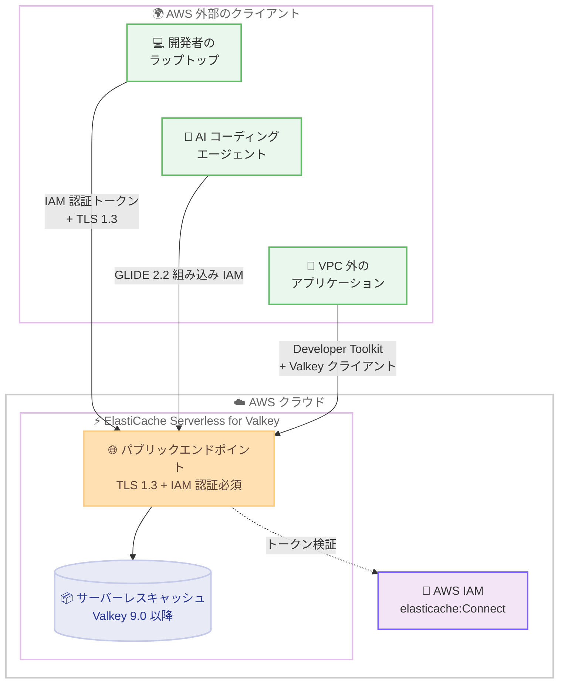

# Amazon ElastiCache - ElastiCache Serverless for Valkey のパブリックエンドポイント対応

**リリース日**: 2026 年 9 月 29 日
**サービス**: Amazon ElastiCache
**機能**: ElastiCache Serverless for Valkey のパブリックエンドポイントサポート

📊 [このアップデートのインフォグラフィックを見る](https://takech9203.github.io/aws-news-summary/20260929-amazon-elasticache-serverless-public-endpoints.html)

## 概要

Amazon ElastiCache Serverless for Valkey がパブリックエンドポイントをサポートしました。これにより、ラップトップ、サーバーレス関数、AWS 外部で動作するアプリケーションなどから、VPN、踏み台ホスト、SSH トンネルを設定することなく、インターネット経由でキャッシュに直接接続できるようになりました。

パブリックエンドポイントを使用すると、VPC の設定やインフラストラクチャのプロビジョニングが不要な、インターネット経由で到達可能なフルマネージドキャッシュを 1 分未満で作成できます。迅速なプロトタイピング、AI コーディングツールやエージェントからのキャッシュへの直接接続、VPC に到達できないワークロードへのキャッシュ追加などに活用できます。

セキュリティ面では、すべての接続で TLS 1.3 上の IAM 認証が必須となっており、保存やローテーションが必要なパスワードは存在しません。接続には、IAM 認証を組み込みでサポートする Valkey GLIDE 2.2 以降、または IAM 認証トークンの生成と更新を行うオープンソースライブラリである Developer Toolkit for ElastiCache と任意の Valkey クライアントの組み合わせを使用します。

**アップデート前の課題**

- ElastiCache Serverless は VPC 内からのアクセスのみをサポートしており、AWS 外部から接続するには VPN、踏み台ホスト、SSH トンネルなどの追加インフラストラクチャの構築と運用が必要だった
- ローカル開発環境や AI コーディングエージェントからキャッシュに直接接続できず、開発やデバッグのたびにネットワーク経路を準備する手間が発生していた
- VPC に到達できない外部アプリケーションやサービスからは ElastiCache を利用できなかった

**アップデート後の改善**

- VPC を設定せずに、インターネット経由で到達可能なサーバーレスキャッシュを 1 分未満で作成できるようになった
- ラップトップ、サーバーレス関数、AWS 外部のアプリケーション、AI コーディングツールやエージェントからキャッシュに直接接続できるようになった
- すべての接続が TLS 1.3 上の IAM 認証で保護されるため、パスワードの保存やローテーションが不要になった

## アーキテクチャ図



AWS 外部のクライアントは、VPN や踏み台ホストを経由せず、TLS 1.3 と IAM 認証で保護されたパブリックエンドポイントに直接接続します。認証トークンは GLIDE クライアントまたは Developer Toolkit for ElastiCache が生成します。

## サービスアップデートの詳細

### 主要機能

1. **パブリックエンドポイントによる VPC 不要の接続**
   - 新しい `ConnectionType` パラメータに `public` を指定するだけで、インターネット経由で到達可能なサーバーレスキャッシュを作成できる
   - VPC、サブネット、セキュリティグループの設定が不要で、1 分未満でキャッシュを作成可能
   - エンドポイントは `{キャッシュ名}-{サフィックス}.public.serverless.{リージョン}.cache.amazonaws.com` 形式でポート 6379 を使用

2. **IAM 認証と TLS 1.3 の必須化**
   - パブリックエンドポイントへのすべての接続で IAM 認証と TLS 1.3 が必須
   - パスワードの保存やローテーションが不要となり、IAM ポリシーで `elasticache:Connect` アクションによるアクセス制御が可能
   - システム管理の IAM ユーザー (default.iam-user) とユーザーグループ (default.iam-user-group) を使えば、カスタムユーザーを作成せずにすぐに利用開始できる

3. **クライアントライブラリの IAM 認証サポート**
   - Valkey GLIDE 2.2 以降は IAM 認証を組み込みでサポートし、トークンの生成、キャッシュ、更新を自動的に処理
   - Developer Toolkit for ElastiCache (developer-toolkit-elasticache) は、valkey-py などの任意の Valkey / Redis OSS クライアントと組み合わせて使用できるオープンソースの Python ライブラリおよび CLI
   - AWS SDK を使用した手動での SigV4 署名によるトークン生成にも対応

4. **ガバナンス制御**
   - `elasticache:ConnectionType` 条件キーを使用して、パブリックエンドポイント付きキャッシュの作成を IAM ポリシーや SCP で制限可能
   - IAM プリンシパルの `elasticache:Connect` 権限を取り消すことでアクセスを制御 (即時切断が必要な場合はユーザーグループからユーザーを削除)

## 技術仕様

### パブリックエンドポイントの仕様

| 項目 | 詳細 |
|------|------|
| 対象エンジン | Valkey 9.0 以降 (ElastiCache Serverless) |
| 接続タイプ | `ConnectionType`: `vpc` または `public` |
| 認証方式 | IAM 認証 (必須) |
| 暗号化 | TLS 1.3 (必須) |
| ポート | 6379 |
| 認証トークン有効期間 | 15 分 (GLIDE は自動更新) |
| セッション有効期間 | 12 時間 (自動再接続) |
| デフォルトユーザーグループ | default.iam-user-group (システム管理) |
| 追加料金 | なし (標準の ElastiCache Serverless 料金のみ) |

### API変更履歴

| 日付 | サービス | 変更内容 |
|------|----------|----------|
| 2026/09/29 | [elasticache](https://awsapichanges.com/archive/changes/e9bb16-elasticache.html) | 4 updated api methods - `CreateServerlessCache` に `ConnectionType` パラメータ (`vpc` \| `public`) を追加。`DeleteServerlessCache`、`DescribeServerlessCaches`、`ModifyServerlessCache` のレスポンスに `ConnectionType` フィールドを追加 |

### 接続用の IAM ポリシー

接続するには、IAM ユーザーまたはロールにキャッシュと ElastiCache ユーザーの両方に対する `elasticache:Connect` アクションの許可が必要です。

```json
{
    "Version": "2012-10-17",
    "Statement": [
        {
            "Effect": "Allow",
            "Action": "elasticache:Connect",
            "Resource": [
                "arn:aws:elasticache:us-east-1:123456789012:serverlesscache:my-public-cache",
                "arn:aws:elasticache:us-east-1:123456789012:user:default.iam-user"
            ]
        }
    ]
}
```

## 設定方法

### 前提条件

1. ElastiCache リソースを作成する権限を持つ AWS アカウント
2. `elasticache:CreateServerlessCache` を含む IAM 権限 (カスタムユーザーグループを作成する場合は `elasticache:CreateUser` と `elasticache:CreateUserGroup` も必要)
3. パブリックエンドポイント付きキャッシュの作成権限 (`elasticache:ConnectionType` 条件キーで制限されていないこと)
4. CLI 手順を実行する場合は AWS CLI バージョン 2

### 手順

#### ステップ1: パブリックエンドポイント付きサーバーレスキャッシュの作成

```bash
aws elasticache create-serverless-cache \
    --serverless-cache-name my-public-cache \
    --engine valkey \
    --major-engine-version 9 \
    --connection-type public \
    --user-group-id default.iam-user-group
```

`--connection-type public` を指定して、Valkey 9 のサーバーレスキャッシュをパブリックエンドポイント付きで作成しています。システム管理のデフォルト IAM ユーザーグループ (default.iam-user-group) を使用するため、カスタムユーザーの作成は不要です。レスポンスに含まれる `Endpoint.Address` (例: `my-public-cache-x2e9hv.public.serverless.use1.cache.amazonaws.com`) を接続時に使用します。

#### ステップ2: GLIDE クライアントでの接続

```python
from glide import (
    GlideClusterClient, GlideClusterClientConfiguration, NodeAddress,
    ServerCredentials, IamAuthConfig, ServiceType,
)

config = GlideClusterClientConfiguration(
    addresses=[NodeAddress("my-public-cache-x2e9hv.public.serverless.use1.cache.amazonaws.com", 6379)],
    credentials=ServerCredentials(
        username="default.iam-user",
        iam_config=IamAuthConfig(
            cluster_name="my-public-cache",
            service=ServiceType.ELASTICACHE,
            region="us-east-1",
        ),
    ),
    use_tls=True,
)

client = await GlideClusterClient.create(config)
await client.set("key", "value")
```

GLIDE 2.2 以降の組み込み IAM 認証を使用して接続しています。`IamAuthConfig` にキャッシュ名とリージョンを指定するだけで、GLIDE がトークンの生成、キャッシュ、更新を自動的に処理するため、認証コードを書く必要はありません。

#### ステップ3: valkey-cli での接続 (Developer Toolkit を使用)

```bash
pip install developer-toolkit-elasticache

export VALKEYCLI_AUTH=$(developer-toolkit-elasticache generate_iam_auth_token \
    --serverless-cache-name my-public-cache \
    --user-id default.iam-user \
    --region us-east-1)

valkey-cli -c -h my-public-cache-x2e9hv.public.serverless.use1.cache.amazonaws.com \
    -p 6379 \
    --tls \
    --user default.iam-user
```

Developer Toolkit for ElastiCache の CLI で IAM 認証トークンを生成し、環境変数 `VALKEYCLI_AUTH` 経由で valkey-cli に渡して TLS 接続しています。`VALKEYCLI_AUTH` は valkey-cli 9.0 以降が必要で、redis-cli の場合は `REDISCLI_AUTH` を使用します。トークンの有効期間は 15 分のため、期限切れの場合は再生成が必要です。

## メリット

### ビジネス面

- **開発速度の向上**: VPN や踏み台ホストの構築が不要になり、開発者がローカル環境から 1 分未満でキャッシュを作成して即座に利用開始できる
- **インフラコストの削減**: 外部接続のためだけに維持していた踏み台ホスト、VPN、SSH トンネルなどの追加インフラストラクチャが不要になる
- **追加費用なし**: パブリックエンドポイントの利用に標準の ElastiCache Serverless 料金以外の追加料金は発生しない

### 技術面

- **セキュアバイデフォルト**: IAM 認証と TLS 1.3 が必須のため、パスワード管理が不要で、アクセス制御を IAM ポリシーに一元化できる
- **クライアント対応の充実**: GLIDE 2.2 の組み込み IAM サポートに加え、Developer Toolkit for ElastiCache により既存の Valkey / Redis OSS クライアントでも IAM 認証を利用できる
- **ガバナンスの維持**: `elasticache:ConnectionType` 条件キーにより、組織としてパブリックエンドポイントの作成を SCP や IAM ポリシーで制御できる

## デメリット・制約事項

### 制限事項

- Valkey 9.0 以降の ElastiCache Serverless のみ対応 (Redis OSS、Memcached、ノードベースのクラスター、Valkey 8 以前は対象外)
- すべての接続で IAM 認証が必須のため、ユーザーグループ内のすべてのユーザーが IAM 認証を使用する必要がある
- TLS 1.3 に対応していないクライアントやランタイムからは接続できない (TLS ハンドシェイク失敗となる)
- IAM 認証トークンの有効期間は 15 分で、Developer Toolkit はトークンを自動更新しないため、アプリケーション側で新しい接続ごとにトークンを生成する必要がある

### 考慮すべき点

- `elasticache:Connect` 権限の取り消しは確立済みセッションを即座に切断しない (セッションは最長 12 時間)。即時切断が必要な場合はキャッシュのユーザーグループからユーザーを削除する必要がある
- インターネット経由のアクセスとなるため、VPC 内接続と比較してレイテンシーが大きくなる可能性があり、本番の低レイテンシー要件ワークロードでは VPC 接続タイプの選択を検討すべき
- キャッシュがインターネットから到達可能になるため、組織のセキュリティポリシーに応じて `elasticache:ConnectionType` 条件キーでパブリックエンドポイントの作成を制限することを推奨
- 認証前の新規接続が失敗した場合、原因を秘匿するために汎用的な「ERR service is not available」エラーが返されるため、トラブルシューティング時は接続レートや AWS Health Dashboard の確認が必要

## ユースケース

### ユースケース1: ローカル開発環境からの直接接続

**シナリオ**: 開発者がラップトップ上でアプリケーションを開発しており、実際の ElastiCache キャッシュに対して動作確認を行いたい。従来は VPN 接続や SSH トンネルの設定が必要だった。

**実装例**:
```bash
# パブリックエンドポイント付きキャッシュを作成
aws elasticache create-serverless-cache \
    --serverless-cache-name dev-cache \
    --engine valkey \
    --major-engine-version 9 \
    --connection-type public \
    --user-group-id default.iam-user-group

# ローカルから valkey-cli で直接接続
export VALKEYCLI_AUTH=$(developer-toolkit-elasticache generate_iam_auth_token \
    --serverless-cache-name dev-cache \
    --user-id default.iam-user \
    --region us-east-1)
valkey-cli -c -h dev-cache-xxxxxx.public.serverless.use1.cache.amazonaws.com \
    -p 6379 --tls --user default.iam-user
```

**効果**: VPN や踏み台ホストなしで実環境のキャッシュに接続でき、開発とデバッグのサイクルが大幅に短縮される。

### ユースケース2: AI コーディングツール・エージェントからのキャッシュ利用

**シナリオ**: AI コーディングエージェントや開発支援ツールが、コード生成や検証の過程でキャッシュへの読み書きを行う必要がある。これらのツールは VPC 外で動作することが多い。

**実装例**:
```python
# GLIDE 2.2 の組み込み IAM 認証で接続
config = GlideClusterClientConfiguration(
    addresses=[NodeAddress("agent-cache-xxxxxx.public.serverless.use1.cache.amazonaws.com", 6379)],
    credentials=ServerCredentials(
        username="default.iam-user",
        iam_config=IamAuthConfig(
            cluster_name="agent-cache",
            service=ServiceType.ELASTICACHE,
            region="us-east-1",
        ),
    ),
    use_tls=True,
)
client = await GlideClusterClient.create(config)
```

**効果**: AI ツールやエージェントが AWS 認証情報のみでキャッシュに直接アクセスでき、パスワード管理やネットワーク構成が不要になる。

### ユースケース3: VPC に到達できない外部ワークロードへのキャッシュ追加

**シナリオ**: オンプレミスや他のクラウド、SaaS 環境で動作するアプリケーションにキャッシュレイヤーを追加したいが、AWS の VPC への専用線や VPN 接続を構築するコストが見合わない。

**実装例**:
```python
# Developer Toolkit + valkey-py で任意の環境から接続
auth = ElastiCacheIAMAuthTokenProvider(
    serverless_cache_name="external-cache",
    user_id="default.iam-user",
    region="us-east-1",
)
client = valkey.ValkeyCluster(
    host="external-cache-xxxxxx.public.serverless.use1.cache.amazonaws.com",
    port=6379,
    ssl=True,
    credential_provider=ElastiCacheCredentialProvider(auth),
)
```

**効果**: ネットワークインフラの追加投資なしに、AWS 外部のワークロードからフルマネージドなキャッシュを利用できる。

## 料金

パブリックエンドポイントの利用に追加料金はなく、標準の ElastiCache Serverless 料金のみが適用されます。ElastiCache Serverless の料金は以下の 2 つのディメンションに基づく従量課金です。

| 課金ディメンション | 説明 |
|--------------------|------|
| データストレージ | キャッシュに保存されたデータ量に対して GB 時間単位で課金 |
| ECPU | リクエストの実行に消費された ElastiCache Processing Unit に対して課金 |

最新の料金の詳細は [ElastiCache 料金ページ](https://aws.amazon.com/elasticache/pricing/) を参照してください。

## 利用可能リージョン

すべての AWS 商用リージョンおよび中国リージョンで利用可能です。

## 関連サービス・機能

- **Valkey GLIDE**: AWS がスポンサーするオープンソースの Valkey クライアント。バージョン 2.2 以降でパブリックエンドポイント接続に必要な IAM 認証を組み込みでサポート
- **Developer Toolkit for ElastiCache**: IAM 認証トークンの生成を行うオープンソースの Python ライブラリおよび CLI。既存の Valkey / Redis OSS クライアントと組み合わせて使用可能
- **AWS IAM**: `elasticache:Connect` アクションによる接続制御と、`elasticache:ConnectionType` 条件キーによるパブリックエンドポイント作成の制限に使用
- **ElastiCache Serverless**: 2023 年に発表されたサーバーレスキャッシュ。容量管理不要で使用量に応じた従量課金を提供し、本アップデートの基盤となる機能

## 参考リンク

- 📊 [インフォグラフィック](https://takech9203.github.io/aws-news-summary/20260929-amazon-elasticache-serverless-public-endpoints.html)
- [公式発表 (What's New)](https://aws.amazon.com/about-aws/whats-new/2026/09/amazon-elasticache-serverless-public-endpoints/)
- [ドキュメント: Create a Valkey serverless cache with a public endpoint](https://docs.aws.amazon.com/AmazonElastiCache/latest/dg/serverless-public-endpoints-chapter.html)
- [ドキュメント: Connect to a cache with a public endpoint](https://docs.aws.amazon.com/AmazonElastiCache/latest/dg/connecting-public-endpoint.html)
- [Developer Toolkit for ElastiCache (GitHub)](https://github.com/aws/developer-toolkit-elasticache)
- [Valkey GLIDE ドキュメント](https://glide.valkey.io)
- [料金ページ](https://aws.amazon.com/elasticache/pricing/)

## まとめ

ElastiCache Serverless for Valkey のパブリックエンドポイント対応により、VPN や踏み台ホストなしで AWS 外部からキャッシュに直接接続できるようになり、プロトタイピングや AI エージェント連携、VPC 外ワークロードへのキャッシュ導入が大幅に容易になりました。IAM 認証と TLS 1.3 が必須のセキュアバイデフォルト設計であり、追加料金も発生しません。まずは開発環境で Valkey 9.0 以降のサーバーレスキャッシュをパブリックエンドポイント付きで作成し、GLIDE 2.2 または Developer Toolkit for ElastiCache による接続を試すことを推奨します。あわせて、組織のセキュリティ要件に応じて `elasticache:ConnectionType` 条件キーによる作成制限の導入を検討してください。
