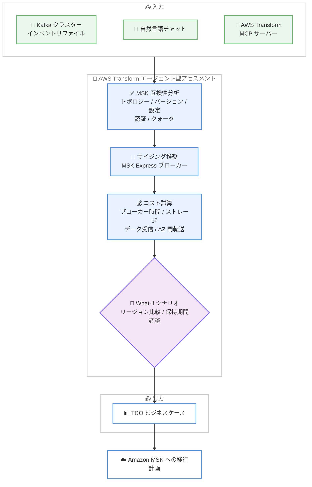

# AWS Transform - Amazon MSK 向け Apache Kafka 移行アセスメント

**リリース日**: 2026 年 9 月 29 日
**サービス**: AWS Transform / Amazon Managed Streaming for Apache Kafka (Amazon MSK)
**機能**: Apache Kafka クラスターの Amazon MSK 移行アセスメント

📊 [このアップデートのインフォグラフィックを見る](https://takech9203.github.io/aws-news-summary/20260929-amazon-msk-migration-assessment-with-aws-transform.html)

## 概要

AWS Transform のエージェント型移行アセスメントが、オンプレミスの Apache Kafka クラスターから Amazon MSK への移行評価に対応しました。エージェント型 AI がワークロードを分析し、適切な AWS サービスを提案し、TCO (総所有コスト) ベースのビジネスケースを数分で生成します。操作は自然言語チャット、または AWS Transform MCP サーバー経由で行えます。

Kafka から Amazon MSK への移行評価を手作業で行う場合、クラスタートポロジーのマッピング、互換性の検証、ブローカーのサイジング、コスト試算などに数週間かかることがありました。今回のアップデートにより、Kafka クラスターのインベントリファイルをアップロードするか、チャットで対話的にクラスター構成を伝えるだけで、互換性分析からコスト試算、What-if シナリオの比較までを短時間で実施できます。

Kafka 移行を検討しているインフラエンジニア、データエンジニア、および移行計画の意思決定を行うステークホルダーに向けたアップデートです。

**アップデート前の課題**

このアップデート以前は、Kafka から Amazon MSK への移行評価に多くの手作業が必要でした。

- クラスタートポロジーのマッピング、バージョンや設定の互換性検証を手作業で行う必要があり、数週間かかることがあった
- ブローカーの適切なサイジングやコスト試算を個別に実施する必要があった
- リージョン間の料金比較や保持期間の変更といった What-if シナリオの検討に時間がかかり、ビジネスケースの作成が困難だった

**アップデート後の改善**

今回のアップデートにより、以下が可能になりました。

- Kafka クラスターのインベントリファイルのアップロード、またはチャットでの対話により、数分で移行アセスメントを実施できる
- トポロジー、バージョン、設定、認証、クォータを対象とした MSK 互換性分析を自動で実行できる
- 適切にサイジングされた Amazon MSK Express ブローカーの推奨と、ブローカー時間、ストレージ、データ受信、AZ 間転送を含むコスト試算を取得できる
- リージョン間の料金比較や保持期間の調整などの What-if シナリオを適用し、ステークホルダー向けの移行ビジネスケースを作成できる

## アーキテクチャ図



Kafka クラスター情報の入力から、AWS Transform のエージェントによる互換性分析、サイジング、コスト試算を経て、TCO ビジネスケースを生成するまでの流れを示しています。

## サービスアップデートの詳細

### 主要機能

1. **柔軟な入力方法**
   - Kafka クラスターのインベントリファイルをアップロードして分析を開始できる
   - チャットで対話的にクラスター構成を記述して開始することも可能
   - AWS Transform MCP サーバー経由での利用にも対応

2. **MSK 互換性分析**
   - 各クラスターについて、トポロジー、バージョン、設定、認証、クォータの観点から MSK との互換性を分析
   - 手作業では数週間かかる評価を数分で完了

3. **サイジング推奨とコスト試算**
   - 適切にサイジングされた Amazon MSK Express ブローカーを推奨
   - ブローカー時間、ストレージ、データ受信 (data-in)、AZ 間データ転送を含むコストを試算

4. **What-if シナリオによるビジネスケース作成**
   - カスタマイズした前提条件を適用して試算を再実行できる
   - リージョン間の料金比較、データ保持期間の調整、代替構成のテストが可能
   - ステークホルダーへの説明に使える移行ビジネスケースを作成できる

## 技術仕様

### アセスメントの分析項目

| 項目 | 詳細 |
|------|------|
| 入力方法 | インベントリファイルのアップロード、自然言語チャット、AWS Transform MCP サーバー |
| 互換性分析の対象 | トポロジー、バージョン、設定、認証、クォータ |
| サイジング | Amazon MSK Express ブローカーの推奨 |
| コスト試算の範囲 | ブローカー時間、ストレージ、データ受信、AZ 間転送 |
| What-if シナリオ | リージョン間料金比較、保持期間調整、代替構成の検討 |
| 出力 | TCO ビジネスケース |

## 設定方法

### 前提条件

1. AWS アカウントと AWS Transform へのアクセス権限
2. 評価対象となるオンプレミス Apache Kafka クラスターの情報 (インベントリファイル、または構成情報)
3. MCP サーバー経由で利用する場合は AWS Transform MCP サーバーのセットアップ

### 手順

#### ステップ 1: AWS Transform でアセスメントを開始

AWS Transform のチャットインターフェイスを開き、Kafka から Amazon MSK への移行アセスメントを開始します。Kafka クラスターのインベントリファイルをアップロードするか、チャットでクラスター構成 (ブローカー数、バージョン、スループットなど) を記述します。

#### ステップ 2: 互換性分析とサイジング結果の確認

エージェントが各クラスターの MSK 互換性 (トポロジー、バージョン、設定、認証、クォータ) を分析し、適切にサイジングされた MSK Express ブローカーの推奨とコスト試算を提示します。内容を確認します。

#### ステップ 3: What-if シナリオの適用とビジネスケースの作成

必要に応じて、リージョンの変更、保持期間の調整、代替構成などの前提条件をチャットで指示し、試算を再実行します。最終的な TCO ビジネスケースをステークホルダーとの合意形成に活用します。

## メリット

### ビジネス面

- **評価期間の大幅な短縮**: 従来数週間かかっていた移行評価を数分で完了でき、移行プロジェクトの意思決定を加速できる
- **ビジネスケースの迅速な作成**: TCO ベースのビジネスケースを自動生成でき、ステークホルダーへの説明資料として活用できる
- **コストの透明性**: ブローカー時間、ストレージ、データ転送まで含めた試算により、移行後のコストを事前に把握できる

### 技術面

- **網羅的な互換性分析**: トポロジー、バージョン、設定、認証、クォータといった多角的な観点で互換性を自動チェックできる
- **適切なサイジング**: MSK Express ブローカーの right-sizing 推奨により、過剰または過小なリソース割り当てを回避できる
- **What-if シナリオ**: リージョンや保持期間などの条件を変えた比較検討が容易で、最適な構成を選択できる

## デメリット・制約事項

### 制限事項

- アセスメントの対象は Amazon MSK への移行であり、サイジング推奨は MSK Express ブローカーが対象
- AWS Transform が利用可能なリージョンでのみ利用できる

### 考慮すべき点

- アセスメント結果はあくまで試算であり、実際の移行時には PoC などによる検証を推奨
- 正確な分析のためには、入力するクラスターインベントリ情報の正確性が重要
- 移行の実行自体 (データレプリケーションなど) は本機能の範囲外であり、MSK Replicator などの別の手段を検討する必要がある

## ユースケース

### ユースケース 1: オンプレミス Kafka クラスターの移行可否判断

**シナリオ**: オンプレミスで複数の Apache Kafka クラスターを運用しており、運用負荷削減のために Amazon MSK への移行を検討しているが、互換性やコストが不明で判断できない。

**実装例**:
```text
1. 各クラスターのインベントリファイル (ブローカー構成、バージョン、
   トピック数、スループットなど) を AWS Transform にアップロード
2. エージェントによる互換性分析とコスト試算を確認
3. 互換性の問題点と推奨構成を移行計画に反映
```

**効果**: 数週間かかっていた移行評価が数分で完了し、移行可否の判断を迅速に行える。

### ユースケース 2: 移行先リージョンとコストの比較検討

**シナリオ**: Kafka ワークロードの移行先として複数の AWS リージョンを候補にしており、コスト面で最適なリージョンを選定したい。

**実装例**:
```text
1. ベースとなるアセスメントを実施
2. チャットで「東京リージョンと大阪リージョンの料金を比較」の
   ような What-if シナリオを指示
3. リージョンごとの試算結果を比較してビジネスケースに反映
```

**効果**: リージョンごとのコスト差を定量的に比較でき、根拠のあるリージョン選定ができる。

### ユースケース 3: 経営層向け移行ビジネスケースの作成

**シナリオ**: Kafka の MSK 移行プロジェクトの予算承認を得るため、TCO とコスト削減効果を示す資料が必要。

**実装例**:
```text
1. 現行クラスターのインベントリをもとにアセスメントを実施
2. 保持期間や構成の前提条件を実運用に合わせて調整
3. 生成された TCO ビジネスケースを経営層への提案資料として活用
```

**効果**: データに基づく TCO ビジネスケースにより、ステークホルダーとの合意形成を迅速化できる。

## 料金

本アセスメント機能自体の追加料金は公式発表には記載されていません。アセスメントの出力として、移行後の Amazon MSK の想定コスト (ブローカー時間、ストレージ、データ受信、AZ 間転送) が提示されます。詳細は AWS Transform および Amazon MSK の料金ページを確認してください。

## 利用可能リージョン

AWS Transform が提供されているすべての AWS リージョンで利用可能です。対象リージョンの一覧は [AWS Transform ユーザーガイドのリージョン一覧](https://docs.aws.amazon.com/transform/latest/userguide/regions.html) を参照してください。

## 関連サービス・機能

- **Amazon MSK**: 移行先となるマネージド Apache Kafka サービス。本アセスメントの評価対象
- **Amazon MSK Express ブローカー**: サイジング推奨の対象となるブローカータイプ。高いスループットと迅速なスケーリングを提供
- **AWS Transform MCP サーバー**: MCP 経由で AWS Transform の移行アセスメントを利用するためのインターフェイス
- **MSK Replicator**: 移行実行時のデータレプリケーションに利用できる機能

## 参考リンク

- 📊 [インフォグラフィック](https://takech9203.github.io/aws-news-summary/20260929-amazon-msk-migration-assessment-with-aws-transform.html)
- [公式発表 (What's New)](https://aws.amazon.com/about-aws/whats-new/2026/09/amazon-msk-migration-assessment-with-aws-transform)
- [AWS Transform 製品ページ](https://aws.amazon.com/transform/)
- [Amazon MSK 製品ページ](https://aws.amazon.com/msk/)
- [AWS Transform 移行アセスメント ドキュメント](https://docs.aws.amazon.com/transform/latest/userguide/transform-app-assessments.html)
- [AWS Transform MCP サーバー ドキュメント](https://docs.aws.amazon.com/transform/latest/userguide/transform-migrations-mcp.html)
- [Amazon MSK Express ブローカー](https://aws.amazon.com/msk/features/express-brokers-for-amazon-msk/)
- [AI ツールによる MSK 移行準備状況の評価](https://docs.aws.amazon.com/msk/latest/developerguide/msk-replicator-migrate-ai-assist.html)
- [Amazon MSK 開発者ガイド](https://docs.aws.amazon.com/msk/latest/developerguide/what-is-msk.html)

## まとめ

AWS Transform のエージェント型アセスメントが Apache Kafka から Amazon MSK への移行評価に対応し、従来数週間かかっていた互換性分析、サイジング、コスト試算を数分で実施できるようになりました。オンプレミス Kafka の移行を検討している場合は、まずインベントリファイルを用意して AWS Transform でアセスメントを実行し、TCO ビジネスケースをもとに移行計画の検討を開始することを推奨します。
