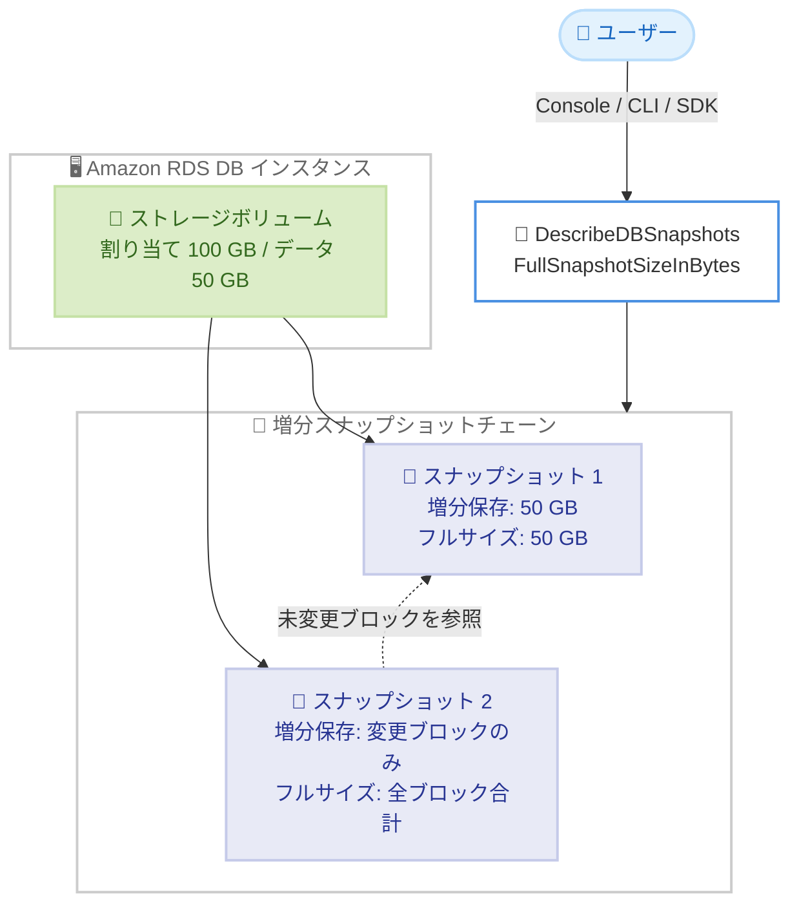

# Amazon RDS - フルスナップショットサイズ情報のコンソール・API 表示

**リリース日**: 2026 年 9 月 29 日
**サービス**: Amazon RDS (Relational Database Service)
**機能**: フルスナップショットサイズ (Full Snapshot Size) の表示

📊 [このアップデートのインフォグラフィックを見る](https://takech9203.github.io/aws-news-summary/20260929-amazon-rds-full-snapshot-size-available.html)

## 概要

Amazon RDS が、RDS スナップショットのフルスナップショットサイズを表示できるようになりました。`DescribeDBSnapshots` API に新しいフィールド `FullSnapshotSizeInBytes` が追加され、マネジメントコンソールにも「Full Snapshot Size」列が追加されています。AWS CLI や AWS SDK からも取得可能です。

RDS スナップショットは増分 (インクリメンタル) 方式で保存されます。各スナップショットには前回のスナップショット以降に変更・追加されたブロックのみが保存され、変更されていないブロックは過去のスナップショットへの参照として扱われます。今回追加されたフルスナップショットサイズは、そのスナップショットを構成するすべてのブロック (直接保存されたブロックと、過去のスナップショットから参照されるブロックの合計) のサイズを示します。

例えば、100 GB のボリュームに 50 GB のデータが含まれている場合、フルスナップショットサイズは最初のスナップショットでも 2 回目以降のスナップショットでも 50 GB と表示されます。これは、そのスナップショット単体で新たに保存された変更ブロックのみを示す増分サイズとは異なる指標です。

**アップデート前の課題**

- 以前は RDS スナップショットの実データ量 (フットプリント全体) をコンソールや API から直接確認する方法がなかった
- 増分方式のため、個々のスナップショットが実際にどれだけのデータを表しているかを把握しにくかった
- スナップショットからの復元時間の見積もりや、バックアップ容量の管理をデータに基づいて行うことが難しかった

**アップデート後の改善**

- コンソールの「Full Snapshot Size」列で、各スナップショットの全体サイズを一目で確認できるようになった
- `DescribeDBSnapshots` API の `FullSnapshotSizeInBytes` フィールドにより、プログラムからサイズ情報を取得し、監視やレポートに組み込めるようになった
- スナップショットの実データ量を把握することで、バックアップ戦略やコスト分析の精度が向上した

## アーキテクチャ図



RDS スナップショットは増分方式で保存されますが、フルスナップショットサイズは直接保存されたブロックと過去のスナップショットから参照されるブロックの合計を示します。ユーザーはコンソール、CLI、SDK からこの値を確認できます。

## サービスアップデートの詳細

### 主要機能

1. **DescribeDBSnapshots API の新フィールド `FullSnapshotSizeInBytes`**
   - スナップショットを構成する全ブロックの合計サイズをバイト単位で返す
   - 直接保存されたブロックと、過去のスナップショットから参照されるブロックの両方を含む
   - AWS CLI および AWS SDK からも取得可能

2. **コンソールの「Full Snapshot Size」列**
   - RDS マネジメントコンソールのスナップショット一覧に新しい列として追加
   - 追加の操作なしで各スナップショットの全体サイズを一覧で確認可能

3. **増分サイズとの明確な区別**
   - フルスナップショットサイズは、スナップショットが表すデータ全体の量を示す
   - 増分サイズは、そのスナップショットで新たに保存された変更ブロックのみを示す
   - 例: データ 50 GB のボリュームでは、初回・2 回目以降のいずれのスナップショットでもフルサイズは 50 GB と表示される

## 技術仕様

### サイズ関連フィールドの比較

| 項目 | 詳細 |
|------|------|
| `FullSnapshotSizeInBytes` | スナップショットを構成する全ブロックの合計サイズ (バイト単位)。今回追加 |
| `AllocatedStorage` | DB インスタンスに割り当てられたストレージサイズ (GiB 単位)。実データ量とは異なる |
| 増分サイズ | 直前のスナップショット以降に変更されたブロックのみのサイズ |

### 対象と提供範囲

| 項目 | 詳細 |
|------|------|
| 対象 | すべての Amazon RDS DB インスタンスのスナップショット |
| 提供リージョン | すべての商用 AWS リージョン |
| アクセス方法 | RDS マネジメントコンソール、AWS CLI、AWS SDK |

## 設定方法

### 前提条件

1. Amazon RDS DB インスタンスとそのスナップショットが存在すること
2. `rds:DescribeDBSnapshots` を実行できる IAM 権限があること
3. AWS CLI を使用する場合は、最新バージョンへの更新を推奨

### 手順

#### ステップ 1: コンソールで確認する

RDS マネジメントコンソールの [スナップショット] ページを開くと、一覧に「Full Snapshot Size」列が表示されます。追加の設定は不要です。

#### ステップ 2: AWS CLI で確認する

```bash
aws rds describe-db-snapshots \
    --db-instance-identifier mydbinstance \
    --query "DBSnapshots[].{ID:DBSnapshotIdentifier,FullSizeBytes:FullSnapshotSizeInBytes,AllocatedGiB:AllocatedStorage}" \
    --output table
```

`describe-db-snapshots` コマンドで対象 DB インスタンスのスナップショット一覧を取得し、`--query` オプションでスナップショット ID、フルスナップショットサイズ、割り当てストレージのみを表形式で表示しています。

#### ステップ 3: サイズ情報を運用に組み込む

```bash
aws rds describe-db-snapshots \
    --snapshot-type manual \
    --query "sum(DBSnapshots[].FullSnapshotSizeInBytes)"
```

手動スナップショット全体のフルサイズを合計し、バックアップデータ量の傾向把握やレポート作成に活用できます。定期実行してデータ増加の推移を監視することも可能です。

## メリット

### ビジネス面

- **コスト管理の精度向上**: スナップショットが表す実データ量を把握できるため、バックアップストレージのコスト分析や予算計画の精度が向上する
- **監査・レポート対応**: バックアップデータ量を定量的に示せるため、コンプライアンスレポートや容量計画の資料作成が容易になる
- **運用の透明性**: これまで見えなかったスナップショットの全体像が可視化され、バックアップ運用の説明責任を果たしやすくなる

### 技術面

- **復元計画の改善**: スナップショットの実サイズがわかることで、復元時間やターゲットインスタンスのストレージ要件を見積もりやすくなる
- **自動化への組み込み**: `FullSnapshotSizeInBytes` フィールドを利用して、サイズ監視やアラートをスクリプトやツールに組み込める
- **データ増加の可視化**: スナップショットごとのフルサイズの推移から、データベースのデータ量の成長傾向を追跡できる

## デメリット・制約事項

### 制限事項

- フルスナップショットサイズは表示・参照のための情報であり、この値を直接制御・変更することはできない
- 提供対象は商用 AWS リージョンと発表されており、その他のパーティションでの提供は明記されていない

### 考慮すべき点

- フルスナップショットサイズは増分サイズとは異なる指標である点に注意が必要。課金対象となるストレージ使用量と直接一致するとは限らないため、コスト計算に使用する場合は増分方式の課金モデルを理解した上で活用する
- `FullSnapshotSizeInBytes` はバイト単位で返されるため、GB 換算などの表示処理はユーザー側で行う必要がある

## ユースケース

### ユースケース 1: バックアップ容量の定期レポート

**シナリオ**: 運用チームが毎月のバックアップデータ量をレポートし、データ増加の傾向を経営層に報告する。

**実装例**:
```bash
aws rds describe-db-snapshots \
    --query "DBSnapshots[].{ID:DBSnapshotIdentifier,Created:SnapshotCreateTime,FullSizeBytes:FullSnapshotSizeInBytes}" \
    --output json > monthly_snapshot_report.json
```

**効果**: スナップショットごとの実データ量を定量的に記録でき、データ増加率に基づいた容量計画とコスト予測が可能になる。

### ユースケース 2: 復元前のサイズ確認

**シナリオ**: 障害復旧やテスト環境構築のためにスナップショットから復元する前に、対象スナップショットのデータ量を確認し、復元先インスタンスのストレージ構成と所要時間を見積もる。

**実装例**:
```bash
aws rds describe-db-snapshots \
    --db-snapshot-identifier mydbsnapshot \
    --query "DBSnapshots[0].FullSnapshotSizeInBytes"
```

**効果**: 復元対象の実データ量を事前に把握することで、復元先のストレージ設定を適切に選択し、復旧時間の見積もり精度を高められる。

### ユースケース 3: サイズ急増の検知

**シナリオ**: 日次スナップショットのフルサイズを監視し、想定外のデータ増加 (ログの肥大化や不要データの蓄積など) を早期に検知する。

**実装例**:
```bash
# 直近のスナップショットのフルサイズを取得し、しきい値と比較
LATEST_SIZE=$(aws rds describe-db-snapshots \
    --db-instance-identifier mydbinstance \
    --query "reverse(sort_by(DBSnapshots,&SnapshotCreateTime))[0].FullSnapshotSizeInBytes" \
    --output text)
echo "Latest full snapshot size: ${LATEST_SIZE} bytes"
```

**効果**: データ量の異常な増加を早期に発見し、ストレージコストの増大やパフォーマンス問題を未然に防げる。

## 料金

本アップデートによる追加料金の記載はありません。フルスナップショットサイズの表示は、既存の RDS スナップショット機能に対する情報提供の強化です。スナップショットのストレージ料金は従来どおり適用されます。

## 利用可能リージョン

すべての商用 AWS リージョンで、すべての Amazon RDS DB インスタンスに対して利用可能です。

## 関連サービス・機能

- **Amazon EBS スナップショット**: RDS スナップショットと同様に増分方式で保存されるブロックストレージのスナップショット。サイズの考え方の理解に役立つ
- **AWS Backup**: RDS を含む AWS リソースのバックアップを一元管理するサービス。サイズ情報はバックアップ容量の管理に活用できる
- **AWS Cost Explorer**: バックアップストレージを含むコストの分析に利用でき、フルスナップショットサイズの情報と組み合わせてコストの背景を把握できる

## 参考リンク

- 📊 [インフォグラフィック](https://takech9203.github.io/aws-news-summary/20260929-amazon-rds-full-snapshot-size-available.html)
- [公式発表 (What's New)](https://aws.amazon.com/about-aws/whats-new/2026/09/amazon-rds-full-snapshot-size-available/)
- [ドキュメント (Amazon RDS User Guide - Backing up, restoring, and exporting data)](https://docs.aws.amazon.com/AmazonRDS/latest/UserGuide/CHAP_CommonTasks.BackupRestore.html)
- [API リファレンス (DescribeDBSnapshots)](https://docs.aws.amazon.com/AmazonRDS/latest/APIReference/API_DescribeDBSnapshots.html)
- [料金ページ (Amazon RDS)](https://aws.amazon.com/rds/pricing/)

## まとめ

Amazon RDS スナップショットのフルサイズがコンソールと API から確認できるようになり、これまで見えにくかったバックアップデータの全体像を定量的に把握できるようになりました。追加設定や追加料金なしで利用できるため、まずはコンソールや `DescribeDBSnapshots` API で既存スナップショットのサイズを確認し、容量レポートや復元計画、サイズ監視の自動化への組み込みを検討することを推奨します。
