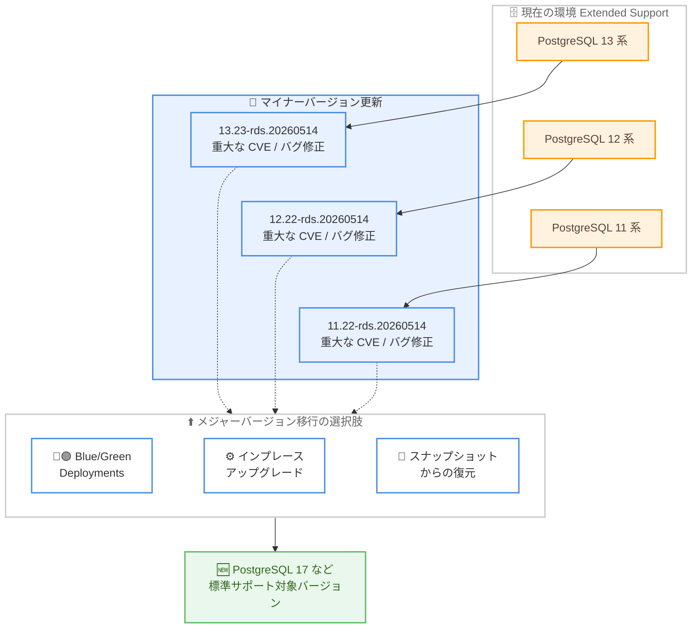

# Amazon RDS for PostgreSQL - Extended Support マイナーバージョン 13.23-rds.20260514 / 12.22-rds.20260514 / 11.22-rds.20260514 のリリース

**リリース日**: 2026 年 9 月 29 日
**サービス**: Amazon RDS for PostgreSQL
**機能**: Amazon RDS Extended Support マイナーバージョン (13.23-rds.20260514 / 12.22-rds.20260514 / 11.22-rds.20260514)

📊 [このアップデートのインフォグラフィックを見る](https://takech9203.github.io/aws-news-summary/20260929-amazon-rds-postgresql-extended-support.html)

## 概要

Amazon RDS for PostgreSQL が、Amazon RDS Extended Support のマイナーバージョン 13.23-rds.20260514、12.22-rds.20260514、11.22-rds.20260514 をリリースしました。Amazon RDS Extended Support は、メジャーバージョンの標準サポート終了日以降も、重大な CVE (Common Vulnerabilities and Exposures) およびバグに対する修正を最大 3 年間提供するプログラムです。

今回のリリースにより、PostgreSQL 13 系、12 系、11 系を Extended Support で利用しているユーザーは、最新のセキュリティ修正とバグ修正を含むマイナーバージョンへ更新できます。標準サポートが終了したバージョンを利用し続けざるを得ないワークロードでも、セキュリティリスクを抑えながら運用を継続できます。

なお、より新しいメジャーバージョンへの移行手段として、Amazon RDS Blue/Green Deployments、インプレースアップグレード、スナップショットからの復元が利用可能です。詳細な手順は Amazon RDS for PostgreSQL ユーザーガイドに記載されています。

**アップデート前の課題**

- 標準サポートが終了した PostgreSQL 11 / 12 / 13 を利用する環境では、新たに公開される重大な CVE やバグへの対応手段が限られていた
- アプリケーション側の制約などで最新メジャーバージョンへすぐに移行できない場合、脆弱性を抱えたまま運用を続けるリスクがあった

**アップデート後の改善**

- Extended Support 対象の 13 系 / 12 系 / 11 系それぞれに、重大な CVE およびバグ修正を含む新しいマイナーバージョンが提供された
- マイナーバージョン更新により、メジャーバージョン移行の準備期間中もセキュリティを維持した運用が可能になった
- Blue/Green Deployments やインプレースアップグレードなど、複数のアップグレード手段が引き続き利用できる

## アーキテクチャ図



Extended Support 環境の各バージョンを新しいマイナーバージョンへ更新する流れと、メジャーバージョン移行の選択肢を示しています。マイナーバージョン更新でセキュリティを維持しつつ、Blue/Green Deployments などを利用して標準サポート対象バージョンへ計画的に移行できます。

## サービスアップデートの詳細

### 主要機能

1. **PostgreSQL 13 系向け Extended Support マイナーバージョン 13.23-rds.20260514**
   - PostgreSQL 13 系の Extended Support 利用環境向けの新しいマイナーバージョン
   - 重大な CVE およびバグに対する修正を含む
   - RDS マネジメントコンソールまたは AWS CLI から適用可能

2. **PostgreSQL 12 系向け Extended Support マイナーバージョン 12.22-rds.20260514**
   - PostgreSQL 12 系の Extended Support 利用環境向けの新しいマイナーバージョン
   - 重大な CVE およびバグに対する修正を含む
   - RDS マネジメントコンソールまたは AWS CLI から適用可能

3. **PostgreSQL 11 系向け Extended Support マイナーバージョン 11.22-rds.20260514**
   - PostgreSQL 11 系の Extended Support 利用環境向けの新しいマイナーバージョン
   - 重大な CVE およびバグに対する修正を含む
   - RDS マネジメントコンソールまたは AWS CLI から適用可能

4. **メジャーバージョン移行手段の提供**
   - Amazon RDS Blue/Green Deployments によるダウンタイムを最小化した移行
   - インプレースアップグレードによる直接的なバージョン更新
   - スナップショットからの復元によるアップグレード

## 技術仕様

### リリースされたバージョン

| 項目 | 詳細 |
|------|------|
| 対象エンジン | Amazon RDS for PostgreSQL |
| 13 系バージョン | 13.23-rds.20260514 |
| 12 系バージョン | 12.22-rds.20260514 |
| 11 系バージョン | 11.22-rds.20260514 |
| 提供プログラム | Amazon RDS Extended Support |
| 修正内容 | 重大な CVE およびバグの修正 |
| 適用方法 | RDS マネジメントコンソール、AWS CLI |

### Amazon RDS Extended Support の概要

| 項目 | 詳細 |
|------|------|
| 目的 | 標準サポート終了後のメジャーバージョンに対する継続的な修正提供 |
| 提供期間 | 標準サポート終了日から最大 3 年間 |
| 提供内容 | 重大な CVE の修正、バグ修正 |
| 課金 | Extended Support 利用分は追加料金が発生 (詳細は料金ページを参照) |

## 設定方法

### 前提条件

1. Amazon RDS for PostgreSQL 13 系、12 系、または 11 系の DB インスタンスを利用していること
2. Extended Support が有効になっていること
3. マイナーバージョン更新に伴う短時間の停止を許容できるメンテナンスウィンドウを確保していること

### 手順

#### ステップ 1: 利用可能なバージョンの確認

```bash
aws rds describe-db-engine-versions \
    --engine postgres \
    --query 'DBEngineVersions[?contains(EngineVersion, `rds.20260514`)].EngineVersion'
```

RDS for PostgreSQL で利用可能なエンジンバージョンの一覧から、今回リリースされた Extended Support マイナーバージョンが選択可能かを確認します。

#### ステップ 2: マイナーバージョンの適用

```bash
aws rds modify-db-instance \
    --db-instance-identifier my-postgres-instance \
    --engine-version 13.23 \
    --apply-immediately
```

対象の DB インスタンスのエンジンバージョンを新しいマイナーバージョンに変更します。`--apply-immediately` を指定すると即時適用され、指定しない場合は次回のメンテナンスウィンドウで適用されます。12 系や 11 系の場合はエンジンバージョンに該当する系列のバージョンを指定します。

#### ステップ 3: 適用状況の確認

```bash
aws rds describe-db-instances \
    --db-instance-identifier my-postgres-instance \
    --query 'DBInstances[0].{Status:DBInstanceStatus,Version:EngineVersion}'
```

DB インスタンスのステータスとエンジンバージョンを確認し、更新が正常に完了したことを検証します。

## メリット

### ビジネス面

- **セキュリティリスクの低減**: 標準サポート終了後のバージョンでも重大な CVE への修正が提供され、コンプライアンス要件への対応を継続できる
- **移行計画の柔軟性**: 最大 3 年間の Extended Support 期間を活用し、アプリケーション改修やテストを含む計画的なメジャーバージョン移行が可能
- **運用継続性の確保**: 既存アプリケーションを変更せずにセキュリティ修正のみを適用できる

### 技術面

- **マイナーバージョン更新の容易さ**: メジャーバージョンアップグレードと比べて互換性リスクが小さく、適用のハードルが低い
- **複数の移行パスの提供**: Blue/Green Deployments、インプレースアップグレード、スナップショット復元と、要件に応じた移行手段を選択できる
- **コンソールと CLI の両対応**: RDS マネジメントコンソールまたは AWS CLI のいずれからでもバージョン更新を実施できる

## デメリット・制約事項

### 制限事項

- Extended Support の提供期間は標準サポート終了日から最大 3 年間であり、恒久的な解決策ではない
- Extended Support の利用には追加料金が発生する (料金はリージョンおよびバージョンにより異なる)
- 個別の CVE 番号や具体的なバグ修正の一覧は今回の発表には記載されていない

### 考慮すべき点

- Extended Support はあくまで移行までの猶予期間と位置付け、標準サポート対象バージョンへの移行計画を早期に策定することが推奨される
- マイナーバージョン更新時には短時間のダウンタイムが発生する可能性があるため、メンテナンスウィンドウの調整が必要
- 適用前にステージング環境での動作確認を行うことが望ましい

## ユースケース

### ユースケース 1: レガシーアプリケーションのセキュリティ維持

**シナリオ**: PostgreSQL 11 に依存するレガシーアプリケーションを運用しており、すぐにはメジャーバージョンアップグレードができないが、セキュリティ要件は満たす必要がある。

**実装例**:
```bash
aws rds modify-db-instance \
    --db-instance-identifier legacy-app-db \
    --engine-version 11.22 \
    --no-apply-immediately
```

**効果**: 次回メンテナンスウィンドウで最新の CVE 修正を適用し、アプリケーションを変更することなくセキュリティ基準を維持できる。

### ユースケース 2: Blue/Green Deployments を利用した標準サポート対象バージョンへの計画的移行

**シナリオ**: PostgreSQL 13 の Extended Support を利用中だが、コスト最適化のため標準サポート対象バージョンへの移行を計画している。移行時のダウンタイムは最小限に抑えたい。

**実装例**:
```bash
aws rds create-blue-green-deployment \
    --blue-green-deployment-name pg13-to-17 \
    --source arn:aws:rds:ap-northeast-1:123456789012:db:prod-postgres \
    --target-engine-version 17
```

**効果**: 本番環境 (Blue) を稼働させたまま新バージョン環境 (Green) を構築・検証し、切り替え時のダウンタイムを最小化してメジャーバージョン移行を実現できる。

### ユースケース 3: スナップショット復元によるアップグレード検証

**シナリオ**: 本番の PostgreSQL 12 環境に影響を与えずに、新しいメジャーバージョンでのアプリケーション互換性を事前に検証したい。

**実装例**:
```bash
aws rds restore-db-instance-from-db-snapshot \
    --db-instance-identifier pg-upgrade-test \
    --db-snapshot-identifier prod-postgres-snapshot \
    --engine postgres
```

**効果**: 本番環境のスナップショットから検証用インスタンスを作成し、そのインスタンスでメジャーバージョンアップグレードとアプリケーションテストを実施することで、本番移行時のリスクを低減できる。

## 料金

Amazon RDS Extended Support の利用には、通常のインスタンス料金に加えて追加料金が発生します。料金はリージョン、エンジンバージョン、vCPU 数などにより異なります。具体的な料金は [Amazon RDS for PostgreSQL 料金ページ](https://aws.amazon.com/rds/postgresql/pricing/) を参照してください。

## 利用可能リージョン

リージョンごとの提供状況は [Amazon RDS for PostgreSQL 料金ページ](https://aws.amazon.com/rds/postgresql/pricing/) で確認できます。

## 関連サービス・機能

- **Amazon RDS Blue/Green Deployments**: 本番環境に影響を与えずにステージング環境を作成し、ダウンタイムを最小化してバージョンアップグレードを実施できる機能
- **Amazon Aurora PostgreSQL**: 同様に Extended Support を提供する PostgreSQL 互換のマネージドデータベース。移行先の選択肢の 1 つ
- **AWS Database Migration Service (AWS DMS)**: 外部データベースから RDS for PostgreSQL への移行を支援するマネージドな移行サービス

## 参考リンク

- 📊 [インフォグラフィック](https://takech9203.github.io/aws-news-summary/20260929-amazon-rds-postgresql-extended-support.html)
- [公式発表 (What's New)](https://aws.amazon.com/about-aws/whats-new/2026/09/amazon-rds-postgresql-extended-support/)
- [Amazon RDS for PostgreSQL 製品ページ](https://aws.amazon.com/rds/postgresql/)
- [Amazon RDS Extended Support ユーザーガイド](https://docs.aws.amazon.com/AmazonRDS/latest/UserGuide/extended-support.html)
- [Amazon RDS Blue/Green Deployments ドキュメント](https://docs.aws.amazon.com/AmazonRDS/latest/UserGuide/blue-green-deployments.html)
- [PostgreSQL DB エンジンのアップグレード手順](https://docs.aws.amazon.com/AmazonRDS/latest/UserGuide/USER_UpgradeDBInstance.PostgreSQL.html)
- [Amazon RDS for PostgreSQL 料金ページ](https://aws.amazon.com/rds/postgresql/pricing/)

## まとめ

Amazon RDS for PostgreSQL の Extended Support マイナーバージョン 13.23-rds.20260514、12.22-rds.20260514、11.22-rds.20260514 のリリースにより、標準サポート終了後のバージョンでも重大な CVE とバグの修正を適用できます。Extended Support 環境を利用中の場合は、早期にマイナーバージョン更新を適用してセキュリティを維持することを推奨します。あわせて、Extended Support は最大 3 年間の時限的なプログラムであるため、Blue/Green Deployments などを活用した標準サポート対象バージョンへの移行計画も並行して進めることが重要です。
