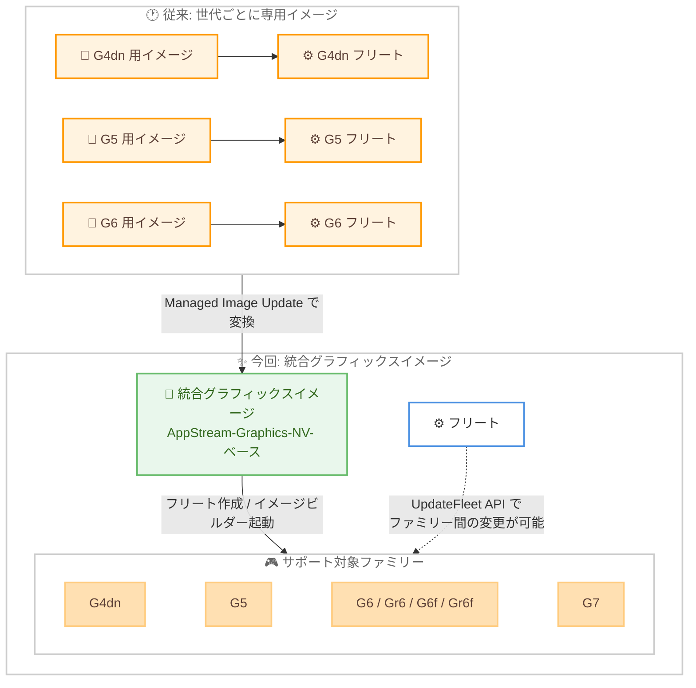

# Amazon WorkSpaces Applications - 統合グラフィックスイメージ (Unified Graphics Images) の導入

**リリース日**: 2026 年 9 月 29 日
**サービス**: Amazon WorkSpaces Applications
**機能**: Unified Graphics Images (統合グラフィックスイメージ)

📊 [このアップデートのインフォグラフィックを見る](https://takech9203.github.io/aws-news-summary/20260929-amazon-workspaces-applications-unified-graphics-images.html)

## 概要

Amazon WorkSpaces Applications (旧 Amazon AppStream 2.0) が、統合グラフィックスイメージ (Unified Graphics Images) を発表しました。これは、G4dn、G5、G6、G7 を含むサポート対象のすべてのグラフィックスインスタンスファミリーで動作する単一のイメージタイプです。従来は GPU 世代ごとに専用のイメージが必要でしたが、今回のアップデートにより、1 つのイメージでサポート対象の任意のグラフィックスインスタンスファミリー上にフリートを作成・管理できるようになりました。

統合グラフィックスイメージはイメージ管理をシンプルにし、新しい GPU 世代が利用可能になった際の採用を容易にします。統合グラフィックスイメージを使用してフリートを作成すると、コンソールに互換性のあるすべてのインスタンスタイプが表示されるため、ワークロードに適した価格とパフォーマンスを選択できます。さらに、統合グラフィックスイメージ上に構築されたフリートは、コンソールまたは UpdateFleet API を使用して、サポート対象ファミリー間でインスタンスタイプを変更できます。この操作は、従来は単一のインスタンスファミリー内のサイズ変更に限定されていました。

GPU を利用したグラフィックス集約型アプリケーション (CAD、3D レンダリングなど) を複数の GPU 世代で提供・検証している管理者にとって、イメージの重複管理を解消し、世代間の移行を大幅に簡素化するアップデートです。

**アップデート前の課題**

- グラフィックスインスタンスの世代 (G4dn、G5、G6、G7) ごとに専用のイメージを個別に作成・維持する必要があった
- 新しい GPU 世代へ移行する際、既存イメージを流用できず、新世代用のベースイメージからイメージを作り直す必要があった
- フリートのインスタンスタイプ変更は同一インスタンスファミリー内のサイズ変更に限定されており、ファミリーをまたぐ変更にはフリートの再作成が必要だった

**アップデート後の改善**

- 1 つの統合グラフィックスイメージで、サポート対象のすべてのグラフィックスインスタンスファミリーのイメージビルダー起動とフリート作成が可能になった
- フリート作成時にコンソールへ互換性のあるすべてのインスタンスタイプが表示され、価格とパフォーマンスの比較・選択が容易になった
- コンソールまたは UpdateFleet API により、フリートのインスタンスタイプをグラフィックスファミリーをまたいで変更できるようになった
- Managed Image Update により、既存のグラフィックスイメージを統合グラフィックスイメージへ変換できるようになった

## アーキテクチャ図



従来は GPU 世代ごとに専用イメージとフリートを個別に管理する必要がありましたが、統合グラフィックスイメージでは 1 つのイメージからすべてのサポート対象ファミリーへフリートを展開でき、既存イメージも Managed Image Update で統合イメージへ変換できます。

## サービスアップデートの詳細

### 主要機能

1. **すべてのグラフィックスファミリーで動作する単一イメージ**
   - Graphics G4dn、G5、G6、Gr6、G6f、Gr6f、G7 の複数インスタンスファミリーを 1 つのイメージでサポート
   - 同じイメージから任意のサポート対象ファミリーでイメージビルダーを起動可能
   - 同じイメージから任意のサポート対象ファミリーでフリートを作成可能

2. **ファミリーをまたぐフリートのインスタンスタイプ変更**
   - コンソールまたは UpdateFleet API でフリートのインスタンスタイプをグラフィックスファミリー間で変更可能
   - 従来は同一インスタンスファミリー内のサイズ変更に限定されていた
   - フリート作成時にはコンソールへ互換性のあるすべてのインスタンスタイプが表示され、価格とパフォーマンスの比較が容易

3. **既存イメージからの移行パス**
   - Managed Image Update により、既存のグラフィックスイメージを統合グラフィックスイメージへ変換可能
   - イメージビルダーで既存グラフィックスイメージからイメージを作成する場合も、グラフィックスドライバーが検出されれば自動的に統合グラフィックスイメージへ変換される
   - 変換後の統合イメージがサポートするファミリーは、インストールされている NVIDIA GRID ドライバーのバージョンに依存

## 技術仕様

### 統合グラフィックスイメージの仕様

| 項目 | 詳細 |
|------|------|
| サポート対象インスタンスファミリー | Graphics G4dn、G5、G6、Gr6、G6f、Gr6f、G7 |
| ベースイメージ名 | AppStream-Graphics-NV-{OperatingSystem}-{MM-DD-YYYY} |
| 対応 OS | Windows Server 2025 / 2022、Red Hat Enterprise Linux 8、Rocky Linux 8 |
| 利用開始方法 | 1. AppStream-Graphics-NV- ベースイメージの利用、2. Managed Image Update による既存イメージの変換、3. イメージビルダーによる既存グラフィックスイメージからのイメージ作成 |
| 制約 | カスタムイメージタイプおよび BYOL イメージタイプでは非サポート |

### API 変更履歴

| 日付 | サービス | 変更内容 |
|------|----------|----------|
| 2026/09/29 | [appstream2](https://awsapichanges.com/archive/changes/e9bb16-appstream2.html) | 4 updated api methods - イメージ関連 API のレスポンスに `ImageSoftwareMetadata` フィールドが追加され、NVIDIA GRID ドライバーバージョン (`nvidiaGridDriverVersion`) のメタデータを取得可能に |

更新された API メソッド (いずれもレスポンスに `ImageSoftwareMetadata` を追加)。

- `DescribeImages`
- `CreateUpdatedImage`
- `CreateImportedImage`
- `DeleteImage`

```json
{
  "Image": {
    "Name": "my-unified-graphics-image",
    "ImageSoftwareMetadata": {
      "nvidiaGridDriverVersion": "string"
    },
    "SupportedInstanceFamilies": ["string"]
  }
}
```

統合イメージがサポートするグラフィックスファミリーはインストール済みドライバーのバージョンに基づくため、このメタデータでイメージのドライバーバージョンを確認できます。

## 設定方法

### 前提条件

1. AWS アカウントと WorkSpaces Applications (AppStream 2.0) の利用環境があること
2. 利用リージョンで WorkSpaces Applications のグラフィックスインスタンスがサポートされていること
3. 既存イメージを変換する場合は、変換元のグラフィックスイメージが Managed Image Update またはイメージビルダーでの再作成に対応していること (カスタム / BYOL イメージタイプは対象外)

### 手順

#### ステップ 1: 統合グラフィックスイメージの準備

以下のいずれかの方法で統合グラフィックスイメージを用意します。

- 新規作成: AppStream-Graphics-NV-{OS}-{MM-DD-YYYY} ベースイメージからイメージビルダーを起動し、アプリケーションをインストールしてイメージを作成
- 既存イメージの変換: Managed Image Update で既存のグラフィックスイメージを更新すると、統合グラフィックスイメージへ変換される

#### ステップ 2: イメージの確認

```bash
# イメージのドライバーバージョンとサポート対象ファミリーを確認
aws appstream describe-images \
  --names my-unified-graphics-image \
  --query "Images[0].{Name:Name,DriverVersion:ImageSoftwareMetadata.nvidiaGridDriverVersion,Families:SupportedInstanceFamilies}"
```

DescribeImages API で、イメージにインストールされている NVIDIA GRID ドライバーバージョンと、そのイメージがサポートするインスタンスファミリーを確認しています。

#### ステップ 3: フリートの作成とインスタンスタイプの変更

```bash
# 統合グラフィックスイメージから G5 フリートを作成
aws appstream create-fleet \
  --name my-graphics-fleet \
  --instance-type stream.graphics.g5.xlarge \
  --fleet-type ON_DEMAND \
  --image-name my-unified-graphics-image \
  --compute-capacity DesiredInstances=2

# フリートを停止した後、別のファミリーのインスタンスタイプへ変更
aws appstream stop-fleet --name my-graphics-fleet
aws appstream update-fleet \
  --name my-graphics-fleet \
  --instance-type stream.graphics.g6.xlarge
aws appstream start-fleet --name my-graphics-fleet
```

統合グラフィックスイメージを指定して G5 フリートを作成した後、UpdateFleet API でインスタンスタイプを G6 ファミリーへ変更しています。従来は同一ファミリー内のサイズ変更のみ可能でしたが、統合グラフィックスイメージ上のフリートではファミリーをまたぐ変更が可能です。

## メリット

### ビジネス面

- **運用コストの削減**: GPU 世代ごとのイメージ作成・パッチ適用・テストといった重複作業がなくなり、イメージ管理の工数を削減できる
- **価格とパフォーマンスの最適化**: フリート作成時に互換性のある全インスタンスタイプを比較でき、ワークロードに最適なコストパフォーマンスの世代を選択しやすくなる
- **新世代 GPU の迅速な採用**: 新しいグラフィックス世代が登場した際に、イメージを作り直すことなく既存イメージのままフリートを移行できる

### 技術面

- **イメージの一元管理**: 単一のイメージパイプラインで全グラフィックスファミリーをカバーでき、イメージの乱立を防止できる
- **ファミリー間のインスタンスタイプ変更**: フリートを再作成することなく、UpdateFleet API またはコンソールでファミリーをまたぐ変更が可能
- **ドライバーバージョンの可視化**: DescribeImages などの API レスポンスに追加された `ImageSoftwareMetadata` により、イメージの NVIDIA GRID ドライバーバージョンをプログラムから確認できる

## デメリット・制約事項

### 制限事項

- カスタムイメージタイプおよび BYOL イメージタイプでは統合グラフィックスイメージはサポートされない
- ベースイメージ (AppStream-Graphics-NV-) の対応 OS は Windows Server 2025 / 2022、RHEL 8、Rocky Linux 8 に限定される
- 統合イメージがサポートするインスタンスファミリーは、イメージにインストールされている NVIDIA GRID ドライバーのバージョンに依存する

### 考慮すべき点

- 既存イメージを変換する場合、イメージビルダーでの再作成時にグラフィックスドライバーが検出される必要がある
- 世代によって GPU 性能や時間単価が異なるため、ファミリー変更時はアプリケーションの動作検証とコスト評価を行うことが望ましい
- 既存の世代別イメージ運用から統合イメージ運用へ切り替える際は、Managed Image Update の適用タイミングを計画する必要がある

## ユースケース

### ユースケース 1: GPU 世代の段階的な移行

**シナリオ**: G5 フリートで CAD アプリケーションを提供している企業が、パフォーマンス向上のため G6 や G7 への移行を検討している。

**実装例**:
```
1. Managed Image Update で既存の G5 イメージを統合グラフィックスイメージへ変換
2. 検証用フリートを G6 / G7 インスタンスタイプで作成し、同一イメージで動作検証
3. 検証完了後、本番フリートを停止し UpdateFleet でインスタンスタイプを変更
```

**効果**: 世代ごとのイメージ再作成が不要になり、フリートの再作成なしで新世代 GPU へ移行できる。

### ユースケース 2: ワークロードに応じたコスト最適化

**シナリオ**: 部門ごとにグラフィックス性能要件が異なるため、軽量な 2D CAD ユーザーには低コストの世代、大規模 3D レンダリングユーザーには高性能な世代を割り当てたい。

**実装例**:
```
1. アプリケーション一式を組み込んだ統合グラフィックスイメージを 1 つ作成
2. 軽量ワークロード向けに G4dn フリート、高負荷ワークロード向けに G7 フリートを同一イメージから作成
3. フリート作成画面で互換インスタンスタイプの価格・性能を比較して選択
```

**効果**: 単一のイメージ管理のまま、部門ごとの要件に合わせた価格とパフォーマンスの最適化を実現できる。

### ユースケース 3: GPU キャパシティ不足時の柔軟な切り替え

**シナリオ**: 特定リージョンで利用中のグラフィックスファミリーのキャパシティが逼迫した際に、別のファミリーへ迅速に切り替えてサービス継続性を確保したい。

**実装例**:
```
1. フリートを統合グラフィックスイメージ上に構築しておく
2. キャパシティ逼迫時にフリートを停止し、UpdateFleet API で別ファミリーのインスタンスタイプへ変更
3. フリートを再起動してストリーミングを再開
```

**効果**: イメージの互換性を気にすることなく複数のグラフィックスファミリーを代替候補にでき、キャパシティ起因の障害リスクを低減できる。

## 料金

統合グラフィックスイメージ自体に関する追加料金の記載はありません。WorkSpaces Applications の既存の料金体系に従い、フリートで選択したインスタンスタイプ・サイズ・OS に基づく時間課金 (ストリーミングリソース料金) と、Windows フリートの場合はユーザーごとの月額料金 (RDS SAL) が発生します。

統合グラフィックスイメージにより世代間のインスタンスタイプ変更が容易になるため、各グラフィックスファミリーの時間単価を比較し、ワークロードに応じたコスト最適化が可能です。具体的な単価は料金ページで利用リージョンを選択して確認してください。

## 利用可能リージョン

Amazon WorkSpaces Applications のグラフィックスインスタンスがサポートされているすべての AWS 商用リージョンおよび AWS GovCloud (US) リージョンで利用可能です。

## 関連サービス・機能

- **Managed Image Update (マネージドイメージ更新)**: 既存のグラフィックスイメージを統合グラフィックスイメージへ変換するための更新機能
- **UpdateFleet API**: フリートのインスタンスタイプをグラフィックスファミリー間で変更するために使用する API
- **Amazon EC2 G4dn / G5 / G6 / G7 インスタンス**: WorkSpaces Applications のグラフィックスインスタンスの基盤となる NVIDIA GPU 搭載 EC2 インスタンスファミリー
- **Amazon WorkSpaces (パーソナル)**: 永続的な仮想デスクトップを提供するサービス。非永続的なアプリケーションストリーミングを提供する WorkSpaces Applications と使い分ける

## 参考リンク

- 📊 [インフォグラフィック](https://takech9203.github.io/aws-news-summary/20260929-amazon-workspaces-applications-unified-graphics-images.html)
- [公式発表 (What's New)](https://aws.amazon.com/about-aws/whats-new/2026/09/amazon-workspaces-applications-unified-graphics-images/)
- [Unified graphics images (ドキュメント)](https://docs.aws.amazon.com/appstream2/latest/developerguide/unified-graphics-images.html)
- [API 変更履歴 (awsapichanges.com)](https://awsapichanges.com/archive/changes/e9bb16-appstream2.html)
- [Amazon WorkSpaces Applications 料金ページ](https://aws.amazon.com/workspaces/applications/pricing/)

## まとめ

Amazon WorkSpaces Applications の統合グラフィックスイメージにより、G4dn から G7 までのグラフィックスインスタンスファミリーを単一のイメージでカバーでき、世代ごとのイメージ管理の重複と、ファミリーをまたぐフリート変更時の再作成が不要になりました。複数の GPU 世代でアプリケーションストリーミングを運用している場合は、Managed Image Update による既存イメージの統合イメージへの変換を検討し、新世代 GPU への移行やコスト最適化を容易にする運用への切り替えを推奨します。
