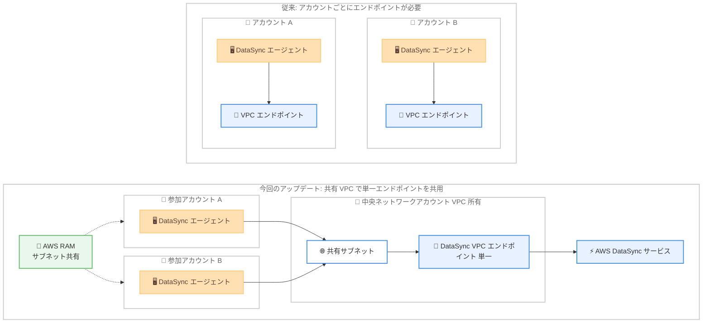

# AWS DataSync - 共有 VPC のサポート

**リリース日**: 2026 年 9 月 29 日
**サービス**: AWS DataSync
**機能**: 共有 VPC (Shared VPC) サポート

📊 [このアップデートのインフォグラフィックを見る](https://takech9203.github.io/aws-news-summary/20260929-aws-datasync-shared-vpcs.html)

## 概要

AWS DataSync が共有 VPC (Shared Virtual Private Cloud) をサポートしました。AWS Resource Access Manager (RAM) を使用して複数の AWS アカウント間で共有されたサブネット上で、DataSync エージェントの作成と転送タスクの実行が可能になります。これにより、アカウントごとに VPC エンドポイントを用意するのではなく、中央アカウントで管理する共有サブネットと VPC エンドポイントを経由して、プライベートにデータを転送できます。

ネットワークを中央集約しているお客様は、これまで AWS PrivateLink 経由でプライベート接続するすべてのアカウントに、個別の DataSync 用 VPC エンドポイントを作成する必要がありました。各エンドポイントは IP アドレスを消費し、アカウントをまたいだ維持管理の運用負荷も発生していました。今回のアップデートにより、VPC を所有するアカウント内の単一のエンドポイントが、サブネットを共有されたすべてのアカウントにサービスを提供できるようになり、IP アドレス空間の節約とアカウントごとのエンドポイント管理の廃止が実現します。

このアップデートは単一アカウント構成にもメリットがあります。従来はサブネットごとに対応する VPC エンドポイントが必要でしたが、1 つの VPC エンドポイントを複数のサブネットで利用できるようになりました。

**アップデート前の課題**

- PrivateLink でプライベート接続する場合、アカウントごとに個別の DataSync 用 VPC エンドポイントの作成が必要だった
- 各 VPC エンドポイントが IP アドレスを消費し、アドレス空間を圧迫していた
- 複数アカウントにまたがるエンドポイントの維持管理に運用負荷が発生していた
- 単一アカウント内でも、サブネットごとに対応する VPC エンドポイントが必要だった

**アップデート後の改善**

- AWS RAM で共有されたサブネットを使用して DataSync エージェントの作成と転送タスクの実行が可能になった
- VPC 所有アカウント内の単一の VPC エンドポイントを、サブネットを共有されたすべてのアカウントで利用できるようになった
- アカウントごとのエンドポイント作成が不要になり、IP アドレス空間を節約できるようになった
- 単一アカウント内でも、1 つの VPC エンドポイントを複数のサブネットで共有できるようになった

## アーキテクチャ図



従来はアカウントごとに DataSync 用 VPC エンドポイントが必要でしたが、今回のアップデートにより、AWS RAM で共有されたサブネット上の単一エンドポイントを複数アカウントの DataSync エージェントが共用できるようになりました。

## サービスアップデートの詳細

### 主要機能

1. **共有サブネットでのエージェント作成とタスク実行**
   - AWS RAM で自アカウントに共有されたサブネットを指定して、DataSync エージェントを作成可能
   - 共有サブネットを使用した転送タスクの実行に対応
   - コンソールまたは CreateAgent API から利用可能

2. **単一 VPC エンドポイントのマルチアカウント共用**
   - VPC を所有する中央アカウント内の単一の DataSync 用 VPC エンドポイントが、サブネットを共有されたすべてのアカウントにサービスを提供
   - アカウントごとの PrivateLink エンドポイント作成が不要になり、IP アドレス空間を節約
   - エンドポイントの一元管理により、アカウント横断の運用負荷を削減

3. **単一アカウント内でのエンドポイント共用**
   - 1 つの VPC エンドポイントを複数のサブネットで利用可能
   - 従来のサブネットごとに対応する VPC エンドポイントが必要という要件を撤廃

4. **Enhanced モードと Basic モードの両方をサポート**
   - エージェントベースのタスクにおいて、Enhanced モードと Basic モードの両方で共有 VPC を利用可能

## 技術仕様

### 対応範囲

| 項目 | 詳細 |
|------|------|
| 対象機能 | DataSync エージェントの作成、転送タスクの実行 |
| サブネット共有の仕組み | AWS Resource Access Manager (RAM) |
| 対応タスクモード | Enhanced モード、Basic モード (エージェントベースのタスク) |
| プライベート接続 | AWS PrivateLink (VPC エンドポイント) |
| エンドポイント配置 | VPC を所有するアカウント (中央アカウント) に単一配置 |
| 利用方法 | コンソール、CreateAgent API |

### API変更履歴

今回のアップデートに伴う新規 API の追加は確認されていません。既存の CreateAgent API で AWS RAM 経由で共有されたサブネットを指定することで利用できます。

## 設定方法

### 前提条件

1. 中央ネットワークアカウントで VPC とサブネットを作成し、AWS RAM を使用して利用側アカウントにサブネットを共有していること
2. VPC を所有するアカウントで DataSync 用の VPC エンドポイント (AWS PrivateLink) を作成していること
3. 利用側アカウントに DataSync エージェントをデプロイするための権限があること

### 手順

#### ステップ1: AWS RAM でサブネットを共有

```bash
aws ram create-resource-share \
  --name datasync-shared-subnet \
  --resource-arns arn:aws:ec2:ap-northeast-1:111111111111:subnet/subnet-0123456789abcdef0 \
  --principals 222222222222
```

中央ネットワークアカウント (111111111111) が所有するサブネットを、DataSync を利用するアカウント (222222222222) に AWS RAM で共有します。

#### ステップ2: 中央アカウントで DataSync 用 VPC エンドポイントを作成

```bash
aws ec2 create-vpc-endpoint \
  --vpc-id vpc-0123456789abcdef0 \
  --vpc-endpoint-type Interface \
  --service-name com.amazonaws.ap-northeast-1.datasync \
  --subnet-ids subnet-0123456789abcdef0 \
  --security-group-ids sg-0123456789abcdef0
```

VPC を所有する中央アカウントで、DataSync サービス用のインターフェイス型 VPC エンドポイントを作成します。このエンドポイントがサブネットを共有されたすべてのアカウントで共用されます。

#### ステップ3: 利用側アカウントで共有サブネットを指定してエージェントを作成

```bash
aws datasync create-agent \
  --agent-name shared-vpc-agent \
  --activation-key AAAAA-BBBBB-CCCCC-DDDDD-EEEEE \
  --vpc-endpoint-id vpce-0123456789abcdef0 \
  --subnet-arns arn:aws:ec2:ap-northeast-1:111111111111:subnet/subnet-0123456789abcdef0 \
  --security-group-arns arn:aws:ec2:ap-northeast-1:222222222222:security-group/sg-0fedcba9876543210
```

利用側アカウントで CreateAgent API を実行し、AWS RAM で共有されたサブネットと中央アカウントの VPC エンドポイントを指定して DataSync エージェントを作成します。コンソールからも同様の設定が可能です。

## メリット

### ビジネス面

- **運用コストの削減**: アカウントごとの VPC エンドポイントの作成・維持管理が不要になり、マルチアカウント環境の運用負荷を削減できる
- **ネットワークガバナンスの強化**: ネットワークリソースを中央アカウントに集約する組織のベストプラクティスに沿った構成で DataSync を利用できる
- **エンドポイント費用の最適化**: アカウントごとに課金されていたインターフェイス型 VPC エンドポイントの数を削減できる

### 技術面

- **IP アドレス空間の節約**: エンドポイントごとに消費されていた IP アドレスを削減し、アドレス設計の柔軟性が向上する
- **単一アカウントでも構成を簡素化**: 1 つの VPC エンドポイントを複数サブネットで共用でき、サブネットごとのエンドポイント作成が不要になる
- **両タスクモードに対応**: Enhanced モードと Basic モードのエージェントベースタスクの両方で利用でき、既存構成からの移行がしやすい

## デメリット・制約事項

### 制限事項

- AWS Secret Regions では利用できない
- 共有 VPC のサポートはエージェントベースのタスクが対象 (Enhanced モードと Basic モード)
- サブネット共有には AWS RAM の設定が必要であり、通常は AWS Organizations での組織内共有が前提となる

### 考慮すべき点

- 中央アカウントの VPC エンドポイントに複数アカウントのトラフィックが集約されるため、セキュリティグループやエンドポイントポリシーの設計を見直す必要がある
- 共有サブネットの IP アドレス消費やスループットを、参加アカウント全体で考慮した容量設計が求められる
- 中央ネットワークアカウントと利用側アカウントの間で、責任分界と運用プロセスを明確にしておく必要がある

## ユースケース

### ユースケース1: マルチアカウント環境での集中型ネットワークによるデータ移行

**シナリオ**: AWS Organizations で多数のアカウントを運用し、ネットワークリソースを中央のネットワークアカウントに集約している企業が、各アカウントのオンプレミスデータを Amazon S3 へプライベートに移行する。

**実装例**:
```
1. 中央ネットワークアカウントで VPC・サブネットを作成し、AWS RAM で各アカウントに共有
2. 中央アカウントに DataSync 用 VPC エンドポイントを 1 つ作成
3. 各アカウントで共有サブネットを指定して DataSync エージェントを作成
4. 各アカウントで転送タスクを作成・実行
```

**効果**: アカウントごとのエンドポイント作成が不要になり、IP アドレスの節約と運用の一元化を実現しながら、PrivateLink 経由のプライベートなデータ転送を維持できる。

### ユースケース2: 単一アカウント内の複数サブネットでのエンドポイント共用

**シナリオ**: 単一アカウント内で複数のサブネットに分散したワークロードのデータを DataSync で転送しており、従来はサブネットごとに VPC エンドポイントを作成していた。

**実装例**:
```
1. VPC 内に DataSync 用 VPC エンドポイントを 1 つ作成
2. 各サブネットの DataSync エージェントから同一のエンドポイントを利用
3. 不要になったサブネットごとのエンドポイントを削除
```

**効果**: サブネットごとの VPC エンドポイントが不要になり、エンドポイント費用と IP アドレス消費を削減できる。

### ユースケース3: セキュリティ要件の厳しい環境でのプライベート転送の標準化

**シナリオ**: 金融機関などインターネット経由の通信を禁止する組織が、全アカウントの DataSync 転送を中央管理されたプライベート経路に統一する。

**実装例**:
```
1. 中央アカウントで VPC エンドポイントとエンドポイントポリシーを一元管理
2. AWS RAM でサブネットを許可されたアカウントのみに共有
3. 各アカウントは共有サブネット経由でのみ DataSync を利用
```

**効果**: プライベート転送経路とポリシーを中央で統制でき、セキュリティガバナンスとコンプライアンス対応を強化できる。

## 料金

DataSync 自体の料金体系に変更はありません。DataSync はコピーしたデータ量に応じたギガバイト単位の課金です。AWS PrivateLink のインターフェイス型 VPC エンドポイントには時間単位およびデータ処理量に応じた料金が発生しますが、今回のアップデートによりエンドポイント数を削減できるため、マルチアカウント環境ではエンドポイント関連費用の削減が期待できます。

詳細は [AWS DataSync 料金ページ](https://aws.amazon.com/datasync/pricing/) および [AWS PrivateLink 料金ページ](https://aws.amazon.com/privatelink/pricing/) を参照してください。

## 利用可能リージョン

AWS DataSync が提供されているすべての AWS リージョンで利用可能です (AWS Secret Regions を除く)。東京リージョン、大阪リージョンを含みます。

## 関連サービス・機能

- **AWS Resource Access Manager (RAM)**: サブネットをアカウント間で共有するための基盤サービス。今回のアップデートの前提となる仕組み
- **AWS PrivateLink**: DataSync サービスへのプライベート接続を提供する VPC エンドポイントの基盤技術
- **Amazon VPC**: 共有 VPC・共有サブネットの機能を提供。中央ネットワークアカウントによる VPC の一元管理を実現
- **AWS Organizations**: AWS RAM によるリソース共有を組織内で行うための管理サービス

## 参考リンク

- 📊 [インフォグラフィック](https://takech9203.github.io/aws-news-summary/20260929-aws-datasync-shared-vpcs.html)
- [公式発表 (What's New)](https://aws.amazon.com/about-aws/whats-new/2026/09/aws-datasync-shared-vpcs/)
- [AWS DataSync ドキュメント - VPC エンドポイントの利用](https://docs.aws.amazon.com/datasync/latest/userguide/choose-service-endpoint-vpc.html)
- [AWS DataSync CreateAgent API リファレンス](https://docs.aws.amazon.com/datasync/latest/userguide/API_CreateAgent.html)
- [AWS DataSync 料金ページ](https://aws.amazon.com/datasync/pricing/)

## まとめ

AWS DataSync の共有 VPC サポートにより、中央アカウントで管理する単一の VPC エンドポイントを複数アカウント・複数サブネットで共用できるようになり、IP アドレスの節約とエンドポイント管理の一元化が実現します。ネットワークを中央集約しているマルチアカウント環境や、複数サブネットで DataSync を利用している環境では、既存のアカウントごと・サブネットごとのエンドポイント構成を見直し、共有 VPC への移行を検討することを推奨します。
