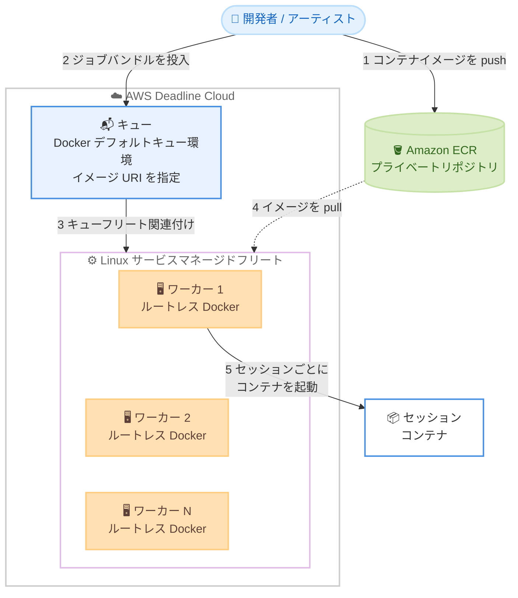

# AWS Deadline Cloud - Linux サービスマネージドフリートでの ECS コンテナサポート

**リリース日**: 2026 年 9 月 29 日
**サービス**: AWS Deadline Cloud
**機能**: Linux Service-Managed Fleets における ECS コンテナサポート

📊 [このアップデートのインフォグラフィックを見る](https://takech9203.github.io/aws-news-summary/20260929-aws-deadline-cloud-ecs-containers-linux-smf.html)

## 概要

AWS Deadline Cloud が、Linux ベースのサービスマネージドフリート (SMF) 上で Amazon ECS の Docker コンテナを使用したジョブ実行をサポートしました。Deadline Cloud は、視覚効果 (VFX)、アニメーション、プロダクトデザイン、シミュレーション、ゲーム開発などの計算負荷の高いワークロードをクラウドで実行するためのフルマネージドサービスです。

今回のアップデートにより、Docker 対応フリートを通じて独自のソフトウェアコンテナを Deadline Cloud に持ち込めるようになりました。すでにソフトウェアをコンテナイメージとしてパッケージ化しているチームは、そのイメージを Deadline Cloud に直接指定するだけで、サービスがコンテナ化されたソフトウェアをすべてのワーカーインスタンスに大規模かつ自動的にデプロイします。レンダリング用の Blender はもちろん、NVIDIA Isaac Sim や MuJoCo といったフィジカル AI ツールなど、コンテナとしてデプロイ可能なあらゆるソフトウェアに対応します。

コンテナの統合はフリートとキューのレベルで行われるため、ジョブテンプレートにコンテナコマンドやイメージ参照を含める必要がありません。Open Job Description CLI でローカル実行できるジョブバンドルは、追加の変更なしでそのまま Deadline Cloud に投入できます。これにより、既存のコンテナ化されたソフトウェアワークフローから、フルマネージドなレンダー / コンピュートファームへの移行がより迅速になります。

**アップデート前の課題**

- 以前は、サービスマネージドフリートのワーカーで独自ソフトウェアを利用するには、Conda パッケージ化やカスタムのセットアップスクリプトなどの方法で環境を準備する必要があった
- 以前は、すでにコンテナイメージとしてパッケージ化済みのソフトウェア資産を Deadline Cloud でそのまま活用できなかった
- 以前は、コンテナ環境を利用したい場合、顧客管理フリート (CMF) で自前のインフラ運用が必要になるケースがあった

**アップデート後の改善**

- 今回のアップデートにより、Amazon ECR のコンテナイメージを指定するだけで、サービスマネージドフリートの全ワーカーにソフトウェアが自動デプロイされるようになった
- 今回のアップデートにより、コンテナ統合がフリートとキューのレベルで完結し、ジョブテンプレート側の変更が不要になった
- 今回のアップデートにより、ローカルで動作確認したジョブバンドルを変更なしでクラウドのマネージドファームに投入できるようになった

## アーキテクチャ図



Amazon ECR のコンテナイメージをキュー環境に指定すると、Docker を有効化した Linux サービスマネージドフリートの各ワーカーがイメージを pull し、ジョブセッションごとにコンテナを起動してタスクを実行します。

## サービスアップデートの詳細

### 主要機能

1. **Docker ソフトウェアアドオン (フリート側)**
   - Linux サービスマネージドフリートの追加設定で「Container support」を有効化すると、各ワーカーにルートレス Docker が自動インストール・構成される
   - GPU インスタンスを含むフリートでは、Container Device Interface (CDI) サポートが自動構成され、特権コンテナアクセスなしで GPU をコンテナから利用できる
   - フリートロールには `AmazonEC2ContainerRegistryReadOnly` マネージドポリシーがアタッチされ、ワーカーが Amazon ECR からイメージを pull できる

2. **Docker デフォルトキュー環境 (キュー側)**
   - キューのデフォルトキュー環境タイプとして「Docker」を選択し、Amazon ECR のイメージ URI を指定する
   - デフォルトのキュー環境は Amazon ECR からイメージを pull するが、カスタマイズすることで他のコンテナレジストリプロバイダーへの認証と pull も可能
   - ジョブセッションごとに 1 つのコンテナが起動され、セッション終了時に停止される

3. **ジョブテンプレートの可搬性**
   - コンテナ統合はフリートとキューのレベルで行われるため、ジョブテンプレートにコンテナコマンドやイメージ参照を含める必要がない
   - Open Job Description CLI でローカル実行できるジョブバンドルを、追加変更なしで Deadline Cloud に投入可能
   - ジョブセッションディレクトリがコンテナ内の同じパスにマウントされるため、埋め込みファイル、ジョブアタッチメント、出力パスがそのまま利用できる

4. **セキュリティ設計**
   - Docker はルートレスモードで実行され、コンテナアクションは非特権の `job-user` ID で動作する
   - コンテナからワーカーへの root アクセスは提供されない

## 技術仕様

### コンテナサポートの構成要素

| リソース | 設定内容 | 役割 |
|------|------|------|
| フリート | Linux SMF の Docker ソフトウェアアドオン | 各ワーカーへのルートレス Docker と GPU 統合のインストール |
| キュー | Docker デフォルトキュー環境と Amazon ECR イメージ URI | イメージの pull とセッションコンテナ内でのアクション実行 |
| キューフリート関連付け | Docker 対応フリートへのコンテナキューの関連付け | コンテナジョブを Docker 提供ワーカーのみにルーティング |

### 主な仕様

| 項目 | 詳細 |
|------|------|
| 対象フリート | Linux サービスマネージドフリート (Windows は非対応) |
| コンテナランタイム | ルートレス Docker (サービスが自動インストール・構成) |
| デフォルトレジストリ | Amazon ECR プライベートリポジトリ (カスタマイズで他レジストリも可) |
| コンテナのライフサイクル | ジョブセッションごとに 1 コンテナを起動、セッション終了時に停止 |
| GPU サポート | CDI により特権アクセスなしで GPU をコンテナへ公開 |
| 実行ユーザー | 非特権の `job-user` (root アクセスなし) |
| 必要な IAM ポリシー | フリートロールとキューロールに `AmazonEC2ContainerRegistryReadOnly` |
| ストレージ | 永続ストレージを有効化すると Docker レイヤーやキャッシュをワーカーのライフサイクルをまたいで保持可能 |

### API 変更履歴

| 日付 | サービス | 変更内容 |
|------|----------|----------|
| 2026/09/29 | [deadline](https://awsapichanges.com/archive/changes/e9bb16-deadline.html) | 10 updated api methods - サービスマネージドフリートの Docker ソフトウェアアドオンサポートを追加。あわせて Open Job Description の EXPR と Feature Bundle 1 ジョブテンプレートもサポート |

## 設定方法

### 前提条件

1. Deadline Cloud のファームが作成済みであること
2. Linux サービスマネージドフリート、またはその作成権限があること (Windows フリートは非対応)
3. 更新可能なキューロールとフリートロールがあること
4. Amazon ECR プライベートリポジトリにタグ付きのコンテナイメージが push 済みであること

### 手順

#### ステップ 1: フリートで Docker を有効化

1. Deadline Cloud コンソールでファームを開き、[Fleets] からサービスマネージドフリートを作成または編集する
2. オペレーティングシステムとして Linux を選択する
3. [Additional configurations] の [Container support] で [Enable Docker] を選択する
4. フリートロールを選択または作成する (コンソールが `AmazonEC2ContainerRegistryReadOnly` ポリシーをアタッチ)
5. 必要に応じて [Persistent storage] を有効化し、Docker レイヤーとアプリケーションキャッシュを保持する

#### ステップ 2: キューに Docker キュー環境を設定

1. キューを作成または編集し、[Default queue environment] の [Environment type] で [Docker] を選択する
2. [Container image URI] に Amazon ECR リポジトリとイメージタグを指定する

```text
{account-id}.dkr.ecr.{region}.amazonaws.com/{repository}:{tag}
```

Amazon ECR のイメージ URI の形式。コンソールではリポジトリとタグの選択、または完全な URI の直接入力が可能です。

3. キューロールを選択または作成し、キューを Docker 対応フリートに関連付ける

#### ステップ 3: 設定の確認とジョブ投入

フリートがアクティブになった後、以下を確認します。

- フリートの [Software add-ons] に Docker が含まれている
- キューが Docker デフォルト環境を使用し、指定したイメージ URI が表示されている
- キューが Docker 有効な Linux サービスマネージドフリートのみに関連付けられている

```bash
# ジョブバンドルを投入 (ローカルで動作するバンドルをそのまま投入可能)
deadline bundle submit ./my-job-bundle \
  --farm-id farm-xxxxxxxxxxxx \
  --queue-id queue-xxxxxxxxxxxx
```

Deadline Cloud CLI でジョブバンドルを指定のファームとキューに投入するコマンド。コンテナ統合はキューとフリート側で完結しているため、バンドル側の変更は不要です。

なお、フリート更新は実行中のワーカーを置き換えません。Docker ソフトウェアアドオンをすべてのワーカーに即時適用するには、フリートをドレインして再起動します。AWS CLI によるフリートとロールの自動セットアップもサポートされています。

## メリット

### ビジネス面

- **移行の迅速化**: 既存のコンテナ化済みワークフローを変更せずマネージドなレンダー / コンピュートファームへ移行でき、導入までの時間を短縮できる
- **運用負荷の削減**: ワーカーへのソフトウェアデプロイをサービスが自動化するため、環境構築・保守の工数が減る
- **ワークロードの拡大**: レンダリングに加え、NVIDIA Isaac Sim や MuJoCo などフィジカル AI・シミュレーション用途にも同一基盤を活用できる

### 技術面

- **ジョブテンプレートの可搬性**: コンテナ統合がフリート / キューレベルで完結し、ジョブテンプレートはコンテナ非依存のまま維持できる
- **セキュアな実行環境**: ルートレス Docker と非特権 `job-user` により、コンテナに root アクセスを与えずにジョブを実行できる
- **GPU 対応**: CDI により特権コンテナなしで GPU を利用でき、GPU レンダリングや物理シミュレーションに対応できる
- **キャッシュの永続化**: 永続ストレージとの組み合わせで Docker レイヤーを保持し、イメージ pull の時間を短縮できる

## デメリット・制約事項

### 制限事項

- コンテナサポートは Linux サービスマネージドフリートのみで利用可能であり、Windows フリートでは利用できない
- デフォルトのキュー環境は Amazon ECR プライベートリポジトリからの pull を前提としており、他のレジストリを使用するにはキュー環境のカスタマイズが必要
- フリート設定の更新は実行中のワーカーに自動適用されないため、即時反映にはフリートのドレインと再起動が必要

### 考慮すべき点

- フリートロールとキューロールの両方に Amazon ECR への読み取りアクセス権限 (`AmazonEC2ContainerRegistryReadOnly`) が必要
- コンテナイメージのサイズが大きい場合、初回 pull に時間がかかるため、永続ストレージの有効化やイメージの軽量化を検討する
- キューは Docker 有効なフリートのみに関連付ける必要があり、キューフリート関連付けの設計を見直す必要がある場合がある

## ユースケース

### ユースケース 1: Blender によるコンテナベースのレンダリングファーム

**シナリオ**: スタジオが Blender と独自プラグインを含むコンテナイメージを社内で管理しており、これをそのままクラウドレンダリングに利用したい。

**実装例**:
```text
1. Blender と必要なプラグインを含む Docker イメージをビルドし Amazon ECR に push
2. Linux SMF で Container support を有効化
3. キューの Docker 環境にイメージ URI を設定
4. アーティストは既存のジョブバンドルをそのまま投入
```

**効果**: ワーカーごとのソフトウェアセットアップが不要になり、社内で検証済みの環境と同一のコンテナでレンダリングを大規模実行できる。

### ユースケース 2: NVIDIA Isaac Sim によるフィジカル AI シミュレーション

**シナリオ**: ロボティクス開発チームが NVIDIA Isaac Sim を使った大規模なシミュレーションバッチを実行したい。GPU が必要だが、特権コンテナは避けたい。

**実装例**:
```text
1. Isaac Sim のコンテナイメージを Amazon ECR に登録
2. GPU インスタンスを含む Linux SMF で Docker を有効化 (CDI が自動構成)
3. シミュレーションジョブを Open Job Description のジョブバンドルとして投入
```

**効果**: 特権アクセスなしで GPU をコンテナから利用でき、セキュリティを保ちながらシミュレーションをスケールできる。

### ユースケース 3: ローカル検証からクラウドへのシームレスな移行

**シナリオ**: パイプライン開発者が Open Job Description CLI を使ってローカルでジョブを開発・検証し、本番は Deadline Cloud で実行したい。

**実装例**:
```bash
# ローカルでジョブバンドルを検証
openjd run ./my-job-bundle

# 検証済みバンドルを変更なしで Deadline Cloud に投入
deadline bundle submit ./my-job-bundle
```

**効果**: ジョブテンプレートにコンテナ固有の記述が不要なため、ローカルとクラウドで同一のバンドルを使い回せ、開発サイクルが短縮される。

## 料金

今回の発表に追加料金の記載はありません。Deadline Cloud の既存の料金体系 (ワーカーインスタンスの使用時間と使用量ベースの課金) が適用されます。Amazon ECR のストレージとデータ転送には別途 Amazon ECR の料金が適用されます。詳細は料金ページを参照してください。

## 利用可能リージョン

AWS Deadline Cloud が提供されているすべての AWS リージョンで利用可能です。

## 関連サービス・機能

- **Amazon ECR**: コンテナイメージの保管元。デフォルトのキュー環境はプライベートリポジトリからイメージを pull する
- **Amazon ECS**: コンテナイメージのエコシステム。ECS 向けにビルドした Docker イメージをそのまま活用できる
- **Open Job Description (OpenJD)**: ジョブテンプレートの仕様。ローカル検証済みのジョブバンドルを変更なしで投入できる
- **Deadline Cloud 永続ストレージ**: Docker レイヤーやアプリケーションキャッシュをワーカーのライフサイクルをまたいで保持し、起動を高速化する

## 参考リンク

- 📊 [インフォグラフィック](https://takech9203.github.io/aws-news-summary/20260929-aws-deadline-cloud-ecs-containers-linux-smf.html)
- [公式発表 (What's New)](https://aws.amazon.com/about-aws/whats-new/2026/08/aws-deadline-cloud-ecs-containers-linux-smf/)
- [ドキュメント: Container support for service-managed fleets (ユーザーガイド)](https://docs.aws.amazon.com/deadline-cloud/latest/userguide/fleet-container-support.html)
- [ドキュメント: Run portable jobs in containers (開発者ガイド)](https://docs.aws.amazon.com/deadline-cloud/latest/developerguide/containers.html)
- [API 変更履歴 (awsapichanges.com)](https://awsapichanges.com/archive/changes/e9bb16-deadline.html)
- [料金ページ](https://aws.amazon.com/deadline-cloud/pricing/)

## まとめ

AWS Deadline Cloud の Linux サービスマネージドフリートが Docker コンテナに対応し、Amazon ECR のイメージを指定するだけで独自ソフトウェアを全ワーカーへ自動デプロイできるようになりました。ジョブテンプレートはコンテナ非依存のまま維持されるため、既存のコンテナ資産とローカル検証済みのジョブバンドルを活かして、レンダリングからフィジカル AI シミュレーションまで迅速にマネージドファームへ移行できます。コンテナ化されたワークフローを持つチームは、フリートの Docker 有効化とキュー環境の設定から試すことを推奨します。
