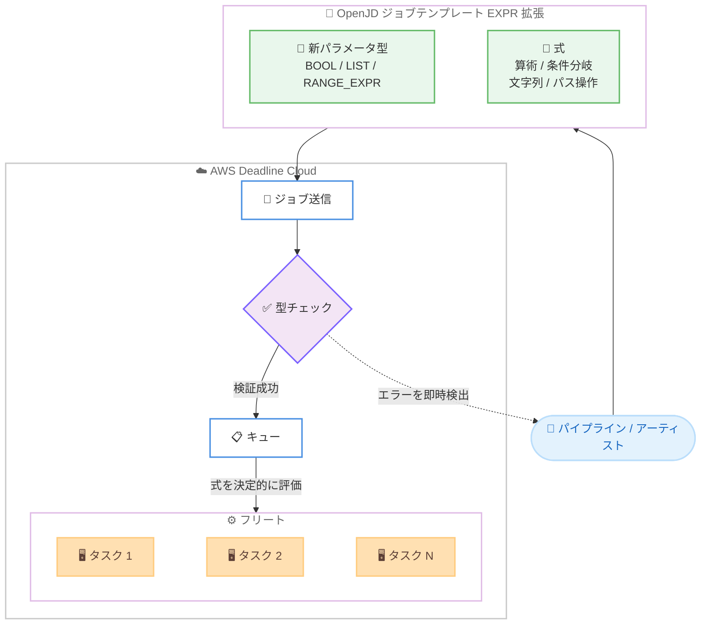

# AWS Deadline Cloud - ジョブテンプレートでの式 (Expression) サポート

**リリース日**: 2026 年 9 月 29 日
**サービス**: AWS Deadline Cloud
**機能**: ジョブテンプレートにおける式 (Open Job Description EXPR 拡張) のサポート

📊 [このアップデートのインフォグラフィックを見る](https://takech9203.github.io/aws-news-summary/20260929-aws-deadline-cloud-expressions-job-templates.html)

## 概要

AWS Deadline Cloud は、ジョブテンプレート内で柔軟な式 (Expression) と、より豊かなパラメータ型をサポートするようになりました。AWS Deadline Cloud は、視覚効果 (VFX)、アニメーション、プロダクトデザイン、シミュレーション、ゲームなどの計算負荷の高いワークロードを実行するためのマネージドサービスです。

今回のアップデートにより、ジョブテンプレート内で Python スタイルの構文を使用した算術演算、条件分岐、文字列やパスの操作、リスト内包表記などを記述できるようになりました。これにより、フレームレンジをタスクごとのフレームに分割する、シーン名から出力パスを導出する、オプションフラグをテンプレート内で切り替えるといった処理をテンプレート側で表現でき、既存のプロダクションパイプラインとの統合が容易になります。

この機能は、Deadline Cloud がジョブテンプレートに採用しているオープン仕様 Open Job Description (OpenJD) の新しい EXPR 拡張によって実現されています。式はジョブ送信時に型チェックされ、評価は決定的 (deterministic) であるため、ジョブは毎回予測可能に実行されます。

**アップデート前の課題**

- 以前のジョブテンプレートでは `{{Param.Name}}` のような単純な値の参照 (補間) しかできず、算術演算や条件分岐などのロジックを表現できなかった
- 出力パスの導出やフラグの切り替えなどの動的な処理は、テンプレートの外側にある送信ツールやカスタムスクリプトで実装する必要があった
- パラメータ型が STRING、INT、FLOAT、PATH に限られており、ブール値やリスト、フレームレンジといったパイプラインで一般的な表現を直接扱えなかった

**アップデート後の改善**

- Python スタイルの構文で算術演算、条件分岐、文字列・パス操作、リスト内包表記をテンプレート内に直接記述できるようになった
- BOOL、LIST、フレームレンジ (RANGE_EXPR / CHUNK) といった新しいパラメータ型により、パイプラインが扱う情報をそのままの形で表現できるようになった
- 式はジョブ送信時に型チェックされ、評価は決定的で副作用がないため、信頼性の高いジョブ実行が保証されるようになった

## アーキテクチャ図



式を含むジョブテンプレートは送信時に型チェックされ、エラーは実行前に検出されます。検証に成功したジョブはキューに入り、フリート上の各タスクで式が決定的に評価されます。

## サービスアップデートの詳細

### 主要機能

1. **Python スタイルの式サポート**
   - 算術演算 (`+ - * / // % **`)、比較演算、論理演算 (`and` / `or` / `not`) をサポート
   - 条件式 (`<値> if <条件> else <値>`)、リスト内包表記 (`[式 for 変数 in リスト if 条件]`) を記述可能
   - 文字列操作 (`split`、`join`、`replace`、`zfill` など)、正規表現 (`re_match`、`re_search` など)、パス結合 (`/` 演算子) の組み込み関数ライブラリを提供
   - テンプレート内の `{{ ... }}` 形式のフォーマット文字列の中で使用する

2. **新しいパラメータ型**
   - ジョブパラメータに BOOL、RANGE_EXPR、LIST (`LIST[STRING]`、`LIST[INT]`、`LIST[PATH]` など) 型を追加
   - タスクパラメータに CHUNK[INT] 型を追加し、フレームレンジを効率的に扱える
   - 例: チェックボックス型の BOOL パラメータで `--gpu` フラグとそれに対応するホスト要件を同時に切り替える、カメラのリストでステップのタスクレンジを定義する

3. **送信時の型チェックと決定的な評価**
   - 式はジョブ送信時に型チェックされ、エラーは実行前に fail-fast で検出される
   - 式の評価は決定的で副作用がなく、ファイルシステム・ネットワーク・環境変数へのアクセスは不可
   - メモリと演算回数に上限が設けられており、安全に評価される

4. **Open Job Description EXPR 拡張**
   - ジョブテンプレートの `extensions` リストに `EXPR` を追加することで有効化
   - OpenJD はスケジューリングシステム間で移植可能なジョブ定義を目指すオープン仕様であり、EXPR 拡張の仕様は公開されている

## 技術仕様

### 式言語の主な要素

| 項目 | 詳細 |
|------|------|
| 構文 | Python 式文法のサブセット (既存の Python パーサーを再利用可能) |
| 算術演算 | `+ - * / // % **`、int / float の混在は float に昇格 |
| 条件式 | `<真の値> if <条件> else <偽の値>` (条件は bool 型必須、truthiness なし) |
| リスト内包表記 | `[式 for 変数 in リスト if 条件]` (ネスト不可) |
| パス操作 | `/` でコンポーネント結合、`+` で末尾コンポーネントへ追記 |
| 関数ライブラリ | 数学 (`abs`、`min`、`max` など)、リスト (`range`、`sorted`、`unique` など)、文字列、正規表現、シェルエスケープ (`repr_sh` など)、`fail(message)` |
| 型システム | bool、int (64 ビット)、float、string、path、range_expr、list[T]、オプショナル (T?)、ユニオン |
| 型チェック | 送信時に実施。テンプレート解析時 → ジョブパラメータバインド時 → ワーカー実行時と段階的に検証 |
| 評価の制約 | 決定的・副作用なし、ファイルシステム / ネットワーク / 環境変数アクセス不可、メモリ・演算回数に上限 |

### 新しいパラメータ型

| パラメータ型 | 用途 |
|------|------|
| BOOL | ブール値。チェックボックスでのフラグ切り替えなど |
| RANGE_EXPR | フレームレンジ表現 (例: `1-100`) |
| LIST[T] | リスト型 (`LIST[STRING]`、`LIST[INT]`、`LIST[FLOAT]`、`LIST[PATH]`、`LIST[BOOL]` など) |
| CHUNK[INT] | タスクパラメータ用。フレームレンジを range_expr として効率的に受け取る |

### API 変更履歴

| 日付 | サービス | 変更内容 |
|------|----------|----------|
| 2026/09/29 | [deadline](https://awsapichanges.com/archive/changes/e9bb16-deadline.html) | 10 updated api methods - Open Job Description EXPR と Feature Bundle 1 ジョブテンプレートのサポート追加 (型付きジョブパラメータ、ジョブ / ステップ / パラメータ名の最大 512 文字対応)、サービスマネージドフリートでの Docker ソフトウェアアドオンのサポート |

### テンプレート記述例

```yaml
specificationVersion: jobtemplate-2023-09
extensions:
  - EXPR
name: "{{Param.SceneName}} Render"
parameterDefinitions:
  - name: SceneName
    type: STRING
  - name: OutputDir
    type: PATH
  - name: UseGpu
    type: BOOL
    default: false
  - name: Frames
    type: RANGE_EXPR
    default: "1-100"
steps:
  - name: Render
    parameterSpace:
      taskParameterDefinitions:
        - name: Frame
          type: INT
          range: "{{Param.Frames}}"
    script:
      actions:
        onRun:
          command: render
          args:
            - "--frame"
            - "{{Task.Param.Frame}}"
            - "--output"
            - "{{ Param.OutputDir / 'renders' / Param.SceneName }}"
            - "{{ '--gpu' if Param.UseGpu else null }}"
```

`extensions` に `EXPR` を追加すると、`{{ ... }}` 内で式を使用できます。条件式が `null` を返した引数はリストから自動的に除外されます。

## 設定方法

### 前提条件

1. AWS Deadline Cloud のファーム、キュー、フリートが構成済みであること
2. ジョブテンプレート (OpenJD、YAML または JSON 形式) の基本構造を理解していること
3. Deadline Cloud CLI または送信ツールが利用可能であること

### 手順

#### ステップ1: ジョブテンプレートで EXPR 拡張を有効化

```yaml
specificationVersion: jobtemplate-2023-09
extensions:
  - EXPR
```

ジョブテンプレートの `extensions` リストに `EXPR` を追加します。これにより、テンプレート内のフォーマット文字列で式を使用できるようになります。

#### ステップ2: 式と新しいパラメータ型を使用してテンプレートを記述

```yaml
parameterDefinitions:
  - name: Cameras
    type: LIST[STRING]
    default: ["main", "closeup"]
```

BOOL、LIST、RANGE_EXPR などの新しいパラメータ型でジョブパラメータを定義し、`{{ ... }}` 内に条件分岐やパス操作などの式を記述します。

#### ステップ3: ジョブを送信して検証

```bash
# Deadline Cloud CLI でジョブを送信
deadline bundle submit ./my-job-bundle
```

ジョブバンドルを Deadline Cloud に送信します。式は送信時に型チェックされるため、記述ミスがあればジョブ実行前にエラーとして検出されます。

## メリット

### ビジネス面

- **パイプライン統合の簡素化**: 出力パスの導出やフラグの切り替えなどのロジックをテンプレート内で完結でき、カスタム送信ツールの開発・保守コストを削減できる
- **運用の信頼性向上**: 送信時の型チェックと決定的な評価により、ジョブが実行時に失敗するリスクが減り、レンダリングファームの稼働効率が向上する
- **オープン仕様による移植性**: EXPR 拡張は Open Job Description のオープン仕様として公開されており、特定ベンダーへのロックインを抑えられる

### 技術面

- **表現力の高いテンプレート**: 算術演算、条件分岐、文字列・パス操作、リスト内包表記により、フレーム分割や動的なコマンドライン生成をテンプレートだけで表現できる
- **型安全性**: BOOL、LIST、CHUNK などの型付きパラメータと段階的な型チェックにより、エラーを早期に検出できる
- **安全な評価環境**: 式はファイルシステムやネットワークにアクセスできず、メモリと演算回数が制限されているため、安全に実行される

## デメリット・制約事項

### 制限事項

- 式の構文は Python のサブセットであり、Python と完全互換ではない (例: truthy の扱いが異なり、`0` や空文字列も true として評価される)
- ユーザー定義関数は使用できず、リスト内包表記のネストもできない
- 正規表現は Python と Rust regex の共通サブセットに制限され、後方参照や先読み / 後読みは使用できない
- 式からファイルシステム、ネットワーク、環境変数へのアクセスはできない

### 考慮すべき点

- EXPR 拡張を使用するテンプレートは、拡張に対応した OpenJD 実装 (Deadline Cloud および対応バージョンのツール) でのみ動作するため、既存ツールチェーンの対応状況を確認する必要がある
- 条件式の条件は bool 型である必要があり、Python の感覚で truthiness に依存した記述をするとエラーになる
- 評価にはメモリ (デフォルト約 100 MB) と演算回数 (デフォルト 1,000 万回) の上限があるため、極端に大きなリスト生成などは避ける

## ユースケース

### ユースケース1: フレームレンジの動的分割

**シナリオ**: アーティストが「1-100」のようなフレームレンジを 1 つのパラメータとして指定し、タスクごとに個別のフレームへ分割してレンダリングしたい。

**実装例**:
```yaml
parameterDefinitions:
  - name: Frames
    type: RANGE_EXPR
    default: "1-100"
steps:
  - name: Render
    parameterSpace:
      taskParameterDefinitions:
        - name: Frame
          type: INT
          range: "{{Param.Frames}}"
```

**効果**: 送信ツール側でフレーム分割ロジックを実装する必要がなくなり、テンプレートだけでタスクの並列化を定義できる。

### ユースケース2: GPU フラグとホスト要件の連動切り替え

**シナリオ**: チェックボックス 1 つで GPU レンダリングのオン / オフを切り替え、コマンドライン引数とホスト要件を同時に変更したい。

**実装例**:
```yaml
parameterDefinitions:
  - name: UseGpu
    type: BOOL
    default: false
steps:
  - name: Render
    script:
      actions:
        onRun:
          command: render
          args:
            - "{{ '--gpu' if Param.UseGpu else null }}"
```

**効果**: 条件が偽の場合は引数が自動的に除外されるため、GPU 用と CPU 用でテンプレートを分ける必要がなくなる。

### ユースケース3: シーン名からの出力パス導出

**シナリオ**: シーンファイル名に基づいて出力ディレクトリを自動的に構成し、命名規則をファーム全体で統一したい。

**実装例**:
```yaml
args:
  - "--output"
  - "{{ Param.OutputDir / 'renders' / Param.SceneName }}"
```

**効果**: パス結合演算子によりテンプレート内で出力パスを一貫して導出でき、パイプラインスクリプトでのパス組み立て処理が不要になる。

## 料金

この機能の利用に追加料金はありません。AWS Deadline Cloud の既存の料金体系 (ワーカーの稼働時間やライセンス使用量などに基づく従量課金) が適用されます。詳細は [AWS Deadline Cloud 料金ページ](https://aws.amazon.com/deadline-cloud/pricing/) を参照してください。

## 利用可能リージョン

AWS Deadline Cloud が利用可能なすべての AWS リージョンで利用できます。

## 関連サービス・機能

- **Open Job Description (OpenJD)**: Deadline Cloud のジョブテンプレートが準拠するオープン仕様。今回の EXPR 拡張は OpenJD の正式な拡張として公開されている
- **AWS Deadline Cloud フリート**: 式で切り替えられるホスト要件に基づき、サービスマネージドフリートまたはカスタマーマネージドフリートのワーカーにタスクが割り当てられる
- **Deadline Cloud CLI / ジョブバンドル**: 式を含むテンプレートはジョブバンドルとして送信でき、送信時に型チェックが行われる

## 参考リンク

- 📊 [インフォグラフィック](https://takech9203.github.io/aws-news-summary/20260929-aws-deadline-cloud-expressions-job-templates.html)
- [公式発表 (What's New)](https://aws.amazon.com/about-aws/whats-new/2026/08/aws-deadline-cloud-expressions-job-templates/)
- [AWS Deadline Cloud 開発者ガイド](https://docs.aws.amazon.com/deadline-cloud/latest/developerguide/what-is-deadline-cloud.html)
- [Open Job Description Expression Language 仕様](https://github.com/OpenJobDescription/openjd-specifications/wiki/2026-02-Expression-Language)
- [料金ページ](https://aws.amazon.com/deadline-cloud/pricing/)

## まとめ

AWS Deadline Cloud のジョブテンプレートが Open Job Description の EXPR 拡張に対応し、Python スタイルの式と BOOL / LIST / フレームレンジなどの新しいパラメータ型を利用できるようになりました。これまで送信ツール側のカスタムコードで実装していた動的なロジックをテンプレート内で完結でき、送信時の型チェックにより信頼性も向上します。レンダリングパイプラインを運用しているチームは、既存のジョブテンプレートへの EXPR 拡張の適用と、カスタム送信ロジックのテンプレートへの移行を検討することを推奨します。
