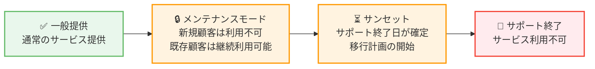

# AWS - サービス提供状況の更新 (メンテナンスモード移行・サンセット・サポート終了)

**リリース日**: 2026 年 9 月 29 日
**サービス**: AWS 全般 (複数サービスのライフサイクル変更)
**機能**: サービス提供状況 (Service Availability) の更新

📊 [このアップデートのインフォグラフィックを見る](https://takech9203.github.io/aws-news-summary/20260929-aws-service-availability.html)

## 概要

AWS は、複数のサービスおよび機能の提供状況の変更を発表しました。今回の発表は、「メンテナンスモードへの移行」「サンセット (段階的終了) の開始」「サポート終了」の 3 つのカテゴリで構成されています。

メンテナンスモードに移行するサービスは、2026 年 10 月 29 日以降、新規のお客様は利用できなくなります。既存のお客様は引き続き利用可能で、AWS はこれらのサービスの運用とサポートを継続します。サンセットに入るサービスについては、運用とサポートを終了する日付が発表されており、対象サービスを利用中のお客様は、各サービスの製品ページとドキュメントで推奨される代替サービスへの移行計画を開始する必要があります。また、Amazon Mechanical Turk は 2026 年 9 月 29 日をもってサポートを終了し、利用できなくなりました。

このような複数サービスのライフサイクル変更を一括で発表する形式は、Solutions Architect にとって重要な情報源です。担当するワークロードで対象サービスを利用している場合、影響の確認と移行計画の策定が必要になります。

**発表のポイント**

- メンテナンスモード移行: 2026 年 10 月 29 日以降、新規顧客は対象サービスを利用不可 (既存顧客は継続利用可能)
- サンセット開始: 対象サービスごとにサポート終了日が確定し、移行計画の開始が推奨される
- サポート終了: Amazon Mechanical Turk は 2026 年 9 月 29 日時点で利用終了

## サービスライフサイクルの流れ

AWS サービスのライフサイクルは、一般提供からメンテナンスモード、サンセットを経てサポート終了に至ります。今回の発表では、各段階に該当するサービスがそれぞれ示されました。

## サービスアップデートの詳細

### 1. メンテナンスモードに移行するサービス

2026 年 10 月 29 日以降、新規のお客様は利用できなくなります。既存のお客様は引き続き利用可能で、AWS は運用とサポートを継続します。各サービスの製品ページとドキュメントで変更内容を確認することが推奨されています。

- **Amazon Chime SDK SIP Media Application**: 電話番号や SIP インフラストラクチャと音声アプリケーションを接続する機能
- **Amazon WorkSpaces Secure Browser**: マネージド型のセキュアブラウザサービス

### 2. サンセットに入るサービス

以下のサービスは段階的終了 (サンセット) に入り、運用とサポートを終了する日付が発表されました。利用中のお客様は、各サービスのウェブページとドキュメントで推奨される代替サービスを確認し、移行計画を開始する必要があります。

- **Amazon Managed Blockchain**: サポート終了日 2027 年 9 月 29 日
- **Amazon DevOps Guru**: サポート終了日 2027 年 9 月 30 日
- **AWS Backint Agent for SAP ASE**: サポート終了日 2027 年 9 月 29 日
- **AWS Infrastructure Composer**: スタンドアロンコンソールのサポート終了日 2026 年 12 月 7 日

### 3. サポートが終了したサービス

- **Amazon Mechanical Turk**: 2026 年 9 月 29 日をもってサポートを終了し、利用できなくなりました

## 技術仕様

### 対象サービスとスケジュール一覧

| サービス / 機能 | ライフサイクル段階 | 重要日程 |
|------|------|------|
| Amazon Chime SDK SIP Media Application | メンテナンスモード | 2026 年 10 月 29 日以降、新規顧客は利用不可 |
| Amazon WorkSpaces Secure Browser | メンテナンスモード | 2026 年 10 月 29 日以降、新規顧客は利用不可 |
| Amazon Managed Blockchain | サンセット | サポート終了: 2027 年 9 月 29 日 |
| Amazon DevOps Guru | サンセット | サポート終了: 2027 年 9 月 30 日 |
| AWS Backint Agent for SAP ASE | サンセット | サポート終了: 2027 年 9 月 29 日 |
| AWS Infrastructure Composer | サンセット | スタンドアロンコンソールのサポート終了: 2026 年 12 月 7 日 |
| Amazon Mechanical Turk | サポート終了 | 2026 年 9 月 29 日をもって利用不可 |

### ライフサイクル段階の定義

| 段階 | 新規顧客 | 既存顧客 | AWS のサポート |
|------|------|------|------|
| メンテナンスモード | 利用不可 | 継続利用可能 | 運用・サポートを継続 |
| サンセット | - | 終了日まで利用可能 | 終了日をもって運用・サポートを終了 |
| サポート終了 | 利用不可 | 利用不可 | 終了済み |

## 推奨される対応

### 前提条件

1. AWS アカウントで対象サービスの利用状況を確認できること
2. 各サービスの製品ページとドキュメントにアクセスできること

### 手順

#### ステップ 1: 対象サービスの利用状況を確認

担当するアカウントやワークロードで、今回発表された対象サービスを利用しているかどうかを確認します。マネジメントコンソール、AWS Cost Explorer、AWS Config などを活用して、利用中のサービスを棚卸しします。

#### ステップ 2: 影響度の評価

- **メンテナンスモード対象サービスを利用中の場合**: 既存の利用は継続可能ですが、新規アカウントや新規プロジェクトでの採用はできなくなるため、将来の拡張計画への影響を評価します
- **サンセット対象サービスを利用中の場合**: サポート終了日から逆算して移行スケジュールを策定します。特に AWS Infrastructure Composer のスタンドアロンコンソールは 2026 年 12 月 7 日と期限が近いため、優先的な対応が必要です

#### ステップ 3: 移行計画の策定と実行

各サービスの製品ページとドキュメントに記載されている移行ガイドと推奨される代替サービスを確認し、移行計画を策定します。AWS は包括的な移行ガイドを用意しており、サポートチームも移行を支援するとしています。

#### ステップ 4: 今後の更新の購読

[AWS Product Lifecycle ページ](https://docs.aws.amazon.com/general/latest/gr/service-lifecycle.html) を確認し、RSS フィードを購読することで、今後のライフサイクル変更を継続的に把握できます。

## 影響とポイント

### ビジネス面

- **計画的な移行が可能**: サンセット対象サービスはサポート終了日が 1 年前後先に設定されており、計画的な移行の時間が確保されている
- **既存ワークロードの継続性**: メンテナンスモード対象サービスは既存顧客の利用とサポートが継続されるため、即座の対応は不要
- **移行支援の提供**: AWS は移行ガイドを用意し、サポートチームによる移行支援を提供

### 技術面

- **アーキテクチャレビューの契機**: 対象サービスに依存するアーキテクチャを見直し、代替サービスへの移行を通じてモダナイゼーションを進める機会となる
- **新規設計への影響**: メンテナンスモード対象サービスは新規顧客が利用できなくなるため、今後の新規設計では採用候補から除外する必要がある

## デメリット・制約事項

### 制限事項

- メンテナンスモード対象サービスは、2026 年 10 月 29 日以降、新規のお客様は利用開始できない
- サンセット対象サービスは、サポート終了日以降は運用とサポートが終了する
- Amazon Mechanical Turk はすでに利用できない

### 考慮すべき点

- 対象サービスを利用しているワークロードは、移行先の選定と移行作業の工数を見込む必要がある
- 移行先の代替サービスは各サービスの製品ページとドキュメントで案内されているため、必ず一次情報を確認する
- マルチアカウント環境では、組織全体での利用状況の棚卸しが必要

## 利用可能リージョン

本発表はサービスのライフサイクル変更に関するものであり、対象サービスが提供されている全リージョンに適用されます。

## 関連サービス・機能

- **AWS Product Lifecycle ページ**: AWS サービスのライフサイクル (メンテナンスモード、サンセット、サポート終了) の情報を一元的に確認できるページ
- **AWS Health Dashboard**: アカウントに影響するサービス変更の通知を確認できる
- **AWS Config / AWS Cost Explorer**: 対象サービスの利用状況の棚卸しに活用できる

## 参考リンク

- 📊 [インフォグラフィック](https://takech9203.github.io/aws-news-summary/20260929-aws-service-availability.html)
- [公式発表 (What's New)](https://aws.amazon.com/about-aws/whats-new/2026/09/aws-service-availability/)
- [AWS Product Lifecycle ページ](https://docs.aws.amazon.com/general/latest/gr/service-lifecycle.html)

## まとめ

AWS は複数のサービスについて、メンテナンスモードへの移行、サンセットの開始、サポート終了を一括で発表しました。特に Amazon Managed Blockchain、Amazon DevOps Guru、AWS Backint Agent for SAP ASE は 2027 年 9 月にサポートが終了し、AWS Infrastructure Composer のスタンドアロンコンソールは 2026 年 12 月 7 日に終了するため、対象サービスを利用中の場合は早期に利用状況を棚卸しし、各サービスの移行ガイドに沿って移行計画を策定することを推奨します。
