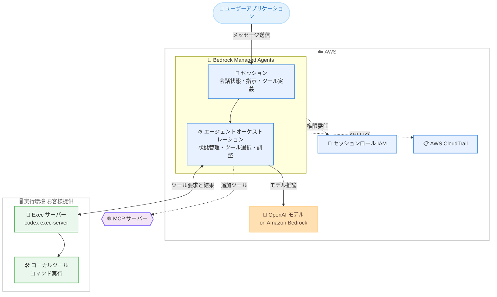

# Amazon Bedrock - Bedrock Managed Agents (powered by OpenAI) プレビュー提供開始

**リリース日**: 2026 年 9 月 29 日
**サービス**: Amazon Bedrock
**機能**: Amazon Bedrock Managed Agents, powered by OpenAI (プレビュー)

📊 [このアップデートのインフォグラフィックを見る](https://takech9203.github.io/aws-news-summary/20260929-bedrock-managed-agents-preview.html)

## 概要

AWS と OpenAI が共同開発した Bedrock Managed Agents (BMA) がプレビューとして発表されました。BMA は OpenAI の Agents API をカスタマイズし、AWS ネイティブに再設計したマネージドエージェントサービスで、OpenAI モデルに最適化されたエージェントを完全に AWS 内で実行できます。既存の ID、権限、ガバナンス管理をそのまま活用できる点が特徴です。

ユーザーはセッションを作成し、指示 (instructions) と実行環境を用意してメッセージを送信するだけで、エージェントの会話管理とモデルとのやり取りはサービス側が担います。ツールはユーザーが用意したコンピューティング環境内で実行されるため、コードベースの調査、ドキュメント処理、ファイル生成など、複数ステップにわたるタスクに適しています。

対象ユーザーは、OpenAI モデルを使ったエージェントアプリケーションを AWS のセキュリティ・ガバナンス基盤の上で構築したい開発者やエンタープライズです。

**アップデート前の課題**

- 以前は OpenAI のエージェント機能を利用する場合、AWS 外部のサービスを利用する必要があり、AWS の IAM や CloudTrail によるガバナンスを一貫して適用できなかった
- 以前はエージェントの状態管理 (会話履歴、ツール呼び出し、中間結果) を自前で実装・保持する必要があった
- 以前はツール実行環境とモデルオーケストレーションの連携を独自に構築する必要があった

**アップデート後の改善**

- 今回のアップデートにより、OpenAI モデルに最適化されたエージェントを完全に AWS 内で実行し、既存の IAM 権限やガバナンス管理を適用できるようになった
- 永続的なセッション (durable sessions) がメッセージ、ツール呼び出し、中間結果を保持するため、後から情報を追加して作業を再開できるようになった
- 再利用可能なスキルや MCP サーバー経由のツール接続により、エージェントの機能拡張が容易になった
- エージェントごとの IAM ロール、重要なアクション前の人間による承認 (human approval)、CloudTrail によるログ記録でセキュリティとガバナンスを確保できるようになった

## アーキテクチャ図



アプリケーションが BMA にメッセージを送信すると、BMA が Amazon Bedrock 上の OpenAI モデルを呼び出し、お客様が用意した実行環境 (Exec サーバー) との間でツール要求と結果を交換します。

## サービスアップデートの詳細

### 主要機能

1. **エージェントオーケストレーション**
   - モデルによる状態保持、ツールの選択と呼び出し、コード実行、複数ステップ作業の調整を BMA が管理
   - OpenAI の Agents API をベースに AWS ネイティブに再設計され、AWS リソースと統合
   - ユーザーはセッションの作成、指示と実行環境の提供、メッセージの送信に集中できる

2. **永続的なセッション (Durable Sessions)**
   - メッセージ、ツール呼び出し、中間結果をセッション内に保持
   - 後からセッションに戻り、新しい情報を追加して作業を再開可能
   - セッションはモデル、指示、ツール、IAM ロール、実行環境を指定するステートフルな会話単位

3. **再利用可能なスキルとツール接続**
   - スキルにより特定の手順をエージェントに再利用可能な形で追加できる
   - Model Context Protocol (MCP) サーバー経由で追加ツールをエージェントに提供可能

4. **実行環境の選択肢**
   - **セルフホスト型**: 既存の開発マシン、コンテナ、コンピューティング環境を利用。ホスト、ワークスペース、ネットワークアクセス、Exec サーバーの稼働をユーザーが用意
   - **Amazon Bedrock AgentCore Runtime**: Exec サーバーとアダプターを含む AgentCore Runtime を利用し、マネージドなランタイムセッションと設定可能なストレージを AWS アカウント内で利用

5. **セキュリティとガバナンス**
   - エージェントごとに専用の IAM ロール (セッションロール) を割り当て
   - 重要なアクションの実行前に人間による承認をサポート
   - サポート対象の API アクティビティを AWS CloudTrail に記録

## 技術仕様

### 主要コンポーネント

| コンポーネント | 説明 |
|------|------|
| セッション | エージェントとのステートフルな会話。モデル、指示、ツール、IAM ロール、実行環境を指定 |
| ターン | 送信されたメッセージに応じて実行される作業単位。推論、ツール呼び出し、出力生成を含む |
| 実行環境 | コマンドとローカルツールが実行されるお客様提供のコンピューティング環境 |
| Exec サーバー | 実行環境と BMA を接続する `codex exec-server` プロセス。サービスへアウトバウンド接続する |
| アイテムとイベント | アイテムは永続的な会話出力を保持。イベントストリームは作業の進行状況を報告 |
| セッションロール | BMA がユーザーに代わって引き受ける IAM ロール。モデル推論や AgentCore Runtime の起動に使用 |

### リージョンエンドポイント

プレビューでは `bedrock-mantle` エンドポイントを使用します。署名サービス名も `bedrock-mantle` です。

| AWS リージョン | リージョンコード | エンドポイント |
|------|------|------|
| 米国東部 (バージニア北部) | `us-east-1` | `https://bedrock-mantle.us-east-1.api.aws` |
| 米国西部 (オレゴン) | `us-west-2` | `https://bedrock-mantle.us-west-2.api.aws` |
| 米国東部 (オハイオ) | `us-east-2` | `https://bedrock-mantle.us-east-2.api.aws` |

- セッション操作は `/openai/v1/agents/sessions` パスを使用
- モデル検出は `/v1/models` を使用
- モデルの利用可否はリージョンとアカウントによって異なる場合がある

### API 変更履歴

| 日付 | サービス | 変更内容 |
|------|----------|----------|
| 2026/09/29 | [bedrock-agent-runtime](https://awsapichanges.com/archive/changes/e9bb16-bedrock-agent-runtime.html) | 1 updated api methods - Amazon Bedrock Agentic Retrieve が新しい MantleFoundationModel 設定 (オプションの projectId 付き) により Bedrock Mantle (OpenAI Responses) エンドポイントをサポート |

## 設定方法

### 前提条件

1. AWS アカウントと、プレビュー提供リージョン (us-east-1、us-west-2、us-east-2) へのアクセス
2. BMA がモデル推論などの操作のために引き受けるセッションロール (IAM ロール) の設定
3. 実行環境の用意 (セルフホスト型のホスト、または Amazon Bedrock AgentCore Runtime)

### 手順

#### ステップ 1: 権限と前提条件の設定

公式ドキュメントの「Set up permissions and prerequisites」に従い、セッションロールと必要な IAM 権限を設定します。公式のサンプルバンドルには、セルフホスト型と AgentCore Runtime の両方の CDK アプリケーションが含まれています。セルフホスト型の CDK アプリケーションは IAM ロールを作成し (ホストは作成しません)、AgentCore 用の CDK アプリケーションは Runtime、ストレージ、ネットワークを作成します。

#### ステップ 2: 実行環境の起動

セルフホスト型の場合、ホスト上で Exec サーバー (`codex exec-server` プロセス) を起動します。Exec サーバーはサービスへのアウトバウンド接続を確立し、実行環境と BMA を接続します。AgentCore Runtime を使用する場合は、Exec サーバーとアダプターを含む Runtime をデプロイします。

#### ステップ 3: セッションの作成とメッセージの送信

`https://bedrock-mantle.{region}.api.aws` エンドポイントの `/openai/v1/agents/sessions` パスに対して、モデル、指示、ツール、IAM ロール、実行環境を指定してセッションを作成し、メッセージを送信します。イベントストリームで進行状況を確認し、アイテムとして永続化された会話出力を取得します。必要に応じてスキルや MCP サーバーを追加します。

## メリット

### ビジネス面

- **ガバナンスの一貫性**: 既存の ID、権限、ガバナンス管理をそのまま適用でき、エンタープライズのコンプライアンス要件を満たしやすい
- **プレビュー期間中の追加料金なし**: BMA 自体の追加料金はなく、エージェントが消費する AWS リソース (モデル推論など) の料金のみで試用できる
- **開発工数の削減**: エージェントの状態管理やオーケストレーションの自前実装が不要になり、アプリケーションロジックに集中できる

### 技術面

- **AWS ネイティブな OpenAI Agents API**: OpenAI の Agents API をカスタマイズした AWS ネイティブ実装で、AWS リソースと統合されている
- **永続的なセッション管理**: メッセージ、ツール呼び出し、中間結果が保持され、中断と再開が可能
- **柔軟な実行環境**: セルフホスト型と AgentCore Runtime から選択でき、ツールはお客様管理の環境内で実行されるため制御性が高い
- **MCP 対応**: MCP サーバー経由で既存のツールエコシステムをエージェントに接続可能

## デメリット・制約事項

### 制限事項

- プレビュー段階であり、機能と API は変更される可能性がある (公式ドキュメントのプレビュー制限事項の確認が必要)
- 提供リージョンは米国東部 (バージニア北部)、米国西部 (オレゴン)、米国東部 (オハイオ) の 3 リージョンのみ
- モデルの利用可否はリージョンとアカウントによって異なる場合がある

### 考慮すべき点

- 料金は一般提供 (GA) 時に変更される可能性がある
- 実行環境 (ホストやネットワーク) はお客様側で用意・管理する必要がある
- AgentCore Runtime のサンプルは NAT ゲートウェイを含むストレージ・ネットワークリソースを作成するため、BMA のターンが実行されていない間も課金が継続する可能性がある
- BMA セッションを削除しても、S3 バケットや自前ホスト上のファイルは削除されない (ライフサイクルが別管理)

## ユースケース

### ユースケース 1: コードベースの調査と修正

**シナリオ**: 大規模なコードベースに対して、バグの原因調査や修正案の作成を複数ステップで実行したい

**実装例**:
```text
1. 開発マシンまたはコンテナ上で codex exec-server を起動 (セルフホスト型)
2. コードベースをワークスペースとして指定してセッションを作成
3. 「このリポジトリの認証処理のバグを調査して修正案を提示して」とメッセージを送信
4. エージェントがツール呼び出しでコードを読み取り、推論と修正案生成を実行
```

**効果**: 複数ステップの調査・分析作業を永続的なセッション内で実行でき、途中で追加情報を与えて作業を継続できる

### ユースケース 2: ドキュメント処理とファイル生成

**シナリオ**: 大量のドキュメントを処理し、要約レポートや変換済みファイルを生成したい

**実装例**:
```text
1. AgentCore Runtime に Exec サーバーを含む実行環境をデプロイ
2. ドキュメント処理用のスキル (再利用可能な手順) をセッションに追加
3. 処理対象ドキュメントを指定してメッセージを送信
4. エージェントが実行環境内でファイルを生成し、S3 などに保存
```

**効果**: マネージドなランタイムで処理を実行でき、生成ファイルは BMA セッションとは独立して自アカウントのストレージに保持される

### ユースケース 3: ガバナンス要件の厳しいエンタープライズでのエージェント導入

**シナリオ**: 金融機関などで、監査ログと人間による承認を必須としたエージェントを導入したい

**実装例**:
```text
1. エージェント専用の IAM ロール (セッションロール) を最小権限で定義
2. 重要なアクション実行前の人間による承認を設定
3. CloudTrail で BMA の API アクティビティを記録し、監査基盤と統合
```

**効果**: 既存の AWS ガバナンス基盤 (IAM、CloudTrail) をそのまま適用し、統制の取れたエージェント運用が可能になる

## 料金

プレビュー期間中、BMA 自体の追加料金はありません。エージェントが消費する AWS リソースに対してのみ課金されます。

- モデル推論: [Amazon Bedrock の料金](https://aws.amazon.com/bedrock/pricing/)に基づく
- AgentCore Runtime を使用する場合: [Amazon Bedrock AgentCore の料金](https://aws.amazon.com/bedrock/agentcore/pricing/)に基づく
- AgentCore のサンプル構成は NAT ゲートウェイなどのネットワーク・ストレージリソースを作成するため、エージェント非稼働時にも課金が発生する可能性がある

**注意**: 料金は一般提供 (GA) 時に変更される可能性があります。

## 利用可能リージョン

プレビューは以下のリージョンで利用可能です。

- 米国東部 (バージニア北部) - us-east-1
- 米国西部 (オレゴン) - us-west-2
- 米国東部 (オハイオ) - us-east-2

## 関連サービス・機能

- **Amazon Bedrock**: BMA のモデル推論基盤。OpenAI モデルを Bedrock 上で呼び出す
- **Amazon Bedrock AgentCore Runtime**: BMA の実行環境オプションの 1 つ。マネージドなランタイムセッションとストレージを提供
- **AWS IAM**: エージェントごとのセッションロールによる権限管理
- **AWS CloudTrail**: BMA の API アクティビティのログ記録
- **Model Context Protocol (MCP)**: エージェントに追加ツールを提供するためのプロトコル

## 参考リンク

- 📊 [インフォグラフィック](https://takech9203.github.io/aws-news-summary/20260929-bedrock-managed-agents-preview.html)
- [公式発表 (What's New)](https://aws.amazon.com/about-aws/whats-new/2026/09/bedrock-managed-agents-preview/)
- [ドキュメント: Amazon Bedrock Managed Agents, powered by OpenAI (preview)](https://docs.aws.amazon.com/bedrock/latest/userguide/bedrock-managed-agents-openai.html)
- [料金ページ: Amazon Bedrock](https://aws.amazon.com/bedrock/pricing/)
- [料金ページ: Amazon Bedrock AgentCore](https://aws.amazon.com/bedrock/agentcore/pricing/)

## まとめ

AWS と OpenAI の共同開発による Bedrock Managed Agents は、OpenAI の Agents API を AWS ネイティブに提供する大きなマイルストーンです。永続的なセッション、MCP 対応のツール接続、IAM と CloudTrail によるガバナンスを備えたマネージドエージェントを、プレビュー期間中は追加料金なしで試用できます。OpenAI モデルを活用したエージェント構築を検討しているチームは、米国リージョンでの検証とプレビュー制限事項の確認から始めることを推奨します。
