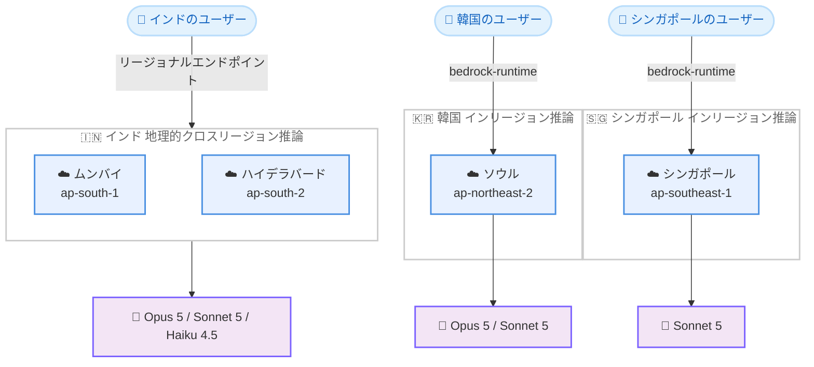

# Amazon Bedrock - Claude モデルのインド、韓国、シンガポールへの提供拡大

**リリース日**: 2026 年 9 月 29 日
**サービス**: Amazon Bedrock
**機能**: Claude モデルのリージョン提供拡大 (インド、韓国、シンガポール)

📊 [このアップデートのインフォグラフィックを見る](https://takech9203.github.io/aws-news-summary/20260929-claude-region-expansion-in-sk.html)

## 概要

Amazon Bedrock は、Anthropic の Claude モデルの提供リージョンをインド、韓国、シンガポールに拡大したことを発表しました。インドでは Claude Opus 5、Claude Sonnet 5、Claude Haiku 4.5 の 3 モデル、韓国では Claude Opus 5 と Claude Sonnet 5 の 2 モデル、シンガポールでは Claude Sonnet 5 が利用可能になります。

今回の拡大は、金融サービス、ヘルスケア、公共部門など、データレジデンシー (データ所在地) 要件を持つお客様を主な対象としています。推論リクエストとデータが呼び出し先のリージョン内で処理されるため、国内でのデータ処理が求められるワークロードでも、最新の Claude モデルを大規模に活用できるようになります。

インドでは、ムンバイリージョンとハイデラバードリージョンにまたがる地理的クロスリージョン推論によってリージョナルエンドポイントが提供され、データ処理をインド国内のリージョンに保ちながら推論を実行できます。韓国とシンガポールでは、各リージョンの bedrock-runtime エンドポイントを通じたインリージョン推論が提供されます。

**アップデート前の課題**

今回のアップデート以前には、以下の課題がありました。

- インド、韓国、シンガポールのリージョンでは最新の Claude モデル (Opus 5、Sonnet 5、Haiku 4.5) を利用できず、他リージョンのエンドポイントやグローバルクロスリージョン推論に依存する必要があった
- 金融、医療、公共部門など国内でのデータ処理が義務付けられるワークロードでは、推論データが国外のリージョンで処理される可能性があるため、最新モデルの採用が困難だった
- 国外エンドポイントの利用はネットワークレイテンシーの面でも不利になる場合があった

**アップデート後の改善**

今回のアップデートにより、以下が可能になりました。

- インドのお客様は、ムンバイとハイデラバードにまたがる地理的クロスリージョン推論により、データ処理をインド国内に保ったまま Claude Opus 5、Claude Sonnet 5、Claude Haiku 4.5 を利用できる
- 韓国のお客様は、ソウルリージョン (ap-northeast-2) の bedrock-runtime エンドポイントで Claude Opus 5 と Claude Sonnet 5 のインリージョン推論を利用できる
- シンガポールのお客様は、シンガポールリージョン (ap-southeast-1) の bedrock-runtime エンドポイントで Claude Sonnet 5 のインリージョン推論を利用できる
- データレジデンシー要件を満たしながら、ユーザーに近い場所で低レイテンシーな推論を実行できる

## アーキテクチャ図



各国のユーザーが自国内のエンドポイントを通じて Claude モデルの推論を実行する構成を示しています。インドはムンバイとハイデラバードにまたがる地理的クロスリージョン推論、韓国とシンガポールは単一リージョン内でのインリージョン推論です。

## サービスアップデートの詳細

### 主要機能

1. **インドでの Claude モデル提供 (地理的クロスリージョン推論)**
   - Claude Opus 5、Claude Sonnet 5、Claude Haiku 4.5 の 3 モデルが利用可能
   - ムンバイリージョンとハイデラバードリージョンにまたがる地理的クロスリージョン推論でリージョナルエンドポイントを提供
   - データ処理をインド国内のリージョンに保つことが可能
   - 従来どおりグローバルクロスリージョン推論も引き続き利用可能

2. **韓国での Claude モデル提供 (インリージョン推論)**
   - Claude Opus 5 と Claude Sonnet 5 の 2 モデルが利用可能
   - ソウルリージョン (ap-northeast-2) の bedrock-runtime エンドポイントを通じて提供
   - 推論リクエストとデータは呼び出したリージョン内で処理される

3. **シンガポールでの Claude モデル提供 (インリージョン推論)**
   - Claude Sonnet 5 が利用可能
   - シンガポールリージョン (ap-southeast-1) の bedrock-runtime エンドポイントを通じて提供
   - 推論処理はリージョン内で完結する

## 技術仕様

### 提供モデルとリージョンの対応

| 国 | 提供モデル | 推論方式 | エンドポイント |
|------|------|------|------|
| インド | Claude Opus 5、Claude Sonnet 5、Claude Haiku 4.5 | 地理的クロスリージョン推論 | ムンバイとハイデラバードにまたがるリージョナルエンドポイント |
| 韓国 | Claude Opus 5、Claude Sonnet 5 | インリージョン推論 | ap-northeast-2 の bedrock-runtime |
| シンガポール | Claude Sonnet 5 | インリージョン推論 | ap-southeast-1 の bedrock-runtime |

### データ処理の考え方

| 項目 | 詳細 |
|------|------|
| インリージョン推論 | Amazon Bedrock は呼び出したリージョン内で推論リクエストとデータを処理する |
| 地理的クロスリージョン推論 | 同一地理圏内の複数リージョン (インドの場合はムンバイとハイデラバード) に推論を分散し、データ処理を国内に保つ |
| グローバルクロスリージョン推論 | 従来どおり利用可能で、グローバルなキャパシティを活用できる |

## 設定方法

### 前提条件

1. AWS アカウントを保有していること
2. 対象リージョン (ap-south-1、ap-northeast-2、ap-southeast-1 など) で Amazon Bedrock の対象モデルへのアクセスが有効化されていること
3. Amazon Bedrock の呼び出しに必要な IAM 権限 (bedrock:InvokeModel など) が付与されていること

### 手順

#### ステップ1: モデルアクセスの有効化

```bash
# 利用可能な Claude モデルの確認 (例: ソウルリージョン)
aws bedrock list-foundation-models \
  --region ap-northeast-2 \
  --by-provider anthropic \
  --query "modelSummaries[].modelId"
```

対象リージョンで利用可能な Anthropic モデルの一覧を取得し、モデル ID を確認します。モデルアクセスはマネジメントコンソールの [Model access] からも有効化できます。

#### ステップ2: インリージョン推論の実行

```bash
# ソウルリージョンの bedrock-runtime エンドポイントで推論を実行する例
aws bedrock-runtime converse \
  --region ap-northeast-2 \
  --model-id <Claude Sonnet 5 のモデル ID> \
  --messages '[{"role":"user","content":[{"text":"こんにちは"}]}]'
```

ソウルリージョンの bedrock-runtime エンドポイントに対して Converse API で推論リクエストを送信します。推論リクエストとデータは呼び出したリージョン内で処理されます。

#### ステップ3: インドでの地理的クロスリージョン推論の利用

インドのお客様は、ムンバイとハイデラバードにまたがるリージョナルエンドポイント (地理的クロスリージョン推論プロファイル) を指定して推論を実行します。利用可能な推論プロファイルは以下のコマンドで確認できます。

```bash
# インドリージョンで利用可能な推論プロファイルの確認
aws bedrock list-inference-profiles \
  --region ap-south-1 \
  --query "inferenceProfileSummaries[].inferenceProfileId"
```

リージョナル推論プロファイルの ID を確認し、モデル ID の代わりに指定することで、データ処理をインド国内に保ったまま推論を実行できます。

## メリット

### ビジネス面

- **データレジデンシー要件への対応**: 金融サービス、ヘルスケア、公共部門など、国内でのデータ処理が求められる業界でも最新の Claude モデルを採用できる
- **コンプライアンス負担の軽減**: 推論データが国外に出ないことを前提としたアーキテクチャを構築でき、規制対応の説明が容易になる
- **アジア太平洋地域での AI 活用の加速**: インド、韓国、シンガポールのお客様が最新の生成 AI モデルをスケールして利用できる

### 技術面

- **低レイテンシー**: ユーザーに近いリージョンで推論を実行することで、ネットワークレイテンシーを削減できる
- **柔軟な推論方式の選択**: インリージョン推論、地理的クロスリージョン推論、グローバルクロスリージョン推論を要件に応じて使い分けられる
- **既存 API との互換性**: bedrock-runtime の既存 API (Converse、InvokeModel) をそのまま利用でき、リージョン指定の変更のみで移行できる

## デメリット・制約事項

### 制限事項

- 提供モデルは国ごとに異なる (シンガポールは Sonnet 5 のみ、韓国は Opus 5 と Sonnet 5 のみで、Haiku 4.5 の 3 モデルすべてが揃うのはインドのみ)
- インドはインリージョン推論ではなく、ムンバイとハイデラバードにまたがる地理的クロスリージョン推論での提供となる

### 考慮すべき点

- 最新のリージョン別モデル提供状況は、Amazon Bedrock ユーザーガイドの「Regional availability by models」ページで確認が必要
- リージョンや推論方式によって料金が異なる場合があるため、料金ページでの確認が必要
- クロスリージョン推論を利用する場合は、推論プロファイル ID の指定方法や IAM ポリシーの設定を確認する必要がある

## ユースケース

### ユースケース1: インドの金融機関における生成 AI アシスタント

**シナリオ**: インドの銀行が、顧客データを国外に出さずに生成 AI による業務支援アシスタントを構築したい。

**実装例**:
```
1. ap-south-1 で Claude Sonnet 5 のモデルアクセスを有効化
2. インドの地理的クロスリージョン推論プロファイルを指定して Converse API を呼び出し
3. データ処理はムンバイとハイデラバードのインド国内リージョンで完結
```

**効果**: データレジデンシー規制を満たしながら、最新モデルによる高品質な応答と高いスループットを両立できる。

### ユースケース2: 韓国の公共部門における文書処理

**シナリオ**: 韓国の公共機関が、行政文書の要約・分類に生成 AI を活用したいが、データを国内で処理する必要がある。

**実装例**:
```
1. ap-northeast-2 (ソウル) で Claude Opus 5 のモデルアクセスを有効化
2. ソウルリージョンの bedrock-runtime エンドポイントで InvokeModel / Converse を実行
3. 推論データはソウルリージョン内で処理される
```

**効果**: 国内でのデータ処理要件を満たしつつ、高度な推論能力を持つ Opus 5 で複雑な文書処理を自動化できる。

### ユースケース3: シンガポールのヘルスケア企業におけるチャットボット

**シナリオ**: シンガポールのヘルスケア企業が、患者向け問い合わせチャットボットを低レイテンシーかつ国内データ処理で提供したい。

**実装例**:
```
1. ap-southeast-1 で Claude Sonnet 5 のモデルアクセスを有効化
2. シンガポールリージョンの bedrock-runtime エンドポイントからインリージョン推論を実行
3. アプリケーションも同一リージョンに配置してレイテンシーを最小化
```

**効果**: 医療データをシンガポール国内で処理しながら、ユーザーに近いリージョンでの低レイテンシーな応答を実現できる。

## 料金

今回の発表には具体的な料金情報は含まれていません。Amazon Bedrock の料金は、モデルおよびリージョンごとの入出力トークン数に基づく従量課金です。対象リージョンでの Claude モデルの料金は、Amazon Bedrock の料金ページで確認してください。

## 利用可能リージョン

- **インド**: ムンバイ (ap-south-1) とハイデラバード (ap-south-2) にまたがる地理的クロスリージョン推論 — Claude Opus 5、Claude Sonnet 5、Claude Haiku 4.5
- **韓国**: ソウル (ap-northeast-2) のインリージョン推論 — Claude Opus 5、Claude Sonnet 5
- **シンガポール**: シンガポール (ap-southeast-1) のインリージョン推論 — Claude Sonnet 5

最新のリージョン別提供状況は、Amazon Bedrock ユーザーガイドの「Regional availability by models」を参照してください。

## 関連サービス・機能

- **Amazon Bedrock クロスリージョン推論**: 複数リージョンに推論を分散してスループットを高める機能。今回のインド向け提供は同一地理圏内に閉じた地理的クロスリージョン推論を採用
- **Amazon Bedrock Converse API / InvokeModel API**: bedrock-runtime エンドポイントを通じてモデル推論を実行する API。リージョン指定を変更するだけで新リージョンを利用可能
- **AWS IAM**: モデル呼び出しや推論プロファイル利用のアクセス制御に使用

## 参考リンク

- 📊 [インフォグラフィック](https://takech9203.github.io/aws-news-summary/20260929-claude-region-expansion-in-sk.html)
- [公式発表 (What's New)](https://aws.amazon.com/about-aws/whats-new/2026/09/claude-region-expansion-in-sk/)
- [Amazon Bedrock でサポートされているモデルのリージョン別提供状況](https://docs.aws.amazon.com/bedrock/latest/userguide/models-region-compatibility.html)
- [Amazon Bedrock のモデル一覧 (Models at a glance)](https://docs.aws.amazon.com/bedrock/latest/userguide/model-cards.html)
- [Amazon Bedrock 料金ページ](https://aws.amazon.com/bedrock/pricing/)

## まとめ

Amazon Bedrock の Claude モデルがインド、韓国、シンガポールで利用可能になり、データレジデンシー要件を持つ金融、医療、公共部門のお客様が国内データ処理を保ちながら最新の生成 AI モデルを活用できるようになりました。対象リージョンでワークロードを運用している場合は、モデルアクセスを有効化し、インリージョン推論または地理的クロスリージョン推論への移行を検討することを推奨します。
