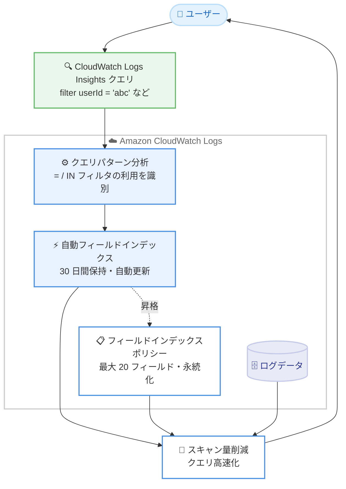

# Amazon CloudWatch Logs - 頻繁にクエリされるフィールドの自動インデックス作成

**リリース日**: 2026 年 9 月 29 日
**サービス**: Amazon CloudWatch Logs
**機能**: 頻繁にクエリされるフィールドの自動インデックス作成 (Automatically indexed fields)

📊 [このアップデートのインフォグラフィックを見る](https://takech9203.github.io/aws-news-summary/20260929-cloudwatch-logs-auto-indexes-fields.html)

## 概要

Amazon CloudWatch Logs が、頻繁にクエリされるフィールドを自動的にインデックス化する機能を発表しました。CloudWatch Logs Insights クエリで `=` 演算子や `IN` 演算子によるフィルタリングに使用されているフィールドをサービス側が自動的に識別し、手動での設定なしにフィールドインデックスを作成します。これにより、スキャンするデータ量が削減され、クエリの実行速度が向上します。

自動インデックスは、既存のデフォルトフィールドインデックスやフィールドインデックスポリシーで設定したインデックスに追加される形で機能します。自動的にインデックス化されたフィールドは 30 日間保持され、ログループあたり 20 フィールドというポリシーの上限にはカウントされません。クエリパターンの変化に応じて、自動インデックスの対象フィールドリストも更新されます。

CloudWatch Logs Insights を利用してログ分析を行うすべてのユーザー、特に大量のログデータに対して繰り返し同じフィールドでフィルタリングを行う運用チームや開発チームにとって、追加コストなしでクエリパフォーマンスが改善される価値の高いアップデートです。

**アップデート前の課題**

このアップデート以前は、フィールドインデックスの管理に手動での運用が必要でした。

- クエリの利用状況を自分で分析し、インデックス化するフィールドを手動で選定する必要があった
- フィールドインデックスポリシーを事前に作成しないと、クエリ高速化の恩恵を受けられなかった
- クエリパターンが変化するたびに、インデックスポリシーの見直しとメンテナンスが継続的に発生していた

**アップデート後の改善**

今回のアップデートにより、インデックス管理の多くが自動化されました。

- `=` や `IN` によるフィルタリングで頻繁に使用されるフィールドが自動的にインデックス化され、手動設定が不要になった
- クエリパターンの変化に応じて自動インデックスの対象が自動的に更新されるようになった
- 自動インデックスされたフィールドは、コンソールまたは API からフィールドインデックスポリシーに昇格させて永続化できるようになった

## アーキテクチャ図



CloudWatch Logs がユーザーのクエリパターンを分析し、`=` や `IN` でフィルタリングされるフィールドを自動的にインデックス化する流れを示しています。自動インデックスはポリシーへ昇格させることで永続化できます。

## サービスアップデートの詳細

### 主要機能

1. **クエリパターンに基づく自動インデックス作成**
   - CloudWatch Logs Insights クエリにおいて、`=` 演算子または `IN` 演算子による等価フィルタで最近使用されたフィールドを自動的にインデックス化
   - デフォルトフィールドインデックスおよびポリシーで設定したインデックスに追加される形で動作
   - ポリシーの作成や設定変更は一切不要

2. **自動的なライフサイクル管理**
   - 自動インデックスされたフィールドは CloudWatch Logs が管理し、30 日間保持される
   - 最近のクエリアクティビティに基づいて対象フィールドのセットが自動更新される
   - フィールドがセットから削除されると、以降に取り込まれるログイベントのインデックス作成は停止する

3. **ポリシーへの昇格による永続化**
   - 自動インデックスされたフィールドを恒久的に維持したい場合、アカウントレベルまたはロググループレベルのフィールドインデックスポリシーに追加できる
   - コンソールのロググループの [Field indexes] タブ、または API から操作可能
   - 自動インデックスはロググループあたり 20 フィールドというポリシー上限の対象外

4. **API による自動インデックスの確認**
   - `DescribeFieldIndexes` API のリクエストパラメータ `indexCategories` に `AUTO` を含めることで、自動インデックスされたフィールドを一覧表示できる
   - レスポンスでは自動インデックスされたフィールドの `indexCategory` が `AUTO` に設定される
   - `indexCategories` を省略したリクエストでは自動インデックスフィールドは返されない

## 技術仕様

### 自動インデックスとポリシーベースインデックスの比較

| 項目 | 自動インデックス | フィールドインデックスポリシー |
|------|------------------|--------------------------------|
| 設定方法 | 不要 (クエリパターンから自動選定) | コンソール / API で手動設定 |
| 対象フィールドの選定 | `=` / `IN` フィルタの利用実績 | ユーザーが指定 |
| 保持期間 | 30 日間 | ポリシーが存在する限り継続 |
| フィールド数の上限 | 20 フィールド上限の対象外 | ポリシーあたり最大 20 フィールド |
| 対象の更新 | クエリアクティビティに応じて自動更新 | ユーザーがポリシーを変更 |
| 追加料金 | なし | なし |

### filter と filterIndex の使い分け

自動インデックスされたフィールドに対しては、`filterIndex` ではなく `filter` コマンドの使用が推奨されています。

- `filterIndex` コマンドはインデックス化されたデータのみを返す
- 自動インデックスはクエリアクティビティに基づいて更新・削除されるため、`filterIndex` を使用すると、フィールドが自動インデックス対象になる前、または対象から外れた後に取り込まれたイベントは検索されない
- `filterIndex` を使用する場合は、クエリアクティビティに関係なくインデックスが維持されるよう、対象フィールドをフィールドインデックスポリシーに追加することが推奨される

### フィールドインデックスの主な制約

| 項目 | 詳細 |
|------|------|
| ポリシーあたりのフィールド数 | 最大 20 フィールド |
| フィールド名の長さ | 最大 100 文字 |
| フィールド名のマッチング | 大文字と小文字を区別 (`RequestId` と `requestId` は別フィールド) |
| アカウントレベルポリシー数 | 最大 40 (ロググループ名プレフィックス指定 20、データソース指定 20) |

## 設定方法

### 前提条件

1. CloudWatch Logs でログを収集し、CloudWatch Logs Insights でクエリを実行していること
2. フィールドインデックスがサポートされているリージョンを使用していること
3. ポリシーへの昇格を行う場合は、フィールドインデックスポリシーを操作できる IAM 権限があること

### 手順

#### ステップ 1: 自動インデックスされたフィールドの確認

```bash
aws logs describe-field-indexes \
  --log-group-identifiers "my-log-group" \
  --index-categories AUTO
```

`DescribeFieldIndexes` API を呼び出し、指定したロググループで自動インデックスされたフィールドの一覧を取得します。`--index-categories AUTO` を指定しない場合、自動インデックスされたフィールドは結果に含まれません。コンソールでは、ロググループの [Field indexes] タブでも確認できます。

#### ステップ 2: 通常どおりクエリを実行

```sql
fields @timestamp, @message
| filter userId = "user-12345"
| sort @timestamp desc
| limit 100
```

CloudWatch Logs Insights で `=` や `IN` を使ったフィルタクエリを実行します。頻繁に使用されるフィルタ対象フィールドは自動的にインデックス化され、以降の同様のクエリでスキャン量が削減されます。自動インデックスされたフィールドには `filterIndex` ではなく `filter` の使用が推奨されます。

#### ステップ 3: 必要に応じてポリシーへ昇格

```bash
aws logs put-index-policy \
  --log-group-identifier "my-log-group" \
  --policy-document '{"Fields": ["userId", "requestId"]}'
```

恒久的にインデックスを維持したいフィールドをロググループレベルのフィールドインデックスポリシーに追加します。コンソールの場合は、ロググループの [Field indexes] タブから [Manage field indexes] を選択し、ポリシーにフィールドを追加して保存します。

## メリット

### ビジネス面

- **運用負荷の削減**: インデックス対象フィールドの選定やポリシーのメンテナンスという継続的な作業が不要になり、運用チームの工数を削減できる
- **追加コストなし**: 自動インデックス機能は追加料金なしで提供され、既存の CloudWatch Logs 利用者は何もせずに恩恵を受けられる
- **障害調査の迅速化**: 頻繁に使うフィールドでのクエリが高速化されるため、インシデント対応時のログ調査時間を短縮できる

### 技術面

- **スキャン量の削減によるクエリ高速化**: インデックスを活用することでスキャンするログデータ量が減り、CloudWatch Logs Insights クエリの実行時間が短縮される
- **クエリパターンへの自動追従**: 利用状況の変化に応じてインデックス対象が自動更新されるため、ワークロードの変化に手動対応する必要がない
- **既存ポリシーとの共存**: デフォルトインデックスやポリシーベースのインデックスに追加される形で動作し、20 フィールドのポリシー上限を消費しない

## デメリット・制約事項

### 制限事項

- 自動インデックスされたフィールドの保持期間は 30 日間であり、恒久的な維持にはフィールドインデックスポリシーへの追加が必要
- 自動インデックスの対象となるのは `=` および `IN` 演算子による等価フィルタで使用されたフィールドのみで、範囲検索や部分一致は対象外
- フィールドが自動インデックスの対象から外れると、以降に取り込まれるイベントはそのフィールドでインデックス化されない
- フィールドインデックスがサポートされているリージョンでのみ利用可能

### 考慮すべき点

- 自動インデックスされたフィールドに `filterIndex` を使用すると、インデックス化される前後のイベントが検索結果から漏れる可能性があるため、`filter` の使用が推奨される
- インデックス対象の選定はサービス側のクエリアクティビティ分析に依存するため、確実にインデックスを維持したい重要フィールドはポリシーで明示的に管理するべき
- フィールド名のマッチングは大文字と小文字を区別するため、ログ出力時のフィールド名の統一が重要

## ユースケース

### ユースケース 1: マイクロサービスの障害調査の高速化

**シナリオ**: 複数のマイクロサービスのログを CloudWatch Logs に集約しており、障害発生時に `requestId` や `traceId` でログを横断検索している。これまでインデックスポリシーを設定しておらず、クエリに時間がかかっていた。

**実装例**:
```sql
fields @timestamp, @message, serviceName
| filter requestId = "req-abc-123"
| sort @timestamp asc
```

**効果**: 日常的に `requestId` でのフィルタリングが行われているため、このフィールドが自動的にインデックス化され、設定作業なしで障害調査クエリが高速化されます。

### ユースケース 2: 変化するクエリパターンへの自動追従

**シナリオ**: 新機能のリリースに伴い、これまで検索対象でなかった `featureFlag` フィールドでのフィルタリングが頻繁に行われるようになった。従来はポリシーの見直しが必要だった。

**実装例**:
```sql
fields @timestamp, userId, @message
| filter featureFlag IN ["new-checkout", "new-checkout-v2"]
| stats count(*) by bin(5m)
```

**効果**: クエリパターンの変化を CloudWatch Logs が検出し、`featureFlag` を自動的にインデックス化します。ポリシーのメンテナンスなしで、新しい分析ニーズにもクエリ高速化が追従します。

### ユースケース 3: 重要フィールドのポリシーへの昇格

**シナリオ**: 自動インデックスされたフィールドのうち、セキュリティ監査で常時使用する `sourceIp` フィールドは、クエリ頻度にかかわらず確実にインデックスを維持したい。

**実装例**:
```bash
# 自動インデックスされたフィールドを確認
aws logs describe-field-indexes \
  --log-group-identifiers "security-audit-logs" \
  --index-categories AUTO

# ポリシーに昇格して永続化
aws logs put-index-policy \
  --log-group-identifier "security-audit-logs" \
  --policy-document '{"Fields": ["sourceIp"]}'
```

**効果**: 自動インデックスの 30 日間の保持期間やクエリアクティビティへの依存から切り離し、監査業務に必要なインデックスを恒久的に維持できます。

## 料金

自動フィールドインデックス機能は**追加料金なし**で提供されます。CloudWatch Logs Insights のクエリ料金 (スキャンされたデータ量に基づく課金) は従来どおり適用されますが、インデックスの活用によりスキャン量が削減されるため、クエリコストの削減につながる可能性があります。

詳細は [Amazon CloudWatch 料金ページ](https://aws.amazon.com/cloudwatch/pricing/) を参照してください。

## 利用可能リージョン

CloudWatch Logs のフィールドインデックス機能がサポートされているすべての AWS リージョンで利用可能です。

## 関連サービス・機能

- **CloudWatch Logs Insights**: 本機能によりクエリが高速化される対象のログ分析サービス。`filter` コマンドでの等価フィルタが自動インデックスの選定対象となる
- **フィールドインデックスポリシー**: アカウントレベルまたはロググループレベルでインデックス対象フィールドを明示的に管理する既存機能。自動インデックスの昇格先となる
- **CloudWatch Logs 標準ログクラス**: `@logStream` や `@aws.region` などのデフォルトフィールドインデックスが提供されており、自動インデックスはこれらに追加される形で機能する

## 参考リンク

- 📊 [インフォグラフィック](https://takech9203.github.io/aws-news-summary/20260929-cloudwatch-logs-auto-indexes-fields.html)
- [公式発表 (What's New)](https://aws.amazon.com/about-aws/whats-new/2026/09/cloudwatch-logs-auto-indexes-fields/)
- [ドキュメント: 自動インデックスされたフィールド](https://docs.aws.amazon.com/AmazonCloudWatch/latest/logs/CloudWatchLogs-Field-Indexing-Automatic.html)
- [ドキュメント: フィールドインデックスの作成](https://docs.aws.amazon.com/AmazonCloudWatch/latest/logs/CloudWatchLogs-Field-Indexing.html)
- [ドキュメント: フィールドインデックスの構文とクォータ](https://docs.aws.amazon.com/AmazonCloudWatch/latest/logs/CloudWatchLogs-Field-Indexing-Syntax.html)
- [料金ページ](https://aws.amazon.com/cloudwatch/pricing/)

## まとめ

CloudWatch Logs の自動フィールドインデックス機能により、手動設定なしで CloudWatch Logs Insights クエリの高速化とスキャン量の削減が実現されます。追加料金なしで自動的に有効化されるため、既存ユーザーは特別な対応をせずに恩恵を受けられます。まずは `DescribeFieldIndexes` API やコンソールの [Field indexes] タブで自動インデックスされたフィールドを確認し、監査や定常運用で常時使用する重要なフィールドについてはフィールドインデックスポリシーへの昇格を検討することを推奨します。
