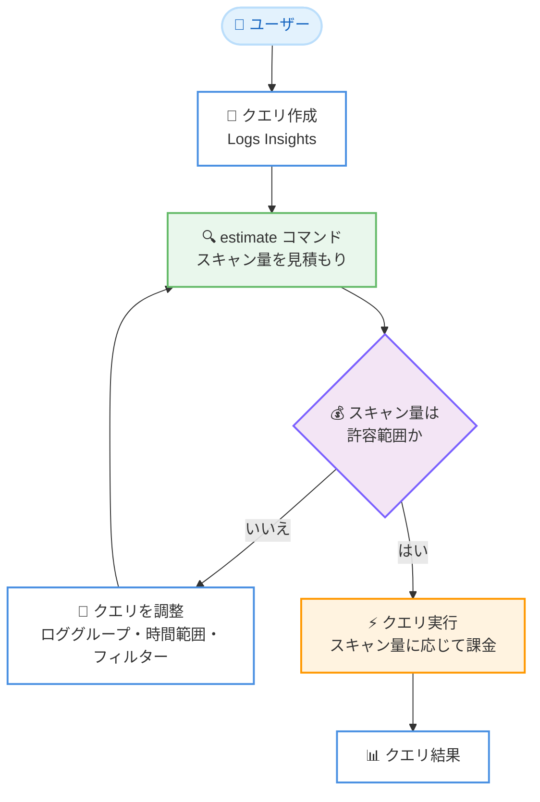

# Amazon CloudWatch Logs - Logs Insights クエリ実行前のスキャンバイト数見積もり機能

**リリース日**: 2026 年 9 月 29 日
**サービス**: Amazon CloudWatch Logs (CloudWatch Logs Insights)
**機能**: クエリ実行前のスキャンデータ量見積もり (estimate コマンド)

📊 [このアップデートのインフォグラフィックを見る](https://takech9203.github.io/aws-news-summary/20260929-cloudwatch-logs-estimate-bytes-scanned.html)

## 概要

Amazon CloudWatch Logs Insights で、クエリを実際に実行する前に、そのクエリがスキャンするログデータ量 (バイト数) を見積もることができるようになりました。選択したロググループと時間範囲に対して、クエリがどの程度のデータをスキャンするかを事前に把握できます。

CloudWatch Logs Insights のクエリ料金はスキャンしたデータ量に基づいて課金されるため、意図せず広範囲のロググループや長い時間範囲を対象にしたクエリを実行すると、想定外のコストが発生する可能性がありました。今回のアップデートにより、クエリ実行前にスキャン量の見積もりを確認し、ロググループの選択、時間範囲、フィルター条件を調整してからクエリを実行できるようになります。見積もり自体には CloudWatch Logs Insights のクエリ料金は発生しません。

ログ分析を日常的に行う運用担当者や、大規模なログデータを扱う環境でコスト管理を重視する組織にとって、クエリコストの予測可能性を高める重要な機能強化です。

**アップデート前の課題**

- 以前はクエリを実行するまで、どの程度のデータ量がスキャンされるか把握できなかった
- 広範囲のロググループや長い時間範囲を対象にしたクエリにより、想定外のスキャン料金が発生するリスクがあった
- コストを抑えるためのクエリ調整 (時間範囲の短縮やフィルターの追加) は、実際にクエリを実行して結果を確認する試行錯誤が必要だった

**アップデート後の改善**

- クエリ実行前にスキャンされるデータ量 (バイト数) の見積もりを確認できるようになった
- コンソールのクエリエディタでは、ロググループの選択、時間範囲、クエリテキストを変更するたびに見積もりが自動的に更新される
- CLI / API では、クエリの末尾に `estimate` コマンドを追加することで明示的に見積もりをリクエストできる
- 見積もりにはクエリ料金が発生しないため、コストを気にせずクエリのチューニングを繰り返せる

## アーキテクチャ図



クエリ実行前に `estimate` コマンドで無料のスキャン量見積もりを取得し、許容範囲になるまでクエリを調整してから実行するワークフローを示しています。

## サービスアップデートの詳細

### 主要機能

1. **スキャンバイト数の事前見積もり**
   - クエリを実行せずに、選択したロググループと時間範囲でスキャンされるデータ量 (バイト数) の見積もりを返す
   - 見積もり結果をもとに、ロググループの選択、時間範囲、フィルター条件をクエリ実行前に調整できる
   - 見積もりは近似値であり、実際にクエリを実行した際のスキャン量とは異なる場合がある

2. **コンソールでの自動見積もり**
   - CloudWatch コンソールのクエリエディタでは、見積もりが自動的に表示される
   - ロググループの選択、時間範囲、クエリテキストを変更するたびに見積もりが更新される
   - 追加の操作なしでスキャン量を常に確認しながらクエリを作成できる

3. **CLI / API での明示的な見積もりリクエスト**
   - クエリの末尾に `estimate` コマンドを追加することで、見積もりを明示的にリクエストできる
   - `estimate` コマンドはクエリの最後のコマンドである必要がある
   - `estimate` コマンドを使用したクエリには CloudWatch Logs Insights のクエリ料金が発生しない

## 技術仕様

### estimate コマンドの仕様

| 項目 | 詳細 |
|------|------|
| 構文 | `\| estimate` |
| 配置 | クエリの最後のコマンドとして記述する必要がある |
| 返却値 | 選択したロググループと時間範囲でスキャンされる推定バイト数 |
| 精度 | 近似値 (実際のスキャン量と異なる場合がある) |
| 料金 | 見積もりクエリにはクエリ料金が発生しない |
| コンソール | クエリエディタで自動的に見積もりが更新される |
| CLI / API | クエリに `estimate` コマンドを追加して明示的にリクエスト |

### クエリ例

```
fields @timestamp, @message
| filter @message like /error/
| estimate
```

このクエリは実際にログを検索せず、クエリがスキャンするデータ量の見積もり (バイト数) を返します。

## 設定方法

### 前提条件

1. CloudWatch Logs にログデータが保存されていること
2. CloudWatch Logs Insights のクエリ実行権限 (`logs:StartQuery`、`logs:GetQueryResults` など) があること

### 手順

#### ステップ 1: コンソールで見積もりを確認する

CloudWatch コンソールの [Logs Insights] を開き、ロググループと時間範囲を選択してクエリを入力します。クエリエディタ上で、ロググループの選択、時間範囲、クエリテキストを変更するたびにスキャン量の見積もりが自動的に更新されます。

#### ステップ 2: CLI で見積もりをリクエストする

```bash
aws logs start-query \
  --log-group-names "/aws/lambda/my-function" \
  --start-time 1790000000 \
  --end-time 1790086400 \
  --query-string 'fields @timestamp, @message | filter @message like /error/ | estimate'
```

`start-query` の `--query-string` の末尾に `| estimate` を追加して見積もりクエリを開始します。このコマンドはクエリ ID を返します。

#### ステップ 3: 見積もり結果を取得する

```bash
aws logs get-query-results --query-id <クエリ ID>
```

ステップ 2 で取得したクエリ ID を指定して見積もり結果 (推定スキャンバイト数) を取得します。結果を確認し、スキャン量が大きすぎる場合は時間範囲の短縮やロググループの絞り込みを行ってから、`estimate` を外した本番のクエリを実行します。

## メリット

### ビジネス面

- **コストの予測可能性向上**: クエリ実行前にスキャン量を把握できるため、想定外のクエリ料金の発生を防止できる
- **コスト最適化の促進**: 見積もりは無料のため、コストを気にせずクエリの絞り込みを試行錯誤できる
- **ガバナンス強化**: 大規模なログ環境でも、チームメンバーが高コストなクエリを実行する前に影響を確認する運用を定着させやすい

### 技術面

- **クエリチューニングの効率化**: ロググループ、時間範囲、フィルターの調整効果を実行前に確認できる
- **コンソールでの自動更新**: クエリ編集中にリアルタイムで見積もりが更新され、追加操作が不要
- **CLI / API 対応**: 自動化スクリプトやツールに見積もりステップを組み込むことができる

## デメリット・制約事項

### 制限事項

- `estimate` コマンドが返す値は近似値であり、実際にクエリを実行した際のスキャン量と異なる場合がある
- `estimate` コマンドはクエリの最後のコマンドとして記述する必要がある
- 利用可能なのは AWS 商用リージョンのみ

### 考慮すべき点

- 見積もりはスキャン量 (バイト数) を返すものであり、クエリ結果の件数や内容は確認できない
- 正確な課金額を保証するものではないため、コスト管理には AWS Cost Explorer や CloudWatch の課金メトリクスとの併用が推奨される

## ユースケース

### ユースケース 1: 障害調査時の広範囲ログ検索のコスト確認

**シナリオ**: 障害調査で複数のロググループを横断して過去数週間のエラーログを検索したいが、スキャン量が大きくなりコストが懸念される。

**実装例**:
```
fields @timestamp, @message, @logStream
| filter @message like /error/
| estimate
```

**効果**: 検索実行前にスキャン量を確認し、必要に応じて時間範囲を分割したり対象ロググループを絞り込むことで、調査コストをコントロールできる。

### ユースケース 2: 定期実行クエリのコスト事前評価

**シナリオ**: ダッシュボードや定期レポートに組み込むクエリを新規作成する際、繰り返し実行した場合の累積コストを事前に評価したい。

**実装例**:
```
fields @timestamp, @message
| filter statusCode >= 500
| stats count(*) by bin(5m)
| estimate
```

**効果**: 1 回あたりのスキャン量の見積もりから月間の累積スキャン量を試算し、クエリの時間範囲やフィルター設計を最適化してから定期実行を開始できる。

### ユースケース 3: チームでのクエリレビュー運用

**シナリオ**: 大規模なログデータを保持する環境で、チームメンバーが作成したクエリのコスト影響をレビューしてから実行する運用を整備したい。

**実装例**:
```bash
# レビュー用スクリプトで estimate 付きクエリを実行し、見積もりを確認
aws logs start-query \
  --log-group-names "/app/production" \
  --start-time 1790000000 \
  --end-time 1790604800 \
  --query-string 'fields @timestamp | filter level = "ERROR" | estimate'
```

**効果**: 見積もりは無料のため、本番クエリ実行前のコストチェックをコストゼロで運用プロセスに組み込める。

## 料金

`estimate` コマンドを使用した見積もりクエリには、CloudWatch Logs Insights のクエリ料金は発生しません。

通常の CloudWatch Logs Insights クエリは、スキャンしたデータ量に基づいて課金されます。詳細は [CloudWatch 料金ページ](https://aws.amazon.com/cloudwatch/pricing/) を参照してください。

### 料金例

| 操作 | 料金 |
|------|------|
| `estimate` コマンドによる見積もりクエリ | 無料 |
| 通常のクエリ実行 | スキャンしたデータ量に応じた課金 |

## 利用可能リージョン

すべての AWS 商用リージョンで利用可能です。

## 関連サービス・機能

- **CloudWatch Logs Insights**: 本機能の対象となるログ分析サービス。クエリ言語を使用してログデータを検索・分析する
- **AWS Cost Explorer**: CloudWatch Logs Insights のクエリコストを含む AWS 利用料金の分析に使用できる
- **AWS Budgets**: スキャンコストの増加に対するアラート設定と組み合わせることで、コスト管理をさらに強化できる

## 参考リンク

- 📊 [インフォグラフィック](https://takech9203.github.io/aws-news-summary/20260929-cloudwatch-logs-estimate-bytes-scanned.html)
- [公式発表 (What's New)](https://aws.amazon.com/about-aws/whats-new/2026/09/cloudwatch-logs-estimate-bytes-scanned/)
- [ドキュメント: estimate コマンド](https://docs.aws.amazon.com/AmazonCloudWatch/latest/logs/CWL_QuerySyntax-Estimate.html)
- [料金ページ](https://aws.amazon.com/cloudwatch/pricing/)

## まとめ

CloudWatch Logs Insights の `estimate` コマンドにより、クエリ実行前にスキャンデータ量を無料で見積もることができるようになり、想定外のクエリコストを防止できます。コンソールでは見積もりが自動更新されるため、まずは普段のログ分析ワークフローで見積もり表示を確認し、CLI / API を使用する場合はクエリ末尾に `| estimate` を追加する運用を取り入れることを推奨します。
