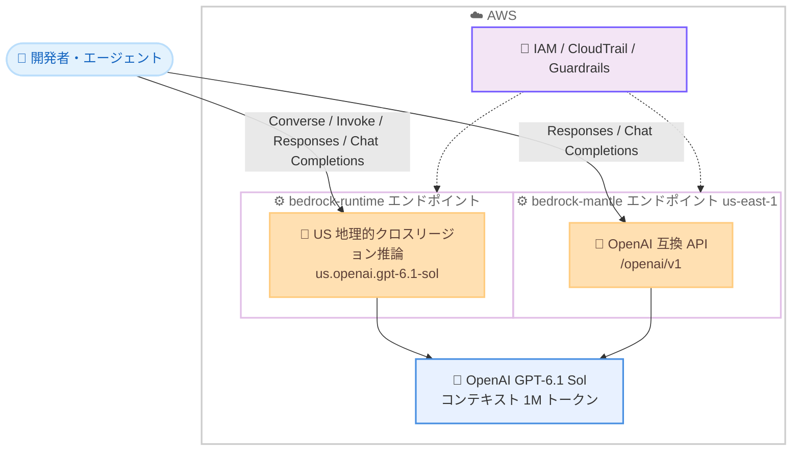

# Amazon Bedrock - OpenAI GPT-6.1 Sol の一般提供開始

**リリース日**: 2026 年 9 月 29 日
**サービス**: Amazon Bedrock
**機能**: OpenAI GPT-6.1 Sol モデルの一般提供 (GA)

📊 [このアップデートのインフォグラフィックを見る](https://takech9203.github.io/aws-news-summary/20260929-openai-gpt-6-1-sol-on-amazon-bedrock.html)

## 概要

OpenAI の最新モデル GPT-6.1 Sol が Amazon Bedrock で一般提供開始されました。GPT-6.1 Sol は GPT-6 Sol の後継となるアップグレードモデルで、エージェンティックコーディング、コンピュータ操作 (computer use)、ビジネス文書処理などの実務ワークロードで高い性能を発揮します。OpenAI の発表によると、難易度の高い評価において最上位モデル GPT-6 Astra に近い性能を、約 5 分の 1 のコストで実現するとされており、コストを抑えながら高性能なエージェントを大規模に運用したい開発者に適したモデルです。

機能の構築、デバッグ、ソリューションの反復改善、マルチステップワークフローの実行、複雑なコードベースの探索といったユースケースを想定しており、Amazon Bedrock の推論基盤が提供するパフォーマンス、セキュリティ、信頼性のもとで本番ワークロードに利用できます。IAM によるアクセス制御、AWS CloudTrail による監査、VPC エンドポイント / AWS PrivateLink によるネットワーク分離など、標準的な AWS のセキュリティコントロールが適用されます。

**アップデート前の課題**

- GPT-6 Astra クラスの高い性能が必要なエージェントワークロードでは、推論コストが高く、大規模運用が難しかった
- GPT-6 Sol はコスト効率に優れる一方、難易度の高いコーディングタスクや複雑な文書分析では GPT-6 Astra との性能差があった
- ツール呼び出しの失敗や制約された操作の報告など、エージェントの透明性に改善の余地があった

**アップデート後の改善**

- GPT-6 Astra に近い性能を約 5 分の 1 のコストで利用でき、高性能エージェントの大規模運用が現実的になった
- コーディングベンチマーク DeepSWE v1.1 で GPT-6 Astra と同等のスコアを達成し、GPT-6 Sol の最高スコアを 6.4 ポイント上回った (より低い推論労力で達成、OpenAI 発表値)
- ツールの失敗、制限された操作、情報不足のフラグ付けなど、透明性・ユーザー意図の理解・明示的な制約の遵守に関する評価が GPT-6 Sol から向上した

## アーキテクチャ図



GPT-6.1 Sol へのアクセス経路を示しています。`bedrock-runtime` エンドポイントでは US 地理的クロスリージョン推論プロファイル経由で、`bedrock-mantle` エンドポイント (us-east-1) では OpenAI 互換 API 経由で利用できます。

## サービスアップデートの詳細

### 主要機能

1. **GPT-6 Astra に迫る性能を低コストで提供**
   - コーディングベンチマーク DeepSWE v1.1 で GPT-6 Astra と同等のスコアを約 5 分の 1 のタスクあたりコストで達成 (OpenAI 発表値)
   - 複雑な文書分析でも GPT-6 Astra に近い性能を発揮
   - マルチステップのビジネスツールワークフローで GPT-6 Sol を上回る性能

2. **エージェントワークロード向けの設計**
   - コードベースの調査、実装、テストの反復といったエージェンティックコーディングに最適化
   - コンピュータ操作 (computer use) やマルチステップワークフローの実行に対応
   - ツール呼び出しの失敗、制限された操作、情報不足を明示的に報告する透明性の向上

3. **複数のアクセス方法と OpenAI 互換 API**
   - `bedrock-runtime` エンドポイント: Converse、Invoke、Responses、Chat Completions API に対応
   - `bedrock-mantle` エンドポイント: OpenAI SDK をそのまま利用できる Responses / Chat Completions API に対応 (ベースパスは `/openai/v1`)
   - 長期 API キーを使用した OpenAI SDK からの直接アクセスが可能

4. **エンタープライズ向けセキュリティ**
   - IAM によるアクセスガバナンス、CloudTrail によるモデル呼び出しの監査
   - VPC エンドポイント / AWS PrivateLink によるネットワーク分離
   - ハードウェア分離されたインフラストラクチャ上で推論を実行し、オペレーターによるアクセスはゼロ
   - 推論データはモデルの学習に使用されず、OpenAI へのデータ共有オプトインも不要

## 技術仕様

### モデル仕様

| 項目 | 詳細 |
|------|------|
| モデル ID | `openai.gpt-6.1-sol` |
| 推論プロファイル ID | `us.openai.gpt-6.1-sol` (US 地理的クロスリージョン推論) |
| モデル発表日 | 2026 年 9 月 29 日 |
| コンテキストウィンドウ | 1M トークン |
| 最大出力トークン | 131,072 トークン |
| 入力モダリティ | テキスト、画像 |
| 出力モダリティ | テキスト |
| ストリーミング | 対応 |
| Guardrails | 対応 |
| サービスティア | Standard のみ (Priority / Flex / Reserved は非対応) |
| 出力トークンのクォータ消費率 | 出力 1 トークンあたりクォータ 10 トークンを消費 |

### エンドポイントと API 対応状況

| API | bedrock-runtime | bedrock-mantle |
|------|------|------|
| Converse | 対応 | 非対応 |
| Invoke | 対応 | 非対応 |
| Responses | 対応 | 対応 |
| Chat Completions | 対応 | 対応 |
| Messages | 非対応 | 非対応 |

`bedrock-mantle` エンドポイントは us-east-1 のみで利用可能で、ベースパスは `/v1` ではなく `/openai/v1` を使用します。

### API 変更履歴

| 日付 | サービス | 変更内容 |
|------|----------|----------|
| 2026/09/29 | [bedrock-agent-runtime](https://awsapichanges.com/archive/changes/e9bb16-bedrock-agent-runtime.html) | 1 updated api methods - Bedrock Agentic Retrieve が新しい MantleFoundationModel 設定により Bedrock Mantle (OpenAI Responses) エンドポイントをサポート |

### 注意: プロンプトキャッシュの扱い

What's New では、コンテキストを繰り返し再利用するエージェントワークロード向けにプロンプトキャッシュの有用性が言及されています。一方、モデルカードでは本モデルの Bedrock 機能としての「明示的プロンプトキャッシュ (explicit prompt caching)」は非対応と記載されており、料金表にはキャッシュ書き込み / 読み取りの料金ディメンションが定義されています。実装時はモデルカードと料金ページで最新の対応状況を確認してください。

## 設定方法

### 前提条件

1. AWS アカウントと Amazon Bedrock へのアクセス権限
2. Amazon Bedrock コンソールでの GPT-6.1 Sol へのモデルアクセス有効化
3. OpenAI SDK を使用する場合は Bedrock API キー (長期 API キー) の作成と Python 環境

### 手順

#### ステップ 1: OpenAI SDK のインストールと環境変数の設定

```bash
python3 -m pip install openai

# bedrock-runtime エンドポイントを使用する場合
export OPENAI_API_KEY="<Bedrock API キー>"
export OPENAI_BASE_URL="https://bedrock-runtime.us-east-1.amazonaws.com/openai/v1"
```

OpenAI SDK をインストールし、Bedrock コンソールで作成した長期 API キーと Bedrock のエンドポイント URL を環境変数に設定しています。`bedrock-mantle` を使用する場合は `OPENAI_BASE_URL` に `https://bedrock-mantle.us-east-1.api.aws/openai/v1` を指定します。

#### ステップ 2: Responses API で推論を実行

```python
from openai import OpenAI

client = OpenAI()

response = client.responses.create(
    model="us.openai.gpt-6.1-sol",
    input="Amazon Bedrock の機能を説明してください。",
    max_output_tokens=512,
)
print(response.output_text)
```

OpenAI SDK の Responses API を使用して GPT-6.1 Sol に推論リクエストを送信しています。`bedrock-runtime` では US クロスリージョン推論プロファイル `us.openai.gpt-6.1-sol` をモデル名に指定します (`bedrock-mantle` の場合は `openai.gpt-6.1-sol`)。

#### ステップ 3: Converse API で推論を実行 (AWS SDK を使用する場合)

```python
import boto3

client = boto3.client("bedrock-runtime", region_name="us-east-1")

response = client.converse(
    modelId="us.openai.gpt-6.1-sol",
    messages=[
        {"role": "user", "content": [{"text": "複雑なコードベースの調査手順を提案してください。"}]}
    ],
)
print(response["output"]["message"]["content"][0]["text"])
```

AWS SDK (boto3) の Converse API を使用して推論を実行しています。既存の Bedrock アプリケーションであれば、モデル ID を差し替えるだけで GPT-6.1 Sol に切り替えられます。

## メリット

### ビジネス面

- **大幅なコスト削減**: GPT-6 Astra に近い性能を約 5 分の 1 のコストで利用でき、高性能エージェントの大規模展開が現実的になる
- **エンタープライズガバナンス**: IAM、CloudTrail、PrivateLink など既存の AWS セキュリティ・監査基盤をそのまま活用できる
- **データプライバシー**: 推論データはモデル学習に使用されず、OpenAI へのデータ共有も不要なため、機密データを扱うワークロードでも採用しやすい

### 技術面

- **1M トークンの大規模コンテキスト**: 大規模なコードベースや長大な文書を一度に処理できる
- **OpenAI SDK 互換**: 既存の OpenAI SDK ベースのアプリケーションを最小限の変更で移行できる
- **モデル切り替えの容易さ**: Converse API 対応により、Bedrock 上の他モデルからコードの書き換えなしに切り替え可能

## デメリット・制約事項

### 制限事項

- `bedrock-mantle` エンドポイントは us-east-1 (バージニア北部) のみで利用可能
- `bedrock-runtime` では US 地理的クロスリージョン推論プロファイルのみ対応で、リージョン内直接呼び出しやグローバル推論プロファイルは提供されない
- Bedrock 機能としての明示的プロンプトキャッシュ、サーバーサイドシステムツール、インテリジェントプロンプトルーティング、トークンカウントは非対応 (モデルカード記載)
- サービスティアは Standard のみで、Priority / Flex / Reserved ティアは非対応
- 出力トークンのクォータ消費率が 10 倍のため、大量の出力を伴うワークロードではクォータ設計に注意が必要

### 考慮すべき点

- ベンチマーク結果は OpenAI の発表値であり、AWS が独立して検証したものではないため、自社ワークロードでの評価が推奨される
- 不正利用検出の分類器によりフラグ付けされたトラフィックは AWS により最大 30 日間保持される (ゼロデータ保持はアカウントチーム経由でリクエスト可能)
- 入力が 272,000 トークンを超えるリクエストには全体に長コンテキスト料金が適用されるため、コンテキスト設計がコストに直結する
- 商用リージョンの In-Region および US CRIS 料金にはグローバルベースレートに対して 10% のプレミアムが含まれる

## ユースケース

### ユースケース 1: エージェンティックコーディング

**シナリオ**: 開発チームが大規模なレガシーコードベースの調査、バグ修正、テストの反復を AI エージェントに任せたい。

**実装例**:
```python
response = client.responses.create(
    model="us.openai.gpt-6.1-sol",
    input="このリポジトリの認証モジュールのバグを調査し、修正案とテストコードを提示してください。",
    max_output_tokens=8192,
)
```

**効果**: 1M トークンのコンテキストで大規模コードベースを俯瞰しながら、GPT-6 Astra 級のコーディング性能を約 5 分の 1 のコストで活用できる。Codex や Agent Toolkit for AWS との組み合わせで AWS ドキュメントや API とも連携可能。

### ユースケース 2: 複雑な文書分析と業務ワークフロー

**シナリオ**: 金融機関が契約書や規制文書などの長大なドキュメントを分析し、複数の業務システムを横断するマルチステップワークフローを自動化したい。

**実装例**:
```python
response = client.converse(
    modelId="us.openai.gpt-6.1-sol",
    messages=[{"role": "user", "content": [
        {"text": "添付の契約書群を分析し、リスク条項を抽出して要約してください。"}
    ]}],
)
```

**効果**: 複雑な文書理解で GPT-6 Astra に近い精度を確保しつつ、ツール失敗や情報不足を明示的に報告する透明性により、業務ワークフローの信頼性を高められる。

### ユースケース 3: 顧客向け AI アプリケーションの大規模運用

**シナリオ**: SaaS 事業者が顧客向けのコーディングアシスタント機能を提供しており、性能を落とさずに推論コストを削減してスケールさせたい。

**実装例**:
```python
# 既存の GPT-6 Astra 利用箇所のモデル ID を差し替え
model_id = "us.openai.gpt-6.1-sol"  # 従来: GPT-6 Astra
```

**効果**: モデル ID の変更のみで約 5 分の 1 のコストに削減しながら、難易度の高いタスクでも近い性能を維持できる。US クロスリージョン推論により需要の変動にも柔軟に対応できる。

## 料金

トークン単位の従量課金 (Standard ティア) です。すべて 100 万トークンあたりの USD 価格で、商用リージョンの In-Region および US 地理的クロスリージョン推論 (US CRIS) 料金にはグローバルベースレートに対して 10% のプレミアムが含まれます。入力が 272,000 トークンを超えるリクエストには、リクエスト全体に長コンテキスト料金が適用されます。

### 短コンテキスト (入力 272K トークン以下)

| 推論オプション | 入力 | 入力 - キャッシュ書き込み | 入力 - キャッシュ読み取り | 出力 |
|--------|------|------|------|------|
| Regional (Mantle、IAD) | $2.20 | $2.75 | $0.11 | $11.00 |
| US CRIS (bedrock-runtime) | $2.20 | $2.75 | $0.11 | $11.00 |
| グローバルベースレート (OpenAI 1st party) | $2.00 | $2.50 | $0.10 | $10.00 |

### 長コンテキスト (入力 272K トークン超)

| 推論オプション | 入力 | 入力 - キャッシュ書き込み | 入力 - キャッシュ読み取り | 出力 |
|--------|------|------|------|------|
| Regional (Mantle、IAD) | $4.40 | $5.50 | $0.22 | $16.50 |
| US CRIS (bedrock-runtime) | $4.40 | $5.50 | $0.22 | $16.50 |
| グローバルベースレート (OpenAI 1st party) | $4.00 | $5.00 | $0.20 | $15.00 |

Priority および Flex ティアは本モデルでは提供されません。最新の料金は [Amazon Bedrock 料金ページ](https://aws.amazon.com/bedrock/pricing/) を確認してください。

## 利用可能リージョン

- **bedrock-mantle エンドポイント**: 米国東部 (バージニア北部、us-east-1) のみ
- **bedrock-runtime エンドポイント**: US 地理的クロスリージョン推論プロファイル (`us.openai.gpt-6.1-sol`) 経由で利用可能。ソースリージョンは US 推論プロファイルの有効なリージョンを使用

リージョン内直接呼び出しおよびグローバル推論プロファイルは本ローンチでは提供されません。最新のリージョン対応状況は [Regional availability by models](https://docs.aws.amazon.com/bedrock/latest/userguide/models-region-compatibility.html) を確認してください。

## 関連サービス・機能

- **Amazon Bedrock Guardrails**: GPT-6.1 Sol でも利用可能な安全性フィルタ。有害コンテンツのブロックや機密情報のマスキングに活用できる
- **クロスリージョン推論 (CRIS)**: US 地理的推論プロファイルにより、複数リージョンにトラフィックを自動分散して可用性とスループットを確保
- **Amazon Bedrock AgentCore**: エージェントの本番運用基盤。GPT-6.1 Sol を推論モデルとして組み合わせたエージェント構築が可能
- **AWS PrivateLink / VPC エンドポイント**: インターネットを経由しないプライベートなモデル呼び出し経路を提供

## 参考リンク

- 📊 [インフォグラフィック](https://takech9203.github.io/aws-news-summary/20260929-openai-gpt-6-1-sol-on-amazon-bedrock.html)
- [公式発表 (What's New)](https://aws.amazon.com/about-aws/whats-new/2026/09/openai-gpt-6-1-sol-on-amazon-bedrock/)
- [AWS Blog: Bring near-Astra intelligence to everyday work with GPT-6.1 Sol on Amazon Bedrock](https://aws.amazon.com/blogs/machine-learning/bring-near-astra-intelligence-to-everyday-work-with-gpt-6-1-sol-on-amazon-bedrock/)
- [モデルカード: GPT-6.1 Sol](https://docs.aws.amazon.com/bedrock/latest/userguide/model-card-openai-gpt-6-1-sol.html)
- [Regional availability by models](https://docs.aws.amazon.com/bedrock/latest/userguide/models-region-compatibility.html)
- [Amazon Bedrock 料金ページ](https://aws.amazon.com/bedrock/pricing/)

## まとめ

GPT-6.1 Sol の Amazon Bedrock での GA により、GPT-6 Astra に近い性能を約 5 分の 1 のコストで利用できるようになり、エージェンティックコーディングやマルチステップ業務ワークフローの大規模運用が現実的になりました。OpenAI SDK 互換の API と Converse API の両方に対応しているため、既存アプリケーションからの移行も容易です。まずは US クロスリージョン推論プロファイル `us.openai.gpt-6.1-sol` で自社ワークロードの性能とコストを評価することを推奨します。
