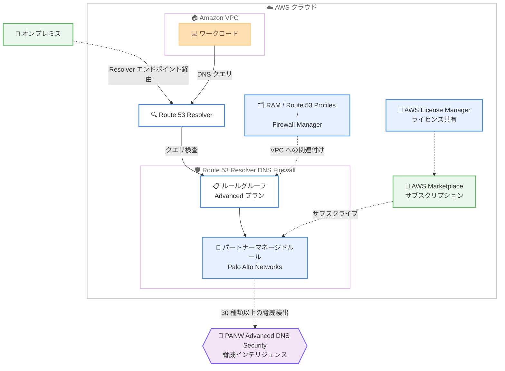

# Amazon Route 53 - Resolver DNS Firewall の Palo Alto Networks Advanced DNS Security サポートが一般提供開始

**リリース日**: 2026 年 9 月 29 日
**サービス**: Amazon Route 53 (Resolver DNS Firewall)
**機能**: Palo Alto Networks Advanced DNS Security によるパートナーマネージド DNS 脅威保護の一般提供 (GA)

📊 [このアップデートのインフォグラフィックを見る](https://takech9203.github.io/aws-news-summary/20260929-route-53-dns-firewall-panw-dns-security-generally-available.html)

## 概要

Amazon Route 53 Resolver DNS Firewall における Palo Alto Networks (PANW) Advanced DNS Security のサポートが、32 の AWS リージョンで一般提供 (GA) となりました。セキュリティチームは、別途ファイアウォールをデプロイしたり VPC の構成を変更したりすることなく、PANW Advanced DNS Security のルールを使用して VPC からの悪意ある DNS トラフィックを直接検出・ブロックできます。

本機能は AWS Summit New York City でプレビュー発表されたもので、コマンドアンドコントロール (C2)、マルウェア、フィッシング、新規登録ドメインなどの Palo Alto Networks による DNS 脅威保護を、Route 53 DNS Firewall のルールとして適用できます。Amazon VPC からの DNS クエリに加えて、Route 53 Resolver エンドポイント経由のハイブリッドクラウド環境からの DNS クエリも検査・ブロックの対象です。

GA に伴い、PANW Advanced DNS Security は DNS Firewall が提供されているすべての商用 AWS リージョンでサポートされます。Route 53 DNS Firewall コンソールから直接サブスクライブして有効化でき、AWS License Manager による組織アカウント間でのライセンス共有、AWS Resource Access Manager、Route 53 Profiles、AWS Firewall Manager を使用した PANW ルールを含むルールグループの VPC への関連付けが可能です。

**アップデート前の課題**

- Palo Alto Networks の DNS 脅威インテリジェンスを AWS 環境で利用するには、複数の VPC やアカウントに PANW ファイアウォールを個別にデプロイする必要があった
- DNS トラフィックを外部の検査ポイントに転送するための VPC ルーティング設定やアーキテクチャ変更が必要で、運用が複雑だった
- DNS 検査のためだけにファイアウォールインフラを維持することによるコストと運用負荷が発生していた

**アップデート後の改善**

- Route 53 DNS Firewall の既存のルールとルールグループの仕組みをそのまま使用して、PANW の脅威インテリジェンスを直接適用できるようになった
- ファイアウォールの追加デプロイや VPC 構成の変更が不要になり、コストと運用の複雑さが削減された
- ファストフラックス検出、DNS ハイジャック、ドメイン生成アルゴリズム (DGA) 検出、新規登録ドメインの識別など、30 種類以上の DNS 脅威検出を利用できるようになった
- DNS Firewall コンソールからのサブスクリプション、License Manager によるライセンス共有、RAM / Route 53 Profiles / Firewall Manager による大規模展開が可能になった

## アーキテクチャ図



VPC およびオンプレミス (Resolver エンドポイント経由) からの DNS クエリは Route 53 Resolver DNS Firewall で検査され、AWS Marketplace でサブスクライブした Palo Alto Networks Advanced DNS Security の脅威インテリジェンスに基づいてブロックまたはアラートされます。

## サービスアップデートの詳細

### 主要機能

1. **Palo Alto Networks 脅威インテリジェンスのネイティブ統合**
   - PANW Advanced DNS Security による 30 種類以上の DNS 脅威検出を DNS Firewall ルールとして直接利用可能
   - 検出例: ファストフラックス検出、DNS ハイジャック、ドメイン生成アルゴリズム (DGA) 検出、新規登録ドメインの識別、コマンドアンドコントロール、マルウェア、フィッシング
   - 別途ファイアウォールのデプロイ、VPC ルーティングの変更、外部検査ポイントへの DNS 転送は不要

2. **コンソールからの直接サブスクリプション**
   - Route 53 DNS Firewall コンソールのルール作成フローから AWS Marketplace サブスクリプションを直接申し込み可能
   - ルールタイプとして「Partner managed DNS threat protection」、ベンダーとして「Palo Alto Networks」を選択
   - サブスクリプション完了後、DNS セキュリティカテゴリのドロップダウンから脅威リストフィードを選択してルールを作成

3. **組織全体への大規模展開**
   - AWS License Manager による AWS Organizations アカウント間でのライセンス共有
   - AWS Resource Access Manager (RAM)、Route 53 Profiles、AWS Firewall Manager を使用して、PANW ルールを含むルールグループを複数の VPC に関連付け可能
   - ハイブリッドクラウド環境は Route 53 Resolver エンドポイント経由で保護対象に含められる

## 技術仕様

### 機能仕様

| 項目 | 詳細 |
|------|------|
| ルールタイプ | パートナーマネージド DNS 脅威保護 (Partner managed DNS threat protection) |
| ベンダー | Palo Alto Networks |
| 必要な料金プラン | DNS Firewall ルールグループの Advanced プラン |
| サブスクリプション | AWS Marketplace (DNS Firewall コンソールまたは Marketplace コンソールから) |
| 脅威検出数 | 30 種類以上 (ファストフラックス、DNS ハイジャック、DGA、新規登録ドメインなど) |
| 保護対象 | Amazon VPC、ハイブリッドクラウド (Route 53 Resolver エンドポイント経由) |
| 展開手段 | RAM、Route 53 Profiles、AWS Firewall Manager |
| ライセンス共有 | AWS License Manager (組織アカウント間) |
| データ共有 | サブスクリプション時に DNS クエリメタデータの PANW への共有を承認 |

### 前提条件 (ドキュメントより)

- DNS Firewall と AWS Marketplace に対する適切な IAM 権限を持つ AWS アカウント
- 作成済みの DNS Firewall ルールグループ (ワークフロー中の新規作成も可)
- ルールグループで Advanced プラン料金オプションを選択していること (パートナーマネージド DNS 脅威保護に必須)

## 設定方法

### 前提条件

1. DNS Firewall と AWS Marketplace の操作に必要な IAM 権限を持つ AWS アカウントを用意する
2. DNS Firewall ルールグループを作成する (または設定フロー中に作成する)
3. ルールグループで Advanced プラン料金オプションを選択する

### 手順

#### ステップ 1: DNS Firewall コンソールでルールを追加する

1. Amazon VPC コンソールを開き、ナビゲーションペインの「DNS Firewall」で [Rule groups] を選択する
2. パートナーマネージド DNS 保護を追加するルールグループを選択し、[Add rule] を選択する
3. ルール名を入力する (例: `PAN-Threat-Protection-Rule`。使用可能文字は A-Z、a-z、0-9、ハイフン、アンダースコアで最大 64 文字)
4. Advanced 料金オプションを選択する

コンソールのルール作成フローの中で、パートナーマネージドルールの設定を進めます。

#### ステップ 2: Palo Alto Networks にサブスクライブする

1. [Rule configurations] > [Rule type] で「Partner managed DNS threat protection」を選択する
2. [Vendor] で「Palo Alto Networks」を選択する
3. 未サブスクライブの場合はバナーが表示されるため、[View subscription options] を選択する
4. 表示されるオファー、料金、利用規約を確認し、[Subscribe] を選択する

サブスクリプションの処理が完了すると、フォームが自動的に更新されます。サブスクライブにより、DNS クエリメタデータを Palo Alto Networks と共有することを承認したことになります。AWS Marketplace コンソールで「Palo Alto Networks Advanced DNS Security for Amazon Route 53」を検索してサブスクライブすることも可能です。

#### ステップ 3: 脅威カテゴリを選択してルールを作成し、VPC に関連付ける

1. サブスクリプション完了後に有効化される DNS セキュリティカテゴリのドロップダウンから、適用する脅威リストフィードを選択する
2. ルールアクション (BLOCK または ALERT) を設定してルールを保存する
3. ルールグループを VPC に関連付ける。組織全体に展開する場合は RAM、Route 53 Profiles、または AWS Firewall Manager を使用する

まずは ALERT アクションで運用し、Resolver クエリログと CloudWatch メトリクスで誤検知がないことを確認してから BLOCK に切り替える運用が安全です。

## メリット

### ビジネス面

- **インフラコストの削減**: DNS 検査のためだけに複数の VPC やアカウントへ PANW ファイアウォールをデプロイする必要がなくなり、コストと運用の複雑さを削減しながら同等の脅威検出効果を維持できる
- **調達の簡素化**: AWS Marketplace 経由のサブスクリプションにより、既存の AWS 請求に統合された形でサードパーティのセキュリティ機能を調達できる
- **組織全体のガバナンス**: License Manager によるライセンス共有と Firewall Manager によるポリシー展開で、マルチアカウント環境全体に一貫した DNS セキュリティを適用できる

### 技術面

- **アーキテクチャ変更不要**: 既存の DNS Firewall のルールとルールグループの仕組みをそのまま利用でき、VPC ルーティングの変更や DNS トラフィックの外部転送が不要
- **高度な脅威検出**: ファストフラックス、DNS ハイジャック、DGA、新規登録ドメインなど、AWS マネージドドメインリストを補完する 30 種類以上の PANW 脅威検出を利用可能
- **ハイブリッド対応**: Route 53 Resolver エンドポイントを経由するオンプレミスからの DNS クエリも保護対象に含められる

## デメリット・制約事項

### 制限事項

- DNS Firewall ルールグループの Advanced プラン料金オプションが必須であり、Advanced プランの時間課金が発生する
- AWS Marketplace での PANW Advanced DNS Security サブスクリプション (有料) が別途必要
- 提供対象は DNS Firewall が利用可能な商用 AWS リージョンに限られる

### 考慮すべき点

- サブスクリプション時に、DNS クエリメタデータを Palo Alto Networks と共有することを承認する必要がある。データ共有ポリシー上の確認を事前に行うこと
- Marketplace コンソールからサブスクライブした場合はセラーのホームページにリダイレクトされるが、DNS Firewall コンソールからの場合はリダイレクトされないため、必要な登録手続きはセラーのページで別途確認することが推奨されている
- 誤検知の可能性を考慮し、本番環境でブロックを有効化する前に ALERT アクションとクエリログで評価することが望ましい

## ユースケース

### ユースケース 1: マルチアカウント環境への DNS 脅威保護の一括展開

**シナリオ**: AWS Organizations 配下の多数のアカウントと VPC に対して、PANW の脅威インテリジェンスに基づく DNS 保護を統一的に適用したい。

**実装例**:
```text
1. 管理アカウントで PANW Advanced DNS Security をサブスクライブ
2. AWS License Manager でライセンスを組織アカウントに共有
3. PANW ルールを含む DNS Firewall ルールグループを作成
4. AWS Firewall Manager ポリシーで組織全体の VPC に自動関連付け
```

**効果**: アカウントごとの個別設定なしで、組織全体に一貫した DNS 脅威保護を展開し、設定漏れを防止できる。

### ユースケース 2: PANW ファイアウォールの DNS 検査部分の置き換え

**シナリオ**: DNS 検査のためだけに各 VPC に PANW ファイアウォールをデプロイしており、コストと運用負荷が課題になっている。

**実装例**:
```text
1. DNS Firewall ルールグループに PANW パートナーマネージドルールを追加
2. 対象 VPC にルールグループを関連付け
3. ALERT アクションで並行稼働し、検出結果を既存環境と比較
4. 問題がなければ BLOCK に切り替え、DNS 検査専用ファイアウォールを廃止
```

**効果**: 同等の脅威検出効果を維持しながら、ファイアウォールインフラの運用コストを削減できる。

### ユースケース 3: ハイブリッド環境の DNS セキュリティ強化

**シナリオ**: オンプレミスから AWS への DNS クエリに対しても、C2 通信やフィッシングドメインへのアクセスをブロックしたい。

**実装例**:
```text
1. Route 53 Resolver インバウンドエンドポイントを構成
2. オンプレミス DNS サーバーからエンドポイントへクエリを転送
3. PANW ルールを含むルールグループをエンドポイントが属する VPC に関連付け
4. Resolver クエリログで検出状況をモニタリング
```

**効果**: クラウドとオンプレミスの両方の DNS トラフィックに対して、単一の仕組みで高度な脅威保護を適用できる。

## 料金

Route 53 Resolver DNS Firewall の料金に加えて、AWS Marketplace での PANW Advanced DNS Security のサブスクリプション料金が発生します。パートナーマネージド DNS 脅威保護にはルールグループの Advanced プランが必要です。

### Route 53 Resolver DNS Firewall の料金 (参考)

| 項目 | 料金 |
|------|------|
| DNS クエリ (Foundational) | 100 万クエリあたり 0.60 USD (月間 10 億クエリまで)、超過分は 100 万クエリあたり 0.40 USD |
| ドメイン名 (独自ドメインリスト) | 1 ドメインあたり月額 0.0005 USD (時間割) |
| DNS Firewall Advanced | Advanced ルールを含むルールグループの VPC 関連付けごとに 1 時間あたり 0.16 USD |

PANW Advanced DNS Security 自体の料金は AWS Marketplace のリスティングで確認してください。

## 利用可能リージョン

32 の AWS リージョンで一般提供されています。DNS Firewall が提供されているすべての商用 AWS リージョンでサポートされます。

## 関連サービス・機能

- **Amazon Route 53 Resolver DNS Firewall**: 本機能の基盤。VPC からのアウトバウンド DNS クエリをドメインリストや脅威シグネチャで検査・制御する
- **AWS Marketplace**: PANW Advanced DNS Security のサブスクリプション購入チャネル
- **AWS License Manager**: 組織アカウント間でのサブスクリプションライセンスの共有
- **AWS Firewall Manager / AWS Resource Access Manager / Route 53 Profiles**: PANW ルールを含むルールグループのマルチアカウント・マルチ VPC への展開
- **Route 53 Resolver エンドポイント**: オンプレミスなどハイブリッド環境からの DNS クエリを保護対象に含めるための入り口

## 参考リンク

- 📊 [インフォグラフィック](https://takech9203.github.io/aws-news-summary/20260929-route-53-dns-firewall-panw-dns-security-generally-available.html)
- [公式発表 (What's New)](https://aws.amazon.com/about-aws/whats-new/2026/09/route-53-dns-firewall-panw-dns-security-generally-available)
- [ドキュメント: Partner managed DNS threat protection with Palo Alto Networks](https://docs.aws.amazon.com/Route53/latest/DeveloperGuide/firewall-partner-panw.html)
- [ドキュメント: Subscribe to Palo Alto Networks Advanced DNS Security](https://docs.aws.amazon.com/Route53/latest/DeveloperGuide/firewall-partner-panw-subscribe.html)
- [ドキュメント: Route 53 Resolver DNS Firewall](https://docs.aws.amazon.com/Route53/latest/DeveloperGuide/resolver-dns-firewall.html)
- [料金ページ](https://aws.amazon.com/route53/pricing/)

## まとめ

Route 53 Resolver DNS Firewall と Palo Alto Networks Advanced DNS Security の統合が GA となり、追加のファイアウォールインフラなしでサードパーティの高度な DNS 脅威インテリジェンスを VPC とハイブリッド環境に適用できるようになりました。DNS 検査目的で PANW ファイアウォールを運用している場合や、C2 / フィッシング / DGA などの DNS 脅威対策を強化したい場合は、Marketplace サブスクリプションと Advanced プランの費用を確認のうえ、ALERT アクションでの評価から導入を始めることを推奨します。
