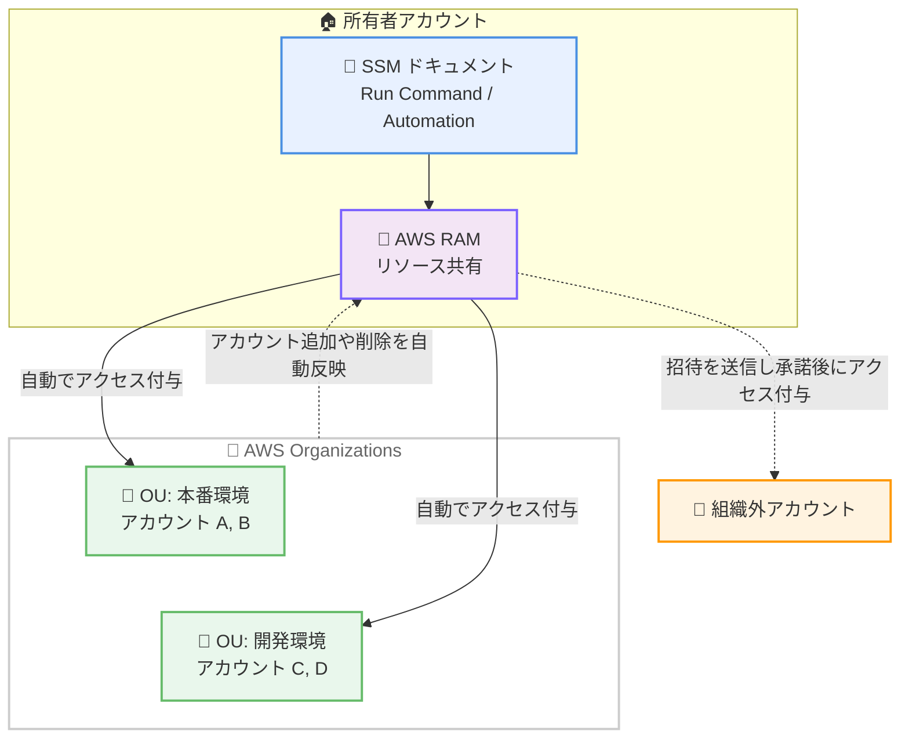

# AWS Systems Manager - AWS Resource Access Manager によるドキュメント共有のサポート

**リリース日**: 2026 年 9 月 29 日
**サービス**: AWS Systems Manager
**機能**: AWS Resource Access Manager (AWS RAM) を使用した SSM ドキュメントの共有

📊 [このアップデートのインフォグラフィックを見る](https://takech9203.github.io/aws-news-summary/20260929-systems-manager-sharing-documents-ram.html)

## 概要

AWS Systems Manager が、AWS Resource Access Manager (AWS RAM) を使用した Systems Manager ドキュメント (SSM ドキュメント) の共有をサポートしました。これにより、AWS Organizations の組織全体、または特定の組織単位 (OU) に対して SSM ドキュメントを共有できるようになります。

これまで SSM ドキュメントの共有は、パブリック共有か、個別の AWS アカウント ID を列挙するプライベート共有のいずれかに限られていました。今回のアップデートにより、組織や OU 単位での共有が可能になり、組織や OU にアカウントが追加・削除された場合も Systems Manager が共有状態を自動的に最新に保つため、アカウントを手動で追跡・更新する必要がなくなります。

共有は AWS RAM のリソース共有とリソースベースポリシーで管理されるため、標準の AWS 認可の仕組みでアクセスが付与されます。組織外のアカウントに共有した場合、そのアカウントはリソース共有の招待を受け取り、承諾して初めてアクセス権を得るため、ドキュメントの所有者と利用者の双方が共有アクセスをより細かく制御できます。マルチアカウント環境で運用自動化のドキュメント (Run Command ドキュメントや Automation ランブックなど) を標準化して展開したい組織に特に有用なアップデートです。

**アップデート前の課題**

- SSM ドキュメントの共有方法は、パブリック共有または個別のアカウント ID を列挙するプライベート共有のみだった
- 組織にアカウントが追加・削除されるたびに、共有先アカウントのリストを手動で更新する必要があった
- 共有状態が `ModifyDocumentPermission` によるドキュメント権限に分散し、組織全体の共有を一元的に把握・監査しにくかった

**アップデート後の改善**

- AWS RAM のリソース共有により、組織全体または特定の OU に対して SSM ドキュメントを共有できるようになった
- 組織や OU のアカウント構成の変化に合わせて、Systems Manager が共有を自動的に最新に保つため、手動でのアカウント管理が不要になった
- AWS RAM コンソールですべての共有を一元的に確認・監査できるようになった
- 組織外アカウントへの共有では招待の承諾が必要となり、共有側・利用側の双方でアクセスの制御性が向上した

## アーキテクチャ図



所有者アカウントが AWS RAM のリソース共有に SSM ドキュメントを追加し、組織・OU・個別アカウントを共有先 (プリンシパル) として指定します。組織内への共有はアカウントの増減に合わせて自動的に反映され、組織外アカウントへの共有は招待の承諾後にアクセスが付与されます。

## サービスアップデートの詳細

### 主要機能

1. **組織・OU 単位でのドキュメント共有**
   - AWS Organizations の組織全体、OU、個別 AWS アカウントの 3 種類のプリンシパルに共有可能
   - 個別のアカウント ID を列挙する必要がなく、組織構造に沿った共有ポリシーを実現できる
   - 組織・OU への共有には、AWS RAM で AWS Organizations との共有を有効化しておく必要がある

2. **共有状態の自動メンテナンス**
   - 組織や OU にアカウントが追加・削除されると、Systems Manager が共有状態を自動的に更新する
   - アカウントリストの手動追跡・更新が不要になり、共有漏れや消し忘れのリスクを低減できる

3. **リソースベースポリシーによる標準的な認可**
   - 共有は AWS RAM とリソースベースポリシーで管理され、標準の AWS 認可でアクセスが付与される
   - 組織外アカウントへの共有では、利用側がリソース共有の招待を承諾するまでアクセスできない
   - AWS RAM コンソールですべての共有を一元的に表示・監査できる

4. **既存の共有からの移行手段**
   - `ModifyDocumentPermission` によるアカウント権限共有から AWS RAM への移行用に、AWS 所有の Automation ランブック `AWS-MigrateSSMDocumentSharingToRAM` が提供される
   - 既存の共有先 (コンシューマー) を維持したまま AWS RAM のリソース共有に移行できる
   - 移行が失敗またはキャンセルされた場合は、ランブックが自動的にロールバックする

## 技術仕様

### 共有方式の比較

| 項目 | AWS RAM 共有 (新方式・推奨) | アカウント権限共有 (従来方式) |
|------|------|------|
| 共有先の指定 | 組織全体、OU、個別アカウント | 個別アカウント ID、またはパブリック |
| アカウント増減への追従 | 自動 | 手動でリストを更新 |
| パブリック共有 | 不可 (プライベート共有のみ) | 可能 (最大 5 ドキュメント) |
| 共有されるバージョン | すべてのバージョン | デフォルトバージョン (アカウント指定時はバージョン指定可) |
| 共有の一元管理 | AWS RAM コンソールで一元管理 | ドキュメントごとの権限設定 |
| 共有数の上限 | AWS RAM のサービスクォータに準拠 | 最大 1,000 アカウント (引き上げ申請可) |

### 主な制約

| 項目 | 詳細 |
|------|------|
| リージョン | 同一リージョン内のアカウントとのみ共有可能 (クロスリージョン共有は不可) |
| 共有操作 | ドキュメントの所有者のみが共有可能 |
| 方式の併用 | 同一ドキュメントで AWS RAM 共有とアカウント権限共有の併用は不可。パブリック共有とプライベート共有の併用も不可 |
| 移行後の API | 移行済みドキュメントに対する `ModifyDocumentPermission` / `DescribeDocumentPermission` は 4xx エラーを返す |

### API 変更履歴

| 日付 | サービス | 変更内容 |
|------|----------|----------|
| 2026/09/28 | [Amazon Simple Systems Manager (SSM)](https://awsapichanges.com/archive/changes/66a474-ssm.html) | 1 updated api methods - RAM を使用した組織・OU への SSM ドキュメント共有のサポートを追加 |

## 設定方法

### 前提条件

1. 共有する SSM ドキュメントの所有者アカウントであること
2. 組織または OU に共有する場合、AWS RAM で AWS Organizations との共有 (信頼されたアクセス) を有効化していること
3. AWS RAM のリソース共有を作成する IAM 権限があること

### 手順

#### ステップ 1: AWS RAM でリソース共有を作成する (コンソール)

1. AWS RAM コンソールを開き、[リソース共有] から [リソース共有を作成] を選択
2. リソース共有の名前を入力
3. リソースタイプで [SSM Documents] を選択し、共有するドキュメントを選択
4. プリンシパルとして組織、OU、または AWS アカウントを追加
5. 内容を確認してリソース共有を作成

#### ステップ 2: CLI でリソース共有を作成する

```bash
aws ram create-resource-share \
    --name MyDocumentShare \
    --resource-arns arn:aws:ssm:ap-northeast-1:111122223333:document/MyRunbook \
    --principals arn:aws:organizations::111122223333:ou/o-exampleorgid/ou-exampleouid
```

AWS RAM のリソース共有を作成し、SSM ドキュメントの ARN をリソースとして追加、共有先のプリンシパル (組織 ARN、OU ARN、またはアカウント ID) を指定するコマンドです。共有の作成後、利用側アカウントに反映されるまで数分かかる場合があります。

#### ステップ 3: 共有されたドキュメントを利用する

```bash
# 共有されたプライベートドキュメントの一覧を表示
aws ssm list-documents --filters Key=Owner,Values=Private

# 共有ドキュメントを ARN で指定して実行
aws ssm send-command \
    --document-name arn:aws:ssm:ap-northeast-1:111122223333:document/MyRunbook \
    --instance-ids i-1234567890abcdef0
```

利用側アカウントで共有されたドキュメントを一覧表示し、ドキュメントの完全な ARN を `--document-name` に指定してコマンドを実行する例です。コンソール以外から共有ドキュメントを実行する場合は、完全な ARN の指定が必要です。

#### ステップ 4: 既存の共有を AWS RAM に移行する (必要な場合)

1. Systems Manager コンソールの [ドキュメント] から対象ドキュメントを選択
2. [詳細] タブの [アクセス許可] セクションで [Migrate to RAM] を選択
3. 移行するドキュメントと Automation 用の IAM ロール (AutomationAssumeRole) を指定
4. [Start migration] を選択して `AWS-MigrateSSMDocumentSharingToRAM` ランブックを実行

既存の共有先を維持したまま AWS RAM のリソース共有に移行します。パブリック共有中のドキュメントは移行できないため、先にパブリック共有を停止する必要があります。

## メリット

### ビジネス面

- **ガバナンスの強化**: 組織・OU 単位の共有と AWS RAM コンソールでの一元管理により、誰に何を共有しているかを可視化・監査しやすくなる
- **運用コストの削減**: アカウントの増減に共有が自動追従するため、共有先リストのメンテナンス作業が不要になる
- **追加料金なし**: AWS RAM によるドキュメント共有に追加料金は発生しない (移行用ランブックの Automation 実行には Systems Manager の料金が適用される)

### 技術面

- **標準的な認可モデル**: リソースベースポリシーによる標準の AWS 認可でアクセスが付与され、IAM ポリシーと組み合わせた制御が可能
- **アクセス制御の双方向性**: 組織外アカウントへの共有では招待の承諾が必要なため、意図しない共有の受け入れを防止できる
- **既存共有からの移行パス**: `AWS-MigrateSSMDocumentSharingToRAM` ランブックにより、既存の共有先を維持したまま安全に移行できる (失敗時は自動ロールバック)

## デメリット・制約事項

### 制限事項

- 同一 AWS リージョン内のアカウントとのみ共有可能 (クロスリージョン共有は不可)
- AWS RAM 共有はプライベート共有のみで、パブリック共有には従来のアカウント権限方式を使用する必要がある
- 同一ドキュメントに対して AWS RAM 共有とアカウント権限共有 (`ModifyDocumentPermission`) を併用できない
- AWS RAM 共有ではドキュメントのすべてのバージョンが共有される (特定バージョンのみの共有は不可)
- AWS RAM のサービスクォータが適用される

### 考慮すべき点

- 移行後のドキュメントに対しては `ModifyDocumentPermission` / `DescribeDocumentPermission` が 4xx エラーを返すため、これらの API を使用する既存の自動化やスクリプトの改修が必要
- 組織・OU への共有には、事前に AWS RAM で AWS Organizations との共有を有効化する必要がある
- 共有ドキュメントは信頼できるソースのもののみ使用し、実行前に内容を必ず確認するというベストプラクティスは引き続き適用される
- 移行用ランブックの実行には Systems Manager Automation の料金が発生する

## ユースケース

### ユースケース 1: 組織全体への標準運用ランブックの展開

**シナリオ**: 中央の運用チームが、パッチ適用やログ収集などの標準化された Automation ランブックを組織内のすべてのアカウントに提供したい。

**実装例**:
```bash
aws ram create-resource-share \
    --name OrgStandardRunbooks \
    --resource-arns \
        arn:aws:ssm:ap-northeast-1:111122223333:document/Standard-PatchRunbook \
        arn:aws:ssm:ap-northeast-1:111122223333:document/Standard-LogCollection \
    --principals arn:aws:organizations::111122223333:organization/o-exampleorgid
```

**効果**: 新しいアカウントが組織に追加されると自動的にランブックへのアクセスが付与され、共有先リストのメンテナンスなしで組織全体の運用標準化を維持できる。

### ユースケース 2: OU 単位での環境別ドキュメント配布

**シナリオ**: 本番環境 OU には厳格な変更管理用ドキュメントのみ、開発環境 OU には検証用ドキュメントを共有するなど、環境ごとに異なるドキュメントセットを配布したい。

**実装例**:
```bash
# 本番環境 OU 向けの共有
aws ram create-resource-share \
    --name ProdDocuments \
    --resource-arns arn:aws:ssm:ap-northeast-1:111122223333:document/Prod-ChangeManagement \
    --principals arn:aws:organizations::111122223333:ou/o-exampleorgid/ou-prod

# 開発環境 OU 向けの共有
aws ram create-resource-share \
    --name DevDocuments \
    --resource-arns arn:aws:ssm:ap-northeast-1:111122223333:document/Dev-TestAutomation \
    --principals arn:aws:organizations::111122223333:ou/o-exampleorgid/ou-dev
```

**効果**: OU の構造に沿ったドキュメント配布により、環境ごとのガバナンス要件を満たしつつ、アカウントの OU 間移動にも共有が自動追従する。

### ユースケース 3: 既存のアカウント権限共有からの移行

**シナリオ**: これまで `ModifyDocumentPermission` で数十のアカウント ID に共有していたドキュメントを、管理性向上のため AWS RAM に移行したい。

**実装例**:
```
1. Systems Manager コンソールの [ドキュメント] で対象ドキュメントを選択
2. [詳細] タブの [アクセス許可] から [Migrate to RAM] を選択
3. AutomationAssumeRole を指定し、必要に応じて共有先の組織 ID / OU ID を追加
4. [Start migration] で AWS-MigrateSSMDocumentSharingToRAM ランブックを実行
```

**効果**: 既存の共有先を維持したまま AWS RAM に移行でき、以降は AWS RAM コンソールで共有を一元管理できる。失敗時は自動ロールバックされるため安全に移行できる。

## 料金

AWS RAM を通じた SSM ドキュメントの共有に追加料金はかかりません。AWS RAM 自体も無料で利用できます。

なお、既存の共有を移行する `AWS-MigrateSSMDocumentSharingToRAM` ランブックの実行には AWS Systems Manager Automation が使用されるため、Automation のステップ実行に応じた料金が発生します。

## 利用可能リージョン

AWS Systems Manager が利用可能なすべての AWS リージョンで利用できます (東京・大阪リージョンを含む)。Systems Manager コンソール、AWS CLI、AWS SDK から利用可能です。

## 関連サービス・機能

- **AWS Resource Access Manager (AWS RAM)**: リソース共有の作成・管理を担うサービス。SSM ドキュメントが共有可能なリソースタイプに追加された
- **AWS Organizations**: 組織・OU 単位での共有先指定に使用。AWS RAM との連携 (信頼されたアクセス) の有効化が必要
- **AWS Systems Manager Automation**: 共有対象となる Automation ランブックの実行基盤。既存共有の移行用ランブック `AWS-MigrateSSMDocumentSharingToRAM` も Automation で実行される
- **AWS Identity and Access Management (IAM)**: 共有ドキュメントへのアクセスはリソースベースポリシーと IAM ポリシーを組み合わせて制御する

## 参考リンク

- 📊 [インフォグラフィック](https://takech9203.github.io/aws-news-summary/20260929-systems-manager-sharing-documents-ram.html)
- [公式発表 (What's New)](https://aws.amazon.com/about-aws/whats-new/2026/09/systems-manager-sharing-documents-ram/)
- [ドキュメント: Sharing SSM documents](https://docs.aws.amazon.com/systems-manager/latest/userguide/documents-ssm-sharing.html)
- [ドキュメント: Getting started with AWS RAM](https://docs.aws.amazon.com/ram/latest/userguide/getting-started-sharing.html)
- [ドキュメント: AWS-MigrateSSMDocumentSharingToRAM ランブック](https://docs.aws.amazon.com/systems-manager-automation-runbooks/latest/userguide/automation-aws-migratessmdocumentsharingtoram.html)
- [料金ページ: AWS Systems Manager](https://aws.amazon.com/systems-manager/pricing/)
- [API 変更履歴 (awsapichanges.com)](https://awsapichanges.com/archive/changes/66a474-ssm.html)

## まとめ

AWS RAM による SSM ドキュメント共有のサポートにより、マルチアカウント環境での運用ドキュメントの配布が組織・OU 単位で自動化され、アカウントリストの手動管理が不要になりました。マルチアカウントで SSM ドキュメントを共有している組織は、新規の共有には AWS RAM 方式を採用し、既存のアカウント権限共有は `AWS-MigrateSSMDocumentSharingToRAM` ランブックでの移行を検討することを推奨します。移行後は `ModifyDocumentPermission` などの API が使用できなくなるため、既存の自動化への影響を事前に確認してください。
