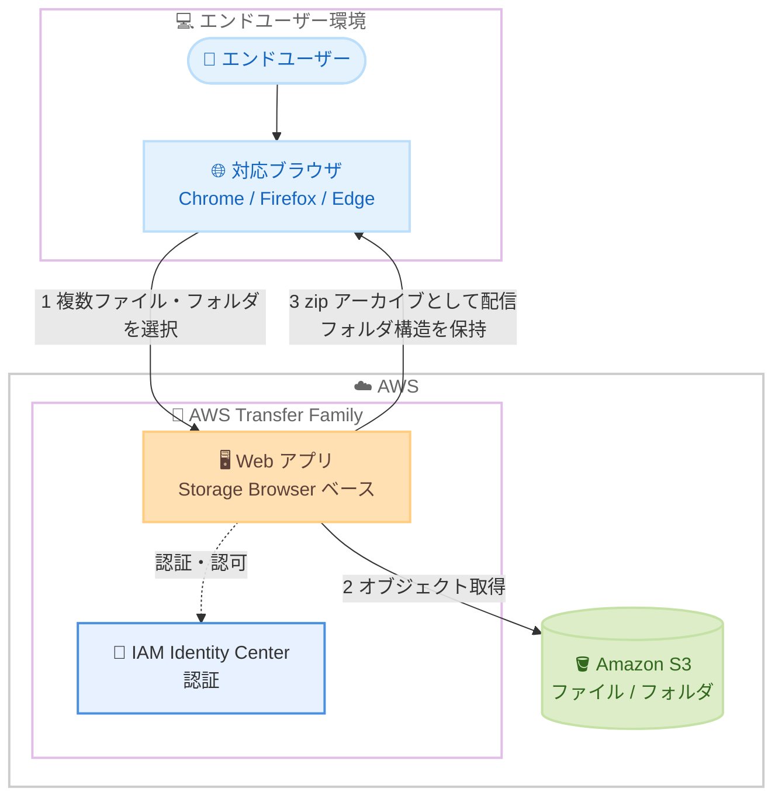

# AWS Transfer Family - Web アプリでの複数ファイル・フォルダの一括ダウンロード対応

**リリース日**: 2026 年 9 月 29 日
**サービス**: AWS Transfer Family
**機能**: Web アプリにおける複数ファイル・フォルダの一括ダウンロード

📊 [このアップデートのインフォグラフィックを見る](https://takech9203.github.io/aws-news-summary/20260929-transfer-family-web-apps-download-multiple-files-folders.html)

## 概要

AWS Transfer Family の Web アプリで、複数のファイルとフォルダを一括でダウンロードできるようになりました。エンドユーザーはファイルとフォルダを任意の組み合わせで選択し、1 回の操作でまとめてダウンロードできます。ダウンロードは zip アーカイブとして提供され、解凍時には元のフォルダ構造がそのまま保持されます。

Transfer Family Web アプリは、Amazon S3 上のデータをブラウザ経由で参照・アップロード・ダウンロードできるフルマネージドなポータル機能です。今回のアップデートにより、大量のファイルを扱うエンドユーザーの操作性が大幅に向上し、ファイル共有ポータルとしての実用性が高まります。

利用を開始するには、Web アプリ上でファイルとフォルダを選択し、アクションメニューから [Download] を選択します。Web アプリはダウンロード対象のファイル一覧と、ファイルごとの成功・失敗ステータスを含むリアルタイムの進捗を表示します。

**アップデート前の課題**

- 以前はエンドユーザーが一度にダウンロードできるのは 1 ファイルのみだった
- フォルダ単位でのダウンロードはまったくできなかった
- 多数のファイルを取得するには、1 件ずつダウンロード操作を繰り返す必要があり、作業負荷が高かった

**アップデート後の改善**

- ファイルとフォルダを任意の組み合わせで選択し、1 回の操作で一括ダウンロードできるようになった
- zip アーカイブとして配信され、解凍時に元のフォルダ構造が保持されるようになった
- ダウンロード対象のファイル一覧と、ファイルごとの成功・失敗ステータスをリアルタイムで確認できるようになった

## アーキテクチャ図



エンドユーザーがブラウザ上の Web アプリで複数のファイル・フォルダを選択すると、Amazon S3 から取得したオブジェクトがフォルダ構造を保持した zip アーカイブとして一括ダウンロードされます。

## サービスアップデートの詳細

### 主要機能

1. **複数ファイル・フォルダの一括選択とダウンロード**
   - ファイルとフォルダを任意の組み合わせで選択可能
   - 1 回の操作 (アクションメニューの [Download]) でまとめてダウンロード
   - フォルダ単体のダウンロードにも対応

2. **zip アーカイブによる配信**
   - ダウンロードは単一の zip アーカイブとして配信
   - 解凍時に元のフォルダ構造をそのまま復元
   - 手動でのファイル整理が不要

3. **リアルタイムの進捗表示**
   - ダウンロード対象のファイル一覧を表示
   - ファイルごとに成功・失敗のステータスをリアルタイムで確認可能
   - 大量ファイルのダウンロード状況を可視化

## 技術仕様

### ブラウザ対応状況

| ブラウザ | 複数ファイルダウンロード |
|------|------|
| Google Chrome | 対応 |
| Mozilla Firefox | 対応 |
| Microsoft Edge などの Chromium ベースブラウザ | 対応 |
| Safari | 非対応 (従来どおり 1 ファイルずつのダウンロードは可能) |

### 機能概要

| 項目 | 詳細 |
|------|------|
| 選択対象 | ファイルとフォルダの任意の組み合わせ |
| 配信形式 | zip アーカイブ (フォルダ構造を保持) |
| 進捗表示 | ファイルごとの成功・失敗ステータスをリアルタイム表示 |
| 追加設定 | 不要 (既存の Web アプリでそのまま利用可能) |

## 設定方法

### 前提条件

1. AWS Transfer Family の Web アプリが作成済みであること
2. エンドユーザーが IAM Identity Center 経由で Web アプリにアクセスできること
3. エンドユーザーが Google Chrome、Mozilla Firefox、または Chromium ベースのブラウザを使用していること

### 手順

#### ステップ 1: Web アプリにサインイン

エンドユーザーは Web アプリのアクセスエンドポイント URL にブラウザでアクセスし、認証情報でサインインします。既存の Web アプリに追加の設定は不要です。

#### ステップ 2: ファイルとフォルダを選択

ダウンロードしたいロケーションに移動し、ファイルとフォルダを任意の組み合わせで選択します。

#### ステップ 3: 一括ダウンロードを実行

アクションメニューから [Download] を選択します。ダウンロード対象のファイル一覧と進捗が表示され、完了すると zip アーカイブとして保存されます。解凍すると元のフォルダ構造が復元されます。

## メリット

### ビジネス面

- **エンドユーザーの生産性向上**: 1 件ずつの繰り返し操作が不要になり、大量ファイルの取得作業が大幅に効率化される
- **問い合わせ削減**: フォルダごとダウンロードできないことによるユーザーからの問い合わせや回避策の案内が不要になる
- **ポータルとしての完成度向上**: 取引先やパートナーへのファイル共有ポータルとして、一般的なファイル共有サービスと同等の操作性を提供できる

### 技術面

- **フォルダ構造の保持**: zip 解凍時に元の階層構造がそのまま復元されるため、ダウンロード後の手動整理が不要
- **可視性の向上**: ファイルごとの成功・失敗ステータスにより、部分的な失敗も特定しやすい
- **追加開発が不要**: フルマネージド機能として提供されるため、カスタムポータルの開発・保守なしで利用できる

## デメリット・制約事項

### 制限事項

- Safari では複数ファイルダウンロードが利用できない (1 ファイルずつのダウンロードは引き続き可能)
- 対応ブラウザは Google Chrome、Mozilla Firefox、Microsoft Edge などの Chromium ベースブラウザに限られる

### 考慮すべき点

- エンドユーザーの利用ブラウザに Safari が含まれる場合は、対応ブラウザの利用を案内する運用が必要
- 大量・大容量のファイルを一括ダウンロードする場合は、クライアント側のネットワーク帯域やストレージ容量に注意が必要

## ユースケース

### ユースケース 1: 取引先へのファイル共有ポータル

**シナリオ**: 製造業の企業が、設計図面や仕様書などの多数のドキュメントを取引先に共有している。従来は取引先の担当者がファイルを 1 件ずつダウンロードする必要があり、負担が大きかった。

**実装例**:
```
1. Transfer Family Web アプリで取引先ごとのフォルダを用意
2. 取引先の担当者は案件フォルダを選択して [Download] を実行
3. フォルダ構造を保持した zip として一括取得
```

**効果**: 数十から数百のファイルを 1 回の操作で取得でき、取引先の作業負荷と共有にかかるリードタイムを削減できる。

### ユースケース 2: 月次レポートの一括回収

**シナリオ**: 金融機関のバックオフィス部門が、S3 に蓄積された月次レポート群を監査対応のためにまとめて取得する必要がある。

**実装例**:
```
1. 対象月のレポートフォルダと関連ファイルを Web アプリ上で複数選択
2. 一括ダウンロードを実行し、進捗画面でファイルごとの成功・失敗を確認
3. 失敗したファイルのみ個別に再取得
```

**効果**: 取得漏れをステータス表示で確認しながら、監査資料を効率的に回収できる。

### ユースケース 3: メディアファイルの受け渡し

**シナリオ**: メディア企業が、撮影素材や編集済みコンテンツを外部の制作会社と受け渡ししている。素材はプロジェクトごとのフォルダ階層で管理されている。

**実装例**:
```
1. 制作会社の担当者が Web アプリにサインイン
2. プロジェクトフォルダを選択して一括ダウンロード
3. 解凍後もフォルダ階層がそのまま維持され、編集ツールでそのまま利用
```

**効果**: フォルダ構造の再構築が不要になり、素材受け渡し後の作業をすぐに開始できる。

## 料金

本機能の利用に追加料金は発生しません。Transfer Family Web アプリの料金は、プロビジョニングした Web アプリユニット数に基づく時間課金です。詳細は [AWS Transfer Family の料金ページ](https://aws.amazon.com/aws-transfer-family/pricing/) を参照してください。

## 利用可能リージョン

Transfer Family Web アプリが提供されているすべての AWS リージョンで利用可能です。

## 関連サービス・機能

- **Amazon S3**: Web アプリのダウンロード対象となるファイル・フォルダの格納先ストレージ
- **Storage Browser for Amazon S3**: Transfer Family Web アプリの基盤となる S3 用ブラウザインターフェース
- **AWS IAM Identity Center**: Web アプリのエンドユーザー認証を担う ID 管理サービス

## 参考リンク

- 📊 [インフォグラフィック](https://takech9203.github.io/aws-news-summary/20260929-transfer-family-web-apps-download-multiple-files-folders.html)
- [公式発表 (What's New)](https://aws.amazon.com/about-aws/whats-new/2026/09/transfer-family-web-apps-download-multiple-files-folders)
- [ドキュメント: Transfer Family web apps User Guide](https://docs.aws.amazon.com/transfer/latest/userguide/web-app.html)
- [料金ページ](https://aws.amazon.com/aws-transfer-family/pricing/)

## まとめ

Transfer Family Web アプリの複数ファイル・フォルダ一括ダウンロード対応により、エンドユーザー向けファイル共有ポータルとしての操作性が大きく向上しました。既存の Web アプリに追加設定なしで適用されるため、Web アプリを利用中の場合は対応ブラウザとあわせてエンドユーザーへの周知を推奨します。Safari 利用者が多い環境では、対応ブラウザへの誘導を検討してください。
