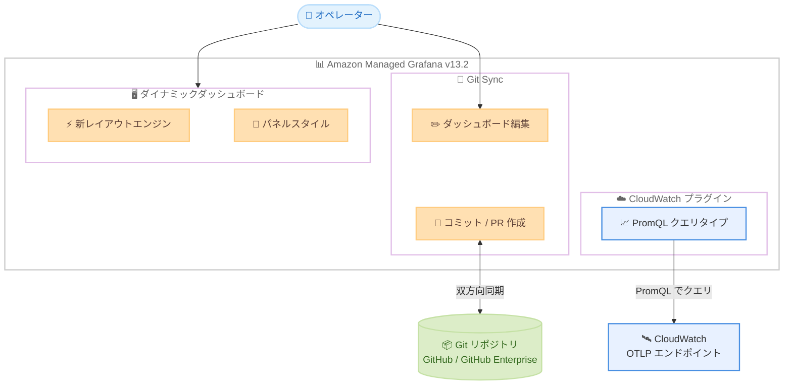

# Amazon Managed Grafana - Grafana 13.2 ワークスペース作成サポート

**リリース日**: 2026 年 9 月 30 日
**サービス**: Amazon Managed Grafana
**機能**: Grafana バージョン 13.2 ワークスペースの新規作成

📊 [このアップデートのインフォグラフィックを見る](https://takech9203.github.io/aws-news-summary/20260930-amazon-managed-grafana-now-supports-creating-grafana-13-2-workspaces.html)

## 概要

Amazon Managed Grafana が Grafana バージョン 13.2 でのワークスペース新規作成をサポートした。このリリースにはオープンソース Grafana 13.0 から 13.2 までの機能が含まれており、ダッシュボードをコードとして管理する Git Sync、新しいレイアウトエンジンによるダイナミックダッシュボード、CloudWatch データソースプラグインにおける PromQL サポートなど、多数の機能強化が含まれる。

特に Git Sync は、ワークスペースを Git リポジトリに接続することでダッシュボードの変更履歴の追跡、レビュー、ロールバックを可能にする機能であり、ダッシュボード管理に IaC (Infrastructure as Code) と同様のワークフローを導入できる。オブザーバビリティ資産を組織的に管理したい運用チームやプラットフォームチームにとって重要なアップデートである。

**アップデート前の課題**

- ダッシュボードの変更履歴を Grafana 内で体系的に管理する手段が限られており、変更のレビューやロールバックには手動でのエクスポートや外部ツールが必要だった
- ダッシュボードのレイアウトは静的であり、データや変数の条件に応じて表示を動的に変化させることが難しかった
- CloudWatch の OTLP エンドポイント経由で取り込んだメトリクスを、Prometheus ユーザーに馴染みのある PromQL で直接クエリできなかった

**アップデート後の改善**

- Git Sync によりワークスペースと Git リポジトリを接続し、ダッシュボードとフォルダをコードとして双方向に同期できるようになった
- ダイナミックダッシュボードが GA (一般提供) となりデフォルトで有効化され、データや変数の条件に応答するレスポンシブなビューを構築できるようになった
- CloudWatch データソースプラグインに PromQL クエリタイプが追加され、既存の Metric Search および Metrics Insights クエリタイプを補完する選択肢が増えた

## アーキテクチャ図



Grafana 13.2 の主要コンポーネント構成を示す。Git Sync によるダッシュボードと Git リポジトリの双方向同期、ダイナミックダッシュボード、CloudWatch OTLP メトリクスへの PromQL クエリが新たに利用可能になった。

## サービスアップデートの詳細

### 主要機能

1. **Git Sync によるダッシュボードのコード管理**
   - ワークスペースを Git リポジトリに接続し、ダッシュボードとフォルダをコードとして管理可能
   - Grafana の UI から離れることなく、ダッシュボードの編集、保存、コミット、プルリクエストの作成が可能
   - リポジトリ側の変更はワークスペースに自動的に同期される双方向同期
   - GitHub Enterprise のサポート、リポジトリルートへの同期、UI からの既存ダッシュボードのインポートに対応
   - GPG、SSH、S/MIME 署名キーによる検証済みコミット (Verified commits) をサポート

2. **ダイナミックダッシュボード**
   - 新しいレイアウトエンジン、編集エクスペリエンス、ダッシュボード構造が GA となりデフォルトで有効化
   - データや変数の条件に応答するレスポンシブなビューを構築可能
   - 既存ダッシュボードは初回オープン時に新スキーマへ自動移行される
   - 複数パネルの一括選択による行またはタブへのグループ化、セクションレベル変数、時間軸上で近接するアノテーションのクラスタリング表示などを含む

3. **CloudWatch データソースプラグインの PromQL サポート**
   - CloudWatch の OTLP (OpenTelemetry Protocol) エンドポイント経由で取り込んだメトリクスを PromQL でクエリ可能
   - Builder モードと Code モードの両方の編集モードに対応
   - 既存の Metric Search および Metrics Insights クエリタイプを補完

4. **ダッシュボード・ビジュアライゼーションの強化**
   - 削除済みダッシュボードの復元 (Recently deleted ビュー) が GA
   - 刷新されたゲージビジュアライゼーション、ビジュアライゼーション提案の品質向上
   - パネルスタイル機能により、色、しきい値、表示オプションのセットをワンクリックで適用、パネル間でのコピー&ペーストにも対応
   - 保存済みクエリ (Saved queries) によりクエリの発見、再利用、共有が可能になり、Terraform でのプロビジョニングにも対応

5. **データソースの強化**
   - Elasticsearch データソースに Query DSL と ES|QL をサポートする raw クエリエディタを追加
   - OpenSearch データソースにインデックスブラウザを追加
   - Azure Monitor データソースが Metrics Batch API に対応し、クエリ数の削減とスロットリング回避を実現

## 技術仕様

### バージョン比較

| 項目 | Grafana 12.4 | Grafana 13.2 |
|------|--------------|--------------|
| ダッシュボード管理 | ワークスペース内で管理 | Git Sync によるコード管理 |
| レイアウトエンジン | Scenes エンジン | ダイナミックダッシュボード GA |
| CloudWatch クエリ | Metric Search、Metrics Insights、PPL/SQL | PromQL クエリタイプを追加 |
| 削除ダッシュボード復元 | 非対応 | Recently deleted ビューで復元可能 |
| クエリ再利用 | 限定的 | 保存済みクエリで組織内共有 |
| コミット署名 | 該当なし | GPG / SSH / S/MIME 署名に対応 |

### 破壊的変更

Grafana バージョン 13 には、以前のバージョンで使用していた機能が動作しなくなる可能性のある変更が含まれる。

| 変更内容 | 影響と対応 |
|----------|-----------|
| レガシー Alertmanager 設定 API の削除・制限 | バージョン 12 で非推奨となったシングルテナント Alertmanager 設定 API が削除または制限される。`/api/v1/provisioning` などのサポートされるプロビジョニングエンドポイントへの移行が必要 |
| 数値 ID ベースのデータソース API がデフォルト無効化 | バージョン 9 で非推奨となった数値 `id` 参照の API が無効化される。`uid` を使用する API への更新が必要 |
| AWS IoT TwinMaker アプリプラグインの非サポート | コアアプリケーションの React 19 へのアップグレードに伴い、`grafana-iot-twinmaker-app` の SceneViewer パネルが動作しなくなる。代替のビジュアライゼーションの検討が必要 |

### API 変更履歴

直近 14 日間で Amazon Managed Grafana に関連する API 変更は確認されなかった。ワークスペース作成時の `grafanaVersion` パラメータで `13.2` を指定する。

## 設定方法

### 前提条件

1. AWS アカウントを持っていること
2. Amazon Managed Grafana のワークスペース作成権限があること
3. Git Sync を利用する場合は、接続先の Git リポジトリ (GitHub または GitHub Enterprise) へのアクセス権があること

### 手順

#### ステップ 1: Grafana 13.2 ワークスペースの作成

```bash
aws grafana create-workspace \
  --workspace-name "my-grafana-v13-workspace" \
  --account-access-type CURRENT_ACCOUNT \
  --authentication-providers AWS_SSO \
  --permission-type SERVICE_MANAGED \
  --grafana-version "13.2"
```

上記コマンドは `--grafana-version` パラメータで 13.2 を指定して新しいワークスペースを作成する。マネジメントコンソールの場合は、ワークスペース作成画面でバージョン 13.2 を選択する。

#### ステップ 2: Git Sync の設定

ワークスペース作成後、Grafana UI の管理メニューから Git Sync を設定し、ダッシュボードを管理する Git リポジトリを接続する。コミット署名を利用する場合は、GPG、SSH、S/MIME のいずれかの署名キーを設定する。

#### ステップ 3: CloudWatch データソースでの PromQL クエリ

CloudWatch データソースを追加した後、クエリエディタで PromQL クエリタイプを選択する。OTLP エンドポイント経由で CloudWatch に取り込んだメトリクスに対して、Builder モードまたは Code モードで PromQL クエリを記述する。

## メリット

### ビジネス面

- **ガバナンスの強化**: Git Sync によりダッシュボードの変更がすべて Git の履歴として記録され、レビュープロセスを通じた品質管理と監査対応が容易になる
- **運用資産の保護**: 削除済みダッシュボードの復元機能により、誤削除による再構築コストを削減できる
- **チーム生産性の向上**: 保存済みクエリの組織内共有により、クエリ作成の重複作業を削減できる

### 技術面

- **Dashboards as Code の実現**: ダッシュボードを JSON ファイルとしてリポジトリで管理し、CI/CD パイプラインや既存の開発ワークフローに統合できる
- **PromQL スキルの再利用**: Prometheus に慣れたエンジニアが、CloudWatch の OTLP メトリクスに対しても同じクエリ言語を使用できる
- **表現力の高いダッシュボード**: ダイナミックダッシュボードにより、条件に応じて変化するレスポンシブなビューやセクションレベル変数を活用できる

## デメリット・制約事項

### 制限事項

- 新規ワークスペース作成のサポートであり、既存ワークスペースのバージョンアップは別途アップデート操作が必要
- AWS IoT TwinMaker アプリプラグインはバージョン 13 では動作せず、プラグインカタログからも削除されている
- レガシー Alertmanager 設定 API を使用する既存の自動化はバージョン 13 で動作しなくなる

### 考慮すべき点

- 既存ダッシュボードはダイナミックダッシュボードの新スキーマへ初回オープン時に自動移行されるため、本番ワークスペースの更新前に非本番環境での動作検証を推奨
- 数値 ID でデータソースを参照する自動化スクリプトは `uid` ベースへの更新が必要
- Git Sync の導入にあたっては、リポジトリのブランチ戦略やレビュープロセスの整備が必要

## ユースケース

### ユースケース 1: ダッシュボードの GitOps 運用

**シナリオ**: プラットフォームチームが Grafana ワークスペースを GitHub リポジトリに接続し、ダッシュボードの変更をプルリクエストベースでレビューする運用を導入する。コミット署名を有効化して変更の信頼性を担保する。

**効果**: ダッシュボードの変更履歴が完全に追跡可能になり、問題のある変更は Git の操作で即座にロールバックできる。複数環境へのダッシュボード展開もリポジトリ経由で標準化できる。

### ユースケース 2: OpenTelemetry メトリクスの PromQL 分析

**シナリオ**: OpenTelemetry Collector から CloudWatch の OTLP エンドポイントへメトリクスを送信している開発チームが、Grafana の CloudWatch データソースから PromQL でメトリクスをクエリし、Prometheus 環境と共通のダッシュボードパターンを構築する。

**実装例**:
```
rate(http_server_request_duration_count[5m])
```

**効果**: Prometheus で培ったクエリ資産とスキルを CloudWatch メトリクスにも適用でき、ハイブリッドなオブザーバビリティ環境でのクエリ言語を統一できる。

### ユースケース 3: 大規模組織でのクエリ標準化

**シナリオ**: 複数チームが利用する共有ワークスペースで、SRE チームが標準クエリを保存済みクエリとして公開し、Terraform でプロビジョニングする。各チームはコマンドパレットから検索して再利用する。

**効果**: ベストプラクティスに沿ったクエリが組織全体で再利用され、ダッシュボード品質の均一化とオンボーディングの迅速化が実現する。

## 料金

Amazon Managed Grafana の料金体系に変更はない。Grafana 13.2 ワークスペースも既存の料金体系が適用される。

| 項目 | 料金 |
|------|------|
| アクティブエディター/管理者 | $9/ユーザー/月 |
| アクティブビューアー | $5/ユーザー/月 |

最新の料金は [料金ページ](https://aws.amazon.com/grafana/pricing/) を参照。

## 利用可能リージョン

Amazon Managed Grafana が一般提供されているすべての AWS リージョンで Grafana 13.2 ワークスペースの作成が可能。

## 関連サービス・機能

- **Amazon CloudWatch**: OTLP エンドポイントで取り込んだメトリクスを PromQL でクエリ可能になった主要データソース
- **Amazon Managed Service for Prometheus**: PromQL ベースのメトリクス監視サービス。Grafana との組み合わせで PromQL スキルを共通化できる
- **AWS IAM Identity Center**: Grafana ワークスペースの認証に使用
- **GitHub / GitHub Enterprise**: Git Sync の接続先としてダッシュボードのコード管理を実現

## 参考リンク

- 📊 [インフォグラフィック](https://takech9203.github.io/aws-news-summary/20260930-amazon-managed-grafana-now-supports-creating-grafana-13-2-workspaces.html)
- [公式発表 (What's New)](https://aws.amazon.com/about-aws/whats-new/2026/09/amazon-managed-grafana-now-supports-creating-grafana-13-2-workspaces)
- [Grafana バージョン間の差異 (ユーザーガイド)](https://docs.aws.amazon.com/grafana/latest/userguide/version-differences.html#version-diff-v13)
- [製品ページ](https://aws.amazon.com/grafana/)
- [料金ページ](https://aws.amazon.com/grafana/pricing/)

## まとめ

Amazon Managed Grafana の Grafana 13.2 サポートは、Git Sync によるダッシュボードのコード管理、ダイナミックダッシュボードの GA、CloudWatch データソースの PromQL 対応という、ダッシュボード運用の成熟度を高めるメジャーアップデートである。新規ワークスペースでは 13.2 の選択を推奨するが、既存ワークスペースの更新時にはレガシー Alertmanager API や AWS IoT TwinMaker プラグインなどの破壊的変更の影響を非本番環境で検証することが重要である。
