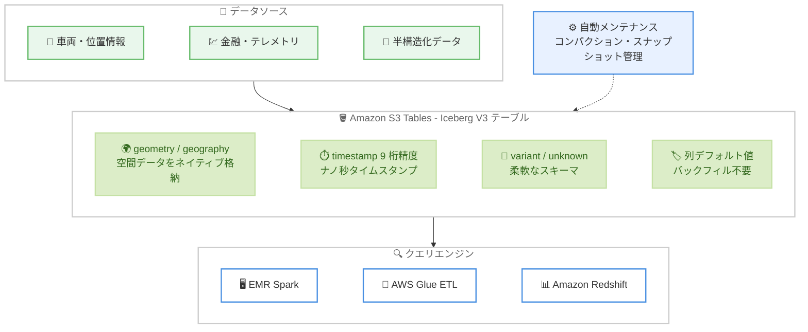

# Amazon S3 Tables - Apache Iceberg V3 全データ型サポート

**リリース日**: 2026 年 9 月 30 日
**サービス**: Amazon S3 Tables
**機能**: Apache Iceberg V3 データ型の完全サポート

📊 [このアップデートのインフォグラフィックを見る](https://takech9203.github.io/aws-news-summary/20260930-amazon-s3-tables-iceberg-v3-data-types.html)

## 概要

Amazon S3 Tables が、Apache Iceberg Version 3 (V3) 仕様で定義されたすべてのデータ型をサポートしました。今回のアップデートで、空間データを格納する geometry 型と geography 型、スキーマ進化のプレースホルダーとして使える unknown 型、ナノ秒精度のタイムスタンプ型 (timestamp(9) / timestamptz(9))、および列のデフォルト値 (column default values) が新たに追加されました。これにより、S3 Tables は Iceberg V3 が導入するデータ型を網羅的にカバーすることになります。

今回の追加は、既にサポートされていた variant データ型、削除ベクトル (deletion vectors)、行リネージ (row lineage) の上に積み重なるものです。地理空間データやナノ秒精度のイベント時刻を、文字列や整数にエンコードすることなくネイティブに格納できるため、データアーキテクチャの簡素化、ストレージ効率の向上、クエリパフォーマンスの改善につながります。

車両管理 (フリートトラッキング) や資産マッピングのような位置情報ワークロード、テレメトリや金融取引のような高精度時刻を扱うワークロードを S3 Tables 上の Iceberg データレイクで運用するユーザーが主な対象です。S3 Tables の自動メンテナンス (コンパクション等) は V3 テーブルにも適用されるため、データの増加に伴ってもテーブルのパフォーマンスとコスト効率が維持されます。

**アップデート前の課題**

- 位置情報 (点、線、ポリゴン) をネイティブ型で格納できず、WKT 文字列や緯度・経度のペア (double 値) としてエンコードする必要があった
- ナノ秒精度のイベント時刻を格納するには、整数型にエンコードして読み取り時に変換する必要があった
- エンコードされた値では、クエリ時に位置や時刻で直接フィルタリングできず、変換処理によるオーバーヘッドが発生していた
- 既存テーブルに新しい列を追加した場合、既存行に値を設定するにはバックフィル (データの書き直し) が必要だった

**アップデート後の改善**

- geometry / geography 型により、空間データをネイティブ列として格納し、クエリ時に位置で直接フィルタリングできるようになった
- timestamp(9) / timestamptz(9) により、ソース精度のままナノ秒タイムスタンプを記録できるようになった
- 列のデフォルト値により、新しく追加した列の値がバックフィルなしで既存行に反映されるようになった
- unknown 型により、型が未確定の列をプレースホルダーとして定義でき、他のテーブルフォーマットからの移行やスキーマ進化が容易になった
- S3 Tables が Iceberg V3 の全データ型をサポートしたことで、V3 への移行判断がシンプルになった

## アーキテクチャ図



位置情報や高精度時刻のデータをエンコードせずに V3 のネイティブデータ型として S3 Tables に格納し、EMR Spark や AWS Glue ETL などの V3 対応エンジンから直接クエリできます。自動メンテナンスは V3 テーブルにも適用されます。

## サービスアップデートの詳細

### 主要機能

1. **地理空間データ型 (geometry / geography)**
   - 点、線、ポリゴンをエンコード文字列や緯度・経度ペアではなく、ネイティブ列として格納
   - geometry はデカルト平面上で、geography は回転楕円体上の球面座標として座標を扱う
   - 両型とも空間参照系識別子 SRID 0 と SRID 4326 を認識
   - `ST_Intersects` などの空間述語により、クエリ時に位置で直接フィルタリング可能

2. **ナノ秒精度タイムスタンプ (timestamp(9) / timestamptz(9))**
   - `timestamp(9)` はタイムゾーンなし、`timestamptz(9)` はタイムゾーンありのナノ秒精度タイムスタンプ
   - テレメトリ、センサーフュージョン、金融ワークロードでソース精度のまま時刻を記録可能
   - 整数へのエンコードと読み取り時の変換が不要になる

3. **列のデフォルト値 (column default values)**
   - `initial-default` (列追加前に書き込まれたレコード用) と `write-default` (書き込み時に列が省略された場合用) をフィールドに設定可能
   - 新しく追加した列の値が、バックフィルなしで既存行に反映される (値はスキーマメタデータに 1 回だけ保存され、読み取り時に補完される)
   - unknown、variant、geometry、geography 型の列は null デフォルトが必須 (非 null デフォルトは無効)

4. **unknown 型**
   - 型が未確定の列を表すプレースホルダー型
   - 必ず optional で、常に null として読み取られ、データファイルには書き込まれない
   - スキーマ進化の途中段階や、他のテーブルフォーマットからの移行時に有用で、後から具体的な型に進化させることが可能

5. **既存の V3 サポートとの統合**
   - 既にサポート済みの variant データ型、削除ベクトル、行リネージと合わせて、S3 Tables が V3 仕様の全データ型をカバー
   - S3 Tables の自動メンテナンス (コンパクション、スナップショット管理、未参照ファイル削除) が V3 テーブルにも適用され、スケールしてもパフォーマンスとコスト効率を維持

## 技術仕様

### Iceberg V3 の主な機能と S3 Tables でのサポート状況

| V3 機能 | 説明 | サポート状況 |
|---------|------|-------------|
| geometry 型 | デカルト平面上の空間データ (点、線、ポリゴン) | **今回追加** |
| geography 型 | 球面座標として扱う空間データ | **今回追加** |
| timestamp(9) / timestamptz(9) | ナノ秒精度タイムスタンプ | **今回追加** |
| unknown 型 | 型未確定のプレースホルダー列 | **今回追加** |
| 列のデフォルト値 | initial-default / write-default による補完 | **今回追加** |
| variant 型 | JSON などの半構造化データ | サポート済み (一部リージョン) |
| 削除ベクトル | Puffin ファイルによる効率的な削除管理 | サポート済み |
| 行リネージ | 行レベルの変更追跡 (`_row_id` など) | サポート済み |

### AWS サービスの V3 対応状況

| サービス | V3 サポート | V3 variant サポート |
|----------|------------|---------------------|
| Amazon S3 Tables (Iceberg REST API、テーブルメンテナンス) | 対応 | 対応 (一部リージョン) |
| EMR Spark | リリース 7.12 以降 | リリース 8.0 以降 |
| AWS Glue ETL | バージョン 5.1 以降 | バージョン 6.0 以降 |
| AWS Glue (Iceberg REST API、テーブルメンテナンス) | 対応 | 非対応 |
| Amazon SageMaker Unified Studio Notebooks | 対応 | 非対応 |
| Amazon Redshift | Patch 204 以降 | 非対応 |
| Amazon Athena (Trino) | 非対応 | 非対応 |

### 制約条件

| 項目 | 詳細 |
|------|------|
| データファイル形式 | V3 データ型は Parquet 形式のテーブルのみサポート (ORC、Avro は非対応) |
| コンパクション戦略 | sort / Z-order コンパクションは variant、geometry、geography、ナノ秒タイムスタンプ型に非対応 |
| デフォルト値の制約 | unknown、variant、geometry、geography 型は null デフォルトが必須 |
| バージョンアップグレード | V2 から V3 への移行は一方向 (ダウングレード不可) |
| Spark での地理空間型 | `spark.sql.geospatial.enabled=true` の設定が必要 |

## 設定方法

### 前提条件

1. S3 Tables のテーブルバケットが作成済みで、AWS Glue Data Catalog との統合が構成されていること
2. V3 対応のクエリエンジンを使用していること (EMR Spark 7.12 以降、AWS Glue ETL 5.1 以降など)
3. geometry / geography 型を Apache Spark で使用する場合、Spark 設定で `spark.sql.geospatial.enabled=true` を有効化していること (AWS Glue ではジョブの `--conf` 引数で設定)
4. IAM で s3tables 名前空間に対する適切な権限が付与されていること

### 手順

#### ステップ 1: V3 テーブルを作成する

```sql
CREATE TABLE IF NOT EXISTS myns.vehicle_telemetry (
    vehicle_id     string,
    event_time     timestamp,
    position       geometry(4326),
    service_area   geography(4326),
    firmware       string
)
USING iceberg
TBLPROPERTIES ('format-version' = '3')
```

`format-version` テーブルプロパティに `3` を指定して、地理空間列 (geometry / geography) を含む Iceberg V3 テーブルを作成します。SRID 4326 を空間参照系として指定しています。

#### ステップ 2: 地理空間データを挿入し、位置でフィルタリングする

```sql
INSERT INTO myns.vehicle_telemetry VALUES (
    'v-1024',
    TIMESTAMP '2026-09-18 14:22:31.123456',
    ST_SetSrid(ST_GeomFromWKT('POINT (1 2)'), 4326),
    ST_SetSrid(ST_GeogFromWKT('POLYGON ((0 0, 10 0, 10 10, 0 10, 0 0))'), 4326),
    'fw-3.2.1'
);

SELECT vehicle_id, event_time
FROM myns.vehicle_telemetry
WHERE ST_Intersects(
        position,
        ST_SetSrid(ST_GeomFromWKT('POLYGON ((0 0, 10 0, 10 10, 0 10, 0 0))'), 4326)
      );
```

`ST_GeomFromWKT` で WKT から空間値を生成して挿入し、`ST_Intersects` 述語で指定ポリゴンと交差する車両位置をクエリ時に直接フィルタリングします。

#### ステップ 3: ナノ秒精度タイムスタンプのテーブルを作成する

```sql
CREATE TABLE IF NOT EXISTS myns.trades (
    trade_id     bigint,
    executed_at  timestamptz(9),
    symbol       string,
    price        decimal(18,8)
)
USING iceberg
TBLPROPERTIES ('format-version' = '3')
```

`timestamptz(9)` 列により、タイムゾーン付きのナノ秒精度で約定時刻を記録するテーブルを作成します。タイムゾーンが不要な場合は `timestamp(9)` を使用します。

#### ステップ 4: デフォルト値付きの列を追加する

```sql
ALTER TABLE myns.orders
ADD COLUMN currency string DEFAULT 'USD'
```

既存テーブルにデフォルト値 `USD` 付きの `currency` 列を追加します。列追加前に書き込まれた既存行も null ではなく `USD` を返し、データファイルの書き直し (バックフィル) は発生しません。

#### ステップ 5: 既存の V2 テーブルを V3 にアップグレードする (必要な場合)

```sql
ALTER TABLE myns.existing_table
SET TBLPROPERTIES ('format-version' = '3')
```

既存の V2 テーブルを、データの書き直しなしでアトミックに V3 へアップグレードします。V3 へのアップグレードは一方向で V2 に戻せないため、テーブルを読み書きするすべてのエンジンが V3 に対応していることを事前に確認してください。

## メリット

### ビジネス面

- **データアーキテクチャの簡素化**: 空間データや高精度時刻のためにエンコード・デコード処理や別システムを維持する必要がなくなり、パイプラインの開発・運用コストを削減できる
- **コンプライアンスとガバナンスの強化**: 削除ベクトルや行リネージと組み合わせることで、GDPR 対応の削除や行レベルの変更追跡を含むデータレイク全体を V3 に統一できる
- **運用負荷の軽減**: S3 Tables の自動メンテナンスが V3 テーブルにも適用されるため、データ増加時も手動のテーブル管理なしでパフォーマンスとコスト効率を維持できる

### 技術面

- **ネイティブ型による性能向上**: 位置や時刻をネイティブ型で格納することで、クエリ時のフィルタリングが直接可能になり、変換オーバーヘッドが解消される
- **ソース精度の保持**: ナノ秒精度のタイムスタンプにより、テレメトリや金融データをソースの精度を失わずに格納できる
- **バックフィル不要のスキーマ進化**: 列のデフォルト値により、既存行への値の反映にデータ書き直しが不要で、大規模テーブルでも低コストで列追加ができる
- **移行の柔軟性**: unknown 型をプレースホルダーとして使うことで、他のテーブルフォーマットからの段階的な移行やスキーマ設計の先行定義が可能になる

## デメリット・制約事項

### 制限事項

- V3 データ型は Parquet データファイル形式のテーブルのみサポートされる (ORC、Avro は非対応)
- sort および Z-order コンパクション戦略は、variant、geometry、geography、ナノ秒タイムスタンプ型に対応していない
- Amazon Athena (Trino) は V3 テーブルを読み取れないため、Athena を利用するワークロードでは V3 へのアップグレードに注意が必要
- unknown、variant、geometry、geography 型の列には非 null のデフォルト値を設定できない
- variant 型は一部リージョンのみで利用可能 (東京リージョンを含む 15 リージョン)

### 考慮すべき点

- V2 から V3 へのアップグレードは一方向であり、標準操作では V2 にダウングレードできない。アップグレード前に、テーブルにアクセスするすべてのエンジンとサードパーティツールの V3 対応を確認する必要がある
- 既存のエンコード済み座標列 (double ペアや WKT 文字列) は、V3 へのアップグレード時に自動変換されない。地理空間型を採用するには、新しい型の列を追加してデータを移行する必要がある
- マイクロ秒精度までしか対応していないエンジンでナノ秒列を読み書きすると、値が切り捨てられる。利用するエンジンのナノ秒精度対応を事前に確認すること
- geography 型に対する測地空間述語はエンジン依存であり、Amazon EMR と AWS Glue の Apache Spark における空間述語は geometry 型を対象とする

## ユースケース

### ユースケース 1: フリートトラッキングと配送エリア分析

**シナリオ**: 物流企業が数万台の車両の位置情報を収集し、特定の配送エリア内にいる車両をリアルタイムに特定したい。従来は緯度・経度を double 値のペアで格納し、アプリケーション側で距離計算を行っていた。

**実装例**:
```sql
SELECT vehicle_id, event_time
FROM myns.vehicle_telemetry
WHERE ST_Intersects(
        position,
        ST_SetSrid(ST_GeomFromWKT('POLYGON ((139.6 35.5, 139.9 35.5, 139.9 35.8, 139.6 35.8, 139.6 35.5))'), 4326)
      )
```

**効果**: geometry 型と空間述語により、クエリ時に対象エリア内の車両を直接フィルタリングできる。アプリケーション側の距離計算ロジックが不要になり、分析パイプラインが簡素化される。

### ユースケース 2: 金融取引データのナノ秒精度記録

**シナリオ**: 証券取引システムの約定データを S3 Tables のデータレイクに格納し、取引の正確な順序を保持したまま監査や市場分析に利用したい。従来はナノ秒時刻を bigint にエンコードして格納していた。

**実装例**:
```sql
CREATE TABLE IF NOT EXISTS myns.trades (
    trade_id     bigint,
    executed_at  timestamptz(9),
    symbol       string,
    price        decimal(18,8)
)
USING iceberg
TBLPROPERTIES ('format-version' = '3')
```

**効果**: ソース精度のまま約定時刻を記録でき、読み取り時の変換処理が不要になる。ナノ秒レベルの時刻順序が保持されるため、監査要件や高頻度取引の分析に対応できる。

### ユースケース 3: バックフィルなしの大規模テーブルへの列追加

**シナリオ**: 数十億行の注文テーブルに通貨コード列を追加したい。従来は既存行に値を設定するために大規模なバックフィルジョブが必要で、コストと時間がかかっていた。

**実装例**:
```sql
ALTER TABLE myns.orders
ADD COLUMN currency string DEFAULT 'USD'
```

**効果**: デフォルト値はスキーマメタデータに 1 回だけ保存され、読み取り時に補完されるため、データファイルの書き直しが発生しない。大規模テーブルでも即座に、追加コストなしでスキーマ進化が完了する。

## 料金

今回の V3 データ型サポートに伴う追加料金はありません。S3 Tables の標準料金 (ストレージ、リクエスト、自動メンテナンスに伴うモニタリング・コンパクション料金) がそのまま適用されます。詳細は [Amazon S3 の料金ページ](https://aws.amazon.com/s3/pricing/)を参照してください。

## 利用可能リージョン

列のデフォルト値、および geometry、geography、unknown、ナノ秒精度タイムスタンプの各データ型は、**S3 Tables が利用可能なすべての AWS リージョン**で利用できます。

なお、variant データ型 (既存機能) は以下のリージョンで利用可能です: 米国東部 (バージニア北部)、米国東部 (オハイオ)、米国西部 (オレゴン)、アジアパシフィック (ムンバイ)、アジアパシフィック (ソウル)、アジアパシフィック (シンガポール)、アジアパシフィック (シドニー)、**アジアパシフィック (東京)**、カナダ (中部)、欧州 (フランクフルト)、欧州 (アイルランド)、欧州 (ロンドン)、欧州 (パリ)、欧州 (ストックホルム)、南米 (サンパウロ)。

## 関連サービス・機能

- **Amazon EMR**: EMR Spark リリース 7.12 以降で V3 テーブルの読み書きに対応。地理空間型の利用には Spark 設定の有効化が必要
- **AWS Glue**: Glue ETL バージョン 5.1 以降で V3 に対応。Glue Data Catalog との統合により、S3 Tables のテーブルを分析サービスから自動検出可能
- **Amazon Redshift**: Patch 204 以降で V3 テーブルのクエリに対応 (variant 型は非対応)
- **Amazon Athena**: 現時点で V3 テーブルの読み取りに非対応。Athena を利用する場合は V2 テーブルの維持を検討
- **AWS Lake Formation**: S3 Tables 上のデータに対するきめ細かなアクセス制御を提供

## 参考リンク

- 📊 [インフォグラフィック](https://takech9203.github.io/aws-news-summary/20260930-amazon-s3-tables-iceberg-v3-data-types.html)
- [公式発表 (What's New)](https://aws.amazon.com/about-aws/whats-new/2026/09/amazon-s3-tables-iceberg-v3-data-types)
- [ドキュメント: Working with Apache Iceberg V3](https://docs.aws.amazon.com/AmazonS3/latest/userguide/working-with-apache-iceberg-v3.html)
- [AWS Prescriptive Guidance: Apache Iceberg on AWS](https://docs.aws.amazon.com/prescriptive-guidance/latest/apache-iceberg-on-aws/introduction.html)
- [Amazon S3 Tables 製品ページ](https://aws.amazon.com/s3/features/tables/)
- [料金ページ](https://aws.amazon.com/s3/pricing/)

## まとめ

S3 Tables が Apache Iceberg V3 の全データ型をサポートしたことで、地理空間データやナノ秒精度の時刻データを含むワークロードを、エンコードの工夫なしに単一のデータレイクへ統合できるようになりました。削除ベクトル・行リネージ・variant 型と合わせて V3 の主要機能が出揃ったため、更新頻度の高いテーブルや位置情報・テレメトリ系ワークロードでは V3 の採用を検討する価値があります。ただし V3 へのアップグレードは一方向であり、Amazon Athena が V3 に未対応である点など、テーブルにアクセスする全エンジンの対応状況を確認した上で移行計画を立てることを推奨します。
