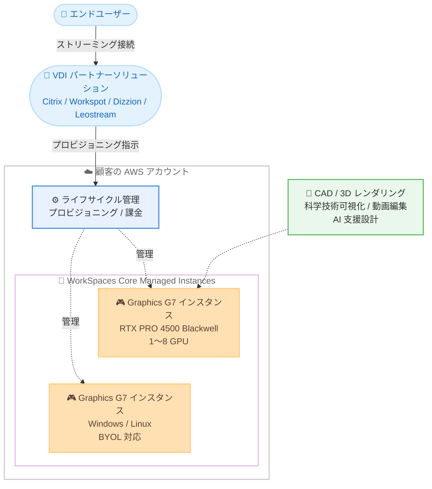

# Amazon WorkSpaces Core - Managed Instances での NVIDIA Blackwell GPU 搭載 Graphics G7 インスタンスのサポート

**リリース日**: 2026 年 9 月 30 日
**サービス**: Amazon WorkSpaces Core (Managed Instances)
**機能**: Graphics G7 インスタンス (NVIDIA RTX PRO 4500 Blackwell Server Edition GPU) のサポート

📊 [このアップデートのインフォグラフィックを見る](https://takech9203.github.io/aws-news-summary/20260930-amazon-workspaces-cmi-g7.html)

## 概要

Amazon WorkSpaces Core Managed Instances が、NVIDIA RTX PRO 4500 Blackwell Server Edition GPU と Intel Xeon 6 プロセッサを搭載した Graphics G7 インスタンスをサポートしました。Graphics G7 インスタンスは、前世代の G6 インスタンスと比較して、グラフィックス集約型ワークロードで最大 2.1 倍のパフォーマンス向上を実現します。

各 GPU は 32 GB の GDDR7 メモリを搭載し、メモリ帯域幅は前世代比で 2.67 倍高速化されています。インスタンスサイズは 6 種類が提供され、GPU 数は 1〜8 基、vCPU 数は 8〜192、システムメモリは 32 GB〜768 GB の範囲から選択できます。OS は Linux と Windows に対応し、BYOL (Bring Your Own License) オプションも利用できます。これにより、CAD/CAM、3D レンダリング、科学技術可視化、動画編集、AI 支援設計といった高負荷なプロフェッショナルアプリケーションを、より高い忠実度とフレームレートで仮想デスクトップとして提供できます。

WorkSpaces Core Managed Instances は、顧客の AWS アカウント内にインスタンスをプロビジョニングし、インフラストラクチャのライフサイクル管理を AWS が担うモデルです。Citrix、Workspot、Dizzion、Leostream などの VDI パートナーソリューションと組み合わせて利用します。今回のアップデートにより、2026 年 9 月 3 日の WorkSpaces Applications、9 月 16 日の WorkSpaces Personal / Core バンドルに続き、Managed Instances でも最新の Blackwell 世代 GPU が利用可能になりました。

**アップデート前の課題**

- WorkSpaces Core Managed Instances で利用できる GPU インスタンスは G6 世代までであり、最新世代 GPU の性能を VDI 環境で活用できなかった
- 大規模な 3D シーンや高解像度モデルを扱う場合、GPU メモリ容量やメモリ帯域幅がボトルネックとなり、フレームレートや描画品質が制限されることがあった
- 既存の WorkSpaces GPU バンドルは最大 2 GPU 構成までであり、4 GPU や 8 GPU を必要とする大規模ワークロードへの対応が難しかった

**アップデート後の改善**

- NVIDIA Blackwell アーキテクチャの RTX PRO 4500 GPU により、G6 比で最大 2.1 倍のグラフィックス性能を Managed Instances で利用可能になった
- GPU あたり 32 GB の GDDR7 メモリと 2.67 倍高速なメモリ帯域幅により、より大規模で複雑な 3D シーン・モデルを扱えるようになった
- 1〜8 GPU、8〜192 vCPU、32 GB〜768 GB メモリの 6 サイズから、ワークロード規模に応じた柔軟な選択が可能になった

## アーキテクチャ図



VDI パートナーソリューション経由で、顧客の AWS アカウント内に Graphics G7 の Managed Instances をプロビジョニングし、エンドユーザーへ高性能なグラフィックスワークロードを配信する構成です。インフラストラクチャのライフサイクル管理は WorkSpaces Core が担います。

## サービスアップデートの詳細

### 主要機能

1. **NVIDIA RTX PRO 4500 Blackwell Server Edition GPU の採用**
   - 前世代 G6 インスタンス比で、グラフィックス集約型ワークロードにおいて最大 2.1 倍のパフォーマンス向上を実現
   - GPU あたり 32 GB の GDDR7 メモリを搭載し、メモリ帯域幅は 2.67 倍高速化
   - CPU には Intel Xeon 6 プロセッサを採用

2. **6 種類のインスタンスサイズの提供**
   - GPU 数 1〜8 基、vCPU 数 8〜192、システムメモリ 32 GB〜768 GB から選択可能
   - WorkSpaces Personal の G7 バンドル (最大 2 GPU) を上回る、4 GPU / 8 GPU のマルチ GPU 構成にも対応
   - より大規模で複雑な 3D シーンやモデルを、高い忠実度とフレームレートで処理可能

3. **Linux と Windows の両 OS に対応**
   - Linux および Windows をサポートし、BYOL オプションも利用可能
   - 新規の Managed Instance 作成時に G7 インスタンスタイプを選択するだけで利用開始できる
   - WorkSpaces Core パートナーソリューション経由での G7 オプション提供にも対応

## 技術仕様

### EC2 G7 インスタンスの主な仕様 (参考)

Managed Instances の基盤となる EC2 G7 インスタンスの仕様は以下のとおりです。

| インスタンスサイズ | GPU 数 | GPU メモリ | vCPU | システムメモリ |
|------|------|------|------|------|
| 2xlarge | 1 | 32 GB | 8 | 32 GiB |
| 4xlarge | 1 | 32 GB | 16 | 64 GiB |
| 8xlarge | 1 | 32 GB | 32 | 128 GiB |
| 12xlarge | 2 | 64 GB | 48 | 192 GiB |
| 24xlarge | 4 | 128 GB | 96 | 384 GiB |
| 48xlarge | 8 | 256 GB | 192 | 768 GiB |

### 利用形態

| 項目 | 詳細 |
|------|------|
| 対応サービス | Amazon WorkSpaces Core Managed Instances |
| GPU | NVIDIA RTX PRO 4500 Blackwell Server Edition (GPU あたり GDDR7 32 GB) |
| CPU | Intel Xeon 6 プロセッサ |
| 対応 OS | Linux、Windows (BYOL オプションあり) |
| 性能向上 | G6 比で最大 2.1 倍 (グラフィックス集約型ワークロード)、メモリ帯域幅 2.67 倍 |
| 対象ワークロード | CAD/CAM、3D レンダリング、科学技術可視化、動画編集、AI 支援設計 |

## 設定方法

### 前提条件

1. AWS アカウントと WorkSpaces Core Managed Instances の利用環境があること
2. VDI パートナーソリューション (Citrix、Workspot、Dizzion、Leostream など) との統合、または Managed Instances を直接管理する環境があること
3. 利用リージョンが Graphics G7 の提供リージョン (バージニア北部、オハイオ、オレゴン、スペイン) であること

### 手順

#### ステップ 1: G7 インスタンスタイプの選択

新規の WorkSpaces Core Managed Instance を作成する際に、インスタンスタイプとして Graphics G7 (g7 ファミリー) を選択します。ワークロードの規模に応じて、1 GPU の 2xlarge から 8 GPU の 48xlarge までのサイズを選択します。

#### ステップ 2: OS とライセンスの設定

Linux または Windows の OS イメージを選択します。既存の Windows ライセンスを保有している場合は、BYOL オプションの利用を検討します。

#### ステップ 3: VDI パートナーソリューションからの利用

WorkSpaces Core パートナーソリューションを利用している場合は、パートナーソリューション側で G7 オプションが提供され次第、管理コンソールから G7 インスタンスをプロビジョニングできます。エンドユーザーはパートナーソリューションのクライアントから接続し、CAD や 3D レンダリングなどのアプリケーションの動作とパフォーマンスを確認します。

## メリット

### ビジネス面

- **ハイエンドワークステーションの集約**: 高価な物理 GPU ワークステーションを配布することなく、最新世代 GPU の性能を既存の VDI 環境のままリモートユーザーへ提供できる
- **既存 VDI 資産の活用**: Citrix などの既存 VDI 管理ソフトウェアや運用プロセスを維持しながら、インフラのみを最新 GPU 世代へ更新できる
- **生産性の向上**: 大規模 3D モデルの読み込みや描画が高速化され、設計者・エンジニアの待ち時間を削減できる

### 技術面

- **最大 2.1 倍の性能向上**: G6 比でグラフィックス性能が大幅に向上し、高フレームレート・高忠実度の描画が可能
- **大容量・高帯域 GPU メモリ**: GPU あたり 32 GB の GDDR7 メモリと 2.67 倍のメモリ帯域幅により、大規模シーンの処理に対応
- **最大 8 GPU のスケーラビリティ**: 48xlarge では 8 GPU / 256 GB GPU メモリ構成が選択でき、WorkSpaces Personal のバンドルでは対応できない大規模ワークロードにも対応

## デメリット・制約事項

### 制限事項

- 提供リージョンは現時点でバージニア北部、オハイオ、オレゴン、スペインの 4 リージョンのみ (東京リージョンは未対応、今後拡大予定)
- WorkSpaces Core Managed Instances の利用には、VDI パートナーソリューションとの統合など WorkSpaces Core の利用形態に沿った構成が必要
- パートナーソリューション側での G7 オプション対応時期は、各パートナーの実装状況に依存する

### 考慮すべき点

- 上位 GPU インスタンスは時間あたりの料金が高くなるため、時間単位課金と月次課金 (2026 年 1 月に追加) の使い分けによるコスト管理が重要
- 既存の G6 インスタンスで性能要件を満たしているワークロードでは、G7 への移行によるコスト増と性能向上のバランスを評価する必要がある
- マルチ GPU 構成 (24xlarge / 48xlarge) を活かすには、アプリケーション側がマルチ GPU に対応している必要がある

## ユースケース

### ユースケース 1: 既存 Citrix 環境での大規模 CAD/CAM 設計環境の刷新

**シナリオ**: 製造業の設計部門が、Citrix ベースの既存 VDI 環境を維持したまま、大規模アセンブリモデルを扱う CAD ワークステーションを最新 GPU 世代へ更新したい。

**実装例**:
```
1. Citrix と WorkSpaces Core Managed Instances の統合環境を準備
2. 設計者向けの新規インスタンスとして g7.8xlarge を選択してプロビジョニング
3. 既存の Citrix クライアントから設計者が接続し、CAD アプリケーションを利用
```

**効果**: 既存の VDI 管理基盤や運用プロセスを変更することなく、32 GB の GPU メモリと最大 2.1 倍の描画性能により、従来は分割が必要だった大規模モデルをそのまま扱えるようになる。

### ユースケース 2: 映像制作スタジオのリモート編集ワークステーション

**シナリオ**: 映像制作会社が、4K/8K 動画編集や 3D レンダリングのワークステーションをリモートの編集者にセキュアに提供し、素材データを社外に持ち出させたくない。

**実装例**:
```
1. 編集者ごとに g7.4xlarge または g7.8xlarge の Managed Instance を作成
2. 素材データは Amazon S3 / Amazon FSx に保管し、インスタンスからのみアクセス
3. 編集者は VDI パートナーソリューションのクライアントから接続して編集作業を実施
```

**効果**: GDDR7 メモリの 2.67 倍の帯域幅によりプレビューやエンコードの待ち時間を削減しつつ、素材データを AWS 内に留めたセキュアな編集環境を実現できる。

### ユースケース 3: マルチ GPU を必要とする科学技術可視化・AI 支援設計環境

**シナリオ**: 研究機関やエンジニアリング企業が、大規模シミュレーション結果の可視化や AI 推論を組み合わせた設計支援ワークフローに、マルチ GPU の仮想ワークステーションを提供したい。

**実装例**:
```
1. 通常の利用者には g7.2xlarge / g7.4xlarge を割り当て
2. 大規模可視化やマルチ GPU 処理が必要な利用者には g7.24xlarge や g7.48xlarge を割り当て
3. 可視化ツールと AI 推論ランタイムをセットアップして利用
```

**効果**: 最大 8 GPU / 256 GB GPU メモリの構成により、WorkSpaces の既存 GPU バンドルでは対応できなかった大規模ワークロードを、物理ワークステーションを調達することなく迅速に提供できる。

## 料金

WorkSpaces Core Managed Instances の料金体系に従い、時間単位課金または月次定額課金 (2026 年 1 月に追加) で利用できます。長期契約は不要な従量課金制です。Windows ライセンス込みの料金に加えて、BYOL オプションも選択できます。Graphics G7 インスタンスの具体的な料金は、料金ページで利用リージョンを選択して確認してください。

詳細は [Amazon WorkSpaces Core 料金ページ](https://aws.amazon.com/workspaces/vdi-partners/pricing/) を参照してください。

## 利用可能リージョン

- 米国東部 (バージニア北部)
- 米国東部 (オハイオ)
- 米国西部 (オレゴン)
- 欧州 (スペイン)

追加リージョンへは今後順次拡大される予定です。

## 関連サービス・機能

- **Amazon EC2 G7 インスタンス**: Managed Instances の基盤となる EC2 インスタンスファミリー。NVIDIA RTX PRO 4500 Blackwell GPU と Intel Xeon 6 プロセッサを搭載
- **Amazon WorkSpaces Personal / Core バンドル**: 2026 年 9 月 16 日に Graphics G7 バンドル (最大 2 GPU) をサポート済み。Managed Instances では最大 8 GPU まで選択可能
- **Amazon WorkSpaces Applications**: 非永続的なアプリケーションストリーミングを提供するサービス。2026 年 9 月 3 日に Graphics G7 インスタンスをサポート済み
- **VDI パートナーソリューション**: Citrix、Workspot、Dizzion、Leostream などのパートナーソリューションと組み合わせて Managed Instances を管理

## 参考リンク

- 📊 [インフォグラフィック](https://takech9203.github.io/aws-news-summary/20260930-amazon-workspaces-cmi-g7.html)
- [公式発表 (What's New)](https://aws.amazon.com/about-aws/whats-new/2026/09/amazon-workspaces-cmi-g7/)
- [Amazon WorkSpaces Core](https://aws.amazon.com/workspaces/vdi-partners/)
- [WorkSpaces Core Managed Instances ドキュメント](https://docs.aws.amazon.com/workspaces-core/latest/ag/partner-admin-guides.html)
- [Amazon EC2 G7 インスタンスタイプ](https://aws.amazon.com/ec2/instance-types/g7/)
- [Amazon WorkSpaces Core 料金ページ](https://aws.amazon.com/workspaces/vdi-partners/pricing/)

## まとめ

Amazon WorkSpaces Core Managed Instances が NVIDIA Blackwell 世代の Graphics G7 インスタンスに対応し、G6 比で最大 2.1 倍のグラフィックス性能、GPU あたり 32 GB の GDDR7 メモリ、最大 8 GPU 構成を VDI パートナーソリューションと組み合わせて利用できるようになりました。既存の VDI 管理基盤を維持しながら CAD/CAM、3D レンダリング、AI 支援設計などの高負荷ワークロードを提供している場合は、対象リージョンで G7 インスタンスタイプを選択し、性能とコストのバランスを検証することを推奨します。
