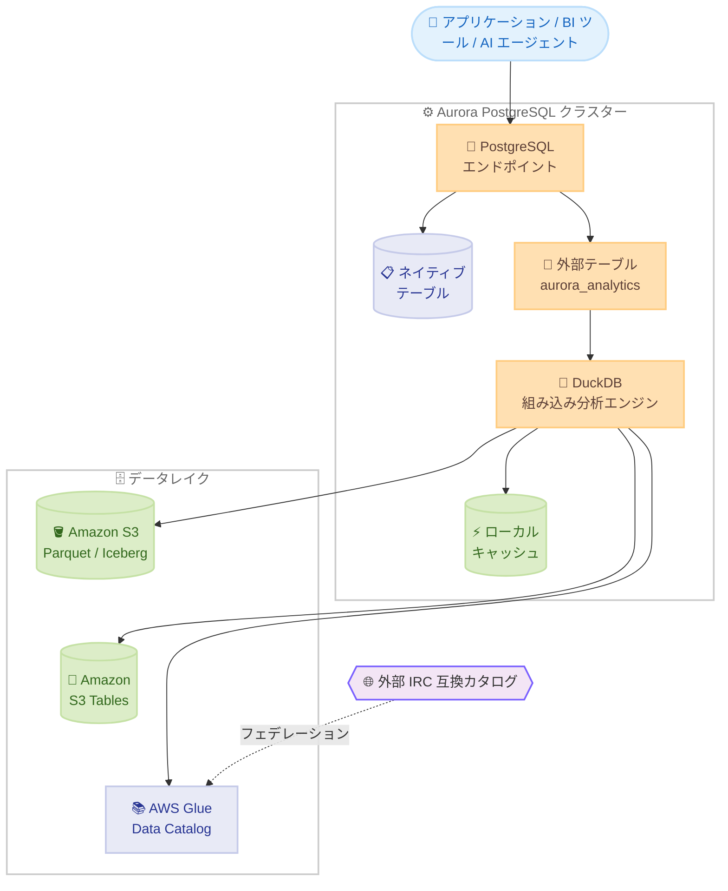

# Amazon Aurora PostgreSQL - Apache Iceberg / Parquet データの直接クエリサポート

**リリース日**: 2026 年 9 月 30 日
**サービス**: Amazon Aurora PostgreSQL 互換エディション
**機能**: Apache Iceberg および Parquet データの直接クエリ (aurora_analytics 拡張機能)

📊 [このアップデートのインフォグラフィックを見る](https://takech9203.github.io/aws-news-summary/20260930-aurora-postgresql-query-apache-iceberg-and-parquet.html)

## 概要

Amazon Aurora PostgreSQL 互換エディションが、データレイク内の Apache Iceberg および Apache Parquet 形式のデータを、Aurora 内の運用データと併せて直接クエリできるようになりました。Amazon S3、Amazon S3 Tables、AWS Glue Data Catalog に保存された Iceberg / Parquet データを参照する PostgreSQL 外部テーブル (Foreign Table) を作成するだけで、ETL パイプラインやデータ複製なしに、既存の PostgreSQL アプリケーション、ドライバー、BI ツールから標準 SQL でアクセスできます。

クエリ実行時には、PostgreSQL に組み込まれた DuckDB の高性能な列指向分析エンジンが使用されます。DuckDB の開発元である DuckDB Labs のチームが Amazon に加わったことを背景とした統合であり、述語プッシュダウン、列プルーニング、ローカルインスタンスストレージへの自動キャッシュといった最適化により、追加インフラのプロビジョニングやチューニングなしで高速な分析クエリを実現します。

本機能は Aurora PostgreSQL 17.11 以降および 18.6 以降 (Aurora Serverless v2 を含む) で一般提供され、追加料金なしで利用できます。運用データと履歴データの両方を横断して推論する AI エージェントの構築や、リバース ETL の排除を目指すユーザーにとって重要なアップデートです。

**アップデート前の課題**

- 以前はデータレイクのデータを Aurora から参照するために、リバース ETL パイプラインを構築してデータを Aurora にコピーする必要があった
- データの複製によりインフラコストが増加し、ソーススキーマやビジネス要件の変化に合わせてコピーを同期し続ける継続的なエンジニアリング作業が必要だった
- 運用データとデータレイクのデータで、アクセス制御や監査などのガバナンスモデルを二重に管理する必要があった

**アップデート後の改善**

- 外部テーブルを作成するだけで、S3 / S3 Tables / Glue Data Catalog 上の Iceberg / Parquet データを標準 SQL で直接クエリできるようになった
- Aurora PostgreSQL テーブルと外部テーブルを単一クエリで JOIN でき、結果を PostgreSQL テーブルやマテリアライズドビューに書き込めるようになった
- AWS Glue Data Catalog フェデレーション経由で、外部の Iceberg REST Catalog (IRC) 互換カタログのテーブルもカスタム統合なしでクエリできるようになった
- 低レイテンシーが必要な場合は、`CREATE TABLE AS SELECT` などの標準 SQL だけでデータレイクのデータを Aurora ネイティブテーブルへマテリアライズできるようになった

## アーキテクチャ図



アプリケーションは単一の PostgreSQL エンドポイントを通じて、Aurora のネイティブテーブルとデータレイク上の Iceberg / Parquet データの両方にアクセスします。外部テーブルへのクエリは組み込みの DuckDB エンジンが処理し、S3 / S3 Tables / Glue Data Catalog からデータを読み取ります。

## サービスアップデートの詳細

### 主要機能

1. **外部テーブルによるデータレイクの直接クエリ**
   - `aurora_analytics` 拡張機能を有効化し、S3 / S3 Tables / Glue Data Catalog 上の Iceberg / Parquet データを参照する外部テーブルを作成
   - スキーマは Parquet ファイルのメタデータから自動推論されるため、列定義を手動で記述する必要がない
   - `IMPORT FOREIGN SCHEMA` により、Glue Data Catalog データベース内の全テーブルの外部テーブルを一括作成可能

2. **組み込み DuckDB エンジンによる高速分析**
   - オープンソースの列指向分析エンジン DuckDB が PostgreSQL サーバー内に直接組み込まれ、分析クエリを処理
   - 述語プッシュダウンと列プルーニングにより、必要なデータのみを読み取り
   - 頻繁にアクセスされるデータは Aurora インスタンスのローカルストレージに自動キャッシュされ、繰り返しクエリが高速化
   - `aurora_analytics_stat_statements()` 関数で、スキャン行数、S3 からの読み取りバイト数、キャッシュヒットをクエリ単位で確認可能

3. **AWS Glue Data Catalog フェデレーションによる外部カタログ対応**
   - 外部の Iceberg REST Catalog (IRC) 互換カタログで管理される Iceberg テーブルを、Glue Data Catalog 経由でクエリ可能
   - カタログを Glue に一度登録すれば、Glue ネイティブテーブルと同様に外部テーブルを作成できる
   - 単一クエリで Aurora の運用データ、AWS 管理のデータレイク、サードパーティカタログを横断可能

4. **標準 SQL によるマテリアライズ**
   - 1 桁ミリ秒のレイテンシーが必要なワークロード向けに、`CREATE TABLE AS SELECT`、`INSERT INTO ... SELECT`、`MERGE INTO` でデータレイクのデータを Aurora ネイティブテーブルへロード可能
   - 専用のバルクロードパイプラインやインジェスト用インフラが不要

## 技術仕様

### 対応環境と前提条件

| 項目 | 詳細 |
|------|------|
| 対応バージョン | Aurora PostgreSQL 17.11 以降、18.6 以降 |
| Aurora Serverless v2 | 対応 |
| 対応データ形式 | Apache Iceberg、Apache Parquet |
| 対応データソース | Amazon S3、Amazon S3 Tables、AWS Glue Data Catalog、IRC 互換カタログ (Glue フェデレーション経由) |
| 拡張機能名 | `aurora_analytics` |
| 外部サーバー名 | `aurora_analytics_server` (事前定義) |
| IAM 設定 | `AuroraAnalytics` 機能としてクラスターに IAM ロールを関連付け (S3 / Glue へのアクセス権限) |
| 読み取りクエリ | ライター / リードレプリカのどちらでも実行可能 |
| マテリアライズ | Aurora への書き込みを伴うためライターインスタンスで実行 |
| 追加料金 | なし (Aurora コンピューティングと S3 リクエストの増分は課金対象) |

## 設定方法

### 前提条件

1. Aurora PostgreSQL 17.11 以降または 18.6 以降のクラスター
2. S3 および AWS Glue Data Catalog へのアクセス権限を持つ IAM ロール
3. クエリ対象の Iceberg / Parquet データ (S3、S3 Tables、または Glue Data Catalog)

### 手順

#### ステップ 1: IAM ロールをクラスターに関連付け

```bash
aws rds add-role-to-db-cluster \
    --db-cluster-identifier my-aurora-cluster \
    --role-arn arn:aws:iam::123456789012:role/AuroraAnalyticsRole \
    --feature-name AuroraAnalytics
```

S3 と Glue Data Catalog へのアクセスを許可する IAM ロールを、`AuroraAnalytics` 機能として Aurora クラスターに関連付けます。

#### ステップ 2: 拡張機能の有効化

```sql
CREATE EXTENSION aurora_analytics;
```

PostgreSQL クライアント (psql など) から `aurora_analytics` 拡張機能を有効化します。これにより外部テーブル機能と組み込み DuckDB エンジンが利用可能になります。

#### ステップ 3: 外部テーブルの作成

```sql
CREATE FOREIGN TABLE transaction_history ()
SERVER aurora_analytics_server
OPTIONS (
    location 's3://<my-bucket>/finance/transaction_history.parquet',
    format 'parquet'
);
```

S3 上の Parquet データを参照する外部テーブルを作成します。列定義を空にすると、Parquet ファイルのメタデータからスキーマが自動推論されます。Glue Data Catalog の複数テーブルを一括登録する場合は `IMPORT FOREIGN SCHEMA` を使用します。

#### ステップ 4: 運用データとデータレイクデータの横断クエリ

```sql
SELECT merchant, category, amount, transaction_date, 'recent' AS source
FROM recent_transactions
WHERE customer_id = 'C-1001'
UNION ALL
SELECT merchant, category, amount, transaction_date, 'historical' AS source
FROM transaction_history
WHERE customer_id = 'C-1001'
  AND transaction_date >= CURRENT_DATE - INTERVAL '5 years'
ORDER BY transaction_date DESC
LIMIT 15;
```

Aurora のネイティブテーブル (直近の取引) と S3 上の Parquet データ (過去の取引履歴) を単一クエリで結合し、1 つの結果セットとして取得します。

## メリット

### ビジネス面

- **ETL パイプラインの排除によるコスト削減**: リバース ETL の構築・運用やデータ複製が不要になり、インフラコストとスキーマ変更への追従にかかるエンジニアリング工数を削減できる
- **追加料金なし**: 機能自体に追加料金はなく、クエリが消費する Aurora コンピューティングと S3 リクエストの増分のみの支払いで済む
- **データ階層化によるストレージコスト最適化**: ホットデータは Aurora に、コールドデータはデータレイクに配置し、クエリアクセスを維持したままデータベースサイズとバックアップフットプリントを削減できる

### 技術面

- **既存アプリケーションの無変更利用**: 同一の PostgreSQL エンドポイント、ドライバー、ORM、BI ツールがそのまま利用でき、アプリケーション改修が不要
- **分析に最適化された実行エンジン**: 組み込み DuckDB、自動キャッシュ、述語プッシュダウン、列プルーニングにより、追加インフラなしで高速な分析クエリを実現
- **一元化されたセキュリティとガバナンス**: データレイクアクセスが PostgreSQL を経由するため、既存のロール、権限、監査ログ、ネットワーク制御が外部テーブルクエリにもそのまま適用される
- **読み取り負荷のオフロード**: 分析クエリをリードレプリカで実行し、ライターインスタンスへの影響を抑制できる

## デメリット・制約事項

### 制限事項

- Aurora PostgreSQL 17.11 以降または 18.6 以降が必要で、それ以前のバージョンでは利用できない
- マテリアライズ (`CREATE TABLE AS SELECT` など) は Aurora への書き込みを伴うため、ライターインスタンスでのみ実行可能
- 外部テーブルへのクエリは読み取り専用であり、Aurora から Iceberg / Parquet データへの書き込みはできない

### 考慮すべき点

- 外部テーブルへのクエリは S3 リクエストと Aurora コンピューティングを消費するため、大規模スキャンを伴うワークロードではコストとインスタンスサイズを考慮する必要がある
- 1 桁ミリ秒のレイテンシーが必要な場合は、外部テーブルの直接クエリではなくネイティブテーブルへのマテリアライズを検討する
- キャッシュはインスタンスのローカルストレージを使用するため、初回クエリとキャッシュヒット時でレイテンシー特性が異なる

## ユースケース

### ユースケース 1: 運用クエリのデータレイクデータによるエンリッチ

**シナリオ**: カスタマーサポートシステムで、Aurora 上のアクティブなサポートケースに、データレイク上の顧客の購買履歴や過去の対応履歴を組み合わせて表示したい。

**実装例**:
```sql
SELECT c.case_id, c.subject, h.purchase_date, h.product_name
FROM support_cases c
JOIN purchase_history h ON c.customer_id = h.customer_id
WHERE c.case_id = 'CASE-2026-1234'
ORDER BY h.purchase_date DESC;
```

**効果**: データ移動や複製なしに、サポート担当者が顧客の全体像を単一クエリで把握でき、対応品質が向上する。

### ユースケース 2: エージェント型 AI アプリケーションの構築

**シナリオ**: 営業支援 AI エージェントが、Aurora 上の商談中の案件情報と、データレイク上のアカウントの全エンゲージメント履歴の両方を参照して、次のアクションを提案する。

**実装例**:
```sql
SELECT o.opportunity_id, o.stage, o.amount,
       e.engagement_type, e.engagement_date, e.summary
FROM opportunities o
JOIN engagement_history e ON o.account_id = e.account_id
WHERE o.opportunity_id = 'OPP-5678'
ORDER BY e.engagement_date DESC;
```

**効果**: AI エージェントは標準 SQL をツールインターフェイスとして、単一の PostgreSQL エンドポイントから運用データと履歴データに構造化アクセスでき、推論の精度と実装の簡潔さが向上する。

### ユースケース 3: データ階層化によるデータベースのスリム化

**シナリオ**: 取引テーブルが肥大化しており、直近データのみ Aurora に残し、過去データは Iceberg 形式でデータレイクに移動したい。ただし過去データへのクエリアクセスは維持したい。

**実装例**:
```sql
-- 過去データは既存パイプラインで Iceberg 化し、外部テーブルとして参照
CREATE FOREIGN TABLE transactions_archive ()
SERVER aurora_analytics_server
OPTIONS (
    location 's3://my-datalake/transactions/archive/',
    format 'iceberg'
);

-- 必要に応じて低レイテンシー用にマテリアライズ
CREATE TABLE recent_archive AS
SELECT * FROM transactions_archive
WHERE transaction_date >= CURRENT_DATE - INTERVAL '1 year';
```

**効果**: Aurora のストレージコストとバックアップフットプリントを削減しつつ、過去データへの SQL アクセスを維持できる。

## 料金

本機能の有効化に追加料金はありません。クエリが消費する Aurora コンピューティングリソースと Amazon S3 リクエストの増分に対してのみ課金されます。

## 利用可能リージョン

すべての AWS 商用リージョンおよび AWS GovCloud (US) リージョンで利用可能です (東京・大阪リージョンを含む)。

## 関連サービス・機能

- **Amazon S3 Tables**: Apache Iceberg に最適化されたフルマネージドなテーブルストレージ。本機能のクエリ対象として利用可能
- **AWS Glue Data Catalog**: データレイクのメタデータカタログ。IRC 互換の外部カタログのフェデレーションにより、サードパーティカタログのテーブルも Aurora からクエリ可能
- **Aurora zero-ETL 統合**: Aurora から Amazon Redshift などへの分析データ連携。本機能は逆方向 (データレイクから Aurora への参照) をカバーし、リバース ETL を排除する
- **DuckDB**: 本機能のクエリエンジンとして Aurora PostgreSQL に組み込まれたオープンソースの列指向分析エンジン

## 参考リンク

- 📊 [インフォグラフィック](https://takech9203.github.io/aws-news-summary/20260930-aurora-postgresql-query-apache-iceberg-and-parquet.html)
- [公式発表 (What's New)](https://aws.amazon.com/about-aws/whats-new/2026/09/aurora-postgresql-query-apache-iceberg-and-parquet/)
- [AWS Blog: Amazon Aurora PostgreSQL now supports direct querying of Apache Iceberg and Parquet data in your data lake](https://aws.amazon.com/blogs/aws/amazon-aurora-postgresql-now-supports-direct-querying-of-apache-iceberg-and-parquet-data-in-your-data-lake)
- [ドキュメント: Querying Apache Iceberg and Parquet data directly in Aurora PostgreSQL](https://docs.aws.amazon.com/AmazonRDS/latest/AuroraUserGuide/query-iceberg-and-parquet-data.html)
- [料金ページ: Amazon Aurora の料金](https://aws.amazon.com/rds/aurora/pricing/)

## まとめ

Aurora PostgreSQL が組み込み DuckDB エンジンにより Apache Iceberg / Parquet データの直接クエリに対応したことで、リバース ETL パイプラインを構築せずに、運用データとデータレイクデータを単一の PostgreSQL エンドポイントで横断的に扱えるようになりました。追加料金なしで利用でき、既存アプリケーションの変更も不要なため、データレイク連携や AI エージェント構築を検討しているユーザーは、Aurora PostgreSQL 17.11 / 18.6 以降へのアップグレードと `aurora_analytics` 拡張機能の試用を推奨します。
