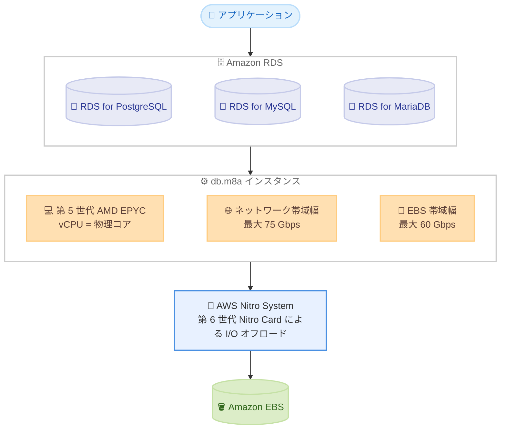

# Amazon RDS - AMD ベースの M8a インスタンスサポート

**リリース日**: 2026 年 9 月 30 日
**サービス**: Amazon RDS (Relational Database Service)
**機能**: AMD ベース M8a データベースインスタンスのサポート

📊 [このアップデートのインフォグラフィックを見る](https://takech9203.github.io/aws-news-summary/20260930-aurora-rds-amd-m8a.html)

## 概要

Amazon RDS が、第 5 世代 AMD EPYC プロセッサを搭載した M8a データベースインスタンスをサポートしました。M8a インスタンスは AWS Nitro System 上に構築され、第 6 世代 Nitro Card により I/O 処理をオフロード・高速化します。対象エンジンは Amazon RDS for PostgreSQL、Amazon RDS for MySQL、Amazon RDS for MariaDB です。

M8a インスタンスでは各 vCPU が物理 CPU コアにマッピングされるため、一貫したコアあたりの性能を得られます。最大 75 Gbps のネットワーク帯域幅と最大 60 Gbps の EBS 帯域幅を提供し、汎用ワークロード向けデータベースの性能と価格性能比の向上が期待できます。

AMD ベースのインスタンスはコストパフォーマンスに優れる選択肢として知られており、汎用データベースワークロードを運用するユーザーにとって、既存の M7a (AMD) や M8g (Graviton4) などと並ぶ新たな選択肢となります。

**アップデート前の課題**

このアップデート以前に存在していた課題や制限は以下のとおりです。

- Amazon RDS で利用できる AMD ベースの汎用インスタンスは第 4 世代 AMD EPYC 搭載の M7a 世代までであり、最新の第 5 世代 AMD EPYC プロセッサの性能を活用できなかった
- ネットワーク帯域幅や EBS 帯域幅の要件が高いデータベースワークロードでは、旧世代インスタンスの帯域幅上限が制約となる場合があった
- 最新世代インスタンスによる価格性能比の改善を、AMD ベースのまま享受することができなかった

**アップデート後の改善**

今回のアップデートにより可能になったことは以下のとおりです。

- 第 5 世代 AMD EPYC プロセッサ搭載の M8a インスタンスを RDS for PostgreSQL、MySQL、MariaDB で利用可能になった
- 最大 75 Gbps のネットワーク帯域幅、最大 60 Gbps の EBS 帯域幅により、高スループットなデータベースワークロードに対応できるようになった
- 各 vCPU が物理コアにマッピングされる設計により、一貫したコアあたり性能を得られるようになった

## アーキテクチャ図



RDS の各エンジンが M8a インスタンス上で動作し、AWS Nitro System の第 6 世代 Nitro Card が I/O 処理をオフロードして EBS との高帯域幅通信を実現する構成を示しています。

## サービスアップデートの詳細

### 主要機能

1. **第 5 世代 AMD EPYC プロセッサの採用**
   - M8a インスタンスは第 5 世代 AMD EPYC プロセッサ (コードネーム Turin) を搭載
   - 各 vCPU が物理 CPU コアにマッピングされ、一貫したコアあたり性能を提供
   - EC2 の M8a は前世代 M7a と比較して最大 30% 高いコンピューティング性能を実現

2. **高いネットワーク・ストレージ帯域幅**
   - 最大 75 Gbps のネットワーク帯域幅
   - 最大 60 Gbps の EBS 帯域幅
   - 高スループットが要求されるデータベースワークロードに対応

3. **AWS Nitro System と第 6 世代 Nitro Card**
   - I/O 機能をオフロード・高速化する第 6 世代 Nitro Card を採用
   - ホストリソースをデータベース処理に最大限活用可能

4. **主要 3 エンジンでのサポート**
   - Amazon RDS for PostgreSQL
   - Amazon RDS for MySQL
   - Amazon RDS for MariaDB
   - サポートされるエンジンバージョンの詳細は RDS ドキュメントの DB インスタンスクラスのページを参照

## 技術仕様

### M8a インスタンスの主な仕様

| 項目 | 詳細 |
|------|------|
| プロセッサ | 第 5 世代 AMD EPYC (最大 4.5 GHz) |
| vCPU 設計 | 各 vCPU が物理 CPU コアにマッピング |
| ネットワーク帯域幅 | 最大 75 Gbps |
| EBS 帯域幅 | 最大 60 Gbps |
| 基盤 | AWS Nitro System (第 6 世代 Nitro Card) |
| 対象エンジン | RDS for PostgreSQL、MySQL、MariaDB |

### 参考: EC2 M8a ファミリーの性能 (対 M7a 比較)

EC2 の M8a インスタンスファミリーでは、前世代 M7a と比較して以下の改善が公表されています。RDS における実際の性能はワークロードにより異なります。

| 項目 | 改善内容 |
|------|----------|
| コンピューティング性能 | 最大 30% 向上 |
| メモリ帯域幅 | 45% 向上 |
| ネットワークスループット | 50% 向上 |
| 価格性能比 | 前世代 AMD インスタンス比で最大 19% 向上 |

## 設定方法

### 前提条件

1. 利用可能リージョン (東京リージョンを含む) で RDS を利用していること
2. RDS for PostgreSQL、MySQL、MariaDB のいずれかで、M8a をサポートするエンジンバージョンを使用していること
3. 既存インスタンスを変更する場合は、メンテナンスウィンドウまたは即時適用による再起動の影響を考慮すること

### 手順

#### ステップ 1: サポート対象の確認

```bash
aws rds describe-orderable-db-instance-options \
  --engine postgres \
  --db-instance-class db.m8a.large \
  --query "OrderableDBInstanceOptions[].{Engine:Engine,Version:EngineVersion,Class:DBInstanceClass,AZ:AvailabilityZones[].Name}" \
  --region ap-northeast-1
```

指定したリージョンとエンジンで db.m8a インスタンスクラスが利用可能なエンジンバージョンと AZ を確認します。

#### ステップ 2: 新規 DB インスタンスの作成

```bash
aws rds create-db-instance \
  --db-instance-identifier my-postgres-m8a \
  --db-instance-class db.m8a.large \
  --engine postgres \
  --engine-version 17.4 \
  --master-username admin \
  --manage-master-user-password \
  --allocated-storage 100 \
  --region ap-northeast-1
```

db.m8a.large インスタンスクラスを指定して、新しい RDS for PostgreSQL インスタンスを作成します。マスターユーザーのパスワードは AWS Secrets Manager で管理します。

#### ステップ 3: 既存インスタンスのインスタンスクラス変更

```bash
aws rds modify-db-instance \
  --db-instance-identifier my-existing-db \
  --db-instance-class db.m8a.large \
  --apply-immediately
```

既存の DB インスタンスのインスタンスクラスを db.m8a.large に変更します。`--apply-immediately` を指定すると即時適用されますが、再起動が発生するためダウンタイムに注意してください。Multi-AZ 構成の場合はフェイルオーバーによりダウンタイムを短縮できます。

## メリット

### ビジネス面

- **コスト効率の向上**: AMD ベースインスタンスは一般に同等の Intel ベースインスタンスより低価格であり、最新世代の性能向上と合わせて価格性能比の改善が期待できる
- **ワークロードの成長への対応**: 高い帯域幅上限により、ビジネス拡大に伴うデータベース負荷の増加にスケールアップで対応しやすくなる
- **選択肢の拡大**: Intel、AMD、Graviton の各アーキテクチャから、ワークロードやコスト要件に応じて最適なインスタンスを選択できる

### 技術面

- **一貫した性能**: 各 vCPU が物理コアにマッピングされるため、SMT による性能変動がなく、データベースワークロードで安定した性能を発揮
- **高帯域幅**: 最大 75 Gbps のネットワーク帯域幅と最大 60 Gbps の EBS 帯域幅により、I/O 集約型ワークロードのボトルネックを緩和
- **Nitro System による効率化**: 第 6 世代 Nitro Card が I/O をオフロードし、ホストリソースをデータベース処理に集中可能

## デメリット・制約事項

### 制限事項

- 対象エンジンは RDS for PostgreSQL、MySQL、MariaDB であり、Oracle や SQL Server は対象外
- 利用可能リージョンは現時点で 9 リージョンに限定される
- サポートされるエンジンバージョンに制限があるため、古いバージョンを使用している場合はエンジンのアップグレードが必要になる場合がある

### 考慮すべき点

- 既存インスタンスからの変更には再起動が伴うため、メンテナンスウィンドウや Multi-AZ フェイルオーバーを活用した計画的な移行が必要
- 公式発表には RDS で利用可能なインスタンスサイズの一覧が記載されていないため、利用前に `describe-orderable-db-instance-options` やドキュメントで対象サイズを確認することを推奨
- リザーブドインスタンスを利用している場合、インスタンスファミリーの変更により既存の予約が適用されなくなる点に注意

## ユースケース

### ユースケース 1: 汎用 Web アプリケーションのデータベース基盤刷新

**シナリオ**: M7a や M6a で RDS for MySQL を運用しており、トラフィック増加に伴いコアあたり性能と価格性能比を改善したい。

**実装例**:
```bash
aws rds modify-db-instance \
  --db-instance-identifier webapp-mysql \
  --db-instance-class db.m8a.xlarge \
  --no-apply-immediately
```

**効果**: 次回メンテナンスウィンドウで M8a へ移行し、最新世代の性能向上によりレスポンスタイムの改善とコスト効率の向上が期待できる。

### ユースケース 2: I/O 集約型の分析系 PostgreSQL ワークロード

**シナリオ**: 大量データの読み書きを行う RDS for PostgreSQL で、EBS 帯域幅がボトルネックになっている。

**実装例**:
```bash
aws rds create-db-instance \
  --db-instance-identifier analytics-postgres \
  --db-instance-class db.m8a.8xlarge \
  --engine postgres \
  --storage-type io2 \
  --allocated-storage 2000 \
  --iops 40000 \
  --master-username admin \
  --manage-master-user-password
```

**効果**: 最大 60 Gbps の EBS 帯域幅と io2 ストレージの組み合わせにより、I/O スループットのボトルネックを緩和できる。

### ユースケース 3: マルチアーキテクチャでのコスト最適化評価

**シナリオ**: Graviton (M8g)、Intel、AMD (M8a) の各インスタンスで性能とコストを比較し、ワークロードに最適な構成を選定したい。

**実装例**:
```bash
# 検証用に本番スナップショットから M8a インスタンスを復元
aws rds restore-db-instance-from-db-snapshot \
  --db-instance-identifier perf-test-m8a \
  --db-snapshot-identifier prod-snapshot \
  --db-instance-class db.m8a.2xlarge
```

**効果**: 本番相当のデータでアーキテクチャごとのベンチマークを実施し、証拠に基づいて最適なインスタンスファミリーを選択できる。

## 料金

M8a インスタンスの料金は、インスタンスサイズ、リージョン、エンジン、デプロイオプション (Single-AZ / Multi-AZ) により異なります。従量課金のオンデマンドのほか、リザーブドインスタンスによる割引も利用できます。具体的な料金は Amazon RDS 料金ページを参照してください。

## 利用可能リージョン

以下の 9 リージョンで利用可能です。

- 米国東部 (バージニア北部)
- 米国東部 (オハイオ)
- 米国西部 (オレゴン)
- アジアパシフィック (東京)
- アジアパシフィック (ムンバイ)
- アジアパシフィック (ハイデラバード)
- 欧州 (アイルランド)
- 欧州 (フランクフルト)
- 欧州 (スペイン)

## 関連サービス・機能

- **Amazon EC2 M8a インスタンス**: 本アップデートの基盤となる EC2 インスタンスファミリー。第 5 世代 AMD EPYC プロセッサを搭載し、M7a 比で最大 30% の性能向上を実現
- **AWS Nitro System**: 仮想化機能や I/O 処理を専用ハードウェアにオフロードする基盤技術。M8a では第 6 世代 Nitro Card を採用
- **Amazon RDS M8g インスタンス**: AWS Graviton4 ベースの汎用インスタンス。アーキテクチャ選択の比較対象となる

## 参考リンク

- 📊 [インフォグラフィック](https://takech9203.github.io/aws-news-summary/20260930-aurora-rds-amd-m8a.html)
- [公式発表 (What's New)](https://aws.amazon.com/about-aws/whats-new/2026/09/aurora-rds-amd-m8a/)
- [Amazon EC2 M8a インスタンス](https://aws.amazon.com/ec2/instance-types/m8a/)
- [DB インスタンスクラスのドキュメント](https://docs.aws.amazon.com/AmazonRDS/latest/UserGuide/Concepts.DBInstanceClass.html)
- [DB インスタンスの作成ガイド](https://docs.aws.amazon.com/AmazonRDS/latest/UserGuide/USER_CreateDBInstance.html)
- [Amazon RDS 料金ページ](https://aws.amazon.com/rds/pricing/)

## まとめ

Amazon RDS で第 5 世代 AMD EPYC プロセッサ搭載の M8a インスタンスが利用可能になり、PostgreSQL、MySQL、MariaDB のワークロードで最新世代の性能と帯域幅を活用できるようになりました。東京リージョンでも初期ローンチから利用可能であるため、M7a や M6a などの旧世代 AMD インスタンスを利用中のユーザーは、エンジンバージョンの対応状況を確認のうえ、検証環境でのベンチマークを通じた移行検討を推奨します。
