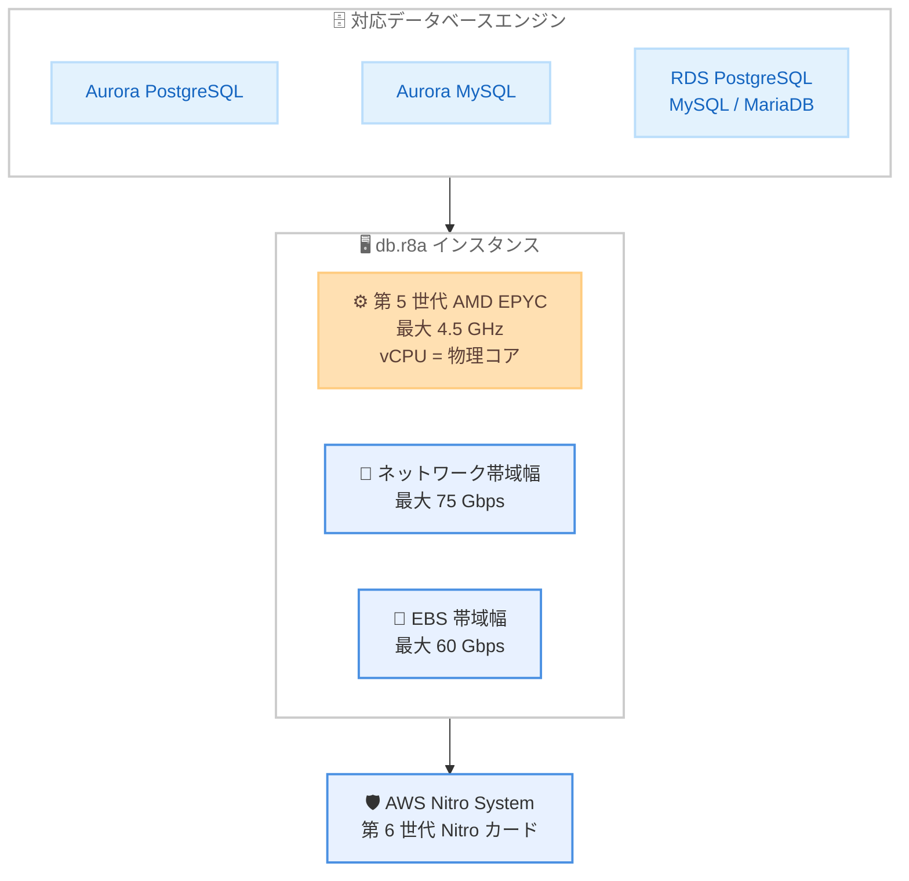

# Amazon Aurora / Amazon RDS - AMD ベース R8a インスタンスのサポート

**リリース日**: 2026 年 9 月 30 日
**サービス**: Amazon Aurora、Amazon RDS
**機能**: AMD ベース R8a データベースインスタンスのサポート

📊 [このアップデートのインフォグラフィックを見る](https://takech9203.github.io/aws-news-summary/20260930-aurora-rds-amd-r8a.html)

## 概要

Amazon Aurora と Amazon RDS が、第 5 世代 AMD EPYC プロセッサを搭載した R8a データベースインスタンスをサポートしました。R8a インスタンスはメモリ最適化インスタンスであり、Aurora PostgreSQL 互換エディション、Aurora MySQL 互換エディション、RDS for PostgreSQL、RDS for MySQL、RDS for MariaDB で利用できます。

R8a インスタンスでは、すべての vCPU が物理コアにマッピングされる設計 (SMT なし) を採用しており、コアあたりの一貫したパフォーマンスを実現します。また、最新の第 6 世代 Nitro カードを採用した AWS Nitro System 上に構築されており、要求の厳しいワークロード向けに最大 75 Gbps のネットワーク帯域幅と最大 60 Gbps の Amazon EBS 帯域幅を提供します。

メモリ集約型のデータベースワークロードを運用し、AMD ベースインスタンスのコスト効率とパフォーマンスの両立を求めるユーザーにとって、新しい選択肢となるアップデートです。

**アップデート前の課題**

- Aurora / RDS で AMD ベースのメモリ最適化インスタンスを利用する場合、第 4 世代 AMD EPYC プロセッサ搭載の R7a 世代までしか選択できなかった
- SMT を利用する従来世代では、vCPU が物理コアのスレッドにマッピングされるため、コアあたりの性能に揺らぎが生じる場合があった
- ネットワークや EBS の帯域幅がボトルネックとなる高負荷なデータベースワークロードでは、より広い I/O 帯域が求められていた

**アップデート後の改善**

- 第 5 世代 AMD EPYC プロセッサ (最大 4.5 GHz) を搭載した R8a インスタンスを Aurora / RDS で選択できるようになった
- すべての vCPU が物理コアにマッピングされるため、コアあたりの一貫したパフォーマンスが得られるようになった
- 最大 75 Gbps のネットワーク帯域幅と最大 60 Gbps の EBS 帯域幅により、I/O 要求の厳しいワークロードにも対応できるようになった

## アーキテクチャ図



Aurora / RDS の各データベースエンジンが、第 6 世代 Nitro カードを採用した AWS Nitro System 上の R8a インスタンスで動作する構成を示しています。

## サービスアップデートの詳細

### 主要機能

1. **第 5 世代 AMD EPYC プロセッサの搭載**
   - コードネーム「Turin」と呼ばれる第 5 世代 AMD EPYC プロセッサを搭載し、最大 4.5 GHz で動作
   - すべての vCPU が物理コアにマッピングされる設計 (SMT なし) により、コアあたりの一貫したパフォーマンスを提供
   - EC2 の R8a インスタンスでは、前世代 R7a と比較して最大 30% のパフォーマンス向上、45% 高いメモリ帯域幅を実現

2. **高い I/O 性能**
   - 最大 75 Gbps のネットワーク帯域幅を提供
   - 最大 60 Gbps の Amazon EBS 帯域幅を提供し、ストレージ I/O が集中するワークロードに対応

3. **AWS Nitro System による基盤強化**
   - 最新の第 6 世代 Nitro カードを採用した AWS Nitro System 上に構築
   - I/O 処理をオフロードおよびアクセラレーションすることで、システム全体のパフォーマンスを向上

4. **幅広いエンジンサポート**
   - Aurora PostgreSQL 互換エディション、Aurora MySQL 互換エディションで利用可能
   - RDS for PostgreSQL、RDS for MySQL、RDS for MariaDB で利用可能
   - サポート対象のエンジンバージョンは Aurora / RDS のインスタンスクラスに関するドキュメントで確認可能

## 技術仕様

### R8a インスタンスの主な仕様 (EC2 ベース)

| 項目 | 詳細 |
|------|------|
| プロセッサ | 第 5 世代 AMD EPYC (コードネーム Turin)、最大 4.5 GHz |
| vCPU 設計 | すべての vCPU が物理コアにマッピング (SMT なし) |
| ネットワーク帯域幅 | 最大 75 Gbps |
| EBS 帯域幅 | 最大 60 Gbps |
| 基盤 | AWS Nitro System (第 6 世代 Nitro カード) |
| メモリ暗号化 | AMD Secure Memory Encryption による常時暗号化 (AES-256 対応) |

### EC2 R8a インスタンスのサイズ例 (参考)

EC2 の R8a インスタンスでは、以下のとおり medium から 48xlarge までのサイズが提供されています。vCPU とメモリの比率は 1:8 のメモリ最適化構成です。Aurora / RDS で利用可能な db.r8a インスタンスクラスのサイズは、各エンジンのドキュメントで確認してください。

| サイズ | vCPU | メモリ (GiB) | ネットワーク帯域幅 (Gbps) | EBS 帯域幅 (Gbps) |
|--------|------|--------------|---------------------------|--------------------|
| large | 2 | 16 | 最大 12.5 | 最大 10 |
| 2xlarge | 8 | 64 | 最大 15 | 最大 10 |
| 8xlarge | 32 | 256 | 15 | 10 |
| 16xlarge | 64 | 512 | 30 | 20 |
| 48xlarge | 192 | 1,536 | 75 | 60 |

## 設定方法

### 前提条件

1. AWS アカウントと Aurora / RDS を操作できる IAM 権限があること
2. 利用するリージョンで R8a インスタンスが提供されていること
3. 利用するデータベースエンジンのバージョンが R8a をサポートしていること (ドキュメントで確認)

### 手順

#### ステップ1: 利用可能なインスタンスクラスの確認

```bash
aws rds describe-orderable-db-instance-options \
  --engine aurora-postgresql \
  --db-instance-class db.r8a.large \
  --region ap-northeast-1 \
  --query "OrderableDBInstanceOptions[].{Engine:Engine,Version:EngineVersion,Class:DBInstanceClass}"
```

指定したリージョンとエンジンで db.r8a インスタンスクラスが利用可能なエンジンバージョンを一覧表示します。

#### ステップ2: 新規インスタンスの作成または既存インスタンスの変更

```bash
# 新規に Aurora クラスターへ R8a インスタンスを追加する例
aws rds create-db-instance \
  --db-instance-identifier my-aurora-r8a-instance \
  --db-cluster-identifier my-aurora-cluster \
  --db-instance-class db.r8a.large \
  --engine aurora-postgresql

# 既存の RDS インスタンスを R8a に変更する例
aws rds modify-db-instance \
  --db-instance-identifier my-rds-instance \
  --db-instance-class db.r8a.large \
  --apply-immediately
```

前者は既存の Aurora クラスターに db.r8a.large のインスタンスを新規作成し、後者は既存の RDS インスタンスのインスタンスクラスを db.r8a.large に変更します。`--apply-immediately` を指定すると、メンテナンスウィンドウを待たずに即時適用されます (再起動によるダウンタイムが発生する点に注意)。

#### ステップ3: 動作確認

インスタンスのステータスが `available` になったことを確認し、Amazon CloudWatch や Performance Insights で CPU 使用率、メモリ、I/O のメトリクスを確認して、変更前とのパフォーマンスを比較します。

## メリット

### ビジネス面

- **インスタンス選択肢の拡大**: Graviton ベース (R8g) や Intel ベースに加えて、最新世代の AMD ベースインスタンスを選択できるようになり、ワークロードや調達方針に応じた柔軟な選択が可能
- **価格性能比の向上が期待できる**: EC2 の R8a は前世代の AMD ベースインスタンスと比較して最大 19% 優れた価格性能比を実現しており、データベースワークロードでもコスト効率の改善が期待できる
- **x86 互換による移行の容易さ**: x86 アーキテクチャであるため、既存の x86 ベースインスタンスからアーキテクチャ変更を伴わずに移行できる

### 技術面

- **一貫したコアあたり性能**: vCPU が物理コアに 1 対 1 でマッピングされるため、SMT による性能の揺らぎがなく、安定したクエリ性能が得られる
- **広い I/O 帯域**: 最大 75 Gbps のネットワーク帯域幅と最大 60 Gbps の EBS 帯域幅により、高スループットが要求されるワークロードに対応
- **セキュリティの強化**: AWS Nitro System と AMD Secure Memory Encryption による常時メモリ暗号化で、セキュアな実行環境を提供

## デメリット・制約事項

### 制限事項

- 利用可能なリージョンは現時点で 9 リージョンに限定される
- サポートされるデータベースエンジンおよびバージョンが限定される (対応バージョンはドキュメントでの確認が必要)
- Aurora / RDS で利用可能な db.r8a のサイズは、EC2 で提供されるすべてのサイズと一致するとは限らない

### 考慮すべき点

- 既存インスタンスからのインスタンスクラス変更には再起動が伴うため、メンテナンスウィンドウやフェイルオーバーを考慮した計画が必要
- vCPU = 物理コアの設計により、同一 vCPU 数の SMT 採用世代とはライセンス費用やコスト構造の比較観点が異なる場合がある
- 実際の価格性能比はワークロードに依存するため、本番適用前にステージング環境でのベンチマークを推奨

## ユースケース

### ユースケース1: メモリ集約型 OLTP データベースの世代更新

**シナリオ**: R7a インスタンスで稼働中の Aurora PostgreSQL クラスターで、ピーク時のクエリレイテンシ改善とコスト効率の向上を図りたい。

**実装例**:
```bash
# リーダーインスタンスから順に R8a へ変更し、最後にフェイルオーバーでライターを切り替える
aws rds modify-db-instance \
  --db-instance-identifier my-aurora-reader-1 \
  --db-instance-class db.r8a.4xlarge \
  --apply-immediately
```

**効果**: 第 5 世代 AMD EPYC プロセッサと高いメモリ帯域幅により、クエリ性能の向上とコスト効率の改善が期待できる。

### ユースケース2: I/O 集約型ワークロードの帯域ボトルネック解消

**シナリオ**: RDS for MySQL で大量の書き込みとバックアップ処理が重なる時間帯に、EBS 帯域がボトルネックになっている。

**実装例**:
```bash
aws rds modify-db-instance \
  --db-instance-identifier my-mysql-instance \
  --db-instance-class db.r8a.16xlarge \
  --apply-immediately
```

**効果**: 最大 60 Gbps の EBS 帯域幅により、ストレージ I/O のボトルネックを解消し、バッチ処理時間を短縮できる。

### ユースケース3: コアあたり性能が重要なライセンス課金ワークロード

**シナリオ**: コア数ベースでライセンス費用が決まるサードパーティ製ツールと連携するデータベースで、コアあたりの処理性能を最大化したい。

**実装例**:
```bash
aws rds describe-orderable-db-instance-options \
  --engine mysql \
  --region us-east-1 \
  --query "OrderableDBInstanceOptions[?starts_with(DBInstanceClass, 'db.r8a')].DBInstanceClass" \
  --output text
```

**効果**: vCPU = 物理コアの設計により、少ない vCPU 数でも高い処理性能を確保し、ライセンスコストの最適化につながる。

## 料金

R8a インスタンスの料金は、リージョンおよびインスタンスサイズごとに設定されます。オンデマンドおよびリザーブドインスタンスの料金体系が適用されます。詳細は Amazon Aurora および Amazon RDS の料金ページを参照してください。

## 利用可能リージョン

以下の 9 リージョンで利用可能です。

- 米国東部 (バージニア北部)
- 米国東部 (オハイオ)
- 米国西部 (オレゴン)
- カナダ (中部)
- アジアパシフィック (東京)
- アジアパシフィック (台北)
- 欧州 (アイルランド)
- 欧州 (フランクフルト)
- 欧州 (スペイン)

## 関連サービス・機能

- **Amazon EC2 R8a インスタンス**: 本アップデートの基盤となるメモリ最適化インスタンスファミリー。EDA、インメモリ分析、大規模エンタープライズアプリケーションなどにも利用される
- **AWS Nitro System**: I/O 処理のオフロードとアクセラレーションを担う基盤技術。第 6 世代 Nitro カードを採用
- **Amazon RDS Performance Insights / CloudWatch Database Insights**: インスタンスクラス変更前後のパフォーマンス比較に活用できるモニタリング機能

## 参考リンク

- 📊 [インフォグラフィック](https://takech9203.github.io/aws-news-summary/20260930-aurora-rds-amd-r8a.html)
- [公式発表 (What's New)](https://aws.amazon.com/about-aws/whats-new/2026/09/aurora-rds-amd-r8a/)
- [Amazon EC2 R8a インスタンス](https://aws.amazon.com/ec2/instance-types/r8a/)
- [Aurora の DB インスタンスクラス (ドキュメント)](https://docs.aws.amazon.com/AmazonRDS/latest/AuroraUserGuide/Concepts.DBInstanceClass.html)
- [Amazon RDS の DB インスタンスクラス (ドキュメント)](https://docs.aws.amazon.com/AmazonRDS/latest/UserGuide/Concepts.DBInstanceClass.html)
- [Amazon Aurora 料金ページ](https://aws.amazon.com/rds/aurora/pricing/)
- [Amazon RDS 料金ページ](https://aws.amazon.com/rds/pricing/)

## まとめ

Amazon Aurora と Amazon RDS で、第 5 世代 AMD EPYC プロセッサを搭載した R8a インスタンスが利用可能になりました。vCPU と物理コアの 1 対 1 マッピングによる一貫した性能と、最大 75 Gbps のネットワーク帯域幅および最大 60 Gbps の EBS 帯域幅が特徴です。東京リージョンでも利用可能なため、R7a や旧世代インスタンスを利用中の場合は、対応エンジンバージョンを確認のうえ、ベンチマークを実施して移行を検討することを推奨します。
