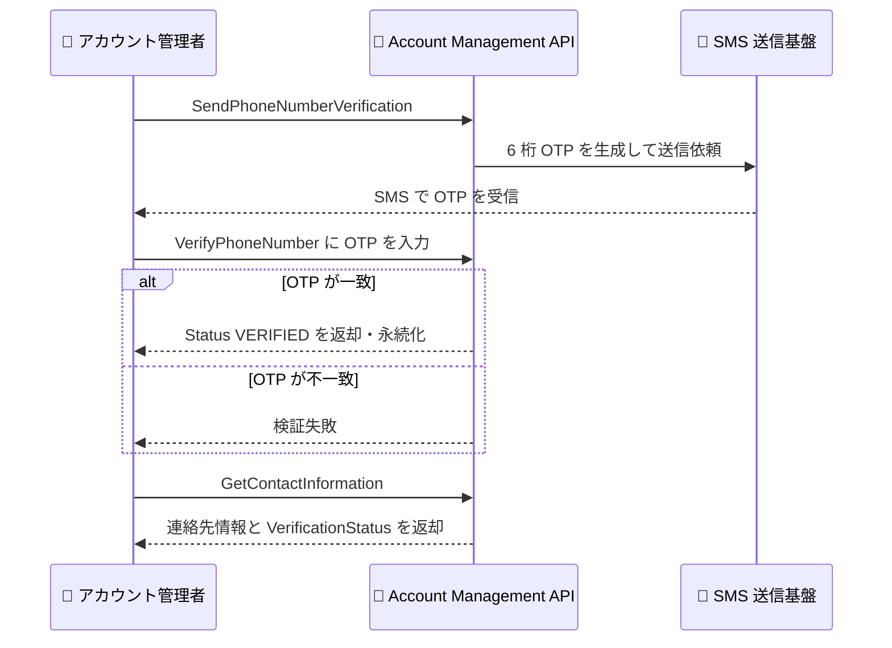
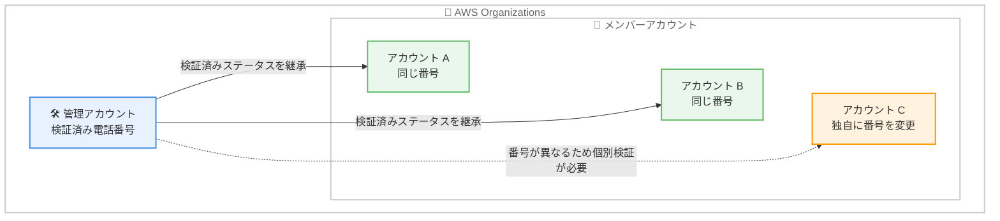

# AWS Account Management - 電話番号検証機能

**リリース日**: 2026 年 9 月 30 日
**サービス**: AWS Account Management
**機能**: AWS アカウントのプライマリ連絡先電話番号の検証 (Phone Number Verification)

📊 [このアップデートのインフォグラフィックを見る](https://takech9203.github.io/aws-news-summary/20260930-aws-accounts-phone-number-verification.html)

## 概要

AWS アカウントのプライマリ連絡先電話番号について、SMS で送信されるワンタイムパスコード (OTP) による所有権検証がサポートされました。これまで電話番号は形式のみが検証され、実際にアカウント所有者がその番号を利用できるかどうかを確認する帯域外 (out-of-band) の検証メカニズムは存在しませんでした。

検証は AWS Management Console または新しい `SendPhoneNumberVerification` API から開始できます。API が 6 桁の OTP を SMS で送信し、ユーザーが入力したコードを `VerifyPhoneNumber` API が検証して、検証済みステータスを永続化します。また、`GetContactInformation` API が検証ステータスを返すようになり、どのアカウントの電話番号が検証済みかを確認できます。

AWS Organizations 環境では、管理アカウントで検証済みの電話番号をメンバーアカウントに展開した場合、番号が一致すればメンバーアカウントも検証済みステータスを継承します。これにより、数千のアカウントで同じ番号を個別に検証する必要がなくなります。

**アップデート前の課題**

このアップデート以前には、以下の課題がありました。

- 電話番号は形式のみが検証され、実際に到達可能な番号かどうかを確認する手段がなかった
- アカウント復旧やサポート連絡の際に、登録された電話番号が有効である保証がなかった
- 多数のアカウントを管理する組織で、連絡先情報の正確性を担保する仕組みがなかった

**アップデート後の改善**

今回のアップデートにより、以下が可能になりました。

- SMS OTP による帯域外検証で、電話番号の所有権を確認できるようになった
- `GetContactInformation` API で検証ステータス (PENDING / VERIFIED / UNVERIFIED / NOT_SUPPORTED) を確認できるようになった
- AWS Organizations の管理アカウントから検証済みステータスをメンバーアカウントに継承でき、大規模環境での検証作業が不要になった

## アーキテクチャ図



SMS OTP による電話番号検証のフローです。検証開始から検証済みステータスの確認までを API で完結できます。



AWS Organizations における検証済みステータスの継承イメージです。管理アカウントと同じ検証済み番号を使用するメンバーアカウントは個別の検証が不要です。

## サービスアップデートの詳細

### 主要機能

1. **SMS OTP による電話番号検証**
   - AWS Management Console または `SendPhoneNumberVerification` API から検証を開始
   - 6 桁の OTP が SMS で送信される
   - `VerifyPhoneNumber` API が OTP を検証し、検証済みステータスを永続化

2. **検証ステータスの可視化**
   - `GetContactInformation` API のレスポンスに `VerificationStatus` フィールドが追加
   - ステータスは PENDING / VERIFIED / UNVERIFIED / NOT_SUPPORTED の 4 種類
   - 組織内のどのアカウントが検証済みかをプログラムで確認可能

3. **AWS Organizations でのステータス継承**
   - 管理アカウントで検証済みの番号をメンバーアカウントに展開した場合、番号が一致すれば検証済みステータスを継承
   - 数千のアカウントで同じ番号を個別に検証する作業が不要
   - メンバーアカウントが独自に番号を変更した場合は、そのアカウントで個別に検証が必要

4. **番号変更時の再検証**
   - `PutContactInformation` API で電話番号を変更した場合、再検証が必要
   - 常に最新の番号に対して検証ステータスが維持される

## 技術仕様

### 検証ステータス

| ステータス | 説明 |
|------|------|
| PENDING | OTP 送信済みで検証待ちの状態 |
| VERIFIED | OTP 検証が完了し、番号の所有権が確認された状態 |
| UNVERIFIED | 未検証、または番号変更により再検証が必要な状態 |
| NOT_SUPPORTED | 検証がサポートされない状態 |

### API 変更履歴

| 日付 | サービス | 変更内容 |
|------|----------|----------|
| 2026/09/30 | [AWS Account](https://awsapichanges.com/archive/changes/ca596c-account.html) | 2 new 1 updated api methods - `SendPhoneNumberVerification`、`VerifyPhoneNumber` の追加、`GetContactInformation` のレスポンスに `VerificationStatus` を追加 |

### API の例

```python
# 検証の開始 (OTP の SMS 送信)
client.send_phone_number_verification(
    AccountId='string'
)
# => {'Status': 'PENDING'}

# OTP の検証
client.verify_phone_number(
    AccountId='string',
    Otp='string'
)
# => {'Status': 'VERIFIED'}

# 検証ステータスの確認
client.get_contact_information(
    AccountId='string'
)
# => {'ContactInformation': {...}, 'VerificationStatus': 'VERIFIED'}
```

## 設定方法

### 前提条件

1. AWS アカウントのプライマリ連絡先情報に SMS を受信可能な電話番号が登録されていること
2. Account Management API を呼び出す IAM 権限 (`account:SendPhoneNumberVerification`、`account:VerifyPhoneNumber`、`account:GetContactInformation` など) があること
3. Organizations のメンバーアカウントを対象とする場合は、管理アカウントまたは委任管理者からの呼び出しであること

### 手順

#### ステップ 1: 検証の開始

```bash
aws account send-phone-number-verification
```

プライマリ連絡先の電話番号宛てに 6 桁の OTP が SMS で送信されます。Organizations 環境でメンバーアカウントを対象とする場合は `--account-id` を指定します。

#### ステップ 2: OTP の入力

```bash
aws account verify-phone-number --otp 123456
```

受信した 6 桁の OTP を指定して検証を完了します。検証に成功すると検証済みステータスが永続化されます。

#### ステップ 3: 検証ステータスの確認

```bash
aws account get-contact-information
```

レスポンスの `VerificationStatus` フィールドで、電話番号が `VERIFIED` になっていることを確認します。

## メリット

### ビジネス面

- **アカウント復旧の信頼性向上**: 検証済みの電話番号により、アカウント復旧やサポート連絡時の到達性が担保される
- **コンプライアンス対応**: 連絡先情報の正確性をプログラムで証明でき、監査要件への対応が容易になる
- **大規模環境での運用負荷削減**: Organizations のステータス継承により、数千アカウント規模でも検証作業を一元化できる

### 技術面

- **API による自動化**: 検証の開始から確認まですべて API で完結し、ガバナンスの自動化パイプラインに組み込める
- **帯域外検証によるセキュリティ強化**: SMS OTP という帯域外メカニズムで、形式チェックでは防げないなりすましや誤登録を検出できる
- **ステータスの可視化**: `GetContactInformation` で組織全体の検証状況を定期的に棚卸しできる

## デメリット・制約事項

### 制限事項

- 検証手段は SMS OTP であり、SMS を受信できない電話番号 (固定電話など) では検証方法に制約が生じる可能性がある
- `PutContactInformation` で番号を変更すると再検証が必要になる
- メンバーアカウントが独自に番号を変更した場合は、継承ではなく個別の検証が必要

### 考慮すべき点

- Organizations でステータス継承を活用するには、管理アカウントで検証した番号とメンバーアカウントの番号が一致している必要がある
- `NOT_SUPPORTED` ステータスが返るケースがあるため、自動化パイプラインではすべてのステータスをハンドリングする必要がある
- 検証ステータスの監視を定期ジョブに組み込み、`UNVERIFIED` のアカウントを検出する運用を検討する

## ユースケース

### ユースケース 1: 組織全体の連絡先情報ガバナンス

**シナリオ**: 数百のメンバーアカウントを持つ企業が、全アカウントの連絡先電話番号を統一し、有効性を担保したい。

**実装例**:
```bash
# 管理アカウントで番号を検証後、メンバーアカウントに展開
aws account put-contact-information --account-id 111122223333 \
  --contact-information "PhoneNumber=+81-3-XXXX-XXXX,FullName=...,..."

# 継承された検証ステータスを確認
aws account get-contact-information --account-id 111122223333
```

**効果**: 管理アカウントで 1 回検証するだけで、同じ番号を使用する全メンバーアカウントが検証済みとなり、個別検証の工数を削減できる。

### ユースケース 2: 検証ステータスの定期監査

**シナリオ**: セキュリティチームが、組織内に未検証の電話番号を持つアカウントがないかを定期的に監査したい。

**実装例**:
```python
import boto3

org = boto3.client('organizations')
account_client = boto3.client('account')

for page in org.get_paginator('list_accounts').paginate():
    for acct in page['Accounts']:
        resp = account_client.get_contact_information(AccountId=acct['Id'])
        if resp.get('VerificationStatus') != 'VERIFIED':
            print(f"未検証: {acct['Id']} - {resp.get('VerificationStatus')}")
```

**効果**: 未検証のアカウントを自動検出し、修復アクションにつなげることで、組織全体の連絡先情報の健全性を維持できる。

### ユースケース 3: アカウント復旧に備えた到達性の確保

**シナリオ**: 単一アカウントの利用者が、MFA デバイス紛失などのアカウント復旧シナリオに備えて、登録済み電話番号の有効性を事前に確認しておきたい。

**実装例**:
```bash
aws account send-phone-number-verification
aws account verify-phone-number --otp <受信した 6 桁コード>
```

**効果**: 緊急時に AWS からの連絡が確実に届く状態を事前に確認でき、アカウント復旧プロセスの確実性が向上する。

## 料金

公式発表には料金に関する記載はありません。アカウントの連絡先情報管理の一部として、追加料金なしで利用できると考えられますが、詳細は公式ドキュメントで確認してください。

## 利用可能リージョン

すべての AWS 商用リージョンで利用可能です。

## 関連サービス・機能

- **AWS Organizations**: 管理アカウントからメンバーアカウントへの検証済みステータスの継承に関連
- **AWS Account Management API**: `PutContactInformation`、`GetContactInformation` など既存の連絡先管理 API と組み合わせて利用
- **AWS IAM**: 検証 API の呼び出しに必要な権限管理

## 参考リンク

- 📊 [インフォグラフィック](https://takech9203.github.io/aws-news-summary/20260930-aws-accounts-phone-number-verification.html)
- [公式発表 (What's New)](https://aws.amazon.com/about-aws/whats-new/2026/09/aws-accounts-phone-number-verification/)
- [ドキュメント (AWS Account Management Reference)](https://docs.aws.amazon.com/accounts/latest/reference/)
- [API 変更履歴 (awsapichanges.com)](https://awsapichanges.com/archive/changes/ca596c-account.html)

## まとめ

AWS アカウントのプライマリ連絡先電話番号を SMS OTP で検証できるようになり、アカウント復旧やサポート連絡の到達性をプログラムで担保できるようになりました。特に AWS Organizations 環境では検証済みステータスの継承により大規模環境でも運用負荷を抑えられるため、組織の管理アカウントでの検証と、`GetContactInformation` を用いた検証ステータスの定期監査の導入を推奨します。
