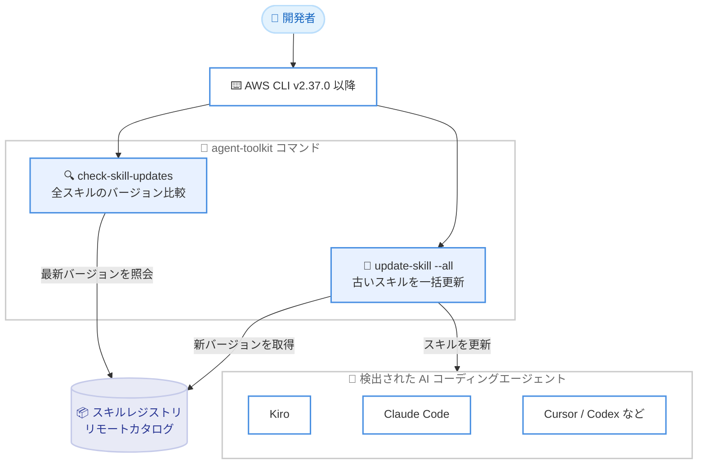

# AWS CLI - Agent Toolkit for AWS のスキル一括更新とバージョンチェック

**リリース日**: 2026 年 9 月 30 日
**サービス**: AWS CLI / Agent Toolkit for AWS
**機能**: インストール済みスキルの一括更新 (`update-skill --all`) とバージョンチェック (`check-skill-updates`)

📊 [このアップデートのインフォグラフィックを見る](https://takech9203.github.io/aws-news-summary/20260930-aws-cli-agent-toolkit-update-skill.html)
<!-- INFOGRAPHIC_BASE_URL は環境変数から取得 -->

## 概要

AWS CLI に、Agent Toolkit for AWS のエージェントスキルを一括管理するための 2 つの新しいコマンドが追加されました。`aws agent-toolkit check-skill-updates` コマンドは、インストール済みのすべてのスキルをレジストリの最新バージョンと比較し、更新が必要なスキルを一覧表示します。`aws agent-toolkit update-skill --all` コマンドは、古くなったすべてのスキルを単一のコマンドで最新バージョンに更新します。

Agent Toolkit for AWS は、AI コーディングエージェントが AWS 上でアプリケーションを構築、デプロイ、管理するためのツール、ナレッジ、ガードレールを提供するツールキットです。15,000 以上の AWS API へのセキュアで監査可能なアクセスを提供する AWS MCP Server、ストレージ、ネットワーキング、分析などのドメインをカバーするエージェントスキル、MCP Server と厳選されたスキルセットをまとめてインストールできるプラグインで構成されています。

対象となるのは、Kiro、Claude Code、Codex、Cursor などの AI コーディングエージェントで Agent Toolkit for AWS を利用している開発者、特にサーバーレス、ストレージ、ネットワーキング、分析など複数ドメインにわたって多数のスキルをインストールしているチームです。

**アップデート前の課題**

このアップデート以前は、インストール済みスキルの鮮度を維持するために手間のかかる運用が必要でした。

- 以前は、スキルの更新有無を確認するには、スキルごとに個別にバージョンを確認する必要がありました
- 以前は、`update-skill` コマンドはスキル名の指定が必須で、1 つずつしか更新できませんでした
- 以前は、多数のスキルをインストールしているチームでは、すべてのスキルを最新に保つための繰り返し作業が発生していました

**アップデート後の改善**

今回のアップデートにより、スキルのメンテナンスが大幅に簡素化されました。

- 今回のアップデートにより、`check-skill-updates` でインストール済みの全スキルとレジストリの最新バージョンを一度に比較できるようになりました
- 今回のアップデートにより、`update-skill --all` で古くなったすべてのスキルを単一のコマンドで更新できるようになりました
- 今回のアップデートにより、スキルを 1 つずつ確認、更新する反復作業が不要になり、常に最新のガイダンスをエージェントに提供できるようになりました

## アーキテクチャ図



開発者は AWS CLI から 2 つの新コマンドを実行し、スキルレジストリとの比較結果の確認と、検出されたすべての AI コーディングエージェントへの一括更新を行います。

## サービスアップデートの詳細

### 主要機能

1. **check-skill-updates コマンド**
   - インストール済みのすべてのスキルを、レジストリで利用可能な最新バージョンと比較します
   - 更新が必要なスキルを一覧で確認できるため、更新作業の計画が容易になります
   - スキルごとに個別のバージョン確認を行う必要がなくなります

2. **update-skill --all オプション**
   - 既存の `update-skill` コマンドに `--all` オプションが追加され、古くなったすべてのスキルを単一のコマンドで更新できます
   - ローカルのバージョンとカタログを比較し、新しいバージョンがある場合のみダウンロードします
   - 多数のスキルを導入しているチームでのメンテナンス負荷を大幅に削減します

3. **既存のスキル管理機能との統合**
   - AWS CLI にはすでに、スキルのインストール (`add-skill`)、検索 (`search-skills`)、一覧表示 (`list-installed-skills`、`list-available-skills`)、削除 (`remove-skill`)、MCP Server の設定 (`aws configure agent-toolkit`) が用意されています
   - 今回の追加により、スキルのライフサイクル全体 (導入、検索、更新、削除) をコマンドラインで完結できるようになりました
   - Kiro、Claude Code、Codex、Cursor など、システム上で検出された複数のエージェントを横断して動作します

## 技術仕様

### 新コマンドの概要

| 項目 | 詳細 |
|------|------|
| `check-skill-updates` | インストール済みの全スキルをレジストリの最新バージョンと比較 |
| `update-skill --all` | 古くなったすべてのスキルを単一コマンドで更新 |
| 前提バージョン | AWS CLI バージョン 2.37.0 以降 |
| 対象エージェント | Kiro、Claude Code、Codex、Cursor などの検出されたエージェント |
| スキルのインストール先 | 各エージェントの設定ディレクトリ (グローバル)。例: Kiro の `~/.kiro` |

### Agent Toolkit for AWS の構成要素

| 構成要素 | 説明 |
|----------|------|
| AWS MCP Server | 15,000 以上の AWS API へのセキュアで監査可能なエージェントインターフェイスを提供するマネージドサーバー |
| エージェントスキル | ストレージ、ネットワーキング、分析などのドメインをカバーする、手順、スクリプト、リファレンスをまとめたパッケージ |
| プラグイン | MCP Server の設定と厳選されたスキルセットを 1 回のインストールで導入できるバンドル |
| ルールファイル | エージェントの動作に対するガードレールや設定を定義するプロジェクトレベルの設定ファイル |

## 設定方法

### 前提条件

1. AWS CLI バージョン 2.37.0 以降がインストールされていること
2. Kiro、Claude Code、Cursor などのサポート対象 AI コーディングエージェントが 1 つ以上インストールされていること
3. `aws agent-toolkit add-skill` などで 1 つ以上のスキルがインストール済みであること

### 手順

#### ステップ 1: スキルの更新有無を確認する

```bash
aws agent-toolkit check-skill-updates
```

インストール済みのすべてのスキルをレジストリの最新バージョンと比較し、更新が利用可能なスキルを一覧表示します。

#### ステップ 2: すべてのスキルを一括更新する

```bash
aws agent-toolkit update-skill --all
```

古くなったすべてのスキルを最新バージョンに更新します。ローカルのバージョンとカタログを比較し、新しいバージョンが存在するスキルのみダウンロードします。

#### ステップ 3: 更新結果を確認する

```bash
aws agent-toolkit list-installed-skills
```

インストール済みのスキルについて、スキル名、対象エージェント、ファイルパスを一覧表示し、更新が反映されたことを確認します。更新後はエージェントクライアントを再起動して、新しいスキルを読み込みます。

## メリット

### ビジネス面

- **運用負荷の削減**: スキルを 1 つずつ確認、更新する反復作業がなくなり、開発者はアプリケーション開発に集中できます
- **チーム全体での一貫性**: 多数のスキルを導入しているチームでも、全スキルを容易に最新状態へ揃えられます
- **追加コストなし**: Agent Toolkit for AWS は追加料金なしで利用でき、今回の新コマンドにも追加費用は発生しません

### 技術面

- **一括バージョンチェック**: `check-skill-updates` により、更新対象の把握が単一コマンドで完結します
- **一括更新**: `update-skill --all` により、更新適用も単一コマンドで完結し、CI やセットアップスクリプトへの組み込みも容易です
- **最新ガイダンスの維持**: スキルを常に最新に保つことで、エージェントが最新の AWS ベストプラクティスや手順に基づいて動作します

## デメリット・制約事項

### 制限事項

- AWS CLI バージョン 2.37.0 以降が必要です
- スキルは各エージェントの設定ディレクトリにグローバルにインストールされるため、プロジェクト単位での管理には対応していません
- AWS MCP Server 自体の利用可能リージョンは米国東部 (バージニア北部) と欧州 (フランクフルト) です

### 考慮すべき点

- 一括更新ではすべての古いスキルが最新化されるため、特定バージョンに固定したいスキルがある場合は `--skill-version` での個別管理を検討してください
- スキル更新後は、エージェントクライアントの再起動が必要になる場合があります
- 特定のエージェントのみを対象にしたい場合は、`--agent` オプションでの個別更新を利用してください

## ユースケース

### ユースケース 1: 複数ドメインのスキルを導入したチームの定期メンテナンス

**シナリオ**: サーバーレス、ストレージ、ネットワーキング、分析など多数のスキルをインストールしているチームが、週次でスキルを最新化したい。

**実装例**:
```bash
# 更新対象を確認
aws agent-toolkit check-skill-updates

# 古いスキルをまとめて更新
aws agent-toolkit update-skill --all
```

**効果**: スキルごとの個別確認、個別更新が不要になり、2 コマンドでメンテナンスが完了します。

### ユースケース 2: 開発環境セットアップスクリプトへの組み込み

**シナリオ**: 新しいメンバーの開発環境や共有開発マシンで、エージェントのスキルを常に最新状態に保ちたい。

**実装例**:
```bash
#!/bin/bash
# 開発環境セットアップスクリプトの一部
aws configure agent-toolkit
aws agent-toolkit update-skill --all
```

**効果**: 環境構築のたびに最新スキルが自動で揃い、メンバー間でガイダンスのバージョン差異が発生しません。

### ユースケース 3: 新機能リリース後の迅速なスキル追従

**シナリオ**: AWS の新機能リリースに合わせてスキルが更新された際、エージェントに最新の手順を即座に反映したい。

**実装例**:
```bash
# 更新の有無を確認してから一括適用
aws agent-toolkit check-skill-updates
aws agent-toolkit update-skill --all
```

**効果**: エージェントが古い手順で動作するリスクを減らし、最新の AWS サービス仕様に沿ったガイダンスを常に利用できます。

## 料金

Agent Toolkit for AWS は追加料金なしで利用できます。エージェントがプロビジョニングまたは操作する AWS リソースに対してのみ、標準の AWS 料金が発生します。今回の新コマンド自体に追加費用はありません。

## 利用可能リージョン

新しい CLI コマンドは AWS CLI バージョン 2.37.0 以降で利用できます。なお、Agent Toolkit for AWS の AWS MCP Server は、米国東部 (バージニア北部) および欧州 (フランクフルト) リージョンで利用可能です。

## 関連サービス・機能

- **AWS MCP Server**: Agent Toolkit for AWS の中核コンポーネントで、15,000 以上の AWS API へのセキュアで監査可能なアクセスを MCP 経由で提供します
- **Kiro**: AWS が提供する AI 搭載 IDE で、AWS MCP Server に直接接続してスキルを利用できます
- **AWS CLI**: `aws configure agent-toolkit` および `aws agent-toolkit` コマンドグループを通じて、エージェントのセットアップとスキル管理を提供します
- **AWS IAM**: AWS MCP Server 経由のアクションは既存の IAM ロールとポリシーで制御され、CloudTrail で監査できます

## 参考リンク

- 📊 [インフォグラフィック](https://takech9203.github.io/aws-news-summary/20260930-aws-cli-agent-toolkit-update-skill.html)
- [公式発表 (What's New)](https://aws.amazon.com/about-aws/whats-new/2026/09/aws-cli-agent-toolkit-update-skill/)
- [ドキュメント: What is the Agent Toolkit for AWS?](https://docs.aws.amazon.com/agent-toolkit/latest/userguide/what-is-agent-toolkit.html)
- [ドキュメント: AWS CLI で Agent Toolkit を利用する](https://docs.aws.amazon.com/agent-toolkit/latest/userguide/aws-cli.html)
- [AWS CLI のインストール](https://docs.aws.amazon.com/cli/latest/userguide/getting-started-install.html)

## まとめ

今回のアップデートにより、Agent Toolkit for AWS のスキル管理が「1 つずつ」から「一括」へと進化し、多数のスキルを導入しているチームのメンテナンス負荷が大幅に軽減されました。AI コーディングエージェントで Agent Toolkit for AWS を利用している場合は、AWS CLI を 2.37.0 以降へ更新したうえで、`check-skill-updates` と `update-skill --all` を定期メンテナンスやセットアップスクリプトに組み込むことを推奨します。
