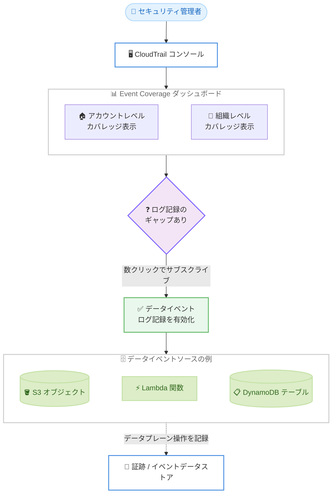

# AWS CloudTrail - Event Coverage によるデータプレーン操作の可視化

**リリース日**: 2026 年 9 月 30 日
**サービス**: AWS CloudTrail
**機能**: CloudTrail Event Coverage

📊 [このアップデートのインフォグラフィックを見る](https://takech9203.github.io/aws-news-summary/20260930-aws-cloudtrail-event-coverage.html)

## 概要

AWS CloudTrail は、データプレーン操作のログ記録状況を可視化する新しいコンソール体験「Event Coverage」を発表しました。Event Coverage を使用すると、アカウントレベルおよび AWS Organizations の組織レベルで、どのサービス・リソースタイプに対してデータイベントのログ記録が有効化されているかを一元的に確認できます。

データイベントは、Amazon S3 の GetObject や PutObject のようなオブジェクトレベルの操作をはじめとするデータプレーン操作を記録するもので、不正なデータアクセスやデータ持ち出しの試みを検知するうえで重要な役割を果たします。しかし、データイベントはデフォルトでは記録されないため、ログ記録が有効化されていないサービスやリソースタイプが存在すると、セキュリティモニタリングに死角 (ブラインドスポット) が生じる可能性がありました。

Event Coverage は、こうしたログ記録の抜け漏れを各アカウントを手動で調査することなく迅速に特定できるようにするもので、セキュリティチームやクラウド管理者、特にマルチアカウント環境を運用する組織にとって価値のあるアップデートです。

**アップデート前の課題**

このアップデート以前には、以下の課題がありました。

- データイベントのログ記録状況を確認するには、アカウントごと・証跡ごとにイベントセレクターの設定を手動で調査する必要があった
- マルチアカウントの組織では、サービスごとのカバレッジ監査に多くの時間と手間がかかっていた
- ログ記録されていないデータプレーン操作は検知されず、不正アクセスやデータ持ち出しの試みがセキュリティモニタリングの死角となるリスクがあった

**アップデート後の改善**

今回のアップデートにより、以下が可能になりました。

- サポートされているすべてのデータイベントソースのカバレッジ状況を、単一のダッシュボードで確認できるようになった
- ダッシュボードから数クリックでデータイベントのサブスクライブ (ログ記録の有効化) を行い、カバレッジのギャップを解消できるようになった
- アカウントレベルに加えて組織レベルでもカバレッジを把握できるようになり、マルチアカウント環境での監査負荷が大幅に軽減された

## アーキテクチャ図



Event Coverage ダッシュボードでアカウント・組織レベルのログ記録状況を確認し、ギャップが見つかった場合はダッシュボードから直接データイベントのログ記録を有効化できます。

## サービスアップデートの詳細

### 主要機能

1. **統合カバレッジダッシュボード**
   - サポートされているすべてのデータイベントソースのログ記録状況を 1 か所で確認できる
   - どのサービス・リソースタイプでデータイベントのログ記録が有効化されているか、されていないかを可視化
   - 各アカウントを手動で調査することなく、ログ記録態勢のギャップを迅速に特定できる

2. **ダッシュボードからの直接サブスクライブ**
   - カバレッジのギャップを発見した場合、ダッシュボードから直接データイベントをサブスクライブ可能
   - 数クリックでログ記録の抜け漏れを解消できる

3. **組織レベルの可視性**
   - アカウントレベルに加えて、AWS Organizations の組織レベルでカバレッジを確認できる
   - 多数のアカウントを運用する組織で、サービスごとのカバレッジ監査にかかる時間を削減

## 技術仕様

### データイベントの基本

| 項目 | 詳細 |
|------|------|
| データイベント | リソース上またはリソース内で実行される操作 (データプレーン操作) の記録 |
| デフォルト動作 | 証跡およびイベントデータストアでは、デフォルトでデータイベントは記録されない |
| 代表的な例 | S3 オブジェクトレベル操作 (GetObject、PutObject、DeleteObject)、Lambda 関数の Invoke、SNS の Publish など |
| 記録先 | CloudTrail の証跡またはイベントデータストア (CloudTrail Lake) |
| 料金 | データイベントのログ記録には追加料金が発生する |

### API 変更履歴

本アップデートに関連する API 変更は、発表時点の AWS API Changes (過去 7 日間) では確認されていません。本機能は CloudTrail コンソール上の新しい体験として提供されます。

## 設定方法

### 前提条件

1. AWS CloudTrail を利用できる AWS アカウント
2. CloudTrail コンソールへのアクセス権限、およびデータイベント設定を変更するための IAM 権限
3. 組織レベルで確認する場合は、AWS Organizations 環境と適切な権限を持つアカウント

### 手順

#### ステップ 1: CloudTrail コンソールで Event Coverage を開く

AWS マネジメントコンソールから CloudTrail コンソールにアクセスし、Event Coverage の画面を開きます。アカウントまたは組織におけるデータイベントソースごとのログ記録状況が表示されます。

#### ステップ 2: カバレッジのギャップを確認する

ダッシュボード上で、データイベントのログ記録が有効化されていないサービスやリソースタイプを確認します。手動で各アカウントの設定を調査する必要はありません。

#### ステップ 3: ダッシュボードからデータイベントをサブスクライブする

ギャップを解消したいデータイベントソースについて、ダッシュボードから直接サブスクライブします。数クリックでログ記録を有効化できます。

参考として、CLI でデータイベントのログ記録を設定する場合は、アドバンストイベントセレクターを使用します。

```bash
aws cloudtrail put-event-selectors \
  --trail-name MyTrail \
  --advanced-event-selectors \
  '[{
      "Name": "S3DataEvents",
      "FieldSelectors": [
          { "Field": "eventCategory", "Equals": ["Data"] },
          { "Field": "resources.type", "Equals": ["AWS::S3::Object"] },
          { "Field": "resources.ARN", "StartsWith": ["arn:aws:s3:::amzn-s3-demo-bucket/"] }
      ]
  }]'
```

このコマンドは、指定した S3 バケット内のオブジェクトに対するデータイベントを証跡に記録するように設定します。

## メリット

### ビジネス面

- **セキュリティリスクの低減**: 不正なデータアクセスやデータ持ち出しの試みを見逃す死角を解消し、セキュリティモニタリングの網羅性を向上できる
- **監査工数の削減**: マルチアカウント組織でのカバレッジ監査を手動調査なしで実施でき、運用コストを削減できる
- **コンプライアンス対応の強化**: ログ記録態勢を定常的に可視化することで、監査要件への対応状況を証明しやすくなる

### 技術面

- **一元的な可視化**: サポートされているすべてのデータイベントソースの状況を単一のダッシュボードで確認できる
- **迅速なギャップ解消**: ダッシュボードから数クリックでデータイベントのログ記録を有効化できる
- **組織レベルの統制**: アカウント単位だけでなく組織全体のログ記録態勢を把握でき、ガバナンスを強化できる

## デメリット・制約事項

### 制限事項

- データイベントのログ記録を有効化すると追加料金が発生する (データイベントは高ボリュームになりやすい)
- ログ記録は有効化した時点以降のイベントが対象であり、過去に遡って記録されるわけではない
- 利用可能なのは CloudTrail がサポートされている商用 AWS リージョンに限られる

### 考慮すべき点

- データイベントは高頻度のアクティビティであるため、すべてを有効化するとコストが増加する可能性がある。アドバンストイベントセレクターで対象を絞り込むなど、コスト最適化と可視性のバランスを検討する
- S3 バケットに対するデータイベントを記録する場合、証跡のログ配信先バケット自体を対象にすると再帰的なログ記録が発生する点に注意が必要
- 組織レベルで活用する場合は、AWS Organizations との連携設定や権限設計を事前に確認する

## ユースケース

### ユースケース 1: マルチアカウント組織のログ記録態勢の監査

**シナリオ**: 数十のメンバーアカウントを運用する企業のセキュリティチームが、S3 オブジェクトレベルのログ記録が全アカウントで有効化されているかを定期監査したい。

**実装例**:
```
1. 管理アカウントで CloudTrail コンソールの Event Coverage を開く
2. 組織レベルのカバレッジ表示で S3 データイベントの記録状況を確認
3. ログ記録が無効なアカウント・リソースを特定し、ダッシュボードからサブスクライブ
```

**効果**: 各アカウントを個別に調査する手作業がなくなり、監査にかかる時間を大幅に短縮できる。

### ユースケース 2: データ持ち出し検知の死角解消

**シナリオ**: 機密データを S3 に保管している組織が、GetObject などのオブジェクトレベル操作を漏れなく記録し、不正アクセスやデータ持ち出しの試みを検知したい。

**実装例**:
```
1. Event Coverage で S3 データイベントのカバレッジギャップを確認
2. 未記録のデータイベントソースをダッシュボードからサブスクライブ
3. 記録されたデータイベントを CloudTrail Lake や SIEM で分析し、異常なアクセスパターンを検知
```

**効果**: データプレーン操作の死角がなくなり、セキュリティインシデントの早期検知につながる。

### ユースケース 3: 新規サービス導入時のログ記録の抜け漏れ防止

**シナリオ**: 開発チームが Lambda や DynamoDB などの新しいサービスを導入した際に、データイベントのログ記録が設定されないまま運用が始まることを防ぎたい。

**実装例**:
```
1. 定期的に Event Coverage ダッシュボードを確認する運用を策定
2. 新たに利用が開始されたデータイベントソースのうち、未記録のものを特定
3. ダッシュボードから数クリックでログ記録を有効化
```

**効果**: サービス導入とログ記録設定のタイムラグによるブラインドスポットを最小化できる。

## 料金

Event Coverage の利用自体に関する追加料金は、公式発表には記載されていません。ただし、ダッシュボードからデータイベントのログ記録を有効化した場合、データイベントのログ記録に対する追加料金が発生します。データイベントは高ボリュームになりやすいため、有効化の範囲に応じたコストを事前に見積もることを推奨します。詳細は [AWS CloudTrail の料金ページ](https://aws.amazon.com/cloudtrail/pricing/) を参照してください。

## 利用可能リージョン

AWS CloudTrail がサポートされているすべての商用 AWS リージョンで利用可能です。

## 関連サービス・機能

- **Amazon S3**: オブジェクトレベル操作 (GetObject、PutObject など) がデータイベントの代表例であり、不正アクセス検知の主要な対象
- **AWS Lambda / Amazon DynamoDB**: 関数の Invoke やテーブル操作などのデータプレーン操作をデータイベントとして記録可能
- **AWS CloudTrail Lake**: データイベントの記録先となるイベントデータストアを提供し、記録したイベントの SQL ベースの分析が可能
- **AWS Organizations**: 組織レベルのカバレッジ表示と組み合わせることで、マルチアカウント全体のログ記録ガバナンスを実現

## 参考リンク

- 📊 [インフォグラフィック](https://takech9203.github.io/aws-news-summary/20260930-aws-cloudtrail-event-coverage.html)
- [公式発表 (What's New)](https://aws.amazon.com/about-aws/whats-new/2026/09/aws-cloudtrail-event-coverage/)
- [ドキュメント: Logging data events with CloudTrail](https://docs.aws.amazon.com/awscloudtrail/latest/userguide/logging-data-events-with-cloudtrail.html)
- [料金ページ](https://aws.amazon.com/cloudtrail/pricing/)

## まとめ

CloudTrail Event Coverage は、デフォルトでは記録されないデータプレーン操作のログ記録状況を、アカウント・組織レベルで一元的に可視化する新しいコンソール体験です。セキュリティモニタリングの死角を手動調査なしで特定し、数クリックで解消できるため、マルチアカウント環境を運用する組織はまず Event Coverage ダッシュボードで現在のカバレッジを確認し、重要なデータイベントソースの記録有効化とコストのバランスを検討することを推奨します。
