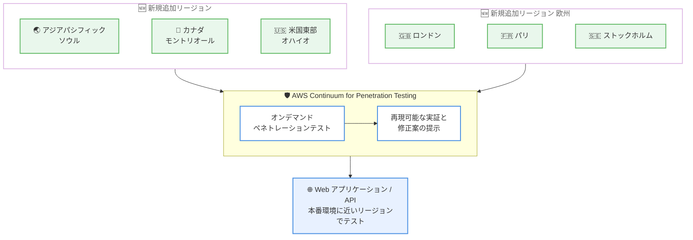

# AWS Continuum - ペネトレーションテスト機能が 6 つのリージョンに追加展開

**リリース日**: 2026 年 9 月 30 日
**サービス**: AWS Continuum (ペネトレーションテスト)
**機能**: AWS Continuum for Penetration Testing の利用可能リージョン拡大

📊 [このアップデートのインフォグラフィックを見る](https://takech9203.github.io/aws-news-summary/20260930-aws-continuum-penetration.html)
<!-- INFOGRAPHIC_BASE_URL は環境変数から取得 -->

## 概要

AWS Continuum for Penetration Testing (旧 AWS Security Agent) が、新たに 6 つのリージョンで一般提供を開始しました。追加されたのは、アジアパシフィック (ソウル)、カナダ (モントリオール)、欧州 (ロンドン)、米国東部 (オハイオ)、欧州 (パリ)、欧州 (ストックホルム) の各リージョンです。既存のサポート対象リージョンは引き続き利用できます。

AWS Continuum for Penetration Testing は、お客様の Web アプリケーションや API に対してペネトレーションテストを実施できるマネージドセキュリティサービスです。オンデマンドのテストにより、従来は数週間を要していたペネトレーションテストを数時間に短縮し、再現可能な実証とすぐに実装可能な修正案を提供します。

今回のリージョン拡大により、これらの地域で事業を展開する組織は、データレジデンシー (データ所在地) 要件を満たしながら、堅牢なセキュリティテストプログラムを維持できます。また、本番環境により近い場所でペネトレーションテストのワークロードを実行できるようになります。脆弱性評価、継続的なセキュリティ態勢の評価、PCI DSS や ISO 27001 などのフレームワークに対するコンプライアンス検証といったユースケースが想定されています。

**アップデート前の課題**

このアップデート以前には、以下のような課題が存在していました。

- AWS Continuum for Penetration Testing の提供リージョンは地理的に限定されており、利用できない地域の組織があった
- データレジデンシー要件を持つ組織は、テストデータの処理場所の制約により利用が難しい場合があった
- 本番環境から離れたリージョンでテストを実行する必要があり、テスト環境と本番環境の近接性に課題があった

**アップデート後の改善**

今回のアップデートにより、以下が可能になりました。

- アジアパシフィック (ソウル)、カナダ (モントリオール)、欧州 (ロンドン)、米国東部 (オハイオ)、欧州 (パリ)、欧州 (ストックホルム) でペネトレーションテストを実行できるようになった
- 欧州やアジアパシフィックなどの地域でデータレジデンシー要件を満たしながらセキュリティテストを実施できるようになった
- 本番環境により近いリージョンでテストワークロードを実行できるようになった

## アーキテクチャ図

今回追加された 6 つのリージョンから AWS Continuum for Penetration Testing を利用し、本番環境に近い場所で Web アプリケーションや API のテストを実行できます。

## サービスアップデートの詳細

### 主要機能

1. **6 つのリージョンへの提供拡大**
   - アジアパシフィック (ソウル)、カナダ (モントリオール)、欧州 (ロンドン)、米国東部 (オハイオ)、欧州 (パリ)、欧州 (ストックホルム) で一般提供を開始
   - 既存のサポート対象リージョンは引き続き完全に運用される
   - 欧州は 3 リージョン追加となり、欧州圏での選択肢が大幅に拡大

2. **データレジデンシー要件への対応**
   - これらの地域で事業を展開する組織が、データ所在地要件を満たしながらセキュリティテストプログラムを維持できる
   - 韓国、カナダ、英国、フランス、スウェーデンなど、データ保護規制が厳格な地域での利用が容易になる

3. **本番環境との近接性**
   - ペネトレーションテストのワークロードを本番環境により近いリージョンで実行できる
   - 脆弱性評価、継続的なセキュリティ態勢の評価、PCI DSS や ISO 27001 などのフレームワークに対するコンプライアンス検証に活用できる

## 技術仕様

### 今回追加されたリージョン

| リージョン名 | 地域 |
|------|------|
| アジアパシフィック (ソウル) | 韓国 |
| カナダ (モントリオール) | カナダ |
| 米国東部 (オハイオ) | 米国 |
| 欧州 (ロンドン) | 英国 |
| 欧州 (パリ) | フランス |
| 欧州 (ストックホルム) | スウェーデン |

### サービスの位置づけ

| 項目 | 詳細 |
|------|------|
| サービス名 | AWS Continuum for Penetration Testing (旧 AWS Security Agent) |
| テスト対象 | Web アプリケーション、API |
| 提供形態 | マネージドセキュリティサービス、一般提供 (GA) |
| テスト方式 | オンデマンド実行による継続的な検証 |
| 主なユースケース | 脆弱性評価、継続的なセキュリティ態勢評価、コンプライアンス検証 |

## メリット

### ビジネス面

- **データレジデンシー要件への適合**: テストを国内または地域内のリージョンで実行できるため、データ保護規制の厳しい地域でもセキュリティテストプログラムを導入しやすくなる
- **コンプライアンス対応の強化**: PCI DSS や ISO 27001 などのフレームワークに対する検証を、要件に合致したリージョンで実施できる
- **テストサイクルの短縮**: 従来数週間を要したペネトレーションテストを数時間で完了でき、リリースサイクルへの組み込みが容易になる

### 技術面

- **本番環境との近接性**: テストワークロードを本番環境に近いリージョンで実行することで、より実環境に即したテストが可能になる
- **継続的な検証**: オンデマンドでテストを実行できるため、定期的な評価から継続的なセキュリティ検証へ移行できる
- **実装可能な修正案**: 再現可能な実証とともに、すぐに実装可能な修正案が提供される

## デメリット・制約事項

### 制限事項

- 東京および大阪リージョンは今回の拡大対象に含まれていない
- テスト対象は Web アプリケーションと API であり、それ以外のワークロードは対象外
- 公式発表には既存のサポート対象リージョンの一覧は明示されていない

### 考慮すべき点

- ペネトレーションテストの実行にあたっては、対象システムへの影響を考慮したテスト計画が必要
- データレジデンシー要件への適合可否は、自社の規制要件と照らし合わせて確認する必要がある

## ユースケース

### ユースケース1: 欧州のデータ保護規制下でのセキュリティテスト

**シナリオ**: 英国やフランスで事業を展開する企業が、データを域内に保持する要件を満たしながら、Web アプリケーションの定期的なペネトレーションテストを実施したい。

**効果**: 欧州 (ロンドン)、欧州 (パリ)、欧州 (ストックホルム) の各リージョンでテストを実行することで、データレジデンシー要件を満たしながら継続的なセキュリティ検証を実現できる。

### ユースケース2: PCI DSS 準拠のための定期的な脆弱性評価

**シナリオ**: 決済システムを運用する企業が、PCI DSS 要件で求められるペネトレーションテストを、本番環境と同じリージョンで効率的に実施したい。

**効果**: 本番環境に近いリージョンでオンデマンドにテストを実行し、数時間でテストを完了できるため、コンプライアンス検証の頻度を高めながら運用負荷を抑えられる。

### ユースケース3: 韓国リージョンでの継続的セキュリティ態勢評価

**シナリオ**: 韓国国内でサービスを提供する企業が、国内リージョンで API のセキュリティ態勢を継続的に評価したい。

**効果**: アジアパシフィック (ソウル) リージョンでテストワークロードを実行し、本番環境への近接性を保ちながら、検証済みの脆弱性情報と修正案を迅速に得られる。

## 料金

公式発表には料金情報は記載されていません。最新の料金については [AWS Continuum の料金ページ](https://aws.amazon.com/continuum/pricing/) を確認してください。

## 利用可能リージョン

今回のアップデートにより、以下の 6 リージョンで新たに一般提供が開始されました。

- アジアパシフィック (ソウル)
- カナダ (モントリオール)
- 米国東部 (オハイオ)
- 欧州 (ロンドン)
- 欧州 (パリ)
- 欧州 (ストックホルム)

既存のサポート対象リージョンは引き続き利用できます。最新の提供状況は公式ページを確認してください。

## 関連サービス・機能

- **AWS Continuum**: ソフトウェアライフサイクル全体にわたりセキュリティリスクを検出、優先順位付け、検証、修復するサービス。ペネトレーションテストはその中核機能の 1 つ
- **AWS Security Agent**: AWS Continuum for Penetration Testing の旧称。ドキュメントやコンソールでは securityagent の名称が使用されている
- **AWS Security Hub**: セキュリティ検出結果の集約・管理サービス。ペネトレーションテストの結果と組み合わせてセキュリティ態勢を一元管理できる

## 参考リンク

- 📊 [インフォグラフィック](https://takech9203.github.io/aws-news-summary/20260930-aws-continuum-penetration.html)
- [公式発表 (What's New)](https://aws.amazon.com/about-aws/whats-new/2026/09/aws-continuum-penetration/)
- [AWS Continuum 製品ページ](https://aws.amazon.com/continuum/)
- [ドキュメント (ペネトレーションテストの実行)](https://docs.aws.amazon.com/securityagent/latest/userguide/perform-penetration-test.html)
- [料金ページ](https://aws.amazon.com/continuum/pricing/)

## まとめ

AWS Continuum for Penetration Testing が 6 つのリージョンに拡大したことで、欧州、アジアパシフィック、北米の広い範囲でデータレジデンシー要件を満たしながらペネトレーションテストを実行できるようになりました。該当地域でデータ所在地要件やコンプライアンス要件を持つ組織は、本番環境に近いリージョンでの継続的なセキュリティ検証への移行を検討することを推奨します。
