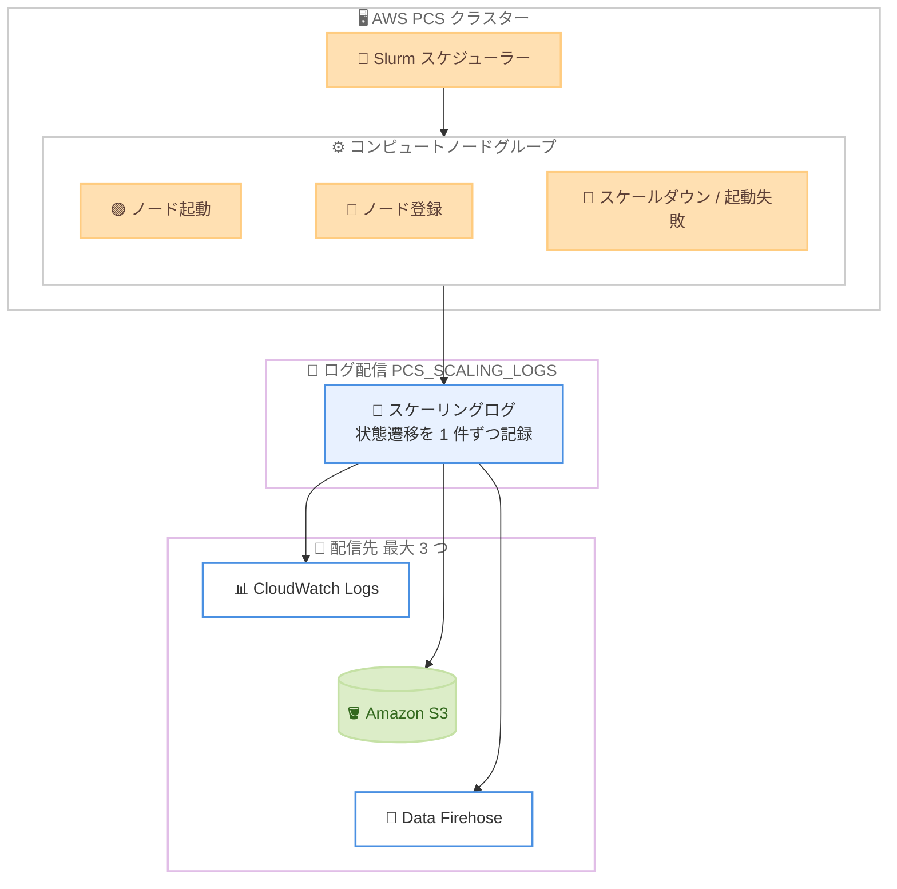

# AWS Parallel Computing Service - スケーリングログのサポート

**リリース日**: 2026 年 9 月 30 日
**サービス**: AWS Parallel Computing Service (AWS PCS)
**機能**: スケーリングログ (Scaling Logs)

📊 [このアップデートのインフォグラフィックを見る](https://takech9203.github.io/aws-news-summary/20260930-aws-pcs-scaling-logs.html)

## 概要

AWS Parallel Computing Service (AWS PCS) が、クラスター内のコンピュートノードグループのスケーリング動作を記録する新しいオブザーバビリティ機能「スケーリングログ」をサポートしました。各ログエントリは、インスタンスの起動、ノードの登録、スケールダウン、起動失敗とその理由など、1 つのコンピュートノードの 1 つの状態遷移を記録します。

スケーリングログは Amazon CloudWatch Logs、Amazon S3、Amazon Data Firehose の 3 つの宛先に配信できます。これにより、コンピュートノードグループが目標サイズに到達しなかった理由の特定、キャパシティ不足による起動失敗の把握、個々のノードの開始・停止時刻の確認が可能になります。HPC ワークロードを AWS PCS で運用する管理者や、スケーリングのトラブルシューティングを行う Solutions Architect にとって重要なアップデートです。

**アップデート前の課題**

このアップデート以前は、AWS PCS のスケーリング動作の内部状態を直接確認する手段が限られていました。

- コンピュートノードグループが目標サイズに到達しない場合、その原因をサービス側のログから直接特定できなかった
- EC2 のキャパシティ不足やクォータ超過による起動失敗を把握するには、CloudTrail の CreateFleet 呼び出し記録などを個別に調査する必要があった
- 個々のノードがいつ起動・停止したかを時系列で追跡する仕組みがなかった

**アップデート後の改善**

今回のアップデートにより、スケーリング動作の可視性が大幅に向上しました。

- ノードごとの状態遷移 (起動、登録、アクティブ化、ドレイン、終了、失敗) が構造化された JSON ログとして記録されるようになった
- `LAUNCH_FAILED` / `INSUFFICIENT_CAPACITY` のようなステータスコードと理由コードにより、スケーリング問題の根本原因を迅速に特定できるようになった
- CloudWatch Logs、S3、Data Firehose への配信により、既存のログ分析基盤やアラート基盤と統合できるようになった

## アーキテクチャ図



AWS PCS がコンピュートノードの状態遷移をスケーリングログとして記録し、CloudWatch Logs のベンデッドログ配信の仕組みを通じて最大 3 つの宛先に配信する流れを示しています。

## サービスアップデートの詳細

### 主要機能

1. **ノード単位の状態遷移の記録**
   - 各ログエントリは 1 つのコンピュートノードの 1 つの状態遷移を記録
   - クラスター ID、コンピュートノードグループ ID、スケジューラーノード ID、ステータスコード、理由コード、人間が読める説明文を含む
   - インスタンスが関連する遷移では EC2 インスタンス ID、インスタンスタイプ、サブネット ID などの起動コンテキストも記録

2. **3 つの配信先のサポート**
   - Amazon CloudWatch Logs: ログストリーム名 `AWSLogs/PCS/{cluster-id}/node_lifecycle.log` に配信
   - Amazon S3: `AWSLogs/{account-id}/PCS/{region}/{cluster-id}/node_lifecycle/...` のパスに gzip 圧縮ファイルとして配信
   - Amazon Data Firehose: ストリーミング配信により外部分析基盤と統合可能
   - クラスターごとに最大 3 つのログ配信先を設定可能

3. **オプトイン方式の配信設定**
   - スケーリングログの配信はデフォルトで無効
   - ログタイプ `PCS_SCALING_LOGS` を指定した配信設定を構成するまでログは配信されない
   - AWS Management Console または AWS CLI (CloudWatch Logs のベンデッドログ配信 API) で設定

## 技術仕様

### ログエントリのトップレベルフィールド

| フィールド | 例 | 説明 |
|------|------|------|
| `resource_id` | `pcs_22l8nzr3t9` | AWS PCS クラスター ID |
| `resource_type` | `PCS_CLUSTER` | 常に `PCS_CLUSTER` |
| `event_timestamp` | `1789179816460` | イベント発生時刻 (Unix エポックミリ秒) |
| `compute_node_group_id` | `pcs_56zr33g8` | ノードが属するコンピュートノードグループ |
| `scheduler_node_id` | `compute-1` | スケジューラーノード ID |
| `status_code` | `LAUNCH_FAILED` | ノードの新しいステータス |
| `reason_code` | `INSUFFICIENT_CAPACITY` | 遷移が発生した理由 |
| `description` | 説明文 | ステータスと理由コードから導出される要約 |
| `details` | `{...}` | 遷移の種類に応じた追加コンテキスト (オプション) |

`details` オブジェクトには、`instance_id`、`ec2_error_code`、`instance_type`、`subnet_id` が遷移の種類に応じて含まれます。`ec2_error_code` は、自身のアカウントの CloudTrail に記録される CreateFleet 呼び出しのエラーコードと同一です。

### 主なステータスコードと理由コード

| ステータスコード | 理由コード | 説明 |
|------|------|------|
| `LAUNCHED` | `SCHEDULER_REQUESTED` | スケジューラーのスケールアップ要求によるインスタンス起動 |
| `LAUNCHED` | `MAINTAIN_MIN_CAPACITY` | ノードグループの最小キャパシティ維持のための起動 |
| `REGISTERED` | `REGISTER_SUCCESS` | PCS エージェント経由でノードの登録に成功 |
| `ACTIVE` | `BOOTSTRAP_SUCCESS` | ブートストラップ完了。slurmd が稼働しジョブを受け付け可能 |
| `PENDING_REPLACEMENT` | `NODE_GROUP_UPDATE` | ノードグループ更新に先立つドレイン中 |
| `PENDING_REPLACEMENT` | `EC2_HEALTH_CHECK_FAILED` | ヘルスチェック失敗によるドレイン中 |
| `LAUNCH_FAILED` | `INSUFFICIENT_CAPACITY` | EC2 キャパシティ不足により起動失敗 |
| `LAUNCH_FAILED` | `LIMIT_EXCEEDED` | アカウントクォータ超過により起動失敗 |
| `TERMINATED` | `SCHEDULER_REQUESTED` | スケジューラーによるノード解放後の終了 (アイドルタイムアウトなど) |
| `TERMINATED` | `BOOTSTRAP_FAILED` | ブートストラップ失敗による終了 |
| `TERMINATED` | `EXTERNALLY_TERMINATED` | PCS 外部でインスタンスが終了されたことを検知 |
| `TERMINATE_FAILED` | `EC2_OPERATION_NOT_PERMITTED` | 終了保護などにより終了に失敗 |

### 必要な IAM 権限

AWS PCS クラスターを管理する IAM プリンシパルには、`pcs:AllowVendedLogDeliveryForResource` アクションの許可が必要です。

```json
{
    "Version": "2012-10-17",
    "Statement": [
        {
            "Sid": "PcsAllowVendedLogsDelivery",
            "Effect": "Allow",
            "Action": ["pcs:AllowVendedLogDeliveryForResource"],
            "Resource": [
                "arn:aws:pcs:*::cluster/*"
            ]
        }
    ]
}
```

## 設定方法

### 前提条件

1. AWS PCS クラスターが作成済みであること
2. 管理用 IAM プリンシパルに `pcs:AllowVendedLogDeliveryForResource` の許可があること
3. 配信先リソース (CloudWatch Logs ロググループ、S3 バケット、または Firehose 配信ストリーム) が作成済みであること

### 手順

#### ステップ 1: ログ配信先を作成する

```bash
aws logs put-delivery-destination --region us-east-1 \
  --name pcs-logs-destination \
  --delivery-destination-configuration \
  destinationResourceArn=arn:aws:logs:us-east-1:111122223333:log-group:/pcs/scaling-logs
```

CloudWatch Logs ロググループ、S3 バケット、または Firehose 配信ストリームの ARN を指定して、ログ配信先を作成します。

#### ステップ 2: PCS クラスターをログ配信ソースとして設定する

```bash
aws logs put-delivery-source --region us-east-1 \
  --name my-cluster-scaling-logs \
  --resource-arn arn:aws:pcs:us-east-1:111122223333:cluster/pcs_abc123de45 \
  --log-type PCS_SCALING_LOGS
```

AWS PCS クラスターの ARN とログタイプ `PCS_SCALING_LOGS` を指定して、クラスターを配信ソースとして登録します。

#### ステップ 3: 配信ソースと配信先を接続する

```bash
aws logs create-delivery --region us-east-1 \
  --delivery-source-name my-cluster-scaling-logs \
  --delivery-destination-arn arn:aws:logs:us-east-1:111122223333:delivery-destination:pcs-logs-destination
```

ステップ 1 とステップ 2 で作成した配信先と配信ソースを接続し、ログ配信を開始します。コンソールの場合は、クラスター詳細ページの [Logs] タブから [Scaling Logs] の配信先を最大 3 つまで追加できます。

## メリット

### ビジネス面

- **ダウンタイムの削減**: スケーリング問題の原因 (キャパシティ不足、クォータ超過など) を迅速に特定でき、HPC ワークロードの停滞時間を短縮できる
- **運用コストの削減**: CloudTrail や EC2 コンソールを横断して調査する手間が不要になり、トラブルシューティングの工数を削減できる
- **キャパシティ計画の改善**: 起動失敗の傾向をデータとして蓄積・分析することで、インスタンスタイプやサブネットの選定を最適化できる

### 技術面

- **構造化された JSON ログ**: ステータスコードと理由コードが明確に定義されており、CloudWatch Logs Insights や Athena による自動分析が容易
- **既存基盤との統合**: ベンデッドログ配信の標準的な仕組み (PutDeliverySource / PutDeliveryDestination / CreateDelivery) を採用しており、他の AWS サービスのログと同じ方法で管理できる
- **EC2 エラーとの突合**: `ec2_error_code` が CloudTrail の CreateFleet 記録と同一のコードを持つため、根本原因の追跡が容易

## デメリット・制約事項

### 制限事項

- スケーリングログの配信はオプトインであり、配信設定を構成するまでログは記録・配信されない
- 配信先はクラスターごとに最大 3 つまで
- 配信先として設定できるのは CloudWatch Logs、Amazon S3、Amazon Data Firehose のみ

### 考慮すべき点

- 配信設定前に発生したスケーリングイベントは遡って取得できないため、クラスター作成後は早期に有効化することが望ましい
- CloudWatch Logs、S3、Firehose それぞれの標準的な料金 (保存、取り込みなど) が発生する可能性があるため、配信先の選択とログ保持期間の設計が必要
- 大規模クラスターではノードの状態遷移が頻繁に発生するため、ログ量の増加を考慮した設計が必要

## ユースケース

### ユースケース 1: ノードグループが目標サイズに到達しない原因の調査

**シナリオ**: 大規模な HPC ジョブ投入時にコンピュートノードグループが目標サイズまでスケールせず、ジョブがキューに滞留している。

**実装例**:
```
CloudWatch Logs Insights クエリ:
fields @timestamp, scheduler_node_id, status_code, reason_code, description
| filter status_code = "LAUNCH_FAILED"
| sort @timestamp desc
```

**効果**: `INSUFFICIENT_CAPACITY` や `LIMIT_EXCEEDED` などの理由コードから、キャパシティ不足かクォータ超過かを即座に判別し、インスタンスタイプの変更やクォータ引き上げ申請などの対策を迅速に実行できる。

### ユースケース 2: キャパシティ起因の起動失敗を監視するアラート

**シナリオ**: 特定のインスタンスタイプのキャパシティ不足を早期に検知し、代替インスタンスタイプへの切り替えを判断したい。

**実装例**:
```
CloudWatch Logs メトリクスフィルター:
フィルターパターン: { $.reason_code = "INSUFFICIENT_CAPACITY" }
メトリクス: PCSCapacityFailures
アラーム: 5 分間で 3 回以上発生した場合に SNS 通知
```

**効果**: キャパシティ問題の発生をリアルタイムで検知し、複数のインスタンスタイプやサブネットを使用する構成への変更判断を早期に行える。

### ユースケース 3: ノードライフサイクルの長期分析

**シナリオ**: 数か月にわたるスケーリング履歴を分析し、ノードの起動から終了までのライフサイクル傾向やコスト最適化の機会を把握したい。

**実装例**:
```
S3 への配信を設定し、Athena でパーティション化されたログを分析:
SELECT status_code, reason_code, COUNT(*) AS cnt
FROM pcs_scaling_logs
WHERE year = '2026' AND month = '10'
GROUP BY status_code, reason_code
ORDER BY cnt DESC
```

**効果**: `TERMINATED` / `SCHEDULER_REQUESTED` (アイドルによるスケールダウン) の頻度などから、ノードグループの最小・最大キャパシティ設定の見直しに役立つ知見を得られる。

## 料金

公式発表には本機能自体の追加料金に関する記載はありません。スケーリングログの配信にあたっては、配信先となる Amazon CloudWatch Logs、Amazon S3、Amazon Data Firehose の標準料金 (ベンデッドログの取り込み・保存料金など) が適用されると考えられます。詳細は各サービスの料金ページで確認してください。

## 利用可能リージョン

AWS PCS が利用可能なすべての AWS リージョンで利用できます。最新のリージョン一覧は [AWS リージョン別サービス一覧](https://aws.amazon.com/about-aws/global-infrastructure/regional-product-services/) を参照してください。

## 関連サービス・機能

- **Amazon CloudWatch Logs**: スケーリングログの配信先の 1 つ。ベンデッドログ配信 API (PutDeliverySource など) による配信設定にも使用
- **Amazon S3**: 長期保存や Athena による分析に適した配信先
- **Amazon Data Firehose**: 外部の SIEM や分析基盤へのストリーミング連携に適した配信先
- **AWS CloudTrail**: `ec2_error_code` と CreateFleet 呼び出し記録を突合することで、起動失敗の詳細調査が可能
- **Amazon EC2**: スケーリングログに記録されるインスタンスの起動・終了の実体

## 参考リンク

- 📊 [インフォグラフィック](https://takech9203.github.io/aws-news-summary/20260930-aws-pcs-scaling-logs.html)
- [公式発表 (What's New)](https://aws.amazon.com/about-aws/whats-new/2026/09/aws-pcs-scaling-logs/)
- [ドキュメント: Scaling logs in AWS PCS](https://docs.aws.amazon.com/pcs/latest/userguide/monitoring_scaling-logs.html)
- [ドキュメント: Logging and monitoring for AWS PCS](https://docs.aws.amazon.com/pcs/latest/userguide/monitoring-overview.html)
- [AWS PCS 料金ページ](https://aws.amazon.com/pcs/pricing/)

## まとめ

AWS PCS のスケーリングログにより、HPC クラスターのコンピュートノードの状態遷移が構造化ログとして可視化され、スケーリング問題のトラブルシューティングが大幅に容易になりました。配信はオプトインであるため、AWS PCS を利用中のクラスターでは早期に `PCS_SCALING_LOGS` の配信設定を構成し、キャパシティ起因の起動失敗を監視するアラートの整備から着手することを推奨します。
