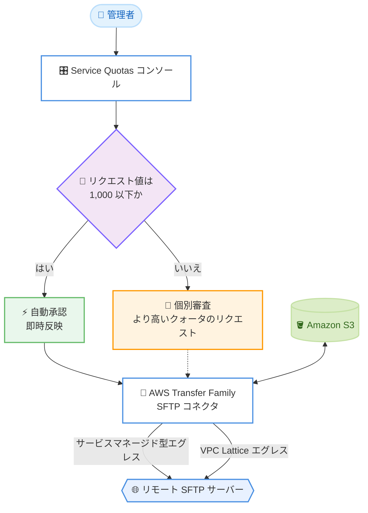

# AWS Transfer Family - SFTP コネクタクォータ引き上げの自動承認 (最大 1,000)

**リリース日**: 2026 年 9 月 30 日
**サービス**: AWS Transfer Family
**機能**: SFTP コネクタクォータ引き上げリクエストの自動承認

📊 [このアップデートのインフォグラフィックを見る](https://takech9203.github.io/aws-news-summary/20260930-aws-transfer-family-sftp-connector-quota-1000.html)

## 概要

AWS Transfer Family は、SFTP コネクタのクォータ引き上げリクエストを最大 1,000 コネクタまで自動承認するようになりました。これにより、アカウントごと、リージョンごとに最大 1,000 個の SFTP コネクタまでのクォータ引き上げが、手動レビューを待つことなく即座に承認されます。

SFTP コネクタは、Amazon S3 とリモート SFTP サーバー間のファイル転送をフルマネージドかつサーバーレスに実行する機能です。多数の取引先やパートナーとファイル連携を行う企業では、接続先ごとにコネクタを作成するため、ビジネスの拡大に伴いコネクタ数が増加します。今回のアップデートにより、こうした大規模なファイル転送ワークロードのスケーリングが迅速になります。

デフォルトクォータは従来どおりアカウントごと、リージョンごとに 100 コネクタのままで、引き上げリクエストは引き続き AWS Service Quotas コンソールから行います。自動承認は、サービスマネージド型エグレスと Amazon VPC Lattice エグレスのどちらを使用するコネクタにも適用されます。

**アップデート前の課題**

このアップデート以前は、クォータ引き上げに手動レビューが必要でした。

- SFTP コネクタのクォータ引き上げリクエストはすべて手動レビューの対象であり、承認までに時間がかかっていた
- 取引先の追加など、ビジネス要件に応じた迅速なスケーリングが承認待ちによって遅延する可能性があった
- 大規模なファイル転送基盤の構築時に、クォータ承認のリードタイムを考慮した計画が必要だった

**アップデート後の改善**

今回のアップデートにより、スケーリングのリードタイムが短縮されます。

- 最大 1,000 コネクタまでのクォータ引き上げリクエストが自動承認され、待ち時間なくスケールできるようになった
- 承認待ちを考慮せずに、取引先追加などのビジネス要件に即応できるようになった
- サービスマネージド型エグレスと VPC Lattice エグレスの両方のコネクタタイプで自動承認が利用できる

## アーキテクチャ図



Service Quotas コンソールからの SFTP コネクタクォータ引き上げリクエストは、1,000 以下であれば自動承認され、即座にコネクタを追加作成できます。

## サービスアップデートの詳細

### 主要機能

1. **クォータ引き上げの自動承認**
   - アカウントごと、リージョンごとに最大 1,000 SFTP コネクタまでの引き上げリクエストを自動承認
   - 手動レビューの待ち時間が不要になり、即座にスケーリングが可能
   - リクエスト手順は従来と同じく AWS Service Quotas コンソールを使用

2. **両方のエグレスタイプに対応**
   - サービスマネージド型エグレスを使用するコネクタに適用
   - Amazon VPC Lattice エグレスを使用するコネクタにも適用

3. **1,000 を超えるクォータのリクエスト**
   - 1,000 を超えるコネクタが必要な場合は、Service Quotas コンソールからより高いクォータをリクエスト可能
   - この場合は従来どおり個別の審査対象となる

## 技術仕様

### クォータの詳細

| 項目 | 詳細 |
|------|------|
| デフォルトクォータ | 100 SFTP コネクタ (アカウントごと、リージョンごと) |
| 自動承認の上限 | 1,000 SFTP コネクタ (アカウントごと、リージョンごと) |
| 1,000 超のリクエスト | Service Quotas コンソールから申請可能 (個別審査) |
| リクエスト方法 | AWS Service Quotas コンソール (従来と同じ) |
| 対象エグレスタイプ | サービスマネージド型、Amazon VPC Lattice |

## 設定方法

### 前提条件

1. AWS アカウントと Service Quotas コンソールへのアクセス権限
2. `servicequotas:RequestServiceQuotaIncrease` を含む IAM 権限
3. AWS Transfer Family SFTP コネクタを利用するリージョンの確認

### 手順

#### ステップ 1: 現在のクォータを確認

```bash
aws service-quotas list-service-quotas \
  --service-code transfer \
  --query "Quotas[?contains(QuotaName, 'connector')]"
```

AWS Transfer Family に関するクォータの一覧から、SFTP コネクタ関連のクォータ名、クォータコード、現在の適用値を確認します。

#### ステップ 2: クォータ引き上げをリクエスト

```bash
aws service-quotas request-service-quota-increase \
  --service-code transfer \
  --quota-code <SFTP コネクタのクォータコード> \
  --desired-value 500
```

ステップ 1 で確認したクォータコードを指定して、希望する値 (この例では 500) への引き上げをリクエストします。1,000 以下の値であれば自動承認されます。

#### ステップ 3: リクエストのステータスを確認

```bash
aws service-quotas list-requested-service-quota-change-history \
  --service-code transfer
```

リクエストの履歴とステータスを確認します。自動承認の対象であれば、ステータスが速やかに `CASE_CLOSED` または承認済みに変わり、新しいクォータが適用されます。

## メリット

### ビジネス面

- **スケーリングの迅速化**: 承認待ちがなくなることで、取引先の追加やビジネス拡大に即応できる
- **計画の簡素化**: クォータ承認のリードタイムを考慮したスケジュール調整が不要になる
- **大規模連携への対応**: 最大 1,000 の接続先と連携する大規模なファイル転送基盤を構築しやすくなる

### 技術面

- **運用負荷の軽減**: サポートケースや審査対応にかかる運用作業が削減される
- **自動化との親和性**: Service Quotas API によるリクエストが即時承認されるため、IaC やプロビジョニング自動化に組み込みやすい
- **エグレスタイプを問わない適用**: サービスマネージド型と VPC Lattice エグレスの両方で同じスケーリング体験が得られる

## デメリット・制約事項

### 制限事項

- 自動承認の対象は 1,000 コネクタまでであり、それを超える場合は従来どおり個別審査が必要
- デフォルトクォータは 100 のままであり、100 を超えて利用するには引き上げリクエスト自体は必要
- クォータはアカウントごと、リージョンごとに適用される

### 考慮すべき点

- コネクタ数の増加に伴い、SFTP コネクタの利用料金も増加するためコスト管理が必要
- 多数のコネクタを運用する場合、認証情報 (AWS Secrets Manager に保存するシークレット) の管理やローテーション運用も合わせて設計することが望ましい
- 接続先サーバー側の同時接続制限など、リモート側の制約も確認が必要

## ユースケース

### ユースケース 1: 取引先拡大に伴う B2B ファイル連携のスケール

**シナリオ**: 金融機関や物流企業が、数百社の取引先と SFTP でファイル連携しており、新規取引先の追加が頻繁に発生する。

**実装例**:
```
1. 取引先オンボーディングのワークフローに Service Quotas API を組み込む
2. コネクタ数がクォータに近づいたら自動で引き上げをリクエスト (1,000 以下)
3. 自動承認後、新しい取引先向けの SFTP コネクタを作成
```

**効果**: 承認待ちによるオンボーディング遅延がなくなり、取引先追加のリードタイムを短縮できる。

### ユースケース 2: IaC による大規模ファイル転送基盤のプロビジョニング

**シナリオ**: 全社共通のファイル転送基盤を Terraform や AWS CloudFormation で構築しており、環境ごとに数百のコネクタを展開する。

**実装例**:
```
1. デプロイ前にパイプラインで現在のクォータを確認
2. 不足する場合は request-service-quota-increase を実行 (自動承認)
3. そのまま同一パイプライン内でコネクタのプロビジョニングを継続
```

**効果**: クォータ承認待ちでパイプラインが中断されず、エンドツーエンドの自動デプロイが実現できる。

### ユースケース 3: VPC Lattice エグレスを使ったプライベート接続の拡張

**シナリオ**: オンプレミスやパートナーのプライベートネットワーク上の SFTP サーバーと、VPC Lattice エグレス経由で多数の接続を確立する。

**実装例**:
```
1. VPC Lattice エグレスを使用する SFTP コネクタを接続先ごとに作成
2. 接続先の増加に合わせてクォータを 1,000 まで自動承認で引き上げ
3. プライベート経路のまま接続先を拡大
```

**効果**: プライベート接続要件を維持しながら、審査待ちなしで接続先を拡大できる。

## 料金

今回のアップデートによる追加料金はありません。クォータ引き上げ自体は無料ですが、SFTP コネクタの利用には通常の AWS Transfer Family の料金 (コネクタ経由で転送されたデータ量に基づく課金) が適用されます。コネクタ数の増加に伴う転送量の増加はコストに影響するため、詳細は料金ページを確認してください。

## 利用可能リージョン

AWS Transfer Family の SFTP コネクタが提供されているすべての AWS リージョンで利用可能です。

## 関連サービス・機能

- **AWS Service Quotas**: クォータの確認と引き上げリクエストに使用するサービス。今回の自動承認もこのコンソール経由のリクエストに適用される
- **Amazon S3**: SFTP コネクタのファイル転送元・転送先となるストレージサービス
- **Amazon VPC Lattice**: プライベートネットワーク経由でリモート SFTP サーバーに接続する際のエグレスオプション
- **AWS Secrets Manager**: SFTP コネクタがリモートサーバーへの認証に使用するシークレットの保存先

## 参考リンク

- 📊 [インフォグラフィック](https://takech9203.github.io/aws-news-summary/20260930-aws-transfer-family-sftp-connector-quota-1000.html)
- [公式発表 (What's New)](https://aws.amazon.com/about-aws/whats-new/2026/09/aws-transfer-family-sftp-connector-quota-1000/)
- [ドキュメント: SFTP コネクタの作成](https://docs.aws.amazon.com/transfer/latest/userguide/creating-connectors.html)
- [料金ページ](https://aws.amazon.com/aws-transfer-family/pricing/)

## まとめ

AWS Transfer Family の SFTP コネクタクォータが最大 1,000 まで自動承認されるようになり、大規模なファイル転送ワークロードのスケーリングが大幅に迅速化されました。多数の取引先と SFTP 連携を行っている、または拡大を予定している場合は、Service Quotas コンソールからのクォータ引き上げが即時反映されることを前提に、オンボーディングやプロビジョニングの自動化を見直すことを推奨します。
