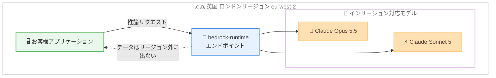

# Amazon Bedrock - 英国 (ロンドン) リージョンでの Claude モデルのインリージョンサポート拡大

**リリース日**: 2026 年 9 月 30 日
**サービス**: Amazon Bedrock
**機能**: Claude モデルの英国 (ロンドン) リージョンにおけるインリージョン推論サポート

📊 [このアップデートのインフォグラフィックを見る](https://takech9203.github.io/aws-news-summary/20260930-claude-region-expansion-lhr.html)

## 概要

Amazon Bedrock において、Anthropic の Claude Opus 5.5 および Claude Sonnet 5 が英国 (ロンドン) リージョン (eu-west-2) でインリージョン推論に対応しました。推論リクエストは呼び出したリージョン内の bedrock-runtime エンドポイントで処理され、データがそのリージョンの外に出ることはありません。

このアップデートは、英国内でのデータレジデンシー (データ所在地) 要件を持つお客様を主な対象としています。公式発表では、金融サービス、ヘルスケア、公共部門のお客様が、推論処理を英国内に保ちながら最新の Claude モデルを大規模に利用できるようになると説明されています。

**アップデート前の課題**

- 英国 (ロンドン) リージョンでは Claude Opus 5.5 および Claude Sonnet 5 をインリージョンで利用できなかった
- 厳格なデータレジデンシー要件を持つ英国の金融サービス、ヘルスケア、公共部門のお客様は、推論データが英国外のリージョンで処理される構成を許容できず、最新の Claude モデルの採用が困難だった
- コンプライアンス要件とモデル性能のどちらかを優先するトレードオフが発生していた

**アップデート後の改善**

- Claude Opus 5.5 および Claude Sonnet 5 を eu-west-2 の bedrock-runtime エンドポイントで直接呼び出せるようになった
- 推論リクエストとデータは呼び出したリージョン内で処理され、リージョン外に出ないことが保証される
- 英国のデータレジデンシー要件を満たしながら、最新世代の Claude モデルを大規模に活用できるようになった

## アーキテクチャ図



推論リクエストからモデル実行までのすべての処理が eu-west-2 リージョン内で完結し、データが英国外に出ない構成を示しています。

## サービスアップデートの詳細

### 主要機能

1. **Claude Opus 5.5 のインリージョン提供**
   - Anthropic の最上位モデルである Claude Opus 5.5 を eu-west-2 で直接利用可能
   - 推論処理はリージョン内の bedrock-runtime エンドポイントで実行

2. **Claude Sonnet 5 のインリージョン提供**
   - 性能とコストのバランスに優れた Claude Sonnet 5 を eu-west-2 で直接利用可能
   - 大規模なワークロードにも対応

3. **データレジデンシーの保証**
   - Amazon Bedrock は推論リクエストとデータを呼び出したリージョン内で処理
   - 処理データがリージョン外に出ることはないと公式発表に明記
   - 英国内のデータ所在地要件を満たすワークロードを構築可能

## 技術仕様

### 提供内容

| 項目 | 詳細 |
|------|------|
| 対象モデル | Claude Opus 5.5、Claude Sonnet 5 |
| 対象リージョン | 欧州 (ロンドン) eu-west-2 |
| エンドポイント | リージョン内の bedrock-runtime エンドポイント |
| データ処理 | 推論リクエストとデータは呼び出したリージョン内で処理 |
| 想定業種 | 金融サービス、ヘルスケア、公共部門など英国のデータレジデンシー要件を持つお客様 |

## 設定方法

### 前提条件

1. AWS アカウントと Amazon Bedrock へのアクセス権限
2. eu-west-2 リージョンでの Amazon Bedrock モデルアクセスの有効化
3. 適切な IAM 権限 (bedrock:InvokeModel など)

### 手順

#### ステップ 1: モデルアクセスの有効化

Amazon Bedrock コンソール (eu-west-2) の [Model access] から、Claude Opus 5.5 および Claude Sonnet 5 へのアクセスをリクエストします。

#### ステップ 2: 利用可能なモデルの確認

```bash
aws bedrock list-foundation-models \
  --region eu-west-2 \
  --by-provider anthropic \
  --query "modelSummaries[].modelId"
```

eu-west-2 リージョンで利用可能な Anthropic モデルの一覧を取得し、対象モデルが表示されることを確認します。

#### ステップ 3: インリージョンで推論を実行

```bash
aws bedrock-runtime converse \
  --region eu-west-2 \
  --model-id <Claude Sonnet 5 のモデル ID> \
  --messages '[{"role": "user", "content": [{"text": "こんにちは"}]}]'
```

eu-west-2 の bedrock-runtime エンドポイントに対して Converse API で推論リクエストを送信します。処理はリージョン内で完結します。モデル ID はステップ 2 の出力で確認した値を使用してください。

## メリット

### ビジネス面

- **コンプライアンス対応**: 英国内のデータレジデンシー要件を満たしながら最新の生成 AI モデルを利用可能
- **規制業種での採用促進**: 金融サービス、ヘルスケア、公共部門など規制の厳しい業種での生成 AI 活用が容易になる
- **トレードオフの解消**: データ所在地要件とモデル性能の二者択一が不要になる

### 技術面

- **インリージョン処理**: 推論データがリージョン外に出ないことが保証され、データフローの説明責任を果たしやすい
- **低レイテンシー**: 英国内のアプリケーションからリージョン内エンドポイントを直接呼び出すことで、ネットワーク経路が短縮される
- **既存 API との互換性**: 既存の Amazon Bedrock API (Converse、InvokeModel) をそのまま利用可能

## デメリット・制約事項

### 制限事項

- 今回のインリージョン対応は Claude Opus 5.5 と Claude Sonnet 5 の 2 モデルが対象
- モデルごとのリージョン対応状況は変化するため、最新情報は公式ドキュメントでの確認が必要

### 考慮すべき点

- eu-west-2 でのモデルアクセスを別途有効化する必要がある
- クロスリージョン推論プロファイルを使用している既存ワークロードでデータレジデンシー要件がある場合は、インリージョンのエンドポイント呼び出しへの切り替えを検討する

## ユースケース

### ユースケース 1: 金融サービスにおける顧客対応 AI アシスタント

**シナリオ**: 英国の金融機関が、顧客データを英国内に保持する規制要件のもとで、生成 AI による顧客対応アシスタントを構築する。

**実装例**:
```
アプリケーション (eu-west-2) → bedrock-runtime (eu-west-2) → Claude Sonnet 5
顧客データ・推論データはすべて英国内で処理
```

**効果**: データレジデンシー要件を満たしながら、高品質な自然言語対応を実現

### ユースケース 2: ヘルスケアデータの要約・分析

**シナリオ**: 英国の医療機関が、患者関連文書の要約や分析に生成 AI を活用したいが、データを国外に転送できない。

**実装例**:
```
文書処理パイプライン (eu-west-2) → Claude Opus 5.5 で高度な読解・要約
→ 結果を英国内のストレージに保存
```

**効果**: 機微なデータを英国内に保ちながら、高度な文書処理を自動化

### ユースケース 3: 公共部門の文書処理・市民サービス

**シナリオ**: 英国の公共機関が、市民からの問い合わせ対応や行政文書の処理に生成 AI を導入する。

**実装例**:
```
問い合わせフォーム → Lambda (eu-west-2) → Bedrock Converse API (eu-west-2)
→ Claude Sonnet 5 による回答生成
```

**効果**: 公共部門のデータ主権要件に準拠しつつ、市民サービスの応答品質と速度を向上

## 料金

公式発表には料金の詳細は記載されていません。Amazon Bedrock の料金はモデルおよびリージョンごとに設定されるため、最新の料金は [Amazon Bedrock 料金ページ](https://aws.amazon.com/bedrock/pricing/) を参照してください。

## 利用可能リージョン

- 欧州 (ロンドン) eu-west-2 — Claude Opus 5.5 および Claude Sonnet 5 のインリージョン推論に対応

モデルごとの最新のリージョン対応状況は、[公式ドキュメントのリージョン互換性ページ](https://docs.aws.amazon.com/bedrock/latest/userguide/models-region-compatibility.html#model-regions-anthropic) を参照してください。

## 関連サービス・機能

- **Amazon Bedrock Converse API**: モデル非依存の統一インターフェースで Claude モデルを呼び出し可能
- **AWS IAM**: モデル呼び出しに対するアクセス制御を提供
- **Amazon CloudWatch**: Bedrock の呼び出しメトリクスやログの監視に利用可能

## 参考リンク

- 📊 [インフォグラフィック](https://takech9203.github.io/aws-news-summary/20260930-claude-region-expansion-lhr.html)
- [公式発表 (What's New)](https://aws.amazon.com/about-aws/whats-new/2026/09/claude-region-expansion-lhr/)
- [Claude Opus 5.5 モデルカード](https://docs.aws.amazon.com/bedrock/latest/userguide/model-card-anthropic-claude-opus-5-5.html)
- [Claude Sonnet 5 モデルカード](https://docs.aws.amazon.com/bedrock/latest/userguide/model-card-anthropic-claude-sonnet-5.html)
- [モデルのリージョン対応状況](https://docs.aws.amazon.com/bedrock/latest/userguide/models-region-compatibility.html#model-regions-anthropic)
- [料金ページ](https://aws.amazon.com/bedrock/pricing/)

## まとめ

Claude Opus 5.5 と Claude Sonnet 5 が英国 (ロンドン) リージョンでインリージョン推論に対応し、推論データが英国外に出ない構成が可能になりました。英国のデータレジデンシー要件を持つ金融サービス、ヘルスケア、公共部門のお客様は、eu-west-2 でのモデルアクセスを有効化し、既存の Bedrock API からの利用を検討することを推奨します。
