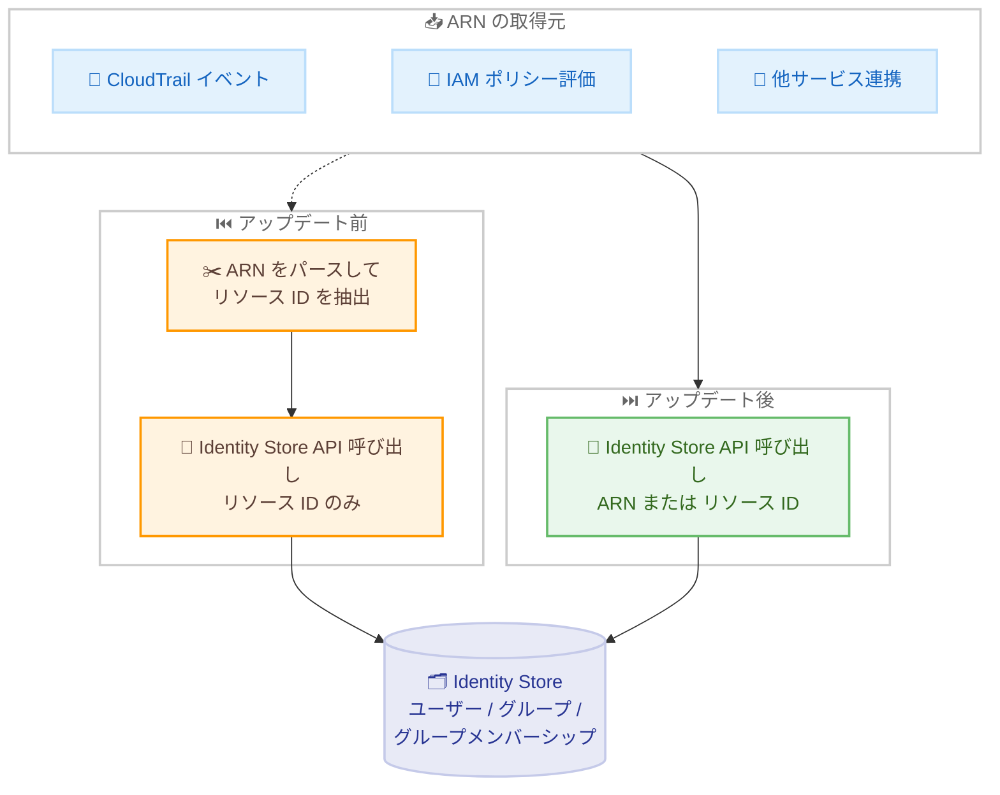

# AWS IAM Identity Center - Identity Store API におけるリソース ARN サポート

**リリース日**: 2026 年 9 月 30 日
**サービス**: AWS IAM Identity Center (Identity Store)
**機能**: Identity Store API がリソース ID に加えてリソース ARN を受け付け可能に

📊 [このアップデートのインフォグラフィックを見る](https://takech9203.github.io/aws-news-summary/20260930-iam-identity-center-apis-arns.html)

## 概要

AWS IAM Identity Center の Identity Store API が、従来のリソース ID に加えて Amazon リソースネーム (ARN) をリクエストの識別子として受け付けるようになりました。対象となるのはユーザー、グループ、グループメンバーシップ、および Identity Store 自体の ARN で、Identity Store API のすべてのリクエスト識別子フィールドに適用されます。

これまで、IAM ポリシーの評価結果、CloudTrail イベント、他の AWS サービスとの連携などから ARN を取得した開発者は、Identity Store API を呼び出す前に ARN からリソース ID を抽出 (パース) する必要がありました。今回のアップデートにより、取得した ARN をそのまま API に渡せるようになり、アプリケーションコードが簡素化され、パース処理に起因するバグを防止できます。

ARN サポートは追加的 (additive) な変更であり、リソース ID を使用する既存のインテグレーションは変更なしで引き続き動作します。API レスポンスは従来どおりリソース ID を返します。

**アップデート前の課題**

- CloudTrail イベントや IAM ポリシー評価から得られる識別子は ARN 形式だが、Identity Store API はリソース ID しか受け付けなかった
- API を呼び出す前に、ARN からリソース ID を抽出する独自のパース処理を実装する必要があった
- パース処理の実装ミスにより、誤ったリソースを操作するリスクがあった

**アップデート後の改善**

- ARN とリソース ID のどちらの形式でも API に直接渡せるようになった
- ARN からリソース ID を抽出するパース処理が不要になり、アプリケーションコードが簡素化された
- 不正な ARN (形式不正、またはリソースタイプの不一致) は `ValidationException` で検出されるため、誤操作を防止できる

## アーキテクチャ図



アップデート前は ARN からリソース ID を抽出する中間処理が必要でしたが、アップデート後は取得した ARN をそのまま Identity Store API に渡せます。

## サービスアップデートの詳細

### 主要機能

1. **リクエスト識別子フィールドでの ARN 受け入れ**
   - ユーザー、グループ、グループメンバーシップ、Identity Store の ARN をリクエストで指定可能
   - Identity Store API のすべてのリクエスト識別子フィールドに適用
   - ARN とリソース ID のどちらの形式でも指定できる

2. **後方互換性の維持**
   - ARN サポートは追加的な変更であり、既存のインテグレーションは変更なしで動作
   - API レスポンスは従来どおりリソース ID を返す

3. **バリデーションによる安全性**
   - 形式が不正な ARN や、対象フィールドと異なるリソースタイプを参照する ARN は `ValidationException` を返す
   - 誤った識別子によるリソース操作を未然に防止

## 技術仕様

### Identity Store のリソース ARN 形式

Service Authorization Reference に記載されている Identity Store のリソースタイプと ARN 形式は以下のとおりです。

| リソースタイプ | ARN 形式 |
|------|------|
| Identity Store | `arn:${Partition}:identitystore::${Account}:identitystore/${IdentityStoreId}` |
| ユーザー | `arn:${Partition}:identitystore:::user/${UserId}` |
| グループ | `arn:${Partition}:identitystore:::group/${GroupId}` |
| グループメンバーシップ | `arn:${Partition}:identitystore:::membership/${MembershipId}` |

### API変更履歴

| 日付 | サービス | 変更内容 |
|------|----------|----------|
| 2026/09/29 | [identitystore](https://awsapichanges.com/archive/changes/e9bb16-identitystore.html) | 3 new 17 updated api methods - リクエスト識別子としてのリソース ARN サポート、ネットワークアクセスコントロール、リソースリビジョンによる楽観的ロックの追加 |

## 設定方法

### 前提条件

1. IAM Identity Center が有効化されており、Identity Store が利用可能であること
2. 呼び出し元に `identitystore:*` の適切な IAM 権限が付与されていること
3. AWS CLI または AWS SDK が最新バージョンに更新されていること

### 手順

#### ステップ1: ARN を使用してユーザー情報を取得

```bash
aws identitystore describe-user \
  --identity-store-id d-1234567890 \
  --user-id "arn:aws:identitystore:::user/94482488-3041-7023-1111-e95dc12a4a50"
```

従来リソース ID を指定していた `--user-id` パラメータに、ユーザーの ARN を直接指定して詳細情報を取得します。レスポンスは従来どおりリソース ID 形式で返されます。

#### ステップ2: ARN を使用してグループ情報を取得

```bash
aws identitystore describe-group \
  --identity-store-id d-1234567890 \
  --group-id "arn:aws:identitystore:::group/93672b1234-5678-90ab-cdef-1234567890ab"
```

グループの識別子フィールドにも同様に ARN を指定できます。CloudTrail イベントなどから取得した ARN をパースせずにそのまま利用できます。

#### ステップ3: 既存コードの簡素化

既存アプリケーションで ARN からリソース ID を抽出していたパース処理 (例: `arn.split("/")[-1]` のような文字列操作) を削除し、ARN をそのまま API に渡すようにリファクタリングできます。既存のリソース ID ベースの呼び出しも引き続き動作するため、段階的な移行が可能です。

## メリット

### ビジネス面

- **開発コストの削減**: ARN のパース処理の実装・テスト・保守が不要になり、開発工数を削減できる
- **運用品質の向上**: パース処理の実装ミスによる誤操作リスクが低減し、ID 管理の信頼性が向上する
- **追加コストなし**: 既存の料金体系のまま、追加費用なしで利用できる

### 技術面

- **コードの簡素化**: CloudTrail、IAM ポリシー評価、クロスサービス連携から取得した ARN をそのまま利用できる
- **後方互換性**: 既存のリソース ID ベースのインテグレーションは変更不要で、段階的な移行が可能
- **堅牢なバリデーション**: 不正な ARN は `ValidationException` で検出されるため、フェイルファストな実装ができる

## デメリット・制約事項

### 制限事項

- API レスポンスは引き続きリソース ID を返すため、レスポンスから ARN が必要な場合は組み立て処理が必要
- 形式不正な ARN や、フィールドと異なるリソースタイプを参照する ARN は `ValidationException` となる

### 考慮すべき点

- ARN とリソース ID が混在するコードベースでは、チーム内でどちらの形式を標準とするか方針を決めておくことが望ましい
- IAM ポリシーでリソースレベルの権限を細かく制御している場合は、ARN 形式 (ユーザー / グループ / メンバーシップの ARN はリージョン・アカウント部が空) を正しく理解しておく必要がある

## ユースケース

### ユースケース1: CloudTrail イベントからの自動修復処理

**シナリオ**: セキュリティ監査の自動化で、CloudTrail イベントに含まれるユーザー ARN をもとに Identity Store のユーザー情報を照会し、不審な変更を検知・通知する。

**実装例**:
```python
import boto3

client = boto3.client("identitystore")

# CloudTrail イベントから取得した ARN をそのまま利用
user_arn = event["detail"]["requestParameters"]["userId"]

response = client.describe_user(
    IdentityStoreId="d-1234567890",
    UserId=user_arn  # パース不要で ARN を直接指定
)
```

**効果**: ARN からリソース ID を抽出する処理が不要になり、イベント駆動の自動化パイプラインが簡素化される。

### ユースケース2: IAM ポリシー評価結果との連携

**シナリオ**: アクセス権限の棚卸しツールで、IAM ポリシーの Resource 要素に記載されたグループ ARN をもとに、グループの詳細情報とメンバーシップを照会する。

**実装例**:
```bash
aws identitystore list-group-memberships \
  --identity-store-id d-1234567890 \
  --group-id "arn:aws:identitystore:::group/93672b1234-5678-90ab-cdef-1234567890ab"
```

**効果**: ポリシードキュメントから抽出した ARN をそのまま利用でき、棚卸しスクリプトの実装が簡潔になる。

### ユースケース3: 既存インテグレーションの段階的な移行

**シナリオ**: リソース ID ベースで実装済みの ID 管理ツールを、新規開発部分から ARN ベースに移行する。

**実装例**:
```python
# 既存コード: リソース ID ベース (変更不要で動作継続)
client.describe_user(IdentityStoreId=store_id, UserId=user_id)

# 新規コード: ARN ベース (パース処理なしで実装)
client.describe_user(IdentityStoreId=store_id, UserId=user_arn)
```

**効果**: 後方互換性が維持されているため、既存コードを変更せずに新規部分のみ ARN ベースで実装でき、リスクを抑えた移行ができる。

## 料金

追加料金はありません。IAM Identity Center および Identity Store API は無料で利用できます。

## 利用可能リージョン

IAM Identity Center が利用可能なすべての AWS リージョンで利用できます。

## 関連サービス・機能

- **AWS IAM Identity Center**: Identity Store は IAM Identity Center のユーザー・グループ情報を保持する基盤であり、本アップデートの対象サービス
- **AWS CloudTrail**: Identity Store リソースの ARN が記録されるイベントソースであり、本アップデートにより ARN をそのまま API 呼び出しに利用可能
- **AWS IAM**: ポリシーの Resource 要素で Identity Store リソースの ARN を使用しており、ポリシー評価結果と API 呼び出しの連携が容易になる

## 参考リンク

- 📊 [インフォグラフィック](https://takech9203.github.io/aws-news-summary/20260930-iam-identity-center-apis-arns.html)
- [公式発表 (What's New)](https://aws.amazon.com/about-aws/whats-new/2026/09/iam-identity-center-apis-arns/)
- [Identity Store API リファレンス](https://docs.aws.amazon.com/singlesignon/latest/IdentityStoreAPIReference/)
- [Service Authorization Reference - AWS Identity Store](https://docs.aws.amazon.com/service-authorization/latest/reference/list_awsidentitystore.html)

## まとめ

Identity Store API がリソース ARN を直接受け付けるようになり、CloudTrail や IAM ポリシー評価から取得した ARN をパースせずにそのまま利用できるようになりました。後方互換性が維持されているため既存コードへの影響はなく、追加料金もありません。Identity Store API を利用するアプリケーションを開発・運用しているチームは、ARN パース処理の削除によるコード簡素化を検討することを推奨します。
