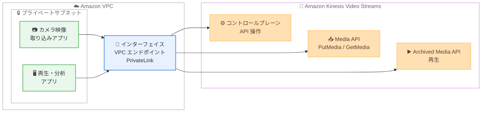

# Amazon Kinesis Video Streams - AWS PrivateLink による VPC エンドポイントのサポート

**リリース日**: 2026 年 9 月 30 日
**サービス**: Amazon Kinesis Video Streams
**機能**: インターフェイス VPC エンドポイント (AWS PrivateLink) のサポート

📊 [このアップデートのインフォグラフィックを見る](https://takech9203.github.io/aws-news-summary/20260930-kinesis-video-streams-vpc-privatelink.html)

## 概要

Amazon Kinesis Video Streams が、AWS PrivateLink を利用したインターフェイス VPC エンドポイントをサポートしました。VPC と Kinesis Video Streams の間のトラフィックが AWS ネットワーク内に閉じ、パブリックインターネットに公開されることがなくなります。

このエンドポイントは、コントロールプレーンの API 操作に加えて、映像の取り込み (PutMedia、GetMedia) と再生 (Archived Media API) のデータプレーンまでカバーする点が特徴です。これにより、インターネットゲートウェイ、NAT デバイス、パブリック IP アドレスを使用せずに、映像の取り込み、保存、再生が可能になります。

プライベートサブネットで稼働するコネクテッドカメラや IoT 映像ワークロードを運用するユーザー、および金融・公共など厳格なネットワーク分離要件を持つユーザーが主な対象です。エンドポイントは Amazon VPC コンソール、AWS CLI、AWS SDK から作成でき、VPC エンドポイントポリシーによるアクセス制御にも対応します。

**アップデート前の課題**

- 以前は Kinesis Video Streams へのアクセスにパブリックエンドポイントを使用する必要があり、プライベートサブネットからはインターネットゲートウェイや NAT デバイス経由の経路が必要だった
- 映像トラフィックがパブリックインターネットを経由するため、ネットワーク分離要件が厳しい環境では採用のハードルがあった
- NAT ゲートウェイなどの追加コンポーネントの構築・運用コストが発生していた

**アップデート後の改善**

- VPC 内から Kinesis Video Streams へプライベート接続でき、トラフィックが AWS ネットワーク内に閉じるようになった
- コントロールプレーンだけでなく、映像の取り込みと再生のデータプレーンもプライベート経路で利用可能になった
- VPC エンドポイントポリシーにより、エンドポイント経由で許可するアクション、プリンシパル、ストリームリソースを制御できるようになった

## アーキテクチャ図



プライベートサブネット内のアプリケーションは、インターフェイス VPC エンドポイントを経由して、インターネットを経由せずに Kinesis Video Streams のコントロールプレーンと映像取り込み・再生のデータプレーンにアクセスできます。

## サービスアップデートの詳細

### 主要機能

1. **コントロールプレーンとデータプレーンの両方をカバーするプライベート接続**
   - コントロールプレーン: Kinesis Video Streams API の各操作
   - 取り込み・取得 (データプレーン): Media API の `PutMedia`、`GetMedia`
   - 再生 (データプレーン): Archived Media API の `GetMediaForFragmentList` などの取得系操作
   - インターネットゲートウェイ、NAT デバイス、パブリック IP アドレスが不要

2. **プライベート DNS による透過的な切り替え**
   - エンドポイント作成時に [Enable private DNS name] がデフォルトで有効になり、リージョンの標準ホスト名 (`*.kinesisvideo.{region}.amazonaws.com`) がエンドポイントのプライベート IP アドレスに解決される
   - アプリケーション側のエンドポイント URL 変更は不要
   - プライベート DNS を無効にすると、ホスト名はパブリック IP アドレスに解決され、トラフィックはパブリック経路に戻る

3. **VPC エンドポイントポリシーによるアクセス制御**
   - デフォルトはフルアクセス。カスタムポリシーをアタッチして、許可するアクション、プリンシパル、ストリームリソースを制限可能
   - エンドポイントポリシーは IAM アイデンティティベースポリシーを置き換えるものではなく、両方のポリシーで許可されている必要がある

## 技術仕様

### エンドポイント情報

| 項目 | 詳細 |
|------|------|
| エンドポイントサービス名 | `com.amazonaws.{region}.kinesisvideo` (全リージョン・全パーティション共通) |
| プライベート DNS 名 (AWS リージョン) | `*.kinesisvideo.{region}.amazonaws.com` |
| プライベート DNS 名 (中国リージョン) | `*.kinesisvideo.cn-north-1.amazonaws.com.cn` |
| プライベート DNS 名 (GovCloud US) | `*.kinesisvideo-fips.{region}.amazonaws.com` (FIPS ホスト名のみ) |
| プロトコル | HTTPS (443) |
| リクエストレートクォータ | 500 リクエスト/秒 (アカウントごと、VPC エンドポイントごと、取り込み・再生 API の合算) |

**注意**: GovCloud (US) リージョンでは、プライベート DNS 名のみに `-fips` が含まれます。エンドポイントサービス名は `com.amazonaws.{region}.kinesisvideo` のままで、個別の `kinesisvideo-fips` エンドポイントサービスは存在しません。

### クォータとスロットリング

- VPC エンドポイント経由のトラフィックには、パブリックインターネット経由とは別のリクエストレートクォータ (500 リクエスト/秒) が適用される
- 上限を超えたリクエストはスロットリングされ、`ClientLimitExceededException` が返される。エクスポネンシャルバックオフとリトライを実装すること
- その他の Kinesis Video Streams のクォータはエンドポイント経由のトラフィックにも引き続き適用される
- クォータの引き上げは AWS サポートへの問い合わせで対応可能

## 設定方法

### 前提条件

1. VPC が作成済みであること
2. 使用する各アベイラビリティーゾーンにサブネットがあること
3. クライアントからのインバウンド HTTPS (443) を許可するセキュリティグループがあること
4. VPC の [DNS ホスト名の有効化] と [DNS サポートの有効化] 属性が有効であること (プライベート DNS 名の使用に必須)

### 手順

#### ステップ 1: リージョンのエンドポイントサービス情報を確認する

```bash
aws ec2 describe-vpc-endpoint-services \
    --filters Name=service-name,Values=com.amazonaws.us-east-1.kinesisvideo \
    --region us-east-1 \
    --query 'ServiceDetails[*].{ServiceName:ServiceName,PrivateDnsName:PrivateDnsName,AvailabilityZones:AvailabilityZones}'
```

対象リージョンの正確なサービス名、プライベート DNS 名、利用可能なアベイラビリティーゾーンを確認します。実行には `ec2:DescribeVpcEndpointServices` の権限が必要です。

#### ステップ 2: インターフェイス VPC エンドポイントを作成する

```bash
aws ec2 create-vpc-endpoint \
    --vpc-id vpc-0123456789abcdef0 \
    --vpc-endpoint-type Interface \
    --service-name com.amazonaws.us-east-1.kinesisvideo \
    --subnet-ids subnet-0123456789abcdef0 subnet-0fedcba9876543210 \
    --security-group-ids sg-0123456789abcdef0 \
    --private-dns-enabled \
    --region us-east-1
```

指定した VPC とサブネットに Kinesis Video Streams 用のインターフェイスエンドポイントを作成します。`--private-dns-enabled` によりリージョンの標準ホスト名がエンドポイントのプライベート IP に解決されるようになります。プライベート DNS はエンドポイント経由で Kinesis Video Streams に到達する唯一のサポートされた方法であるため、有効のままにします。

#### ステップ 3: 接続を検証する

```bash
aws kinesisvideo list-streams --region us-east-1
```

VPC 内のクライアントからコントロールプレーン API を呼び出し、プライベート経路での接続を検証します。本番トラフィックを移行する前に、テスト用ストリームで取り込みと再生を検証することが推奨されています。

## メリット

### ビジネス面

- **コンプライアンス対応**: 映像トラフィックがパブリックインターネットに公開されないため、厳格なネットワーク分離・データ保護要件を持つ業界 (金融、医療、公共など) での採用が容易になる
- **コスト削減の可能性**: NAT ゲートウェイなどインターネット接続用コンポーネントの構築・運用が不要になる
- **GovCloud・中国リージョンでも利用可能**: 規制の厳しい環境を含む幅広いリージョンで同一のアーキテクチャを採用できる

### 技術面

- **攻撃対象領域の削減**: パブリック IP アドレスやインターネット経路を排除し、セキュリティ態勢を強化できる
- **アプリケーション変更不要**: プライベート DNS により標準ホスト名のまま透過的にエンドポイント経由となるため、コード変更なしで移行できる
- **きめ細かいアクセス制御**: VPC エンドポイントポリシーで、エンドポイント経由のアクション・プリンシパル・リソースを制限できる

## デメリット・制約事項

### 制限事項

- **WebRTC は非サポート**: シグナリング、STUN、TURN、メディア、コントロールプレーンを含む Kinesis Video Streams WebRTC のすべてのコンポーネントは PrivateLink をサポートしない。WebRTC トラフィックをこのエンドポイントにルーティングしてはならない
- **プライベート DNS が必須かつ VPC 全体に適用**: プライベート DNS を有効にすると VPC 内のすべてのリソースのホスト名解決が上書きされるため、同一 VPC 内で一部のアプリケーションのみエンドポイントを使う構成はできない (VPC の分離が必要)
- **エンドポイントのパブリック DNS 名は使用不可**: VPC エンドポイント固有のホスト名への直接リクエストはエラーになる。プライベート DNS を有効にした標準ホスト名を使用する必要がある
- **別個のリクエストレートクォータ**: エンドポイント経由のトラフィックには 500 リクエスト/秒 (アカウント・エンドポイントごと) の独立したクォータが適用される

### 考慮すべき点

- プライベート DNS の有効化は VPC 単位の全か無かの切り替えになるため、段階的な移行 (1 つの VPC またはリージョンで検証してから拡大) が推奨される
- 同一 VPC に WebRTC ワークロードが存在する場合、プライベート DNS を有効にすると WebRTC トラフィックが失敗するため、エンドポイントを作成しないか VPC を分離する必要がある
- ロールバックは [Enable private DNS name] の無効化で可能だが、DNS 変更のためクライアントの次回の名前解決後に反映される
- 移行後は取り込み・再生のエラー率、レイテンシー、スロットリングの監視が推奨される

## ユースケース

### ユースケース 1: プライベートサブネットのコネクテッドカメラ映像の取り込み

**シナリオ**: 工場や店舗の監視カメラゲートウェイがプライベートサブネットの EC2 インスタンスで稼働しており、セキュリティポリシー上インターネットへの経路を持てない。

**実装例**:
```bash
# カメラゲートウェイが稼働する VPC にエンドポイントを作成
aws ec2 create-vpc-endpoint \
    --vpc-id vpc-camera-gateway \
    --vpc-endpoint-type Interface \
    --service-name com.amazonaws.ap-northeast-1.kinesisvideo \
    --subnet-ids subnet-az1 subnet-az2 \
    --security-group-ids sg-kvs-https \
    --private-dns-enabled
```

**効果**: NAT ゲートウェイを構築せずに、PutMedia による映像取り込みをプライベート経路で実現し、ネットワーク構成を簡素化できる。

### ユースケース 2: VPC 内の分析アプリケーションによる映像再生

**シナリオ**: プライベートサブネットで稼働する機械学習推論アプリケーションが、保存済み映像を Archived Media API で取得して分析する。

**実装例**:
```bash
# VPC 内から HLS ストリーミングセッション URL を取得して再生
aws kinesis-video-archived-media get-hls-streaming-session-url \
    --stream-name production-camera-01 \
    --playback-mode LIVE \
    --endpoint-url https://<data-endpoint>.kinesisvideo.ap-northeast-1.amazonaws.com
```

**効果**: 取り込みから再生・分析までの映像データフロー全体をプライベートネットワーク内に閉じることができる。

### ユースケース 3: エンドポイントポリシーによる最小権限アクセス

**シナリオ**: 共有 VPC のエンドポイント経由では、特定のストリームへの取り込み操作のみを許可したい。

**実装例**:
```json
{
  "Statement": [
    {
      "Effect": "Allow",
      "Principal": "*",
      "Action": [
        "kinesisvideo:GetDataEndpoint",
        "kinesisvideo:PutMedia"
      ],
      "Resource": "arn:aws:kinesisvideo:ap-northeast-1:123456789012:stream/production-camera-*/*"
    }
  ]
}
```

**効果**: IAM ポリシーと組み合わせた多層防御により、エンドポイント経由のアクセスを必要最小限に制限できる。

## 料金

公式発表では、この機能自体の追加料金に関する記載はありません。AWS PrivateLink のインターフェイスエンドポイントには、エンドポイントの時間課金とデータ処理料金が適用されます。詳細は AWS PrivateLink の料金ページを確認してください。

## 利用可能リージョン

Amazon Kinesis Video Streams が利用可能なすべての AWS リージョンで利用できます。AWS GovCloud (US) リージョンおよび中国 (北京) リージョン (Beijing Sinnet Technology Co., Ltd. が運営) を含みます。

ドキュメントに記載されている商用リージョンは以下のとおりです。

- 米国東部 (バージニア北部、オハイオ)、米国西部 (オレゴン)
- カナダ (中部)、南米 (サンパウロ)
- 欧州 (アイルランド、ロンドン、パリ、フランクフルト、スペイン)
- アジアパシフィック (東京、ソウル、シンガポール、シドニー、マレーシア、ムンバイ、香港)
- アフリカ (ケープタウン)、イスラエル (テルアビブ)
- 中国 (北京)、AWS GovCloud (US-East、US-West)

**東京リージョン (ap-northeast-1) でも利用可能です。**

## 関連サービス・機能

- **AWS PrivateLink**: 本アップデートの基盤技術。VPC と AWS サービス間のプライベート接続を提供する
- **Amazon VPC**: インターフェイスエンドポイントの作成先。プライベート DNS 設定とセキュリティグループによる制御を行う
- **Kinesis Video Streams WebRTC**: 低遅延の双方向メディアストリーミング機能。ただし本アップデートの VPC エンドポイントでは**サポートされない**点に注意
- **AWS IAM**: エンドポイントポリシーと組み合わせてアクセス制御の多層防御を構成する

## 参考リンク

- 📊 [インフォグラフィック](https://takech9203.github.io/aws-news-summary/20260930-kinesis-video-streams-vpc-privatelink.html)
- [公式発表 (What's New)](https://aws.amazon.com/about-aws/whats-new/2026/09/kinesis-video-streams-vpc-privatelink/)
- [ドキュメント: Access Amazon Kinesis Video Streams using AWS PrivateLink](https://docs.aws.amazon.com/kinesisvideostreams/latest/dg/vpc-interface-endpoints.html)
- [AWS PrivateLink とは](https://docs.aws.amazon.com/vpc/latest/privatelink/what-is-privatelink.html)
- [Amazon Kinesis Video Streams 製品ページ](https://aws.amazon.com/kinesis/video-streams/)
- [AWS PrivateLink 料金](https://aws.amazon.com/privatelink/pricing/)

## まとめ

Amazon Kinesis Video Streams がインターフェイス VPC エンドポイントに対応し、コントロールプレーンから映像の取り込み・再生データプレーンまでをプライベート経路で利用できるようになりました。インターネット経路を排除したい映像ワークロードには大きな前進ですが、WebRTC が非サポートである点と、プライベート DNS が VPC 全体に適用される点に注意が必要です。導入時はテスト用 VPC での検証から始め、段階的に移行することを推奨します。
