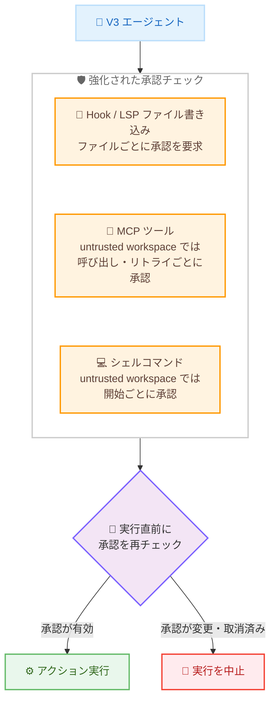

# Kiro - Workflows, Classic Migration Guidance, and V3 Approval Safeguards (Kiro CLI 2.26.0)

**リリース日**: 2026 年 9 月 30 日
**サービス**: Kiro (AWS が提供する AI 搭載 IDE / CLI)
**機能**: Kiro CLI 2.26.0 - Workflows のオプトイン提供、Classic 移行ガイダンス、V3 承認チェックの強化

📊 [このアップデートのインフォグラフィックを見る](https://takech9203.github.io/aws-news-summary/20260930-kiro-changelog-2026-09-30-cli-2-26-0.html)

## 概要

Kiro CLI 2.26.0 がリリースされました。本リリースでは、再利用可能なマルチステップタスクを実行する Workflows 機能がオプトインで V3 セッションに追加されたほか、非推奨となった Classic インターフェースから新しいターミナル UI への移行を支援するガイダンス表示が導入されました。さらに、V3 における承認 (approval) チェックが大幅に強化され、Hook や Language Server Protocol (LSP) によるファイル書き込み、untrusted workspace での MCP ツール呼び出しやシェルコマンド実行、待機中に変更された承認の扱いがより厳格になりました。

本レポートでは、CLI 2.26.0 リリース全体のうち、特に Classic 移行ガイダンスと V3 の承認チェック強化を中心に解説します。なお、Workflows 機能自体の詳細は既存レポート ([Kiro - Introducing Workflows](./2026-09-30-kiro-introducing-workflows.md)) を参照してください。

**アップデート前の課題**

このアップデート以前には、以下の課題が存在していました。

- Classic インターフェースを起動した際、どのフラグ・環境変数・保存済み設定が Classic の起動原因なのかが分からず、ターミナル UI へ移行するために何を変更すべきか特定しにくかった
- Hook や LSP によるファイル編集 (リネームやフォーマット操作など) が、個々のファイル単位での承認を経ずに実行される場合があった
- untrusted workspace において、過去の許可や広範な許可設定が残っていると、MCP ツールやシェルコマンドが毎回の確認なしに実行される可能性があった
- アクションが承認待ちの間に承認内容が変更またはキャンセルされても、古い承認に基づいてアクションが実行されるリスクがあった
- macOS / Linux で、シンボリックリンクやパスの別表記を経由して同一ファイルにアクセスした場合、V3 のファイル権限ルールが適用されないケースがあった

**アップデート後の改善**

今回のアップデートにより、以下が可能になりました。

- V3 セッションで `/settings` の **Features** から Workflows を有効化し、`/workflow run` コマンドで再利用可能なマルチステップタスクを実行できるようになった
- Classic セッション開始時に非推奨通知が表示され、Classic を起動したフラグ・環境変数・設定が特定されるとともに、ターミナル UI への切り替えガイダンスが案内されるようになった
- Hook ファイルの書き込み前、およびリネーム・フォーマット操作における各ファイルの変更前に、ファイル単位の承認が要求されるようになった
- untrusted workspace では、MCP ツールは呼び出しとリトライのたびに、シェルコマンドは開始のたびに承認が要求されるようになった (保存済みまたは広範な許可が存在する場合でも適用)
- すべてのツール実行の直前に承認の有効性が再チェックされ、待機中に変更・キャンセルされた承認は適用されなくなった

## アーキテクチャ図



Kiro CLI 2.26.0 の V3 では、Hook / LSP のファイル書き込み、MCP ツール、シェルコマンドのそれぞれで承認チェックが強化され、さらにすべてのアクションの実行直前に承認の有効性が再チェックされます。

## サービスアップデートの詳細

### 主要機能

1. **マルチステップ Workflows の実行 (オプトイン)**
   - V3 セッションで `/settings` を開き、**Features** から **Workflows** を有効化し、Kiro CLI を再起動すると利用可能になる
   - 実現したい成果 (アウトカム) を Kiro に伝えて Workflow を作成するか、`/workflow run` でレシピを起動できる
   - `/workflow` コマンド群で実行中の Workflow の確認や管理が可能
   - Workflows 機能の詳細は[既存レポート](./2026-09-30-kiro-introducing-workflows.md)を参照

2. **Classic からターミナル UI への移行ガイダンス**
   - Classic セッションの開始時に非推奨 (deprecation) 通知が表示されるようになった
   - フラグ、環境変数、保存済み設定のいずれかが Classic の起動原因である場合、通知がその原因を特定して表示する
   - ターミナル UI への切り替え手順を解説するドキュメントへの案内が表示される

3. **Hook / LSP ファイル書き込みのファイル単位承認**
   - V3 の Hook および LSP による編集は、Hook ファイルの書き込み前に承認を要求する
   - リネームやフォーマット操作では、変更対象の各ファイルごとに承認を要求する

4. **untrusted workspace における MCP ツールの承認強化**
   - untrusted workspace では、V3 の MCP ツールは呼び出しおよびリトライのたびに承認を要求する
   - すべての MCP 呼び出しは、実行前に承認が現在も有効であることを確認する

5. **untrusted workspace におけるシェルコマンドの開始ごと承認**
   - untrusted workspace では、V3 のシェルコマンドは開始のたびに承認を要求する
   - 保存済みの許可や広範な許可設定が存在する場合でも、毎回の確認が適用される

6. **ツール実行直前の承認再チェック**
   - V3 のツール実行は、アクションの実行直前に各承認を再チェックする
   - 待機中に承認が変更またはキャンセルされた場合、その承認は適用されず、アクションは実行されない

### 修正 (Fixes)

- macOS および Linux において、シンボリックリンクやパスの別表記を経由して同一ファイルにアクセスした場合でも、V3 のファイル権限ルールが適用されるようになった
- V3 セッションで、リロード後にツールが返した画像が復元されるようになった

## 技術仕様

### CLI 2.26.0 の承認チェック強化の対象

| 対象 | 強化内容 | 適用条件 |
|------|----------|----------|
| Hook ファイル書き込み | 書き込み前にファイル単位で承認を要求 | V3 の Hook 編集 |
| LSP 操作 (リネーム・フォーマット) | 変更する各ファイルごとに承認を要求 | V3 の LSP 編集 |
| MCP ツール | 呼び出し・リトライごとに承認を要求 | untrusted workspace |
| MCP ツール | 実行前に承認の有効性を確認 | すべての MCP 呼び出し |
| シェルコマンド | 開始ごとに承認を要求 (保存済み許可があっても適用) | untrusted workspace |
| すべてのツール実行 | 実行直前に承認を再チェックし、変更・取消済みの承認は不適用 | V3 のツール実行全般 |
| ファイル権限ルール | シンボリックリンク・パス別表記経由のアクセスにも適用 | macOS / Linux |

### Workflows の有効化と操作

| 項目 | 詳細 |
|------|------|
| 有効化方法 | `/settings` → **Features** → **Workflows** を有効化し、Kiro CLI を再起動 |
| デフォルト状態 | 無効 (オプトイン) |
| 実行方法 | Kiro に成果を伝えて Workflow を作成、または `/workflow run` でレシピを起動 |
| 管理方法 | `/workflow` コマンド群で実行状況の確認・管理 |

## 設定方法

### 前提条件

1. Kiro CLI 2.26.0 以降にアップデートしていること
2. V3 セッション (ターミナル UI) を使用していること (Workflows および承認チェック強化は V3 が対象)

### 手順

#### ステップ 1: Kiro CLI のアップデート

```bash
kiro-cli update
```

Kiro CLI を最新バージョン (2.26.0 以降) にアップデートします。

#### ステップ 2: Workflows の有効化 (任意)

```bash
# V3 セッション内で設定画面を開く
/settings
```

設定画面で **Features** を選択し、**Workflows** を有効化します。変更を適用するには Kiro CLI を再起動します。

#### ステップ 3: Workflow の実行 (任意)

```bash
# レシピから Workflow を起動
/workflow run

# Workflow の確認・管理
/workflow
```

実現したい成果を Kiro に伝えて Workflow を作成するか、`/workflow run` でレシピを起動します。`/workflow` コマンドで実行中の Workflow を確認・管理できます。

#### ステップ 4: Classic 利用者の移行確認

Classic インターフェースを利用している場合、セッション開始時に表示される非推奨通知を確認します。通知には Classic を起動したフラグ・環境変数・設定が表示されるため、該当する設定を変更してターミナル UI に切り替えます。詳細な手順は[公式ドキュメント](https://kiro.dev/docs/cli/terminal-ui/#using-the-classic-interface)を参照してください。

## メリット

### ビジネス面

- **セキュリティガバナンスの強化**: untrusted workspace での MCP ツール・シェルコマンド実行に毎回の承認が必須となり、信頼できないコードベースを扱う際の意図しない操作のリスクが低減される
- **移行コストの削減**: Classic の起動原因が通知で特定されるため、ターミナル UI への移行時に設定を調査する手間が削減される
- **タスク自動化による生産性向上**: Workflows により、定型的なマルチステップタスクを再利用可能な形で実行できる

### 技術面

- **ファイル単位の細かな制御**: Hook / LSP の書き込みがファイルごとに承認されるため、広範なファイル権限を許可している場合でも重要な設定ファイルの変更を把握できる
- **TOCTOU 的なリスクの低減**: 実行直前の承認再チェックにより、承認待ちの間に状態が変化した場合でも古い承認でアクションが実行されることを防げる
- **パス正規化による権限ルールの一貫性**: macOS / Linux でシンボリックリンクやパスの別表記を経由しても、ファイル権限ルールが確実に適用される

## デメリット・制約事項

### 制限事項

- Workflows はオプトイン機能であり、デフォルトでは無効。有効化後は Kiro CLI の再起動が必要
- Workflows および承認チェックの強化は V3 (ターミナル UI) が対象であり、Classic インターフェースは非推奨となっている
- Classic インターフェースは今後の廃止に向けた移行が推奨される

### 考慮すべき点

- untrusted workspace では MCP ツールやシェルコマンドの実行ごとに承認が求められるため、確認操作が増える。頻繁に作業するワークスペースは信頼済み (trusted) に設定することを検討する
- Hook / LSP のリネーム・フォーマット操作で対象ファイルが多い場合、ファイルごとの承認により操作回数が増える可能性がある
- 自動化スクリプト等で Classic を起動している場合、非推奨通知を確認して早めにターミナル UI への移行を計画する必要がある

## ユースケース

### ユースケース 1: 外部リポジトリの安全な調査

**シナリオ**: オープンソースプロジェクトや取引先から受領したコードベースなど、信頼性が未確認のリポジトリを Kiro CLI で調査する。

**実装例**:
```text
1. 未確認のリポジトリを untrusted workspace として開く
2. エージェントにコードの調査を依頼する
3. MCP ツールの呼び出しやシェルコマンドの実行ごとに承認プロンプトが表示される
4. 各操作の内容を確認してから個別に承認する
```

**効果**: 保存済みの許可設定が残っていても毎回確認が入るため、信頼できないコードベースでの意図しないコマンド実行や外部ツール呼び出しを防止できる。

### ユースケース 2: Classic からターミナル UI への計画的な移行

**シナリオ**: チームで Kiro CLI の Classic インターフェースを利用しており、ターミナル UI への移行を進めたいが、各メンバーの環境で Classic が起動する原因が異なる。

**実装例**:
```text
1. Kiro CLI 2.26.0 にアップデートする
2. Classic セッションを開始し、表示される非推奨通知を確認する
3. 通知に表示されたフラグ・環境変数・保存済み設定を特定する
4. 該当する設定を削除・変更し、ターミナル UI で起動することを確認する
```

**効果**: 各環境で Classic の起動原因が自動的に特定されるため、設定の調査にかかる時間を削減し、チーム全体の移行を効率的に進められる。

### ユースケース 3: 定型タスクの Workflow 化

**シナリオ**: 調査、実装、レビュー、プルリクエスト作成といった複数ステップからなる定型タスクを、再利用可能な形で CLI から実行したい。

**実装例**:
```text
1. /settings の Features で Workflows を有効化し、Kiro CLI を再起動する
2. 実現したい成果を Kiro に伝えて Workflow を作成する
   または /workflow run でレシピを起動する
3. /workflow コマンドで実行状況を確認・管理する
```

**効果**: マルチステップタスクを再利用可能な Workflow として定義・実行でき、繰り返し発生する作業の一貫性と効率が向上する。

## 利用可能リージョン

グローバル (Kiro はグローバルに提供されるサービスです)

## 関連サービス・機能

- **Kiro IDE**: IDE 1.2 でも同日に Workflows と untrusted workspace の保護強化が導入されており、CLI と一貫したセキュリティモデルを提供
- **Kiro Web**: Kiro Web のクラウドセッションでも Workflows がオプトインで利用可能
- **MCP (Model Context Protocol)**: 外部ツール連携の仕組み。本リリースで untrusted workspace での呼び出しごとの承認が導入された
- **Kiro Hooks**: イベントをトリガーにエージェントの動作を自動化する機能。本リリースでファイル書き込み前の承認が強化された

## 参考リンク

- 📊 [インフォグラフィック](https://takech9203.github.io/aws-news-summary/20260930-kiro-changelog-2026-09-30-cli-2-26-0.html)
- [Kiro Changelog - CLI 2.26.0](https://kiro.dev/changelog/cli/2-26)
- [Kiro Changelog](https://kiro.dev/changelog/)
- [ドキュメント - Workflows](https://kiro.dev/docs/workflows/)
- [ドキュメント - Terminal UI (Classic インターフェースの利用)](https://kiro.dev/docs/cli/terminal-ui/#using-the-classic-interface)
- [関連レポート - Kiro Introducing Workflows](./2026-09-30-kiro-introducing-workflows.md)

## まとめ

Kiro CLI 2.26.0 は、Workflows のオプトイン提供に加えて、Classic からターミナル UI への移行ガイダンスと、V3 における多層的な承認チェックの強化を導入したリリースです。特に untrusted workspace での毎回承認や実行直前の承認再チェックは、エージェントによる自律的な操作の安全性を高める重要な改善です。Classic インターフェースを利用中のユーザーは非推奨通知を確認してターミナル UI への移行を進め、信頼性が未確認のコードベースを扱うチームは untrusted workspace の承認動作を活用することを推奨します。
