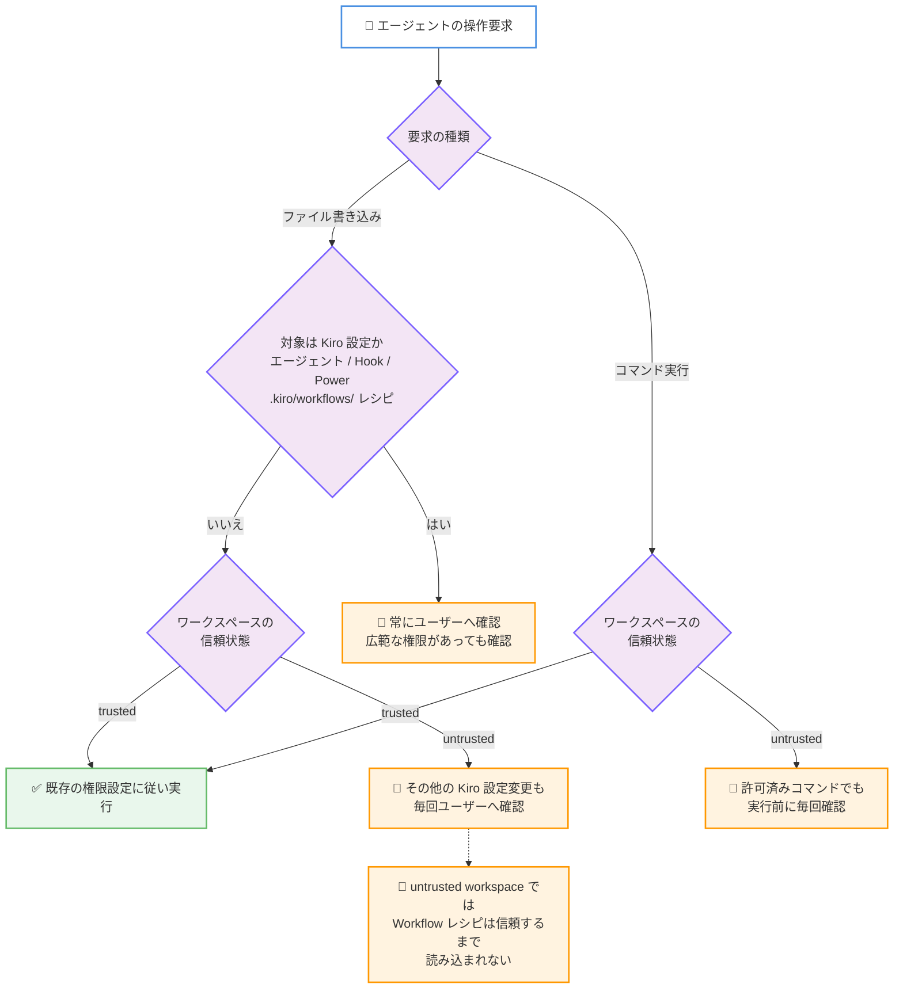

# Kiro - Workflows, Safer Untrusted Workspaces, and Enterprise Sign-In Controls (Kiro IDE 1.2)

**リリース日**: 2026 年 9 月 30 日
**サービス**: Kiro
**機能**: Kiro IDE 1.2 リリース (Workflows、untrusted workspace の安全強化、エンタープライズサインイン制御)

📊 [このアップデートのインフォグラフィックを見る](https://takech9203.github.io/aws-news-summary/20260930-kiro-changelog-2026-09-30-ide-1-2.html)

## 概要

AWS が提供する AI 搭載 IDE である Kiro の IDE 1.2 がリリースされました。本リリースでは、再利用可能なマルチエージェント Workflows のバックグラウンド実行、Kiro 設定ファイルおよび Workflow レシピに対する保護の強化、エンタープライズ向けのサインイン方法の管理機能が導入されました。あわせて、Agent Focus Mode のセッション詳細画面の刷新、エンタープライズプロファイルで選択した AWS リージョン内でのテレメトリ / アクティビティデータの処理、認証・デバッグ・信頼性に関する複数の修正も含まれています。

特に注目すべきは、信頼されていない (untrusted) ワークスペースにおける安全性の強化です。エージェント、Hook、Power の各ファイルや、Workflow を定義する `.kiro/workflows/` 内のレシピをエージェントが変更しようとすると、より広範なファイル書き込み権限が許可されている場合でも、Kiro は必ずユーザーに確認を求めるようになりました。untrusted workspace では、その他の Kiro 設定の変更や各コマンドの実行前にも、過去に許可済みであっても毎回確認が行われます。

なお、本リリースの中核機能である Workflows 自体の詳細は、別レポート「[Kiro - Workflows の導入](./2026-09-30-kiro-introducing-workflows.md)」でカバーしています。本レポートでは IDE 1.2 リリース全体の変更点を中心に記載します。

**アップデート前の課題**

- 広範なファイル書き込み権限を許可している場合、エージェントがエージェント定義、Hook、Power などの Kiro 設定ファイルを確認なしで変更できてしまい、エージェントの動作そのものが意図せず書き換えられるリスクがあった
- untrusted workspace でも、一度許可したコマンドは再確認なしで実行され、信頼できないリポジトリを開いた際の防御が十分ではなかった
- エンタープライズ管理者が組織で許可するサインイン方法を制限したり、サインイン情報を事前設定したりする手段がなかった
- エンタープライズ利用時のテレメトリ / アクティビティデータの送信先リージョンをプロファイルに合わせて制御できなかった

**アップデート後の改善**

- エージェント、Hook、Power ファイルおよび `.kiro/workflows/` のレシピ変更時に、ファイル権限の設定にかかわらず必ず確認を求めるようになり、設定の改ざんリスクが低減された
- untrusted workspace では、すべての Kiro 設定変更と各コマンド実行の前に毎回確認が行われ、Workflow レシピはワークスペースを信頼するまで読み込まれないようになった
- 管理者が許可するサインイン方法の制限、組織のサインイン情報の事前入力、サインイン画面へのヘルプリンク追加を行えるようになった
- テレメトリとアクティビティデータが、選択したエンタープライズプロファイルの AWS リージョンに送信されるようになった

## アーキテクチャ図



IDE 1.2 で強化された権限確認フローです。Kiro 設定ファイルと Workflow レシピへの変更は常に確認が求められ、untrusted workspace ではさらに広い範囲で毎回確認が行われます。

## サービスアップデートの詳細

### 主要機能

1. **マルチエージェント Workflows のバックグラウンド実行**
   - 再利用可能なマルチステップのプランを Kiro に依頼し、親チャットでの作業を継続しながらバックグラウンドで実行できる
   - 各ステップは独立したエージェントセッションで実行される
   - チャット上部の Workflows エリアから、進捗の確認、ステップの表示、実行の一時停止 / 再開 / 停止が可能
   - デフォルトでは無効。Agent Focus の Workspace Configuration で Workflows を有効化するか、Settings で `kiroAgent.workflows.enabled` を設定し、新しいチャットセッションを開始する
   - 詳細は別レポート「[Kiro - Workflows の導入](./2026-09-30-kiro-introducing-workflows.md)」を参照

2. **Kiro 設定と Workflow レシピの保護**
   - エージェントがエージェント定義、Hook、Power の各ファイル、または Workflow を定義する `.kiro/workflows/` 内のレシピを変更する前に、Kiro が必ず確認を求める
   - より広範なファイル書き込み権限が許可されている場合でも確認が行われる
   - untrusted workspace では、その他の Kiro 設定の変更前、および各コマンドの実行前にも毎回確認が行われる (過去に許可済みでも再確認)
   - untrusted workspace の Workflow レシピは、ワークスペースを信頼するまで読み込まれない

3. **エンタープライズサインイン制御**
   - 管理者が、許可するサインイン方法を制限できる
   - 組織のサインイン情報をサインイン画面に事前入力できる
   - サインイン画面にヘルプリンクを追加できる
   - 許可されていない方法を選択した場合、Kiro は許可されている選択肢を表示する

4. **Agent Focus Mode のセッション詳細の刷新**
   - Workflows と Artifacts に専用ビューが追加された
   - ステップごとのアクティビティ表示、アーティファクトのプレビューが可能
   - すべてのアーティファクトに「Open in IDE」が用意された

5. **リージョン内データ処理**
   - テレメトリとアクティビティデータが、選択したエンタープライズプロファイルの AWS リージョンに送信されるようになった

## 技術仕様

### 修正事項 (Fixes)

| 分類 | 修正内容 |
|------|----------|
| セキュリティ | Electron を 44.4.3 (Chromium 152.0.7977.130 を含む) に更新し、CVE-2026-87491 に対処 |
| 認証 / エンタープライズ | `us-east-1` 以外のエンタープライズプロファイルで、アカウントまたはプロファイル切り替え後にウィンドウを再読み込みするまでリクエストが失敗する問題を修正 |
| MCP OAuth | `oauth.redirectUri` にドキュメント記載の完全な URL 形式またはポートのみの形式を使用するとサインインに失敗する問題を修正。設定値がそのまま使用され、使用できない値はランダムポートへのフォールバックではなく設定エラーとして表示される |
| 信頼性 | プロファイルファイルが変更なしで書き換えられた際に、アカウントの再読み込みが繰り返されて IDE が応答しなくなる問題を修正。使用量データ取得時のエラー通知は最大 1 回に抑制 |
| デバッグ | JavaScript デバッガーが Node.js 24.20 以降にアタッチできない問題を修正 |
| スキル | GitHub リポジトリのルートからのスキルのインポートに関する問題を修正 |
| スペック | 大文字小文字が異なる Acceptance Criteria 見出しをスペックが認識しない問題を修正 |
| セッション | ツールが返した画像がセッションの再読み込み後に消える問題を修正 |

### 関連設定

| 項目 | 詳細 |
|------|------|
| Workflows の有効化 | Agent Focus の Workspace Configuration、または Settings の `kiroAgent.workflows.enabled` |
| Workflow レシピの保存場所 | `.kiro/workflows/` |
| 保護対象の設定ファイル | エージェント定義、Hook、Power、Workflow レシピ |
| エンタープライズデータの送信先 | 選択したエンタープライズプロファイルの AWS リージョン |

## 設定方法

### 前提条件

1. Kiro IDE 1.2 以降にアップデートしていること
2. エンタープライズサインイン制御を使用する場合は、組織の管理者権限があること
3. Workflows を使用する場合は、機能を明示的に有効化すること (デフォルトで無効)

### 手順

#### ステップ 1: Kiro IDE のアップデート

Kiro IDE を最新バージョンにアップデートします。アップデート後、untrusted workspace の安全強化と設定ファイル保護は自動的に適用されます。追加の設定は不要です。

#### ステップ 2: Workflows の有効化 (任意)

Agent Focus の Workspace Configuration で Workflows をオンにするか、Settings で以下を設定します。

```json
{
  "kiroAgent.workflows.enabled": true
}
```

設定後、新しいチャットセッションを開始すると Workflows が利用可能になります。

#### ステップ 3: ワークスペースの信頼設定の確認

信頼できないリポジトリを開いた場合、Kiro はワークスペースを untrusted として扱い、設定変更やコマンド実行のたびに確認を求めます。内容を確認して問題なければワークスペースを信頼することで、Workflow レシピの読み込みを含む通常の動作に戻ります。

#### ステップ 4: エンタープライズサインイン制御の設定 (管理者)

組織の管理者は、許可するサインイン方法の制限、サインイン情報の事前入力、ヘルプリンクの追加を設定できます。詳細は [エンタープライズサインインガバナンスのドキュメント](https://kiro.dev/docs/enterprise/governance/sign-in/) を参照してください。

## メリット

### ビジネス面

- **ガバナンスの強化**: 管理者がサインイン方法を制御できるため、組織のアイデンティティポリシーに沿った利用を強制でき、個人アカウントでの意図しない利用を防止できる
- **データレジデンシーへの対応**: テレメトリとアクティビティデータがプロファイルのリージョン内で処理されるため、データ所在地に関するコンプライアンス要件を満たしやすくなる
- **サプライチェーンリスクの低減**: 信頼できないリポジトリを開いた際の多層的な確認により、悪意ある設定やコマンドが自動実行されるリスクが低減される

### 技術面

- **設定改ざんへの防御**: エージェント、Hook、Power、Workflow レシピの変更は常に確認が必要となり、エージェント自身の動作が無断で書き換えられることを防げる
- **バックグラウンドでの並行作業**: Workflows により、委任した複数ステップの作業が進む間もメインの会話で作業を継続できる
- **可視性の向上**: Agent Focus Mode の専用ビューにより、Workflow のステップアクティビティやアーティファクトを確認しやすくなった

## デメリット・制約事項

### 制限事項

- Workflows はデフォルトで無効であり、有効化後に新しいチャットセッションを開始する必要がある
- untrusted workspace では Workflow レシピが読み込まれないため、ワークスペースを信頼するまで Workflows を利用できない
- untrusted workspace では過去に許可したコマンドでも毎回確認が必要となり、確認操作の頻度が増える

### 考慮すべき点

- 設定ファイルや Workflow レシピの変更をエージェントに依頼するユースケースでは、確認プロンプトが増える点を考慮する
- エンタープライズサインイン制御を導入する際は、既存ユーザーが利用中のサインイン方法が制限対象に含まれないか事前に確認する
- Electron / Chromium のセキュリティ修正 (CVE-2026-87491) が含まれるため、セキュリティ観点からも早期のアップデートが推奨される

## ユースケース

### ユースケース 1: 外部リポジトリの安全な調査

**シナリオ**: オープンソースプロジェクトや外部から受領したリポジトリを Kiro で開き、コードを調査する。リポジトリに悪意ある Hook や Workflow レシピが含まれている可能性がある。

**実装例**:
```text
1. リポジトリを Kiro で開く (untrusted のまま調査を開始)
2. Workflow レシピは読み込まれず、コマンド実行は毎回確認される
3. 内容を確認して問題がなければワークスペースを信頼する
```

**効果**: 悪意ある設定やコマンドの自動実行を防ぎながら、未知のコードベースを安全に調査できる。

### ユースケース 2: 組織全体でのサインイン方法の統制

**シナリオ**: 企業の IT 管理者として、開発者が必ず組織の ID プロバイダー経由で Kiro にサインインするよう統制したい。

**実装例**:
```text
1. 管理者が許可するサインイン方法を組織の SSO のみに制限
2. 組織のサインイン詳細を事前入力として設定
3. 社内ヘルプデスクへのリンクをサインイン画面に追加
```

**効果**: 開発者が許可されていない方法を選択しても許可された選択肢が提示され、組織のアイデンティティポリシーに沿った利用を徹底できる。

### ユースケース 3: 設定ファイルを含むリファクタリングの安全な委任

**シナリオ**: エージェントにプロジェクト全体の広範なリファクタリングを委任しており、広いファイル書き込み権限を許可している。ただし Kiro の動作を定義する設定ファイルは勝手に変更されたくない。

**実装例**:
```text
1. 通常のソースコードは既存の権限設定に従い自動で編集される
2. エージェント / Hook / Power ファイルや .kiro/workflows/ のレシピへの
   変更要求が発生すると、Kiro が確認プロンプトを表示
3. 変更内容を確認して承認または拒否する
```

**効果**: 広い権限で作業効率を保ちながら、エージェントの動作定義に関わる重要ファイルだけは人間の確認を必須にできる。

## 利用可能リージョン

グローバル (Kiro はグローバルに利用可能なサービスです)

なお、エンタープライズプロファイル利用時のテレメトリとアクティビティデータは、選択したプロファイルの AWS リージョンに送信されます。

## 関連サービス・機能

- **Kiro Workflows**: 本リリースで導入されたマルチエージェントワークフロー機能。詳細は別レポート「[Kiro - Workflows の導入](./2026-09-30-kiro-introducing-workflows.md)」を参照
- **Kiro CLI / Kiro Web**: Workflows は IDE 1.2 のほか Kiro CLI 2.26.0 と Kiro Web でも利用可能で、単一のランタイムによりレシピはどこから起動しても同じように動作する
- **Kiro Hooks / Powers**: 本リリースの保護強化の対象となる Kiro の拡張機構
- **MCP (Model Context Protocol)**: 本リリースで OAuth サインインの `oauth.redirectUri` に関する修正が含まれる

## 参考リンク

- 📊 [インフォグラフィック](https://takech9203.github.io/aws-news-summary/20260930-kiro-changelog-2026-09-30-ide-1-2.html)
- [Kiro Changelog - IDE 1.2](https://kiro.dev/changelog/ide/1-2)
- [Kiro Changelog](https://kiro.dev/changelog/)
- [Workflows ドキュメント](https://kiro.dev/docs/workflows/)
- [Permissions ドキュメント](https://kiro.dev/docs/permissions/)
- [エンタープライズサインインガバナンス](https://kiro.dev/docs/enterprise/governance/sign-in/)

## まとめ

Kiro IDE 1.2 は、Workflows の導入に加えて、untrusted workspace と Kiro 設定ファイルに対する多層的な保護、エンタープライズ向けのサインイン制御とリージョン内データ処理を提供する、セキュリティとガバナンスを重視したリリースです。CVE-2026-87491 に対処する Electron の更新も含まれるため、Kiro ユーザーは早期のアップデートを推奨します。エンタープライズ管理者は、新しいサインイン制御を活用して組織のアイデンティティポリシーの徹底を検討してください。
