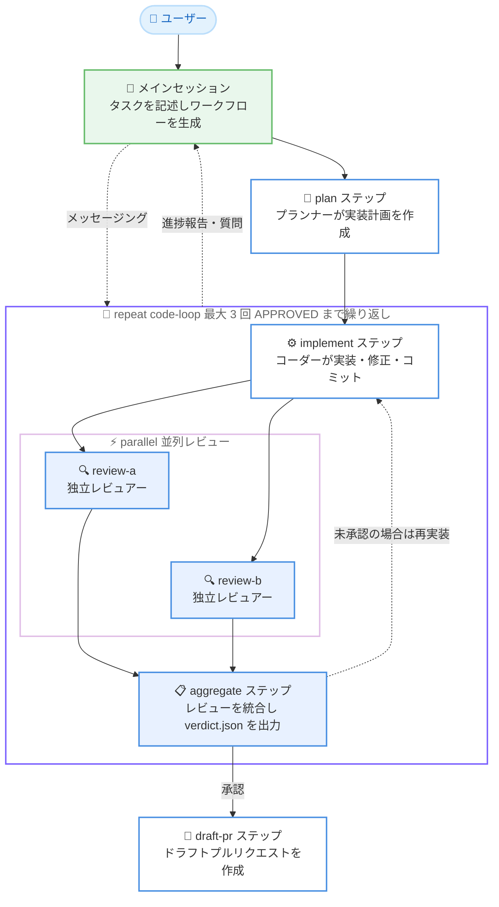

# Kiro - Workflows の導入

**リリース日**: 2026 年 9 月 30 日
**サービス**: Kiro
**機能**: Kiro Workflows (マルチエージェントワークフロー)

📊 [このアップデートのインフォグラフィックを見る](https://takech9203.github.io/aws-news-summary/20260930-kiro-introducing-workflows.html)

## 概要

Kiro は、複数のエージェントを組み合わせて複雑なタスクを最初から最後まで、少ない監督で実行できる新機能「Workflows」を発表しました。Workflows では、モデルがどのエージェントがどの順序で作業するかを定義し、Kiro ランタイムがそのプランを実行します。各ステップはリマインドなしで時間どおりに実行され、ワークフローはエージェントステップ、シーケンス、ループ、並列ブランチで構成されるグラフとして、人間とエージェントの両方が読み書きできる形式 (JSON、YAML もサポート) で表現されます。

各ステップは独立したセッションでフレッシュなコンテキストを持って実行されるため、たとえばレビュアーはコーダーの推論を引き継がずに成果物を評価できます。Kiro はタスクに応じてワークフローを自動生成し、それを「レシピ」として保存して再利用したり、自分でレシピを作成したりできます。ワークフローはバックグラウンドで実行されるため、委任した作業が進行する間もメインの会話で Kiro との作業を継続できます。

Workflows は Kiro IDE 1.2、Kiro CLI 2.26.0、Kiro Web で同時に利用可能になり、3 つのプラットフォームすべてで単一のランタイムが使用されるため、レシピはどこから起動しても同じように動作します。本機能はオプトインであり、設定で有効化する必要があります。Kiro チーム自身も、ワークフローランタイムの大部分と Kiro Web 統合をこの Workflows を使って構築したと述べています。

**アップデート前の課題**

- エージェントに変更の実装を依頼した後、「コードレビューをして」「レビュー指摘に対応して」と手動で指示を繰り返す必要があり、セッションの大半を監督に費やしていた
- セッション内ではモデルがシーケンスを制御するが、モデルのアテンションには限界があり、合意した内容がツール出力やファイル内容で埋まるコンテキストウィンドウ内に置かれるため、残タスクを忘れた際に人間が介入する必要があった
- 複数セッションに作業を分割しプランをファイルに永続化する回避策はあったが、各セッションの状況を把握し、結果を受け渡す作業は手動であり、有効なプロセスができても「もう一度あれをやって」と再利用する手段がなかった

**アップデート後の改善**

- モデルが作業するエージェントと順序を定義し、Kiro ランタイムがプランを実行するため、各ステップがリマインドなしで時間どおりに実行されるようになった
- 各ステップが独立したセッションとフレッシュなコンテキストで実行され、レビュアーがコーダーの推論を引き継がずに評価できるようになった
- 生成されたワークフローをレシピとして保存して再利用でき、ワークフローはバックグラウンドで実行されるため、メインの会話での作業を継続しながら委任した作業を進められるようになった

## アーキテクチャ図



ブログで紹介されている例のワークフローです。計画の後、実装と 2 つの独立した並列レビューを承認が得られるまで繰り返し、最後にドラフトプルリクエストを作成します。各ステップは独立したエージェントセッションで実行され、ステップ間の依存関係は `{{...}}` 変数による出力参照で定義されます。

## サービスアップデートの詳細

### 主要機能

1. **モデル駆動のワークフロー生成**
   - セッションで記述したタスクを Kiro が分解するため、レシピを自分で作成する必要がない
   - カスタムエージェント、使用モデル、思考努力レベル (Thinking effort) を含め、作業の構成方法を指定できる
   - 実行中のエージェントの発見に基づいてワークフローを動的に適応可能。たとえばプランナーが実装を独立したタスクに分割し、並列で動作するコーディングエージェントに委任できる。変更はステップ間で反映され、完了済みの作業と実行中のステップには影響しない

2. **グラフ構造のレシピ**
   - ワークフローはエージェントステップ、シーケンス、ループ (repeat)、並列ブランチ (parallel) で構成されるグラフ
   - レシピは JSON で生成され、YAML もサポート
   - 依存関係は、必要な作業の後にステップを配置し、`{{...}}` 変数で出力を参照することで定義。グラフのエッジを個別に管理する必要がない
   - repeat はレビュー承認などの停止条件付きでステップをループし、parallel は独立したステップを同時実行する

3. **バックグラウンド実行とコンテキスト保全**
   - ワークフローはバックグラウンドで実行され、メインの会話での作業を継続できる
   - 実行中のステップセッションは一時停止、再開、誘導が可能で、実行後にフォローアップの質問もできる
   - 小さな調査でも委任することで、ツール出力や詳細な推論をメインの会話から分離し、継続作業のためのコンテキストを保全できる

4. **セッション間メッセージング**
   - ワークフローステップはメインセッションにメッセージを送信し、進捗報告、完了・失敗の通知、自力で判断できない事項の質問を行う
   - メッセージは進行中の会話に届くため、各ステップセッションを開かずに 1 か所で作業を追跡できる
   - 逆方向のメッセージングも可能で、ステップの質問への回答が会話内に既にある場合、メインセッションがユーザーに代わって応答する。ユーザーは本当に判断が必要な質問のみを受け取る

5. **ビルトインレシピ**
   - `investigate`: 単一エージェントによる読み取り専用の調査をバックグラウンドで実行して報告。セッションのコンテキスト使用量の削減に有効
   - `publish-pr`: プルリクエストを作成しマージまで追跡。失敗した CI チェックをリトライし、安全に解決できるレビューフィードバックに対応。設計変更、スコープ拡大、ユーザー体験の変更が必要な場合はユーザーに確認する
   - `feature-pipeline`: 要件収集、設計とレビュー、実装計画、コーディング、並列コードレビューまでをエージェントが連携して実行する、より高度なサンプル

6. **3 プラットフォーム対応**
   - Kiro IDE 1.2、Kiro CLI 2.26.0、Kiro Web で利用可能
   - 3 つすべてが単一のランタイムを共有するため、レシピはどこから起動しても同じように動作する
   - Kiro Web のクラウド設定にレシピを保存し、プロジェクトとデバイスをまたいで再利用可能。Kiro CLI および IDE からのクラウドセッションでもワークフローを実行できる

## 技術仕様

### Workflows の構成要素

| 項目 | 詳細 |
|------|------|
| レシピ形式 | JSON (デフォルト)、YAML もサポート |
| ノードタイプ | エージェントステップ、シーケンス、repeat (ループ)、parallel (並列) |
| 依存関係の定義 | ステップの配置順と `{{...}}` 変数による出力参照 |
| ステップの実行単位 | 独立したエージェントセッション (フレッシュなコンテキスト) |
| ステップごとの指定 | カスタムエージェント、モデル、思考努力レベル |
| 典型的な規模 | 1 ワークフローあたり 5〜10 ステップ (Kiro チームの実績) |
| 有効化設定 | `kiroAgent.workflows.enabled` (オプトイン) |
| 対応プラットフォーム | Kiro IDE 1.2、Kiro CLI 2.26.0、Kiro Web |

### 同日リリースの関連アップデート

2026 年 9 月 30 日の Changelog には、Workflows に関連する 3 つのエントリが公開されています。

| エントリ | プラットフォーム | 内容 |
|----------|------------------|------|
| Introducing Workflows in Kiro Web | Kiro Web | クラウドセッションでのオプトインの Workflows。バックグラウンドで実行し、各ステップを検査・誘導しながら親の会話で作業を継続可能 |
| Workflows, Safer Untrusted Workspaces, and Enterprise Sign-In Controls | Kiro IDE 1.2 | Workflows の導入に加え、信頼されていないワークスペースの保護強化、エンタープライズのサインイン方法の管理、セッション詳細の刷新など |
| Workflows, Classic Migration Guidance, and V3 Approval Safeguards | Kiro CLI 2.26.0 | V3 でのオプトインの Workflows に加え、Classic からの移行ガイダンス、Hook や LSP のファイル書き込み・MCP ツール・シェルコマンドへの承認チェック強化 |

## 設定方法

### 前提条件

1. Kiro IDE 1.2 以降、Kiro CLI 2.26.0 以降、または Kiro Web を利用していること
2. Workflows はオプトイン機能のため、設定で有効化すること
3. 設定に Workflows が表示されない場合、そのアカウントではまだ利用できない

### 手順

#### ステップ 1: Workflows を有効化する (IDE の場合)

1. プロジェクトの Workspace Configuration を開く
2. Workflows を選択する
3. Workflows を有効にする
4. 新しいチャットセッションを開始する。既に開いているセッションに変更を適用する場合は Kiro を再起動する

バックエンドの設定項目は `kiroAgent.workflows.enabled` です。

#### ステップ 2: ワークフローを実行する

ワークフローを作成する最も簡単な方法は、Kiro に依頼することです。セッションでタスクを記述すると、Kiro がタスクを分解してワークフローを生成します。ビルトインレシピ (`investigate`、`publish-pr`、`feature-pipeline` など) をそのまま実行することも、タスクを記述して Kiro に構成を任せることも、独自のレシピを作成することもできます。

#### ステップ 3: クラウドセッションでの利用 (必要な場合)

Kiro Web のクラウド設定 (cloud configuration) にレシピを保存すると、プロジェクトとデバイスをまたいで再利用できます。クラウドセッションでワークフローを有効化し、保存済みワークフローを管理するには、workflows 設定ページを使用します。

## メリット

### ビジネス面

- **開発スループットの向上**: 各セッション内でより多くの作業が並列実行され、エージェントがバックグラウンドで調査し、複数のプルリクエストにまたがる機能を構築できる。Kiro チームではワークフローがほぼ 24 時間 365 日稼働している
- **人間の時間を高付加価値な作業へ**: 10 分ごとにエージェントを促す必要がなくなり、判断が必要なリクエストのみが届くため、設計上の意思決定や次に何を作るかに時間を使える
- **プロセスの再利用**: 有効だったプロセスをレシピとして保存し、「もう一度あれをやって」を手作業の再構築なしに実現できる

### 技術面

- **コンテキスト品質の向上**: 各ステップが独立したセッションとフレッシュなコンテキストで実行されるため、レビュアーがコーダーの推論にバイアスされず、メインセッションのコンテキストもツール出力で汚染されない
- **確実なステップ実行**: モデルのアテンション任せではなく、Kiro ランタイムがグラフを実行するため、ステップのスキップや実行忘れが起きない
- **プラットフォーム間の一貫性**: IDE、CLI、Web が単一のランタイムを共有し、レシピがどこでも同じように動作する

## デメリット・制約事項

### 制限事項

- オプトイン機能であり、設定で明示的に有効化する必要がある
- 設定に Workflows が表示されないアカウントでは、まだ利用できない
- ワークフローの動的な変更はステップ間でのみ反映され、実行中のステップには適用されない

### 考慮すべき点

- Workflows は他のエージェント作業と同じ Kiro クレジットモデルを使用する。クレジット使用量は実行するエージェント作業に依存するため、複雑なワークフローほど多くのクレジットを消費する可能性がある
- 具体的な指示がない場合、Kiro はタスクに必要と判断した構成でワークフローを作成する。作業の分割方法やレビューの量は、プロンプトやステアリングファイルで誘導する必要がある
- repeat ループには最大反復回数の設定があり、承認条件を満たさない場合は実行が中断されるため、停止条件の設計が重要になる

## ユースケース

### ユースケース 1: 実装・マルチモデルレビュー・修正の自動ループ

**シナリオ**: 実装したコードに対して複数の独立したレビューを行い、指摘事項を修正するサイクルを承認まで自動で繰り返したい。

**実装例**:
```text
plan (プランナーが実装計画を作成)
→ repeat code-loop (最大 3 回、verdict.json が APPROVED になるまで)
   - implement (コーダーが実装・修正・コミット)
   - parallel: review-a / review-b (独立レビュアーが並列レビュー)
   - aggregate (レビューを統合し verdict.json を出力)
→ draft-pr (ドラフトプルリクエストを作成)
```

**効果**: 「レビューして」「指摘に対応して」という手動プロンプトが不要になり、フレッシュなコンテキストを持つレビュアーによる客観的な評価と修正のループが自動実行される。異なるモデル (Claude と GPT など) を組み合わせたマルチモデルレビューも構成できる。

### ユースケース 2: バックグラウンド調査によるコンテキスト保全

**シナリオ**: メインセッションで機能開発を進めながら、関連する問題の調査も行いたいが、調査のツール出力でメインセッションのコンテキストを消費したくない。

**実装例**:
```text
ビルトインの investigate レシピを実行
→ 単一エージェントが読み取り専用の調査をバックグラウンドで実行
→ 結果のみをメインセッションに報告
```

**効果**: 調査のツール出力や詳細な推論がメインの会話から分離され、継続作業のためのコンテキストが保全される。調査が進行する間もメインセッションでの作業を継続できる。

### ユースケース 3: プルリクエストのマージまでの自動追跡

**シナリオ**: プルリクエストの作成後、CI の失敗やレビューフィードバックへの対応を人間が逐一追跡するのは負担が大きい。

**実装例**:
```text
ビルトインの publish-pr レシピを実行
→ プルリクエストを作成しマージまで追跡
→ 失敗した CI チェックをリトライ
→ 安全に解決できるレビューフィードバックに自動対応
→ 設計変更・スコープ拡大・UX 変更が必要な場合のみユーザーに確認
```

**効果**: PR のライフサイクル管理が自動化され、人間は設計やスコープに関わる判断のみに集中できる。Kiro チーム自身が毎日使用しているレシピである。

## 料金

Workflows は他のエージェント作業と同じ Kiro クレジットモデルを使用します。追加料金は発生しませんが、クレジット使用量は実行するエージェント作業に依存するため、ステップ数が多い複雑なワークフローほど多くのクレジットを消費する可能性があります。

## 利用可能リージョン

グローバル (Kiro IDE 1.2、Kiro CLI 2.26.0、Kiro Web で利用可能)

## 関連サービス・機能

- **Kiro Web / クラウドセッション**: レシピをクラウド設定に保存してプロジェクトとデバイス間で再利用でき、CLI や IDE からのクラウドセッションでもワークフローを実行できる
- **カスタムエージェント**: ワークフローの各ステップに割り当てるエージェントとして使用され、モデルや思考努力レベルをステップごとに指定できる
- **ステアリングファイル**: Kiro がワークフローで作業をどう分割し、どの程度レビューを行うかを誘導する手段として機能する

## 参考リンク

- 📊 [インフォグラフィック](https://takech9203.github.io/aws-news-summary/20260930-kiro-introducing-workflows.html)
- [Kiro Blog: Introducing Kiro workflows](https://kiro.dev/blog/introducing-workflows/)
- [Kiro Changelog](https://kiro.dev/changelog/)
- [Kiro Workflows ドキュメント](https://kiro.dev/docs/workflows/)
- [Kiro 料金ページ](https://kiro.dev/pricing/)

## まとめ

Kiro Workflows は、複数エージェントによる複雑なタスクの実行を、モデルによるプラン定義と Kiro ランタイムによる確実な実行に分離することで、エージェント作業の監督負担を大幅に削減するアップデートです。IDE 1.2、CLI 2.26.0、Web の 3 プラットフォームで単一ランタイムとして提供され、レシピの保存と再利用により有効なプロセスをチームの資産にできます。オプトイン機能のため、まずは設定で Workflows を有効化し、ビルトインの `investigate` や `publish-pr` レシピから試すことを推奨します。
