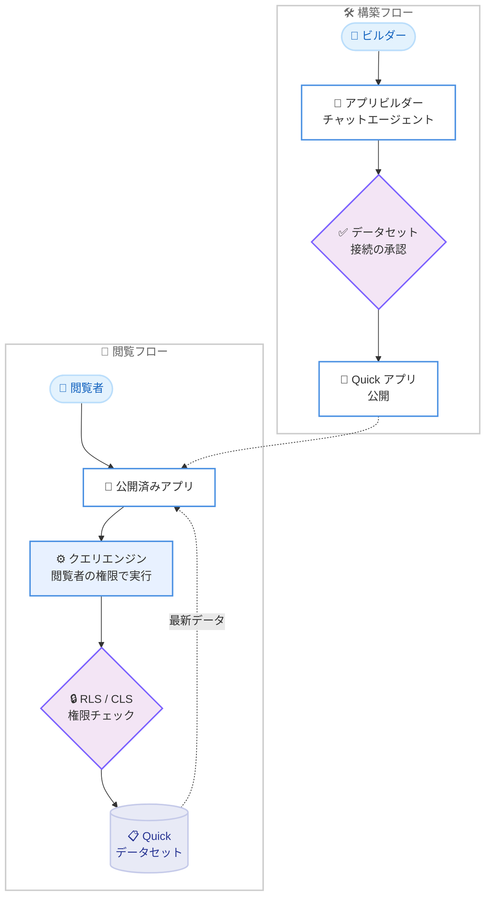

# Amazon Quick - アプリでのデータセットライブデータ対応

**リリース日**: 2026 年 9 月 30 日
**サービス**: Amazon Quick
**機能**: アプリにおけるデータセットのライブデータサポート

📊 [このアップデートのインフォグラフィックを見る](https://takech9203.github.io/aws-news-summary/20260930-live-data-in-apps.html)

## 概要

Amazon Quick のアプリ機能が、Quick のデータセットからライブデータを直接取得できるようになりました。これにより、アプリ内の KPI、チャート、テーブル、インサイトが常に最新のデータを反映するようになります。アプリは受動的なデータ閲覧にとどまらず、承認処理や次のアクションのトリガーなど、ユーザーがデータを見てそのまま行動できるワークフローを実現します。

アプリの構築は会話形式で行います。アプリビルダーのチャットエージェントにデータセット名を伝え、目的を自然言語で説明するだけで、エージェントが関連データセットを検出し、SQL クエリを作成してアプリを構築します。セキュリティは自動的に継承され、各ユーザーは自身の Amazon Quick 権限に基づいたデータのみを閲覧でき、既存の行レベルセキュリティ (RLS) および列レベルセキュリティ (CLS) がそのまま適用されます。

本アップデートは、BI ダッシュボードの閲覧者だけでなく、IT 部門の支援なしに業務アプリを構築したいビジネスユーザーや、ガバナンスを維持しながらデータ活用を推進したい組織に有用です。

**アップデート前の課題**

このアップデート以前に存在していた課題や制限は以下のとおりです。

- 以前はアプリ内のデータセット値がアプリ構築時点のスナップショットとして固定され、公開後にデータが更新されても反映されなかった
- 最新データを表示するにはアプリを再構築するか、別途ダッシュボードを参照する必要があった
- アプリとデータ権限を個別に管理する場合、閲覧者ごとのアクセス制御を独自に実装する必要があった

**アップデート後の改善**

今回のアップデートにより可能になったことは以下のとおりです。

- アプリを開くたびにエージェントが作成した SQL クエリが再実行され、KPI、チャート、テーブルが常に最新データを反映するようになった
- クエリは閲覧者本人の権限で実行されるため、RLS / CLS を含む既存のデータガバナンスが自動的に適用されるようになった
- ライブデータの閲覧と、承認やメール送信などのアクションを 1 つのアプリ内で組み合わせたワークフローを構築できるようになった

## アーキテクチャ図



ビルダーがチャットエージェントと対話してアプリを構築・公開し、閲覧者がアプリを開くたびにクエリが閲覧者自身の権限で実行され、RLS / CLS を通過した最新データのみが表示される流れを示しています。

## サービスアップデートの詳細

### 主要機能

1. **ライブデータの表示**
   - アプリを開くたびに、エージェントが作成した SQL クエリがデータセットに対して再実行される
   - KPI、チャート、テーブル、インサイトが常に最新のデータを反映する
   - Direct Query データセットは常に最新のソースデータを参照し、SPICE データセットは SPICE の更新タイミングに従う

2. **会話形式でのアプリ構築**
   - Amazon Quick の [Apps] を開き、作りたいアプリを自然言語で記述するだけで構築できる
   - エージェントが関連するデータセットを検出し、SQL を作成し、データセットごとにビルダーの承認を求める
   - フォローアップのプロンプトで、フィルターの追加、メールアクション、企業ドキュメントとデータセット値を組み合わせた AI 推論の追加など、反復的に改善できる
   - [Manage integrations] パネルで、接続されているデータ、コンテンツ、コネクタを一覧できる

3. **権限の自動継承によるガバナンス**
   - クエリは閲覧者本人として実行され、既存の RLS / CLS ルールが自動的に適用される (新しい権限モデルは不要)
   - 閲覧者は初回利用時にデータセットごとに 1 回だけ同意を行い、同意はすべてのクエリでサーバーサイドで強制される
   - 認可の判断はクエリエンジン側で行われ、アプリのフロントエンドやプロキシはアクセス判断に関与しない
   - データセットへのアクセス権がないユーザーにはエラーが表示され、匿名アクセスやパブリックアクセスはサポートされない

4. **アクション可能なワークフロー**
   - データの閲覧にとどまらず、承認処理や次のステップのトリガーなど、見たデータに基づいてその場で行動できる
   - 例として、リクエストと承認を扱うチームポータルにライブのパイプライン数値を表示するといった構成が可能

## 技術仕様

### 機能仕様

| 項目 | 詳細 |
|------|------|
| クエリ実行 | アプリを開くたびに閲覧者の権限でクエリを再実行 |
| セキュリティ | 既存の RLS / CLS を自動適用、サーバーサイドで強制 |
| 同意 | 閲覧者はデータセットごとに初回 1 回の同意が必要 |
| 必要ロール | ビルダー、閲覧者ともに Reader Pro 以上 |
| データセット混在 | 同一ソースの SPICE と Direct Query は共存可、異なるソースの Direct Query 同士は不可 |
| 匿名アクセス | 非対応 |

## 設定方法

### 前提条件

1. Amazon Quick のサブスクリプションがあり、ビルダーと閲覧者が Reader Pro 以上のロールを持っていること
2. 利用するデータセットが Amazon Quick に存在し、ビルダーがアクセス権を持っていること
3. ビルダーの RLS 設定でデータセットから 1 行以上取得できること (0 行の場合、そのデータセットではアプリを構築できない)

### 手順

#### ステップ1: アプリの構築を開始する

Amazon Quick で [Apps] を開き、作りたいアプリを自然言語で記述します。例えば「顧客の更新契約を一覧表示し、売上とマージンをドリルダウンできるアプリ」のように目的を伝えます。利用したいデータセットが特定できている場合は、データセット名または ID を直接指定すると確実です。

#### ステップ2: データセット接続を承認する

エージェントが関連するデータセットを検出し、SQL クエリを作成した上で、データセットごとに接続の承認を求めます。内容を確認して承認すると、アプリにライブデータが組み込まれます。

#### ステップ3: 反復的に改善して公開する

フォローアップのプロンプトでフィルター、メールアクション、AI 推論の追加などを行い、[Manage integrations] パネルで接続状況を確認します。完成したら公開し、Quick のユーザーまたはグループと共有します。閲覧者は初回アクセス時にデータセットごとの同意を行います。

## メリット

### ビジネス面

- **意思決定の迅速化**: アプリ内の数値が常に最新であるため、古いスナップショットに基づく誤った判断を防げる
- **開発期間の短縮**: 従来は 1 か月程度かかっていたような業務アプリを、IT 部門の関与なしに会話形式で構築できる
- **ガバナンスの維持**: 既存のデータ権限がそのまま適用されるため、アプリの普及とデータ統制を両立できる

### 技術面

- **権限管理の一元化**: 認可はクエリエンジン側で判断されるため、アプリごとにアクセス制御を実装する必要がない
- **サーバーサイドでの強制**: 同意と権限チェックがすべてのクエリでサーバーサイドに強制され、フロントエンドの改ざんに影響されない
- **既存資産の活用**: 既存の Quick データセットと RLS / CLS 設定をそのまま利用できる

## デメリット・制約事項

### 制限事項

- 結果セットが大きすぎるクエリはガードレールによりブロックされ、クエリの絞り込み、集計、ページネーションが必要になる
- 異なるソースの Direct Query データセット同士を 1 つのアプリで混在させることはできない
- 匿名アクセスやパブリックアクセスはサポートされない
- ビルダーの RLS で 0 行となるデータセットではアプリを構築できない

### 考慮すべき点

- データセットの列名変更や列削除などのスキーマ変更時は、アプリを編集してクエリを再構築する必要がある
- SPICE データセットは SPICE の更新が実行されるまで新しいデータが反映されない (Direct Query は常に最新)
- 構築時の行数制限があるため、全件表示が必要な場合はエージェントにページネーション付きの呼び出しを使うよう指示する
- エージェントがデータセットや列を見つけられない場合は、プロンプトで名前または ID を直接指定する

## ユースケース

### ユースケース1: 営業の契約更新レビューアプリ

**シナリオ**: SaaS 企業の営業リーダーが、顧客の契約更新状況を一覧し、売上やマージンをドリルダウンしながらレビューするアプリを構築する。

**実装例**:
```
プロンプト例:
「renewals データセットを使って、今四半期に更新を迎える顧客の一覧を表示する
アプリを作成してください。顧客を選択すると売上とマージンの詳細を確認でき、
担当者にフォローアップのメールを送信できるようにしてください。」
```

**効果**: 売上データセット、製品戦略ドキュメント、顧客連絡ワークフローを 1 つのアプリに統合し、従来約 1 か月かかっていた構築作業を IT 部門の関与なしに短時間で実現できる。

### ユースケース2: リクエスト承認ポータル

**シナリオ**: チームの各種リクエストを受け付けて承認するポータルに、ライブのパイプライン数値を表示し、承認者がデータを確認しながらその場で承認できるようにする。

**実装例**:
```
プロンプト例:
「リクエストの一覧と承認ボタンを持つチームポータルを作成してください。
pipeline データセットから最新のパイプライン金額を KPI として表示し、
承認時に依頼者へ通知が送られるようにしてください。」
```

**効果**: データ閲覧と承認アクションが 1 つのアプリに統合され、ダッシュボードと承認ツールを行き来する手間がなくなる。

### ユースケース3: 地域別権限を活用した営業ダッシュボードアプリ

**シナリオ**: 複数地域の営業マネージャーが同じアプリを利用するが、RLS により各マネージャーは自分の担当地域のデータのみを閲覧する。

**実装例**:
```
前提: データセットに地域ベースの RLS を設定済み
- AMER 担当マネージャー: AMER のデータのみ表示
- EMEA と AMER 担当マネージャー: 両地域のデータを表示

アプリ側の追加設定は不要。クエリが閲覧者本人として実行されるため、
同じアプリでもユーザーごとに表示されるデータが自動的に変わる。
```

**効果**: アプリを地域ごとに複製することなく、既存の RLS 設定だけで安全なマルチテナント的な利用を実現できる。

## 料金

今回の発表では、この機能に固有の追加料金は示されていません。アプリの構築および閲覧には、ビルダー、閲覧者ともに Amazon Quick の Reader Pro 以上のロールが必要です。詳細は Amazon Quick の料金ページを参照してください。

## 利用可能リージョン

Amazon Quick のアプリ機能がサポートされているすべてのリージョンで利用可能です。最新のリージョン一覧は [Amazon Quick ユーザーガイドのリージョン可用性](https://docs.aws.amazon.com/quick/latest/userguide/apps-limitations.html#apps-regional-availability) を参照してください。

## 関連サービス・機能

- **Amazon Quick Sight**: アプリが参照するデータセットの作成、SPICE / Direct Query の管理、RLS / CLS の設定を担う BI 機能
- **Amazon Quick Index**: 企業ドキュメントのインデックス化により、データセット値とドキュメントを組み合わせた AI 推論をアプリに追加できる
- **SPICE**: インメモリ計算エンジン。SPICE データセットを利用する場合、データの鮮度は SPICE の更新スケジュールに依存する

## 参考リンク

- 📊 [インフォグラフィック](https://takech9203.github.io/aws-news-summary/20260930-live-data-in-apps.html)
- [公式発表 (What's New)](https://aws.amazon.com/about-aws/whats-new/2026/09/live-data-in-apps)
- [AWS Blog: Serve live governed data in AI-built apps with Amazon Quick](https://aws.amazon.com/blogs/machine-learning/serve-live-governed-data-in-ai-built-apps-with-amazon-quick/)
- [ドキュメント: Connecting to datasets](https://docs.aws.amazon.com/quick/latest/userguide/connecting-datasets-apps.html)
- [ドキュメント: アプリの制限事項とリージョン可用性](https://docs.aws.amazon.com/quick/latest/userguide/apps-limitations.html)

## まとめ

Amazon Quick のアプリがデータセットのライブデータに対応し、常に最新の KPI やチャートを表示しながら、既存の RLS / CLS によるガバナンスを自動的に継承できるようになりました。会話形式でのアプリ構築と組み合わせることで、ビジネスユーザーが IT 部門に依存せず、安全な業務アプリを短期間で構築できます。まずは既存のデータセットと RLS 設定を確認し、小規模なチームポータルなどから試すことを推奨します。
