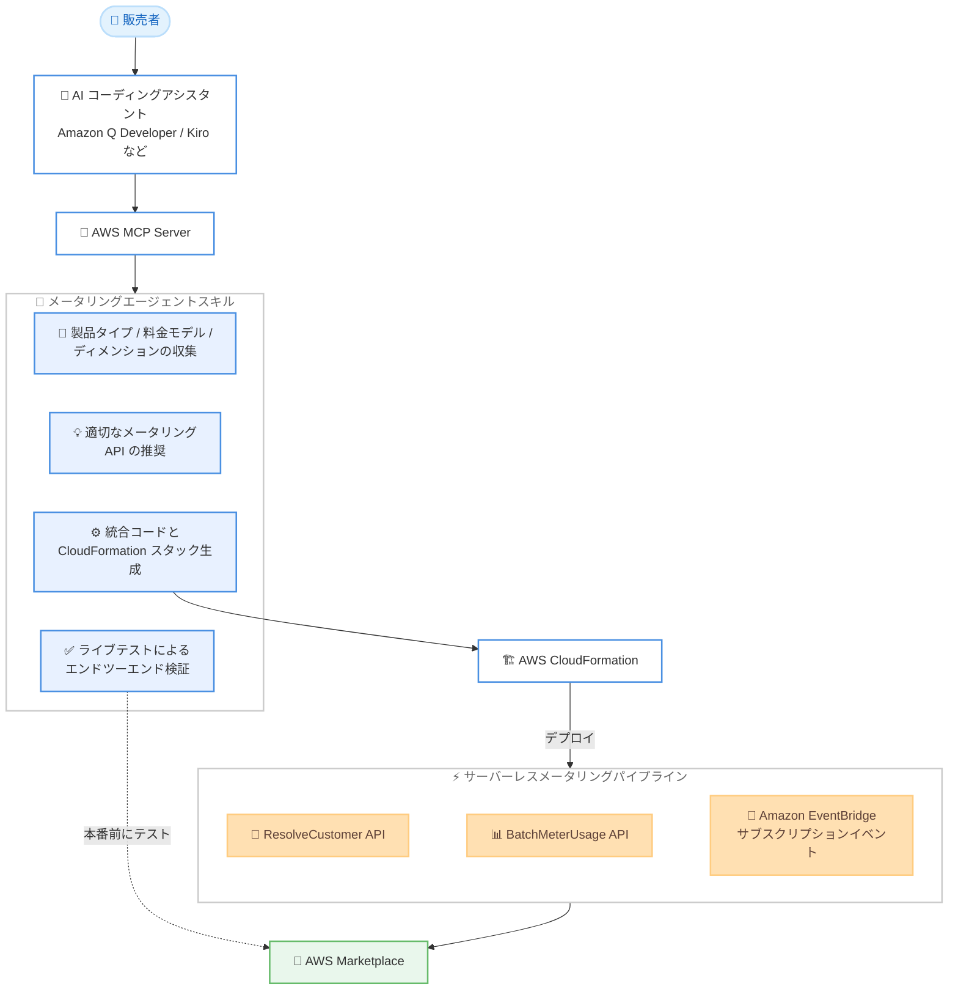

# AWS Marketplace - 従量課金メータリング統合のための AI エージェントスキル

**リリース日**: 2026 年 9 月 30 日
**サービス**: AWS Marketplace
**機能**: メータリングエージェントスキル (従量課金 SaaS メータリング統合の AI ガイド付き構築、デプロイ、検証)

📊 [このアップデートのインフォグラフィックを見る](https://takech9203.github.io/aws-news-summary/20260930-marketplace-ai-agent-metering.html)
<!-- INFOGRAPHIC_BASE_URL は環境変数から取得 -->

## 概要

AWS Marketplace は、従量課金 (pay-as-you-go) 型 SaaS メータリング統合の構築、デプロイ、検証を支援する AI エージェントスキル「メータリングエージェントスキル」の一般提供を開始しました。このスキルは AWS MCP Server を通じて提供され、Amazon Q Developer や Kiro をはじめとする MCP 互換の AI コーディングアシスタントから、プラグインのインストール不要で利用できます。

スキルは、販売者の製品タイプ、料金モデル、使用量ディメンションの収集から、適切なメータリング API の推奨、構成に合わせた統合コードと AWS CloudFormation スタックの生成、そして本番コードの出荷前に AWS Marketplace に対して実行するエンドツーエンドテストまで、統合プロセス全体をガイドします。

対象となるのは、AWS Marketplace で従量課金型の SaaS 製品を提供する、または提供を計画している独立系ソフトウェアベンダー (ISV) や販売者です。既存の販売者にとっても、メータリングレコードの検査、デバッグ、分析を支援する機能が含まれています。

**アップデート前の課題**

このアップデート以前は、メータリング統合の構築に多くの手作業と試行錯誤が必要でした。

- 以前は、販売者はドキュメント、ワークショップ、試行錯誤に頼って統合を構築する必要がありました
- 以前は、ディメンション名の不一致や無効なタイムスタンプといったエラーが、数日後に請求のギャップとして発覚することがありました
- 以前は、本番環境へのデプロイ前に統合を体系的に検証する手段が不足していました

**アップデート後の改善**

今回のアップデートにより、AI コーディングアシスタント上で統合プロセス全体が完結するようになりました。

- 今回のアップデートにより、製品構成に合わせた統合コードと CloudFormation スタックを AI がガイド付きで生成できるようになりました
- 今回のアップデートにより、ディメンションを実際の製品構成と相互検証し、組み込みのガードレールを適用することで、請求エラーを事前に防止できるようになりました
- 今回のアップデートにより、本番コードの出荷前に AWS Marketplace に対するエンドツーエンドのライブテストで統合を検証できるようになりました

## アーキテクチャ図



販売者は AI コーディングアシスタント経由で AWS MCP Server のメータリングエージェントスキルを呼び出し、要件収集からコード生成、サーバーレスメータリングパイプラインのデプロイ、本番前のライブテストまでをガイド付きで実行します。

## サービスアップデートの詳細

### 主要機能

1. **AI ガイド付きの統合構築**
   - 販売者の製品タイプ、料金モデル、使用量ディメンションを対話的に収集します
   - 収集した情報に基づき、適切なメータリング API を推奨します
   - 販売者の構成に合わせてカスタマイズされた統合コードと AWS CloudFormation スタックを生成します

2. **組み込みの検証とガードレール**
   - ディメンションを販売者の実際の製品構成と相互検証し、ディメンション名の不一致などのエラーを事前に検出します
   - 組み込みのガードレールを適用し、無効なタイムスタンプといった請求ギャップの原因となるミスを防ぎます
   - 本番コードの出荷前に、AWS Marketplace に対するエンドツーエンドのライブテストで統合を検証します

3. **サーバーレスメータリングパイプラインのデプロイ**
   - ResolveCustomer API、BatchMeterUsage API、および Amazon EventBridge によるサブスクリプションイベント処理を組み合わせたサーバーレスパイプラインをデプロイします
   - Concurrent Agreements (同一製品に対する複数契約) をサポートします
   - 既存の販売者向けに、メータリングレコードの検査、デバッグ、分析を支援します

4. **MCP 互換アシスタントからの利用**
   - AWS MCP Server を通じて提供され、Amazon Q Developer、Kiro、その他の MCP 互換クライアントで利用できます
   - プラグインのインストールは不要です

## 技術仕様

### スキルがカバーする構成要素

| 項目 | 詳細 |
|------|------|
| 提供形態 | AWS MCP Server 経由のエージェントスキル (プラグインインストール不要) |
| 対応クライアント | Amazon Q Developer、Kiro、その他の MCP 互換 AI コーディングアシスタント |
| 対象製品 | AWS Marketplace の従量課金 (pay-as-you-go) 型 SaaS 製品 |
| 生成物 | 統合コード、カスタマイズされた AWS CloudFormation スタック |
| 利用 API | ResolveCustomer API、BatchMeterUsage API |
| イベント処理 | Amazon EventBridge によるサブスクリプションイベントの処理 |
| 検証 | 本番前の AWS Marketplace に対するエンドツーエンドのライブテスト |
| 契約形態 | Concurrent Agreements をサポート |

### サーバーレスメータリングパイプラインの役割

| コンポーネント | 役割 |
|----------------|------|
| ResolveCustomer API | 購入者の登録トークンを顧客 ID に解決し、サブスクリプションを識別 |
| BatchMeterUsage API | 顧客ごとの使用量レコードを AWS Marketplace にバッチ送信 |
| Amazon EventBridge | サブスクリプションの開始、変更、解約などのイベントを受信して処理 |

## 設定方法

### 前提条件

1. AWS Marketplace の販売者として登録済みであること
2. 従量課金型の SaaS 製品を AWS Marketplace に出品している、または出品を計画していること
3. Amazon Q Developer、Kiro などの MCP 互換 AI コーディングアシスタントで AWS MCP Server をセットアップ済みであること

### 手順

#### ステップ 1: AWS MCP Server をセットアップする

```bash
# 例: AWS CLI の Agent Toolkit コマンドで MCP Server を設定
aws configure agent-toolkit
```

AI コーディングアシスタントから AWS MCP Server に接続できるように設定します。詳細な手順は AWS MCP Server の入門ガイドを参照してください。プラグインの追加インストールは不要です。

#### ステップ 2: AI コーディングアシスタントからスキルを呼び出す

```text
# AI コーディングアシスタントへのプロンプト例
AWS Marketplace の SaaS 製品に従量課金メータリング統合を構築してください。
```

スキルが製品タイプ、料金モデル、使用量ディメンションを対話的に収集し、適切なメータリング API を推奨したうえで、構成に合わせた統合コードと CloudFormation スタックを生成します。

#### ステップ 3: ライブテストで統合を検証する

スキルのガイドに従い、本番コードの出荷前に AWS Marketplace に対するエンドツーエンドのライブテストを実行します。ディメンションの相互検証とガードレールにより、請求ギャップの原因となるエラーを事前に排除できます。

## メリット

### ビジネス面

- **収益化までの時間短縮**: ドキュメントの読み込みやワークショップへの参加、試行錯誤に費やしていた時間を削減し、SaaS 製品の出品と収益化を加速できます
- **請求ギャップの防止**: ディメンション名の不一致や無効なタイムスタンプといったエラーを本番前に検出し、数日後に発覚する請求漏れのリスクを低減します
- **既存販売者の運用改善**: メータリングレコードの検査、デバッグ、分析の支援により、既存統合の運用品質を向上できます

### 技術面

- **ガイド付きのコード生成**: 製品構成に合わせた統合コードと CloudFormation スタックが生成され、実装の属人化を防ぎます
- **ベストプラクティスの自動適用**: ResolveCustomer、BatchMeterUsage、EventBridge を組み合わせたサーバーレスパイプラインとして、推奨アーキテクチャがそのままデプロイされます
- **本番前検証**: エンドツーエンドのライブテストにより、統合の正しさをデプロイ前に確認できます

## デメリット・制約事項

### 制限事項

- 対象は AWS Marketplace の従量課金型 SaaS メータリング統合であり、他の製品タイプの統合は対象外です
- 利用には AWS MCP Server に接続できる MCP 互換 AI コーディングアシスタントが必要です
- 生成されたコードと CloudFormation スタックの最終的なレビューとテストの責任は販売者にあります

### 考慮すべき点

- AI が生成する統合コードは、自社のコーディング規約やセキュリティ要件に照らしてレビューすることを推奨します
- サーバーレスパイプラインを構成する Lambda や EventBridge などの AWS リソースには標準の AWS 利用料金が発生します
- 既存のメータリング統合がある場合は、スキルの検査、デバッグ機能から段階的に活用することを検討してください

## ユースケース

### ユースケース 1: 新規 SaaS 製品の従量課金統合の構築

**シナリオ**: ISV が AWS Marketplace に従量課金型の SaaS 製品を初めて出品し、メータリング統合をゼロから構築したい。

**実装例**:
```text
AI コーディングアシスタントでメータリングエージェントスキルを呼び出し、
製品タイプ、料金モデル、使用量ディメンションを対話的に入力。
生成された CloudFormation スタックをデプロイし、ライブテストで検証。
```

**効果**: ドキュメントと試行錯誤に頼った数日から数週間の統合作業を、ガイド付きのワークフローで大幅に短縮できます。

### ユースケース 2: 本番前の請求エラー検出

**シナリオ**: メータリング統合を実装したが、ディメンション名の不一致による請求漏れを過去に経験しており、本番前に確実に検証したい。

**実装例**:
```text
スキルのディメンション相互検証とガードレールを適用し、
AWS Marketplace に対するエンドツーエンドのライブテストを実行。
```

**効果**: ディメンション名の不一致や無効なタイムスタンプを本番前に検出し、数日後に発覚する請求ギャップを防止できます。

### ユースケース 3: 既存メータリング統合のデバッグと分析

**シナリオ**: すでに従量課金 SaaS 製品を提供している販売者が、メータリングレコードの不整合を調査したい。

**実装例**:
```text
AI コーディングアシスタントからスキルを呼び出し、
メータリングレコードの検査、デバッグ、分析を依頼。
```

**効果**: BatchMeterUsage の送信状況やレコード内容を効率的に調査し、問題の切り分けと修正を迅速化できます。

## 料金

公式発表にスキル自体の追加料金に関する記載はありません。生成された CloudFormation スタックによってデプロイされるサーバーレスメータリングパイプラインの AWS リソース (Lambda、EventBridge など) には、標準の AWS 利用料金が発生します。

## 利用可能リージョン

公式発表に特定のリージョンに関する記載はありません。スキルは AWS MCP Server を通じて、Amazon Q Developer、Kiro、その他の MCP 互換 AI コーディングアシスタントから利用できます。

## 関連サービス・機能

- **AWS MCP Server**: 本スキルの提供基盤であり、MCP 互換の AI コーディングアシスタントから AWS の機能にセキュアにアクセスするためのマネージドサーバーです
- **AWS Marketplace Metering Service**: ResolveCustomer API と BatchMeterUsage API を提供し、従量課金型 SaaS 製品の使用量レポートを実現します
- **Amazon EventBridge**: AWS Marketplace のサブスクリプションイベント (契約の開始、変更、解約など) を受信し、パイプラインでの処理を可能にします
- **AWS CloudFormation**: スキルが生成するカスタマイズされたスタックにより、メータリングパイプラインを Infrastructure as Code としてデプロイします

## 参考リンク

- 📊 [インフォグラフィック](https://takech9203.github.io/aws-news-summary/20260930-marketplace-ai-agent-metering.html)
- [公式発表 (What's New)](https://aws.amazon.com/about-aws/whats-new/2026/09/marketplace-ai-agent-metering/)
- [AWS Blog: Complete guide to upgrading your SaaS product to AWS Marketplace Concurrent Agreements](https://aws.amazon.com/blogs/awsmarketplace/complete-guide-to-upgrading-your-saas-product-to-aws-marketplace-concurrent-agreements/)
- [ドキュメント: Configuring metering for usage with SaaS subscriptions](https://docs.aws.amazon.com/marketplace/latest/userguide/metering-for-usage.html#configure-application-for-meter-usage)
- [ドキュメント: AWS MCP Server の入門ガイド](https://docs.aws.amazon.com/agent-toolkit/latest/userguide/getting-started-aws-mcp-server.html)

## まとめ

AWS Marketplace のメータリングエージェントスキルにより、従量課金型 SaaS メータリング統合の構築が、ドキュメントと試行錯誤に頼るプロセスから、AI ガイド付きで検証まで完結するワークフローへと進化しました。AWS Marketplace で SaaS 製品を提供する販売者は、AWS MCP Server を Amazon Q Developer や Kiro などのアシスタントに接続し、新規統合の構築や既存統合のデバッグに本スキルを活用することを推奨します。
