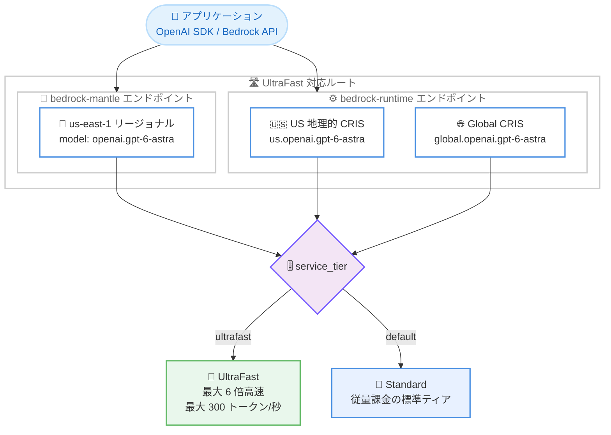

# Amazon Bedrock - OpenAI GPT-6 Astra UltraFast モード

**リリース日**: 2026 年 9 月 30 日
**サービス**: Amazon Bedrock
**機能**: OpenAI GPT-6 Astra UltraFast モード (プレミアムスピードティア)

📊 [このアップデートのインフォグラフィックを見る](https://takech9203.github.io/aws-news-summary/20260930-openai-gpt-6-astra-ultrafast-on-amazon-bedrock.html)

## 概要

Amazon Bedrock で、OpenAI の GPT-6 Astra 向けに UltraFast モードが利用可能になりました。UltraFast は、速度が最も重要なワークロードのために構築された GPT-6 Astra のプレミアムスピードティアです。OpenAI によると、UltraFast は API で最大 6 倍高速な推論を実現し、最大 300 トークン/秒の出力速度を提供します。

GPT-6 Astra は OpenAI の最上位モデルであり、複雑な推論、コーディング、コンピュータ操作、リサーチ、ドキュメント作成などの高度なエンドツーエンドの作業に適しています。今回のアップデートにより、このモデルの高い出力品質を維持したまま、リアルタイムコーディングアシスタント、インタラクティブなエージェント、顧客向けアプリケーションなど、レイテンシーに敏感なユースケースで活用できるようになりました。

Amazon Bedrock の推論エンジンは、本番ワークロードに必要なパフォーマンス、セキュリティ、信頼性を提供します。既存の AWS のコントロールを使用して、ワークロードの保護、アクセス管理、モデル呼び出しアクティビティの監査を行えます。Amazon Bedrock コンソールまたはサポートされている Amazon Bedrock API からすぐに利用を開始できます。

**アップデート前の課題**

- GPT-6 Astra は Standard ティアでのみ提供されており、推論速度を優先するワークロードに最適化された選択肢がなかった
- リアルタイムコーディングアシスタントや対話型エージェントなど、応答速度が体験品質に直結するアプリケーションでは、最上位モデルの採用がレイテンシー面で難しい場合があった
- 速度を優先するために、より小型のモデルを選択して出力品質を妥協する必要があった

**アップデート後の改善**

- `service_tier` パラメータに `ultrafast` を指定するだけで、最大 6 倍高速な推論 (最大 300 トークン/秒) を利用できるようになった
- 最上位モデルの品質とリアルタイム性の両立が可能になり、レイテンシーに敏感なアプリケーションでも GPT-6 Astra を採用できるようになった
- Bedrock の既存のセキュリティ、ガバナンス、監査の仕組みをそのまま適用しながら、高速推論を利用できるようになった

## アーキテクチャ図



リクエストの `service_tier` に `ultrafast` を指定することで、`bedrock-mantle` (us-east-1) または `bedrock-runtime` (US 地理的 CRIS / Global CRIS) 経由で UltraFast ティアの高速推論が実行されます。

## サービスアップデートの詳細

### 主要機能

1. **UltraFast スピードティア**
   - OpenAI によると、Standard ティア比で最大 6 倍高速な API 推論を実現
   - 最大 300 トークン/秒の出力スループット
   - Responses API のリクエストで `"service_tier": "ultrafast"` を指定して利用する
   - Standard ティアは `"service_tier": "default"` の指定、またはフィールドの省略で利用可能

2. **複数のアクセスルート**
   - `bedrock-mantle` エンドポイント: us-east-1 のリージョナルアクセスで利用可能 (モデル ID: `openai.gpt-6-astra`)。us-west-2 のリージョナル Mantle は Standard のみ対応
   - `bedrock-runtime` エンドポイント: US 地理的クロスリージョン推論 (`us.openai.gpt-6-astra`) または Global クロスリージョン推論 (`global.openai.gpt-6-astra`) で利用可能
   - OpenAI SDK との互換性があり、ベース URL と API キーの設定だけで既存コードから移行できる

3. **AWS のガバナンスとの統合**
   - IAM によるアクセス制御、モデル呼び出しログによる監査など、Bedrock の既存のコントロールをそのまま適用可能
   - `bedrock-runtime` では Guardrails (Converse API のみ)、レスポンスストリーミング、不正利用検出などをサポート
   - `bedrock-mantle` では Responses API による暗黙的/明示的プロンプトキャッシュをサポート

## 技術仕様

### GPT-6 Astra モデル仕様

| 項目 | 詳細 |
|------|------|
| プロバイダー | OpenAI |
| モデル ID | `openai.gpt-6-astra` (推論プロファイル: `us.openai.gpt-6-astra`、`global.openai.gpt-6-astra`) |
| コンテキストウィンドウ | 1,050,000 トークン |
| 最大出力トークン | 128,000 トークン |
| 知識カットオフ | 2026 年 4 月 30 日 |
| モデルローンチ日 | 2026 年 9 月 8 日 |
| 入力モダリティ | テキスト、画像 |
| 出力モダリティ | テキスト |
| 対応 API | Responses、Chat Completions、Converse (`bedrock-runtime` のみ) |

### サービスティアの対応状況

| ティア | 対応 | 備考 |
|--------|------|------|
| Standard | ✓ | 従量課金、コミットメント不要 |
| UltraFast | ✓ | **今回追加**。最大 6 倍高速、料金は Standard の 6 倍 |
| Priority | ✗ | GPT-6 Astra では非対応 |
| Flex | ✗ | GPT-6 Astra では非対応 |
| Reserved | ✗ | GPT-6 Astra では非対応 |

### UltraFast の利用ルート

| エンドポイント | モデル指定 | UltraFast 対応 |
|----------------|-----------|----------------|
| `bedrock-mantle` (us-east-1) | `openai.gpt-6-astra` | ✓ |
| `bedrock-mantle` (us-west-2) | `openai.gpt-6-astra` | ✗ (Standard のみ) |
| `bedrock-runtime` US 地理的 CRIS | `us.openai.gpt-6-astra` | ✓ |
| `bedrock-runtime` Global CRIS | `global.openai.gpt-6-astra` | ✓ |

## 設定方法

### 前提条件

1. AWS アカウントがあり、Amazon Bedrock で GPT-6 Astra へのアクセスが有効であること
2. Amazon Bedrock の API キー (長期または短期) を作成済みであること
3. OpenAI SDK (Python の場合は `pip install openai`) がインストールされていること

### 手順

#### ステップ 1: 環境変数を設定する

```bash
export OPENAI_API_KEY="<Amazon Bedrock の API キー>"
```

OpenAI SDK が認証に使用する API キーとして、Amazon Bedrock の API キーを設定します。

#### ステップ 2: UltraFast モードで推論を実行する (bedrock-mantle)

```python
from openai import OpenAI

client = OpenAI(
    base_url="https://bedrock-mantle.us-east-1.api.aws/openai/v1",
)
response = client.responses.create(
    model="openai.gpt-6-astra",
    service_tier="ultrafast",
    input="Explain how Amazon Bedrock cross-Region inference works.",
)
print(response.output_text)
```

`bedrock-mantle` の us-east-1 エンドポイントに対して、Responses API で `service_tier="ultrafast"` を指定して推論を実行します。UltraFast は us-east-1 のリージョナル Mantle でのみ利用できる点に注意してください。

#### ステップ 3: UltraFast モードで推論を実行する (bedrock-runtime)

```python
from openai import OpenAI

client = OpenAI(
    base_url="https://bedrock-runtime.us-east-1.amazonaws.com/openai/v1",
)
response = client.responses.create(
    model="global.openai.gpt-6-astra",
    service_tier="ultrafast",
    input="Explain how Amazon Bedrock cross-Region inference works.",
)
print(response.output_text)
```

`bedrock-runtime` の OpenAI 互換エンドポイントに対して推論を実行します。モデルにはクロスリージョン推論プロファイル (`us.openai.gpt-6-astra` または `global.openai.gpt-6-astra`) を指定します。GPT-6 Astra は `bedrock-runtime` でのインリージョン推論には対応していません。

## メリット

### ビジネス面

- **顧客体験の向上**: 顧客向けチャットやアシスタントで最大 300 トークン/秒の高速応答を実現し、待ち時間によるユーザー離脱を抑制できる
- **最上位モデルの適用範囲拡大**: これまで速度の制約で小型モデルを選ばざるを得なかったリアルタイム用途にも、GPT-6 Astra の品質を適用できる
- **運用統制の継続**: AWS の既存のセキュリティ、アクセス管理、監査の仕組みをそのまま利用でき、ガバナンス要件を満たしながら高速推論を導入できる

### 技術面

- **最小限のコード変更**: `service_tier` パラメータの指定のみで切り替えられ、アプリケーションロジックの変更が不要
- **OpenAI SDK 互換**: ベース URL と API キーの差し替えだけで、既存の OpenAI SDK ベースのコードから利用できる
- **柔軟なルート選択**: リージョナルアクセス (us-east-1 Mantle)、US 地理的 CRIS、Global CRIS から要件に応じたルートを選択できる
- **プロンプトキャッシュとの併用**: `bedrock-mantle` の Responses API ではプロンプトキャッシュを併用でき、入力コストを削減できる (キャッシュ読み取りは入力料金の 10 分の 1)

## デメリット・制約事項

### 制限事項

- UltraFast の料金は対応する Standard 料金の 6 倍に設定されている
- `bedrock-mantle` のリージョナルアクセスで UltraFast を利用できるのは us-east-1 のみ (us-west-2 は Standard のみ)
- GPT-6 Astra 自体が Priority ティアおよび Flex ティアに対応していない
- `bedrock-runtime` ではインリージョン推論に対応しておらず、クロスリージョン推論プロファイルの使用が必須
- `bedrock-runtime` ではサーバーサイドツール使用、インテリジェントプロンプトルーティング、トークンカウントに非対応

### 考慮すべき点

- 入力が 272,000 トークンを超えるリクエストには、リクエスト全体に長コンテキスト料金が適用されるため、長大な入力と UltraFast の併用はコストへの影響が大きい
- 既存セッションが us-west-2 の Mantle キャパシティに固定されている場合、UltraFast を利用するには UltraFast 対応ルートで新しいセッションを開始する必要がある
- 「最大 6 倍高速、最大 300 トークン/秒」は OpenAI が公表する値であり、実際のスループットはワークロードにより変動するため、本番導入前の実測が推奨される
- `bedrock-runtime` のクォータはトークン/分 (TPM) で管理され、出力 1 トークンが 10 トークン分として消費される (10 倍バーンダウンレート)

## ユースケース

### ユースケース 1: リアルタイムコーディングアシスタント

**シナリオ**: IDE に組み込むコーディングアシスタントで、開発者の入力に対して高品質なコード補完やリファクタリング提案を即座に返したい。

**実装例**:
```python
response = client.responses.create(
    model="openai.gpt-6-astra",
    service_tier="ultrafast",
    input="Refactor this function to use async/await: ...",
)
```

**効果**: 最大 300 トークン/秒の出力により、長いコードブロックの生成でも開発者の思考を妨げない応答速度を実現し、最上位モデルの推論品質で複雑なリファクタリングにも対応できる。

### ユースケース 2: 顧客向け対話型エージェント

**シナリオ**: EC サイトのカスタマーサポートエージェントで、商品知識に基づく正確な回答を会話のテンポを損なわずに返したい。コンプライアンス要件のため、有害コンテンツのフィルタリングと監査ログも必要。

**実装例**:
```python
# bedrock-runtime の Converse API + Guardrails と組み合わせる場合は
# Standard ティアを使用し、速度優先の経路では Responses API +
# service_tier="ultrafast" を使用するなど、要件に応じて使い分ける
response = client.responses.create(
    model="us.openai.gpt-6-astra",
    service_tier="ultrafast",
    input=customer_message,
)
```

**効果**: 顧客を待たせないリアルタイムな応答と、Bedrock のモデル呼び出しログによる監査を両立できる。

### ユースケース 3: インタラクティブなエージェントワークフロー

**シナリオ**: 複数ステップのツール呼び出しを行うエージェントで、各ステップの推論レイテンシーが累積してユーザーの体感速度を悪化させている。

**実装例**:
```python
response = client.responses.create(
    model="global.openai.gpt-6-astra",
    service_tier="ultrafast",
    input=agent_context,
    tools=tool_definitions,
)
```

**効果**: ステップごとの推論が最大 6 倍高速化されることで、多段のエージェントループ全体の応答時間を大幅に短縮し、対話的なエージェント体験を実現できる。

## 料金

UltraFast の料金は、対応する Standard 料金の 6 倍です。料金は 100 万トークンあたりの米ドルで、短コンテキスト料金は入力 272,000 トークン以下のリクエストに適用されます。入力がこのしきい値を超えると、リクエスト全体に長コンテキスト料金が適用されます。なお、商用リージョンのインリージョンおよび Geo CRIS の料金には、同一サービスティアの OpenAI 料金に対する 10% のプレミアムが含まれています (追加の上乗せは不要)。

### UltraFast 料金 (短コンテキスト: 入力 272K トークン以下)

| 推論オプション | 入力 | 入力 - 30 分キャッシュ書き込み | 入力 - キャッシュ読み取り | 出力 |
|----------------|------|-------------------------------|---------------------------|------|
| インリージョン (us-east-1) | $66.00 | $82.50 | $6.60 | $330.00 |
| Geo CRIS (US) | $66.00 | $82.50 | $6.60 | $330.00 |
| Global CRIS | $60.00 | $75.00 | $6.00 | $300.00 |

### UltraFast 料金 (長コンテキスト: 入力 272K トークン超)

| 推論オプション | 入力 | 入力 - 30 分キャッシュ書き込み | 入力 - キャッシュ読み取り | 出力 |
|----------------|------|-------------------------------|---------------------------|------|
| インリージョン (us-east-1) | $132.00 | $165.00 | $13.20 | $495.00 |
| Geo CRIS (US) | $132.00 | $165.00 | $13.20 | $495.00 |
| Global CRIS | $120.00 | $150.00 | $12.00 | $450.00 |

### 参考: Standard 料金 (短コンテキスト)

| 推論オプション | 入力 | 出力 |
|----------------|------|------|
| インリージョン / Geo CRIS | $11.00 | $55.00 |
| Global CRIS | $10.00 | $50.00 |

最新の料金は [Amazon Bedrock のドキュメント](https://docs.aws.amazon.com/bedrock/latest/userguide/model-card-openai-gpt-6-astra.html)を参照してください。

## 利用可能リージョン

UltraFast モードは以下のルートで利用できます。

- **bedrock-mantle (リージョナル)**: us-east-1 (バージニア北部) のみ。us-west-2 (オレゴン) のリージョナル Mantle は Standard のみ対応
- **bedrock-runtime (US 地理的 CRIS)**: `us.openai.gpt-6-astra` を使用。us-east-1、us-east-2、us-west-1、us-west-2、ca-central-1 からアクセス可能
- **bedrock-runtime (Global CRIS)**: `global.openai.gpt-6-astra` を使用。東京 (ap-northeast-1)、大阪 (ap-northeast-3) を含む米国、欧州、アジアパシフィック、南米の各対応リージョンからアクセス可能

最新のリージョン対応状況は [Amazon Bedrock のモデル別リージョン対応ページ](https://docs.aws.amazon.com/bedrock/latest/userguide/models-region-compatibility.html)を参照してください。

## 関連サービス・機能

- **Amazon Bedrock クロスリージョン推論 (CRIS)**: UltraFast を `bedrock-runtime` から利用する際の必須の仕組み。地理的 CRIS はデータレジデンシーを尊重し、Global CRIS は世界中のリージョンにルーティングする
- **Amazon Bedrock Guardrails**: `bedrock-runtime` の Converse API 使用時に、有害コンテンツのフィルタリングを適用できる
- **Amazon Bedrock プロンプトキャッシュ**: `bedrock-mantle` の Responses API で暗黙的/明示的キャッシュを利用でき、繰り返し使用するプロンプトの入力コストとレイテンシーを削減できる
- **Amazon Bedrock モデル呼び出しログ**: モデル呼び出しアクティビティの監査に使用できる

## 参考リンク

- 📊 [インフォグラフィック](https://takech9203.github.io/aws-news-summary/20260930-openai-gpt-6-astra-ultrafast-on-amazon-bedrock.html)
- [公式発表 (What's New)](https://aws.amazon.com/about-aws/whats-new/2026/09/openai-gpt-6-astra-ultrafast-on-amazon-bedrock/)
- [ドキュメント: GPT-6 Astra モデルカード](https://docs.aws.amazon.com/bedrock/latest/userguide/model-card-openai-gpt-6-astra.html)
- [ドキュメント: Amazon Bedrock モデル一覧](https://docs.aws.amazon.com/bedrock/latest/userguide/model-cards.html)
- [ドキュメント: モデル別リージョン対応](https://docs.aws.amazon.com/bedrock/latest/userguide/models-region-compatibility.html)

## まとめ

GPT-6 Astra の UltraFast モードは、OpenAI の最上位モデルの品質を維持したまま最大 6 倍高速な推論 (最大 300 トークン/秒) を提供する、レイテンシー重視のワークロード向けアップデートです。`service_tier` パラメータの指定のみで切り替えられるため導入は容易ですが、料金が Standard の 6 倍となるため、リアルタイムコーディングアシスタントや顧客向けエージェントなど速度が価値に直結する経路に限定して適用し、事前にスループットとコストを実測した上での採用を推奨します。
