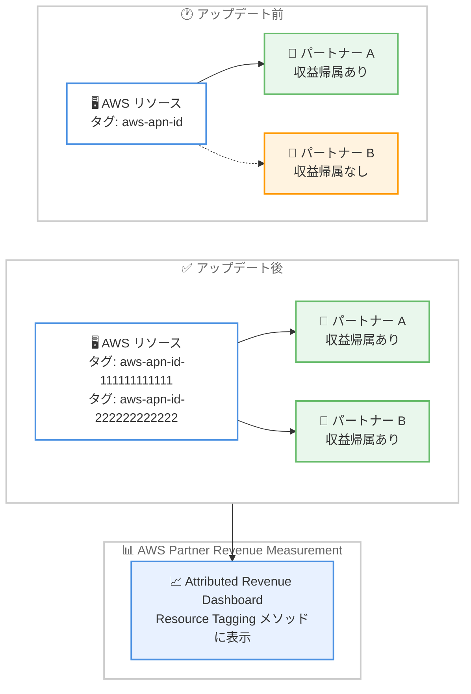

# AWS Partner Revenue Measurement - Resource Tagging のマルチパートナー対応

**リリース日**: 2026 年 9 月 30 日
**サービス**: AWS Partner Revenue Measurement (PRM)
**機能**: Resource Tagging によるレベニューアトリビューションのマルチパートナー対応

📊 [このアップデートのインフォグラフィックを見る](https://takech9203.github.io/aws-news-summary/20260930-partner-revenue-measurement-multi-partner-resource-tagging.html)

## 概要

AWS Partner Revenue Measurement (PRM) の Resource Tagging 機能が、マルチパートナーに対応しました。PRM はパートナーソリューションによって生み出される AWS 消費を追跡する仕組みであり、今回のアップデートにより、単一の AWS リソースに対して複数の AWS パートナーが収益の帰属 (attributed revenue) を受けられるようになります。

これまで Resource Tagging では、1 つのリソースに付与できるパートナータグは `aws-apn-id` キーの 1 つのみでした。そのため、複数のパートナーが同じワークロードに貢献している場合でも、収益の帰属を受けられるのは 1 社だけという制限がありました。今回のアップデートでは、各パートナーが `aws-apn-id-<partner-central-aws-account-id>` という形式の新しいタグキーを使用してリソースをタグ付けできるようになり、同じリソースに複数のパートナーがタグ付けした場合、タグ付けしたすべてのパートナーが収益の帰属を受けられます。

この機能は、コンサルティングパートナーがソフトウェアパートナーの製品を顧客の AWS アカウントにデプロイして運用するような、共同デリバリー (co-delivery) のシナリオで特に有効です。既存の `aws-apn-id` キーも引き続き動作するため、過去にタグ付けしたリソースへの変更は不要です。

**アップデート前の課題**

- 1 つのリソースに付与できるパートナータグは `aws-apn-id` キーの 1 つのみだった
- 複数のパートナーが同じワークロードに貢献していても、収益の帰属を受けられるのは 1 社に限られていた
- コンサルティングパートナーとソフトウェアパートナーが協働する共同デリバリーのシナリオで、双方の貢献を正しく可視化できなかった

**アップデート後の改善**

- `aws-apn-id-<partner-central-aws-account-id>` 形式の新しいタグキーにより、各パートナーが個別にリソースをタグ付けできるようになった
- 同じリソースに複数のパートナーがタグ付けした場合、タグ付けしたすべてのパートナーが収益の帰属を受けられるようになった
- 既存の `aws-apn-id` キーは引き続き有効であり、過去にタグ付けしたリソースの変更は不要
- 新旧どちらのキーによる収益も、Attributed Revenue Dashboard の「Resource Tagging」メソッド配下に表示され、ダッシュボード側の変更は不要

## アーキテクチャ図



アップデート前は 1 リソースに 1 つの `aws-apn-id` タグしか付与できず 1 社のみが収益帰属を受けていましたが、アップデート後はパートナーごとの新しいタグキーにより複数パートナーが同一リソースから収益帰属を受けられることを示しています。

## サービスアップデートの詳細

### 主要機能

1. **パートナー個別のタグキー形式**
   - 各パートナーは `aws-apn-id-<partner-central-aws-account-id>` という形式のタグキーを使用してリソースをタグ付けする
   - キー名に AWS Partner Central に紐づく AWS アカウント ID を含めることで、パートナーごとにタグキーが一意になる
   - タグキーが分離されているため、他のパートナーのタグを上書きすることなく共存できる

2. **複数パートナーへの収益帰属**
   - 同じリソースに複数のパートナーがタグ付けした場合、タグ付けしたすべてのパートナーが収益の帰属を受けられる
   - コンサルティングパートナーがソフトウェアパートナーの製品を AWS アカウントにデプロイ・運用する共同デリバリーのシナリオなどで、双方の貢献を可視化できる

3. **後方互換性の維持**
   - 既存の `aws-apn-id` キーは引き続き動作する
   - 過去にタグ付けしたリソースに対する変更作業は不要

4. **Attributed Revenue Dashboard との統合**
   - 新旧どちらのタグキーによる収益も、Attributed Revenue Dashboard の「Resource Tagging」メソッド配下に表示される
   - ダッシュボード側の変更は不要で、既存の運用をそのまま継続できる

## 技術仕様

### タグキーの比較

| 項目 | 従来のタグキー | 新しいタグキー |
|------|----------------|----------------|
| キー形式 | `aws-apn-id` | `aws-apn-id-<partner-central-aws-account-id>` |
| 1 リソースあたりのパートナー数 | 1 社のみ | 複数社 |
| 利用可否 | 引き続き利用可能 | 今回のアップデートで追加 |
| ダッシュボード表示 | Resource Tagging メソッド | Resource Tagging メソッド |

### タグ付けの例

```json
{
  "Tags": [
    {
      "Key": "aws-apn-id-111111111111",
      "Value": "<パートナー A のソリューション識別子>"
    },
    {
      "Key": "aws-apn-id-222222222222",
      "Value": "<パートナー B のソリューション識別子>"
    }
  ]
}
```

複数のパートナーがそれぞれ自社の Partner Central AWS アカウント ID を含むタグキーで同一リソースをタグ付けするイメージです。タグの値などの詳細は [PRM オンボーディングガイド](https://docs.aws.amazon.com/PRM/latest/aws-prm-onboarding-guide/)を参照してください。

## 設定方法

### 前提条件

1. AWS Partner Central へのオンボーディングが完了しており、PRM の Resource Tagging を利用できること
2. 自社の Partner Central に紐づく AWS アカウント ID を確認していること
3. タグ付け対象のリソースに対するタグ操作の権限があること

### 手順

#### ステップ 1: 自社用のタグキーを確認する

`aws-apn-id-<partner-central-aws-account-id>` 形式で、自社の Partner Central AWS アカウント ID を含むタグキーを決定します。詳細な要件は [PRM オンボーディングガイド](https://docs.aws.amazon.com/PRM/latest/aws-prm-onboarding-guide/)を参照してください。

#### ステップ 2: 対象リソースにタグを付与する

```bash
# 例: Amazon EC2 インスタンスにパートナータグを付与
aws ec2 create-tags \
  --resources i-0123456789abcdef0 \
  --tags Key=aws-apn-id-111111111111,Value=<ソリューション識別子>
```

対象の AWS リソースに、自社用のタグキーでタグを付与します。他のパートナーが同じリソースに別のキーでタグ付けしていても、互いに影響しません。

#### ステップ 3: Attributed Revenue Dashboard で確認する

AWS Partner Central の Partner Analytics から Attributed Revenue Dashboard を開き、「Resource Tagging」メソッド配下に帰属収益が表示されることを確認します。ダッシュボード側の設定変更は不要です。

## メリット

### ビジネス面

- **共同デリバリーの貢献を正当に評価**: コンサルティングパートナーとソフトウェアパートナーの双方が、同じワークロードから収益帰属を受けられる
- **AWS との協業の裏付け強化**: 各パートナーが自社の収益インパクトをデータで示せるため、資金プログラムや共同ビジネス計画の裏付けとして活用できる
- **パートナー間の協業促進**: 収益帰属を奪い合う必要がなくなり、複数パートナーによる協業体制を構築しやすくなる

### 技術面

- **後方互換性**: 既存の `aws-apn-id` タグは引き続き有効で、移行作業が不要
- **タグキーの分離**: パートナーごとに一意のタグキーを使用するため、他社のタグを上書きするリスクがない
- **ダッシュボード変更不要**: 新旧キーの収益がどちらも既存の「Resource Tagging」メソッドに表示され、運用の変更が発生しない

## デメリット・制約事項

### 制限事項

- 新しいタグキーを利用するには、各パートナーが自社の Partner Central AWS アカウント ID を含むキーで個別にタグ付けを行う必要がある
- Resource Tagging はタグ付けされたリソースの消費を対象とするため、タグ付けできないリソースや、タグ付け漏れのリソースは測定対象にならない

### 考慮すべき点

- 複数パートナーで同一リソースをタグ付けする場合、顧客のタグ運用ポリシー (タグ数の管理、タグ付け権限など) との整合を事前に確認することが望ましい
- 既存の `aws-apn-id` キーと新しいキーのどちらを標準とするか、自社のタグ付け運用ルールを整理しておくとよい
- AWS アカウントあたりのリソースタグ数には上限 (リソースあたり 50 個) があるため、顧客環境のタグ設計に注意する

## ユースケース

### ユースケース 1: コンサルティングパートナーとソフトウェアパートナーの共同デリバリー

**シナリオ**: ソフトウェアパートナーの製品を、コンサルティングパートナーが顧客の AWS アカウントにデプロイして運用保守も担当する。

**実装例**:
```bash
# ソフトウェアパートナーのタグ
aws ec2 create-tags --resources i-0123456789abcdef0 \
  --tags Key=aws-apn-id-111111111111,Value=<ISV ソリューション識別子>

# コンサルティングパートナーのタグ
aws ec2 create-tags --resources i-0123456789abcdef0 \
  --tags Key=aws-apn-id-222222222222,Value=<SI ソリューション識別子>
```

**効果**: 製品を提供するソフトウェアパートナーと、デプロイ・運用を担うコンサルティングパートナーの双方が、同一ワークロードの消費から収益帰属を受けられる。

### ユースケース 2: 既存の aws-apn-id タグ運用からの段階的な移行

**シナリオ**: すでに `aws-apn-id` キーでタグ付け済みのリソースが多数あり、今後は他パートナーとの協業案件も見込まれる。

**実装例**:
```
既存リソース: aws-apn-id タグをそのまま維持 (変更不要)
新規リソース: aws-apn-id-<自社アカウント ID> キーで統一
協業リソース: 各パートナーがそれぞれのキーでタグ付け
```

**効果**: 既存タグの張り替え作業なしで、新しいマルチパートナー形式へ段階的に移行でき、どちらのキーの収益も同じダッシュボードで確認できる。

### ユースケース 3: マネージドサービスプロバイダーによる複数 ISV 製品の運用

**シナリオ**: マネージドサービスプロバイダー (MSP) が、複数の ISV 製品が稼働する顧客環境全体の運用を受託している。

**実装例**:
```
ISV 製品 A のリソース: aws-apn-id-<ISV-A> + aws-apn-id-<MSP>
ISV 製品 B のリソース: aws-apn-id-<ISV-B> + aws-apn-id-<MSP>
```

**効果**: 各 ISV は自社製品分の収益帰属を受けつつ、MSP は運用対象の全リソースにわたる収益インパクトを示せる。

## 料金

PRM の Resource Tagging 自体に追加料金は発表されていません。リソースへのタグ付けにも料金は発生しません。

## 利用可能リージョン

すべての AWS 商用リージョンで利用可能です。

## 関連サービス・機能

- **AWS Partner Central**: パートナー向けポータル。Partner Analytics から Attributed Revenue Dashboard にアクセスし、帰属収益を確認できる
- **Attributed Revenue Dashboard**: パートナー製品、AWS サービス、請求期間ごとの収益インパクトを可視化するダッシュボード。新旧タグキーの収益がどちらも「Resource Tagging」メソッドに表示される
- **PRM User Agent 文字列 / AWS Marketplace Metering**: Resource Tagging 以外の PRM アトリビューション手法。ソリューションの形態に応じて使い分けられる

## 参考リンク

- 📊 [インフォグラフィック](https://takech9203.github.io/aws-news-summary/20260930-partner-revenue-measurement-multi-partner-resource-tagging.html)
- [公式発表 (What's New)](https://aws.amazon.com/about-aws/whats-new/2026/09/partner-revenue-measurement-multi-partner-resource-tagging)
- [AWS Blog: Unlock Revenue Insights in the New Attributed Revenue Dashboard](https://aws.amazon.com/blogs/apn/unlock-revenue-insights-in-the-new-attributed-revenue-dashboard/)
- [What is Partner Revenue Measurement? (ドキュメント)](https://docs.aws.amazon.com/PRM/latest/aws-prm-onboarding-guide/what-is-service.html)
- [PRM オンボーディングガイド (Resource Tagging)](https://docs.aws.amazon.com/PRM/latest/aws-prm-onboarding-guide/)

## まとめ

今回のアップデートにより、PRM の Resource Tagging で複数のパートナーが単一の AWS リソースから収益帰属を受けられるようになり、共同デリバリー案件における各パートナーの貢献を正当に可視化できるようになりました。既存の `aws-apn-id` タグはそのまま有効なため、他パートナーとの協業案件を持つパートナーは、`aws-apn-id-<partner-central-aws-account-id>` 形式の新しいタグキーの採用を検討することを推奨します。
