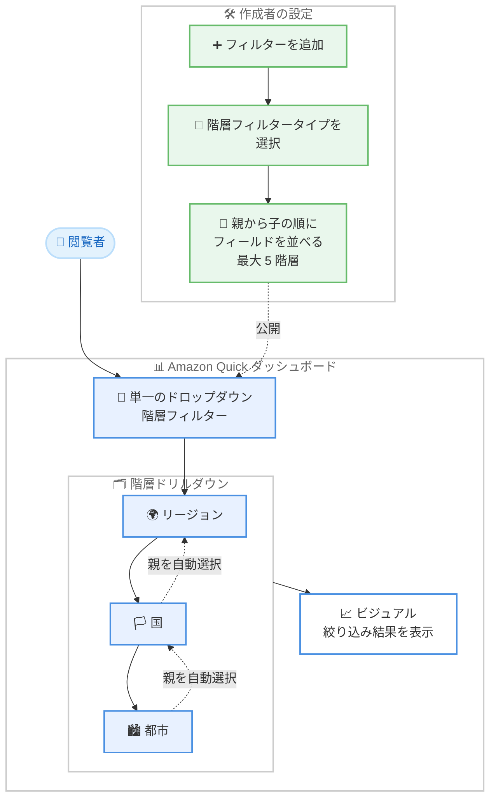

# Amazon Quick - 階層フィルター (Hierarchy Filter) によるダッシュボードのガイド付きドリルダウン

**リリース日**: 2026 年 9 月 30 日
**サービス**: Amazon Quick (Amazon Quick Sight)
**機能**: 階層フィルター (Hierarchy Filter)

📊 [このアップデートのインフォグラフィックを見る](https://takech9203.github.io/aws-news-summary/20260930-quick-hierarchy-filter.html)

## 概要

Amazon Quick のダッシュボードに、階層フィルター (Hierarchy Filter) が追加されました。階層フィルターは、リージョン → 国 → 都市のように関連する複数のディメンションを 1 つのフィルターコントロールにまとめ、閲覧者 (リーダー) が段階的にドリルダウンしながら目的のデータに到達できるようにする機能です。

従来、関連するディメンションごとに個別のフィルターを並べる必要があり、ダッシュボードのコントロールが煩雑になりがちでした。今回のアップデートにより、最大 5 階層のディメンションを 1 つのドロップダウンに統合でき、ダッシュボードの見た目を整理しながら、より少ないクリック数で閲覧者を目的のデータへ誘導できます。

ダッシュボードを作成する BI 開発者やデータアナリスト、そして地域別・組織別・製品カテゴリ別などの階層データを日常的に分析するビジネスユーザーの双方にとって、使い勝手を大きく改善するアップデートです。

**アップデート前の課題**

- リージョン、国、都市のような関連ディメンションごとに個別のフィルターコントロールを配置する必要があり、ダッシュボードが煩雑になっていた
- 閲覧者は「どの国がどのリージョンに属するか」といった階層関係を自分で把握したうえで、複数のフィルターを順番に操作する必要があった
- フィルター間の整合性 (親子関係) を閲覧者自身が意識する必要があり、誤った組み合わせを選択するリスクがあった

**アップデート後の改善**

- 最大 5 階層のディメンションを 1 つのフィルターコントロールに統合でき、ダッシュボードのコントロールを削減できるようになった
- 閲覧者は 1 つのドロップダウンを開き、階層を 1 レベルずつ展開しながら選択するだけで、目的のデータに少ないクリック数で到達できるようになった
- 選択すると次のレベルの候補が自動的に絞り込まれ、親の階層も自動選択されるため、階層関係を知らなくても正しい組み合わせでフィルタリングできるようになった

## アーキテクチャ図



作成者が親から子の順にフィールドを設定した階層フィルターを、閲覧者が単一のドロップダウンから 1 レベルずつ展開して選択し、各選択が次のレベルを絞り込みつつ親階層を自動選択する流れを示しています。

## サービスアップデートの詳細

### 主要機能

1. **複数ディメンションの単一コントロールへの統合**
   - リージョン → 国 → 都市のように関連するディメンションを 1 つのフィルターコントロールにまとめられる
   - 最大 5 階層のディメンションレベルをサポート
   - 複数の個別フィルターを積み重ねる構成と比べて、ダッシュボードのコントロール数を削減できる

2. **ガイド付きドリルダウン体験**
   - 閲覧者は単一のドロップダウンを開き、階層を 1 レベルずつ展開して選択する
   - 各レベルでの選択が次のレベルの候補を自動的に絞り込む
   - 下位レベルを選択すると、その親の階層チェーンが自動的に選択されるため、閲覧者が階層関係を事前に知っている必要がない

3. **シンプルな作成者側の設定**
   - フィルターを追加し、フィルタータイプとして階層フィルターを選択する
   - フィールドを最も広い粒度 (親) から最も詳細な粒度 (子) の順に並べるだけで設定が完了する

## 技術仕様

### 機能の整理

| 項目 | 詳細 |
|------|------|
| 対象機能 | Amazon Quick のダッシュボードフィルター |
| フィルタータイプ | 階層フィルター (Hierarchy Filter) |
| 最大階層数 | 5 レベル |
| 階層の順序 | 最も広い粒度から最も詳細な粒度の順に設定 |
| 閲覧者の操作 | 単一ドロップダウンでレベルを 1 つずつ展開して選択 |
| 絞り込み動作 | 各選択が次のレベルの候補を絞り込み、親階層を自動選択 |
| 設定主体 | ダッシュボード作成者 (作成時にフィルタータイプとして選択) |

## 設定方法

### 前提条件

1. Amazon Quick が利用可能な環境であること
2. ダッシュボード (分析) の作成・編集権限を持っていること
3. データセットに階層関係を持つディメンション (例: リージョン、国、都市) が含まれていること

### 手順

#### ステップ 1: 分析でフィルターを追加する

Amazon Quick の分析画面でフィルターの追加を選択します。階層の最上位にあたるフィールドを起点として設定を開始します。

#### ステップ 2: フィルタータイプとして階層フィルターを選択する

追加したフィルターのタイプとして「階層フィルター (Hierarchy filter)」を選択します。

#### ステップ 3: フィールドを親から子の順に並べる

階層に含めるフィールドを、最も広い粒度 (例: リージョン) から最も詳細な粒度 (例: 都市) の順に追加・配置します。最大 5 レベルまで設定できます。

#### ステップ 4: ダッシュボードを公開して動作を確認する

ダッシュボードを公開し、閲覧者としてドロップダウンを開いて階層を展開します。上位レベルの選択で下位レベルの候補が絞り込まれること、下位レベルの選択で親階層が自動選択されることを確認します。

## メリット

### ビジネス面

- **分析の自己完結性向上**: 閲覧者がデータの階層構造を知らなくても正しくドリルダウンでき、ダッシュボード作成者への問い合わせや誤操作を減らせる
- **意思決定の迅速化**: 少ないクリック数で目的のデータに到達できるため、地域別・組織別の状況確認がスピードアップする
- **ダッシュボード品質の向上**: コントロールの数が減り、画面がすっきりすることで、ビジュアル (グラフや表) の表示領域を広く確保できる

### 技術面

- **フィルター構成の簡素化**: 関連ディメンションごとに個別フィルターを作成・連携させる手間がなくなり、1 つの階層フィルターで完結する
- **整合性の自動担保**: 選択に応じた候補の絞り込みと親階層の自動選択により、矛盾したフィルター組み合わせが発生しない
- **保守性の向上**: フィルターコントロールの数が減ることで、ダッシュボードのメンテナンスやレイアウト調整が容易になる

## デメリット・制約事項

### 制限事項

- 階層のレベル数は最大 5 までに制限される
- 階層フィルターとして意味を持つのは、ディメンション間に明確な親子関係があるデータに限られる

### 考慮すべき点

- データ内の親子関係が不正確な場合 (例: 同じ都市名が複数の国に存在する場合のデータ品質)、絞り込み結果が意図と異なる可能性があるため、データセット側の整備が重要
- 既存ダッシュボードで複数の個別フィルターを使用している場合、階層フィルターへの置き換えによる閲覧者の操作変更を周知する必要がある

## ユースケース

### ユースケース 1: 地域別売上ダッシュボードの簡素化

**シナリオ**: 小売企業がリージョン、国、都市の 3 つのフィルターを並べた売上ダッシュボードを運用しており、閲覧者からコントロールが多く使いづらいという声が上がっている。

**実装例**:
```text
1. 分析でフィルターを追加し、階層フィルタータイプを選択
2. リージョン → 国 → 都市の順にフィールドを設定
3. 既存の 3 つの個別フィルターコントロールを削除
4. ダッシュボードを再公開
```

**効果**: 3 つのコントロールが 1 つに統合され、閲覧者はどの国がどのリージョンに属するかを知らなくても、ドロップダウンを展開するだけで都市レベルまで絞り込める。

### ユースケース 2: 組織階層に沿った業績レビュー

**シナリオ**: 本部 → 部門 → チームという組織階層ごとに KPI を確認する経営ダッシュボードで、マネージャーが自分の管轄範囲へ素早くドリルダウンしたい。

**実装例**:
```text
1. 階層フィルターに本部、部門、チームの 3 レベルを設定
2. マネージャーは自分のチームを直接選択
3. 親の部門・本部が自動選択され、整合した絞り込みが適用される
```

**効果**: マネージャーは組織コードの対応関係を調べることなく、1 つのドロップダウンから自分のチームの KPI に数クリックで到達できる。

### ユースケース 3: 製品カタログ分析のドリルダウン

**シナリオ**: EC 事業者が製品カテゴリ → サブカテゴリ → ブランド → SKU という粒度で在庫・販売状況を分析したい。

**実装例**:
```text
1. 階層フィルターにカテゴリ、サブカテゴリ、ブランド、SKU の 4 レベルを設定
2. 閲覧者はカテゴリから順に展開し、対象の SKU まで絞り込み
3. 各レベルの選択で次のレベルの候補が自動的に絞り込まれる
```

**効果**: 膨大な SKU の中から対象製品を迷わず特定でき、カテゴリ横断の誤った組み合わせによる無意味な絞り込みを防げる。

## 料金

階層フィルターは Amazon Quick のダッシュボード機能の一部として提供され、追加料金に関する言及はありません。料金の詳細は Amazon Quick の料金ページを参照してください。

## 利用可能リージョン

Amazon Quick が利用可能なすべての AWS リージョンで利用できます。対応リージョンの詳細は [Supported AWS Regions](https://docs.aws.amazon.com/quick/latest/userguide/regions.html) を参照してください。

## 関連サービス・機能

- **Amazon Quick Suite**: 本アップデートの対象となるダッシュボード機能を含む分析・AI ワークスペース
- **Amazon Quick Sight のフィルターコントロール**: ドロップダウン、リスト、日付ピッカーなど既存のフィルタータイプ。階層フィルターはこれらに加わる新しい選択肢
- **ビジュアルのドリルダウン機能**: ビジュアル単位で階層を掘り下げる既存機能。階層フィルターはダッシュボード全体の絞り込みに階層ドリルダウンを提供する点で補完関係にある

## 参考リンク

- 📊 [インフォグラフィック](https://takech9203.github.io/aws-news-summary/20260930-quick-hierarchy-filter.html)
- [公式発表 (What's New)](https://aws.amazon.com/about-aws/whats-new/2026/09/quick-hierarchy-filter)
- [AWS Blog](https://aws.amazon.com/blogs/machine-learning/simplify-dashboard-drill-down-with-the-amazon-quick-sight-hierarchy-filter/)
- [ドキュメント (Hierarchy filters)](https://docs.aws.amazon.com/quick/latest/userguide/hierarchy-filter.html)

## まとめ

Amazon Quick の階層フィルターにより、関連する最大 5 つのディメンションを 1 つのドロップダウンに統合し、閲覧者をガイドしながら目的のデータへ少ないクリック数で誘導できるようになりました。リージョン・国・都市や組織階層など、階層構造を持つデータを扱うダッシュボードでは、既存の個別フィルターを階層フィルターへ置き換えることで、画面の簡素化と閲覧者体験の向上の両方が期待できるため、積極的な採用を推奨します。
