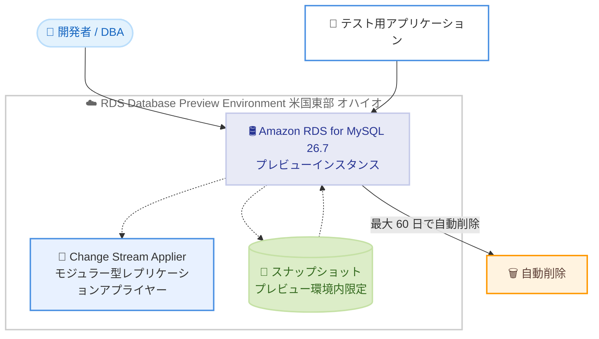

# Amazon RDS for MySQL - MySQL 26.7 の Database Preview Environment 対応

**リリース日**: 2026 年 9 月 30 日
**サービス**: Amazon RDS for MySQL
**機能**: Amazon RDS Database Preview Environment での MySQL 26.7 サポート

📊 [このアップデートのインフォグラフィックを見る](https://takech9203.github.io/aws-news-summary/20260930-rds-mysql-26-7-preview-environment.html)
<!-- INFOGRAPHIC_BASE_URL は環境変数から取得 -->

## 概要

Amazon RDS for MySQL が、Amazon RDS Database Preview Environment においてコミュニティ版 MySQL 26.7 をサポートするようになりました。これにより、正式リリース (GA) 前の最新バージョンを Amazon RDS for MySQL 上で評価できます。MySQL 26.7 は、新しい YY.M (年.月) 形式のカレンダーバージョニングモデルを採用した最初の Innovation リリースであり、バグ修正とセキュリティパッチを含んでいます。

MySQL 26.7 では新機能として Change Stream Applier が導入されています。これはモジュラー型のレプリケーションアプライヤーであり、テストワークロードにおいて適用スループットとバックログからの回復 (backlog recovery) を改善します。レプリケーションを多用するワークロードを運用しているチームにとって、GA 前に効果を検証できる重要な機能です。

対象となるのは、次期バージョンへの移行を検討しているデータベース管理者や開発者、および新しいバージョニングモデルや新機能の早期評価を行いたいチームです。プレビュー環境のインスタンスは最大 60 日間保持され、保持期間を過ぎると自動的に削除されます。

**アップデート前の課題**

- MySQL 26.7 のような GA 前の最新 Innovation リリースを、Amazon RDS のマネージド環境で評価する手段がなかった
- 新バージョンの互換性検証のために、自前で MySQL 環境を構築してテストする必要があった
- Change Stream Applier などの新しいレプリケーション機能を、本番環境と同等のマネージド RDS 上で確認できなかった

**アップデート後の改善**

- Amazon RDS Database Preview Environment 上で MySQL 26.7 を直接評価できるようになった
- 新しい YY.M カレンダーバージョニングモデルを採用した最初の Innovation リリースを、マネージドなサンドボックス環境で検証できる
- Change Stream Applier によるレプリケーション適用スループットの改善効果を、GA 前にテストワークロードで確認できる

## アーキテクチャ図

プレビュー環境は米国東部 (オハイオ) リージョンで稼働し、作成したインスタンスとスナップショットはプレビュー環境内でのみ利用できます。MySQL 26.7 の新機能である Change Stream Applier を含め、GA 前のバージョンをテストワークロードで検証できます。

## サービスアップデートの詳細

### 主要機能

1. **MySQL 26.7 の早期評価**
   - 新しい YY.M (年.月) カレンダーバージョニングモデルを採用した最初の Innovation リリースを Amazon RDS 上で利用可能
   - GA 前のバージョンをマネージド環境でテストできる
   - バグ修正とセキュリティパッチを事前に検証できる

2. **Change Stream Applier**
   - モジュラー型のレプリケーションアプライヤーとして導入された新機能
   - テストワークロードにおいて適用スループット (apply throughput) を改善
   - バックログからの回復 (backlog recovery) を改善し、レプリケーション遅延の解消を高速化

3. **サンドボックス環境の提供**
   - アプリケーションの互換性テストを本番環境から隔離して実施できる
   - プレビュー環境のインスタンスは最大 60 日間保持され、経過後は自動的に削除される
   - 検証用途に適した一時的な環境として活用できる

## 技術仕様

### Database Preview Environment の仕様

| 項目 | 詳細 |
|------|------|
| サポートエンジン | コミュニティ版 MySQL 26.7 (Innovation リリース) |
| バージョニングモデル | YY.M (年.月) カレンダーバージョニング (本リリースから採用) |
| 主要新機能 | Change Stream Applier (モジュラー型レプリケーションアプライヤー) |
| 稼働リージョン | 米国東部 (オハイオ) US East (Ohio) |
| インスタンス保持期間 | 最大 60 日間 (経過後に自動削除) |
| スナップショットの利用範囲 | プレビュー環境内のインスタンスの作成・復元のみ |
| 料金 | 米国東部 (オハイオ) の本番 RDS インスタンスと同額 |

### 制約に関する注意点

- プレビュー環境で作成したスナップショットは、プレビュー環境外の RDS インスタンスの作成や復元には使用できません
- プレビュー環境は本番ワークロードでの使用を想定していません

## 設定方法

### 前提条件

1. AWS アカウントを保有していること
2. Amazon RDS の作成・管理に必要な IAM 権限を持っていること
3. 米国東部 (オハイオ) リージョンでプレビュー環境を利用できること

### 手順

#### ステップ 1: Database Preview Environment にアクセス

AWS マネジメントコンソールから Amazon RDS Database Preview Environment にアクセスします。プレビュー環境は通常の RDS コンソールとは別の専用環境として提供されます。詳細は「Working with the Database Preview Environment」のドキュメントを参照してください。

#### ステップ 2: MySQL 26.7 インスタンスを作成

プレビュー環境でデータベースエンジンとして MySQL 26.7 を選択し、インスタンスを作成します。作成手順は通常の RDS インスタンスと同様ですが、作成されたインスタンスはプレビュー環境内でのみ利用可能です。

#### ステップ 3: アプリケーションのテストと機能検証

作成したインスタンスに対して、既存アプリケーションの互換性テストや Change Stream Applier をはじめとする MySQL 26.7 の新機能の検証を実施します。インスタンスは最大 60 日間で自動削除されるため、検証結果は期間内に記録しておきます。

## メリット

### ビジネス面

- **アップグレードリスクの低減**: GA 前に互換性を検証することで、本番環境へのアップグレード時のリスクを事前に把握できる
- **計画的な移行の実現**: 新しいバージョニングモデルへの移行を含め、バージョン戦略を余裕を持って策定できる
- **運用負荷の軽減**: インスタンスが自動削除されるため、検証環境の後片付けの手間が不要

### 技術面

- **マネージド環境での検証**: 自前で MySQL 環境を構築せず、RDS のマネージド機能を利用して検証できる
- **レプリケーション性能の事前評価**: Change Stream Applier による適用スループットとバックログ回復の改善効果を、実際のワークロードに近い条件で評価できる
- **新バージョニングモデルの早期把握**: YY.M カレンダーバージョニングによる今後のリリースサイクルの変化を事前に理解できる

## デメリット・制約事項

### 制限事項

- プレビュー環境は米国東部 (オハイオ) リージョンのみで利用可能
- インスタンスは最大 60 日間で自動削除されるため、長期的な検証には適さない
- プレビュー環境で作成したスナップショットはプレビュー環境外では利用できない
- 本番ワークロードでの使用は想定されていない

### 考慮すべき点

- MySQL 26.7 は Innovation リリースであり、長期サポート (LTS) リリースとはサポート期間が異なるため、本番採用時はバージョン戦略の検討が必要
- 検証用データやスナップショットは、保持期間内にプレビュー環境外へ移行できない点に留意する必要がある
- 料金は本番 RDS インスタンスと同額のため、コストを意識した検証計画が必要

## ユースケース

### ユースケース 1: Change Stream Applier によるレプリケーション性能の検証

**シナリオ**: リードレプリカを多用するチームが、レプリケーション遅延の改善効果を新バージョンで確認したい。

**効果**: プレビュー環境でテストワークロードを実行し、Change Stream Applier による適用スループットとバックログ回復の改善を定量的に評価できる。

### ユースケース 2: 新バージョニングモデルへの移行計画策定

**シナリオ**: データベース管理チームが、YY.M カレンダーバージョニングへの移行後のアップグレード戦略を検討している。

**効果**: 最初の YY.M 形式リリースである MySQL 26.7 を実際に評価し、今後のリリースサイクルに合わせたアップグレード計画を事前に策定できる。

### ユースケース 3: アプリケーション互換性テスト

**シナリオ**: 複数のアプリケーションが MySQL に依存しており、バージョン変更による影響範囲を把握したい。

**効果**: プレビュー環境で各アプリケーションを接続してテストし、非互換な挙動を GA 前に早期発見できる。

## 料金

Database Preview Environment のインスタンスは、米国東部 (オハイオ) リージョンで作成される本番 RDS インスタンスと同額で課金されます。プレビュー環境専用の割引や無料枠はないため、通常の RDS 料金と同様のコストが発生します。インスタンスは最大 60 日間で自動削除されますが、稼働中は料金が発生する点に注意が必要です。

最新の料金は Amazon RDS の料金ページを参照してください。

## 利用可能リージョン

Amazon RDS Database Preview Environment は米国東部 (オハイオ) US East (Ohio) リージョンで提供されます。

## 関連サービス・機能

- **Amazon RDS for MySQL**: 本アップデートの対象となるマネージド MySQL データベースサービス
- **Amazon RDS スナップショット**: プレビュー環境内で作成・復元に利用できるが、環境外との相互利用はできない
- **Amazon RDS リードレプリカ**: Change Stream Applier の改善効果が期待されるレプリケーション機能

## 参考リンク

- 📊 [インフォグラフィック](https://takech9203.github.io/aws-news-summary/20260930-rds-mysql-26-7-preview-environment.html)
- [公式発表 (What's New)](https://aws.amazon.com/about-aws/whats-new/2026/09/rds-mysql-26-7-preview-environment/)
- [ドキュメント: Working with the Database Preview Environment](https://docs.aws.amazon.com/AmazonRDS/latest/UserGuide/create-db-instance-in-preview-environment.html)
- [MySQL 26.7 リリースノート](https://dev.mysql.com/doc/refman/26.7/en/mysql-nutshell.html)
- [Amazon RDS for MySQL 製品ページ](https://aws.amazon.com/rds/mysql/)

## まとめ

Amazon RDS Database Preview Environment での MySQL 26.7 サポートにより、新しい YY.M カレンダーバージョニングモデルを採用した最初の Innovation リリースを、GA 前にマネージド環境で評価できるようになりました。特にレプリケーションを多用するチームは、Change Stream Applier による適用スループットとバックログ回復の改善効果を、米国東部 (オハイオ) リージョンのプレビュー環境で早期に検証することをお勧めします。インスタンスが最大 60 日間で自動削除される点と、スナップショットがプレビュー環境内でのみ利用可能である点に留意して検証計画を立ててください。
